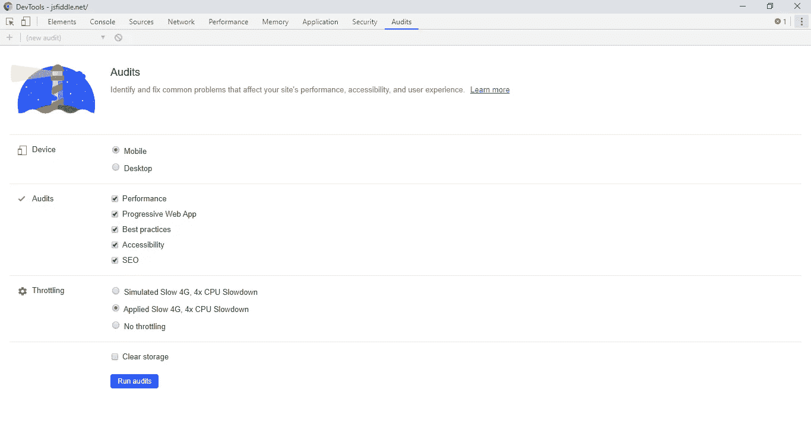
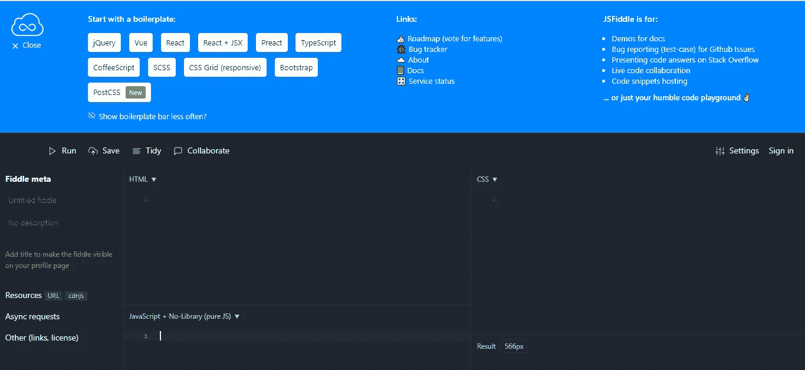
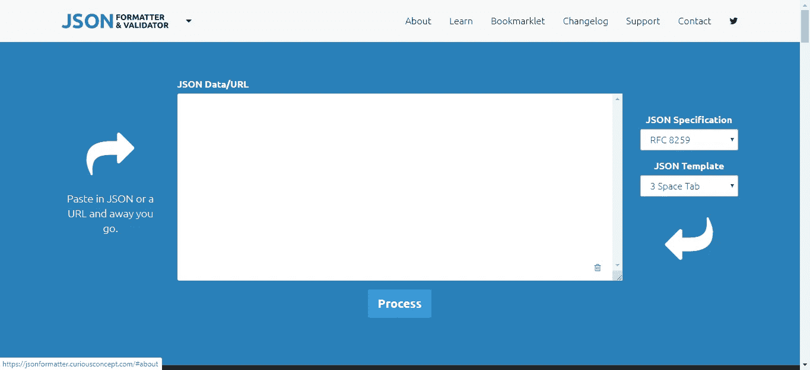
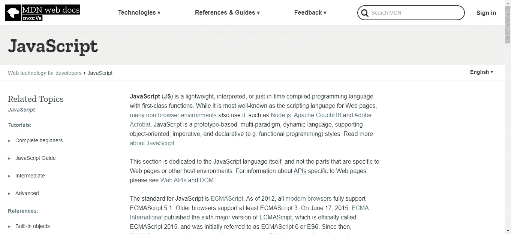
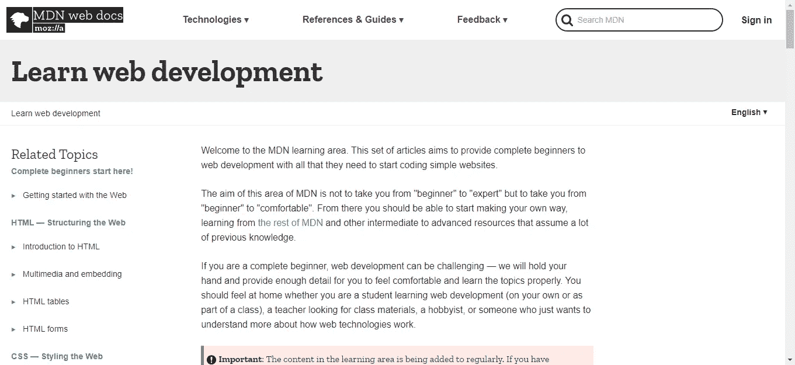

# 编写 JavaScript 应用程序的便捷工具

> 原文：<https://levelup.gitconnected.com/handy-tools-for-writing-javascript-apps-a179a33c2a03>


由于 JavaScript 是一种非常流行的语言，并且所有前端 web 应用程序都以某种形式使用这种语言，因此有很多很好的工具可以帮助您轻松编写高质量的 JavaScript 应用程序。工具生态系统每天都在变得越来越大，比以往任何时候都有更多的工具可用于构建和调试 JavaScript 应用程序。

# 埃斯林特

ESLint 是一个林挺工具，用于检查代码质量问题，如样式、函数长度等。它用于在整个代码库中保持格式代码结构的一致性，并消除格式不一致的问题，JavaScript 代码的不良使用，如双等于和三等于，以及许多其他问题。它们还可以用来识别语法错误和简单的 bug。ESLint 有一个庞大的规则列表需要检查，并且可以用一个文本文件进行配置。

要运行 ESLint，我们可以通过 NPM 按项目或全球安装它。可以使用一个文件来完成配置，该文件包含要在 JSON 中启用或禁用的规则列表。该文件名为`.eslintrc`，规则是根据项目定义的。在文件中，我们有这样的内容:

```
{
  "rules": {
    "semi": ["error", "always"],
    "quotes": ["error", "double"]
  }
}
```

这定义了启用或禁用以及设置报告级别的规则。`error`表示将被报告为错误。它也可以设置为`warning`或用`off`选项完全关闭。也有预设的规则，如`eslint:recommended`规则内置在包中或 AirBNB 风格规则，可以通过使用`theeslint-config-airbnb`节点包安装。

AirBNB 套餐详情位于[https://www.npmjs.com/package/eslint-config-airbnb](https://www.npmjs.com/package/eslint-config-airbnb)，默认 ESLint 推荐规则位于[https://eslint.org/docs/rules/](https://eslint.org/docs/rules/)

正如我们从[https://eslint.org/docs/rules/](https://eslint.org/docs/rules/)中看到的，在设计 JavaScript 代码时有大量的规则。有一些规则与间距、分号、数组、换行符、缩进、变量大小写、逗号等相关。您可以调整的规则非常多。

当您运行 ESLint 时，它将检查您启用的所有规则并检查文件。然后你会得到一个样式问题的列表，它会识别并通知你。此外，您可以将其设置为自动修复它们，这样您就不必这么做了。它不能自动修复一切，但它会尽力这样做。

# 浏览器开发人员控制台

浏览器开发者的控制台是前端开发者最好的朋友。它允许您单独检查每个元素以查看其计算的样式，这些样式应用于来自外部 CSS 文件、内联样式和样式标签的元素。它允许您查看由 JavaScript 呈现的 HTML 文档，并观察 DOM 树随着页面的变化而变化。这很棒，因为当页面被任何东西改变时，它允许你看到什么在改变。您还可以暂停执行或设置断点，以便在更改消失之前有时间仔细查看您想要的更改。

在修改代码之前，修改 CSS 样式是很容易的。这节省了大量时间，因为您不必一直摆弄代码和刷新，直到在屏幕上看到您想要的内容。在 Chrome 开发者控制台中，我们只需右击你想要的元素，然后点击 Inspect。这会将我们带到 Elements 选项卡，然后在那里，我们会看到靠近屏幕底部的 Styles 选项卡。在那里，你可以输入你想要的任何东西，然后你可以立即看到你得到的东西。您在这里所做的任何更改都不会保存在您的代码中，所以如果您想使更改永久化，您必须将它们复制到您的代码中。如果你弄得一团糟，不能回到你想要的，你可以刷新一下，重新开始。它还有一个用于边距和填充的方框模型图，还显示了通过位于 Styles 选项卡右侧的 event listeners 选项卡附加到元素的所有事件侦听器。还有 Properties 选项卡，它列出了您正在检查的元素的所有属性。这很棒，因为您不必添加控制台日志或在控制台中运行任何命令来获取信息。Elements 选项卡还允许您直接处理元素的 HTML。这非常方便，因为在提交代码中的任何更改之前，您还可以修改页面结构。

在 Chrome 开发者控制台的控制台标签中。您可以键入命令并查看返回的输出。当部分代码加载时，您放入代码中的`console.log`语句的输出也显示在这里。如果您想检查全局变量的属性，您可以在这里输入全局变量的名称，并查看您想检查的全局变量内容的转储。还有保存日志选项，用于在刷新后保存日志输出，以及从历史记录中自动完成选项，用于查看在控制台中打开或关闭您正在键入的代码的自动完成。

Chrome 开发者控制台的 Sources 标签允许你查看你的 web 应用的构建代码。它还允许您放入断点来构建控制台，并在代码编译后查看最终的文件结构。我们可以从这里看到构建的 CSS 和 JavaScript 文件。

网络选项卡也是 Chrome 开发者控制台的一个重要选项卡。它显示了您的应用程序和服务器之间上传和下载的所有内容。您的应用程序发出的所有 HTTP 请求都显示在这里。当你点击标签左侧的条目时，你会看到你的应用程序发出的 HTTP 请求的全部细节。从发出请求的 URL，到请求的请求和响应头，以及发送到服务器的参数，这里都显示了。此外，在这里还可以看到请求的状态，因此我们可以看到请求是否成功发出，以及请求是否发送到服务器的响应代码。右侧的预览和响应选项卡显示了服务器的响应正文。它适用于任何类型的反应。预览显示其格式化版本，而响应选项卡显示原始版本。最后，Timing 选项卡让我们看到在客户机和服务器之间发出请求需要多长时间。上面的图表显示了请求的时间。你可以根据不同的请求进行筛选。对于大多数 web 应用程序来说，最重要的是仅显示 AJAX 请求的 XHR 选项卡，有时我们还希望检查 JS、CSS、Img 或媒体选项卡，以查看脚本和媒体是否正确下载。还有用于检查 WebSockets 通信的 WS 选项卡。

“网络”选项卡还让我们模拟不同类型的请求，从正常请求到慢速和快速移动互联网，我们甚至可以在不拔掉电线或断开无线互联网连接的情况下切断互联网，以查看当浏览器离线时会发生什么。

Chrome 的开发者控制台的 Performance 选项卡让我们可以分析页面的性能。我们可以检查 Chrome 控制台的这个选项卡，了解各种事情的加载时间，如下载脚本、渲染页面和其他事情。这对于识别代码的性能瓶颈非常有用。

Chrome 的开发者控制台的应用程序标签总是非常有用。我们可以在这里看到存储在本地存储、会话存储和我们的 cookies 中的内容。此外，我们可以编辑它们，并查看它对我们的应用程序产生的影响。我们还可以清除当前加载的应用程序的所有存储，并重新开始，而无需进入浏览器设置。这对于调试任何与存储相关的问题非常方便。

要审核我们应用程序的性能和可访问性，我们可以转到控制台的 Audits 选项卡，切换设置，看看当我们更改不同的设置来模拟 web 应用程序加载到哪种设备时会发生什么。我们可以将慢速移动互联网的带宽改为常规快速互联网的带宽。此外，我们可以检查我们的渐进式 web 应用程序实际上是否符合渐进式 web 应用程序的要求。

此外，还有一个响应视图来模拟您的页面在不同移动设备上的外观。默认情况下，它有几款手机和平板电脑可供选择。

正如我们所见，Chrome 开发者控制台是最好的调试和模拟工具之一。Firefox 和 Edge 等其他浏览器也有类似的功能，但名称可能不同。然而，Chrome 开发者控制台是最全面的前端开发工具之一。其他基于 Chromium 的浏览器也应该有类似的东西。



Chrome 开发者控制台

# 框架特定工具

如果你正在用 React、Vue.js 或 Angular 这样的框架编写应用程序，那么你应该使用框架的命令行工具来构建你的项目。React 的也叫 Create React App。Vue.js 的工具叫 Vue CLI，Angular 的 CLI 工具叫 Angular CLI。所有 3 个框架都有工具来启动你的项目并将其构建到最终产品中。它们还支持在不同的环境中构建它们，因此您可以将环境变量放在 React Vue CLI 的`.env`文件中。他们可以根据环境读取环境变量文件。对于 Create React App，所有的环境变量键都必须以`REACT_APP`开头，对于 Vue CLI，它们都必须以`VUE_APP`开头。对于构建，它们都可以指定您可以在其中构建的环境。对于 Angular，我们可以将环境特定的变量放在它们自己的文件中，并在构建时更改`angular.json`来添加环境变量。这非常方便，因为我们不必添加额外的工具来处理这个问题。

Vue 和 Angular CLI 也可以运行脚本来添加代码，以添加不同的东西。对于 Angular，各个库都提供了一个`ng add`命令，可以在我们的应用中添加自己的库。例如，NgRx store 让我们运行`ng add @ngrx/store`将其添加到应用程序中。对于 Vue.js，各种库，如 Vue Electron Builder 库，让我们可以用 Vue.js 构建桌面应用程序，为我们提供了`vue add electron-builder`命令，将他们的代码添加到我们自己的代码库中。图书馆位于 https://github.com/nklayman/vue-cli-plugin-electron-builder。

一些命令行工具有自己的专用功能。例如，Vue CLI 可以用一个带`vue-cli-service build --target wc --inline-vue`的命令将代码构建到 web 组件中。Angular CLI 可以用一个命令创建不同的组件，如`ng g component homePage`创建一个名为`HomePage`的组件。

最后，所有工具都将通过缩小和模糊代码来构建供生产使用的应用程序，这样人们就无法清楚地看到代码，并且代码越小越好。

正如我们所见，使用各种框架的命令行工具是现在构建新前端应用程序的方式。这比手动创建我们的应用程序的支架要好得多，手动创建非常繁琐且容易出错。

# JSFiddle

JSFiddle 是一个非常适合摆弄前端 JavaScript 代码的网站，顾名思义。它让您可以在主页上快速编写前端 HTML、CSS 和 JavaScript 代码。它还允许您在主页上为最流行的库和框架(如 React、Vue、jQuery 和 Bootstrap)添加样板代码。像 SCSS 这样的 CSS 预处理程序也是受支持的，只需点击一下就可以启用。您可以在屏幕右下角的结果窗格中看到输出。这是伟大的，因为它让我们快速制作原型和片段，并保存它们，如果我们做一个帐户。



JSFiddle

# JSBin

JSBin 是另一个摆弄 JavaScript 代码的工具。它允许您输入 HTML、CSS 和 JavaScript，并添加流行的库和框架，如 Angular、React、Vue、moment.js、jQuery 等等。还有一个用于查看结果的输出窗格，在专业版中，我们可以有私人片段和 Dropbox 备份。

# JSON 格式化程序和验证程序

位于 https://jsonformatter.curiousconcept.com/的 JSON 格式化器和验证器可以方便地将 JSON 数据格式化为人类可读的树格式。这对于可视化我们经常要处理的 JSON 请求和响应数据非常有用。



JSON 格式化程序

# Mozilla 开发者网络

Mozilla 开发者网络是最全面的前端开发文档网站之一。在一个网站上，我们需要了解的关于 HTML、CSS 和 JavaScript 的东西几乎都有了。知道哪些 API 与哪些浏览器兼容是很方便的。此外，它还具有包含在每个 API 中的综合功能。HTML5 中有很多新的 API，所以它是查找函数中的 API 的最佳网站之一。API 的完整列表跨越了许多列，每一列都很高，所以有很多东西，包括实验性的。

还有一个参考和指南部分，提供了一长串教程来学习所有关于前端开发的内容。从基本的 HTML 到动画，再到用 Django 和 Express 这样的框架进行基本的后端开发，它应有尽有。它也为你提供练习和项目来学习所学的内容。这实际上比你在书店花钱买的学习 web 开发的书更全面。

Mozilla 开发人员网络各部分的 URL 如下:

*   JavaScript—[https://developer.mozilla.org/en-US/docs/Web/JavaScript](https://developer.mozilla.org/en-US/docs/Web/JavaScript)
*   参考和指南—【https://developer.mozilla.org/en-US/docs/Learn 



MDN JavaScript 文档



MDN 教程