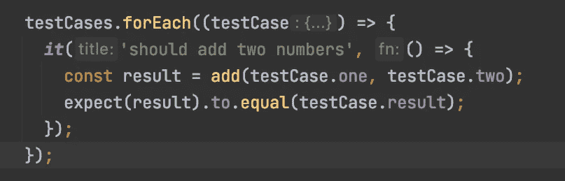

# JavaScript 测试中的便利技巧

> 原文：<https://levelup.gitconnected.com/handy-tricks-in-javascript-testing-36c119f8c208>



随着 JavaScript 库、框架和人们学习这种语言的热潮，每当有人决定用 JavaScript 编写一些测试时，我都会发现一些常见的问题。以下是我在测试中需要做的一些最常见的事情，以及如何在三个主要工具上做这些事情:Jasmine、Mocha 和 Jest。

# 运行单个测试或一组测试

场景:我正在编写测试，不想在整个项目中运行我的整个测试套件。做这件事最快的方法是什么？

**摩卡**

使用`only()` —

```
describe.only('This describe block will run by itself on test run'...// Or a single testit.only('This it block will run by itself on test run'...
```

**笑话**

使用`only()`或`f`—“f”表示*焦点*

```
// Synonymous
describe.only('Your test suite'...
fdescribe('Your test suite'...// Or a single test// Synonymous
it.only('...
fit('...
```

**茉莉**

使用`fdescribe`或`fit`

```
fdescribe('Your tests...'// Or a single testfit('Your single test...'
```

*注意:如果你正在使用 Karma，你可能会将它与上面的一个选项结合使用。他们都应该和所写的业力一起工作。*

# 测试异步代码

如果你有异步代码，比如查询一个数据库或者调用一个服务器，你需要确保你的测试运行没有停顿。

**茉莉/Jest/摩卡**

意外的惊喜…大多数流行的 JS 测试框架都以同样的方式处理异步代码。

*注意:使用以下图案之一，不要在同一个测试中混搭！*

使用`done` —在异步调用返回后调用这个方法，让 Mocha 知道测试已经完成。

```
it('will test async code', (done) => {
  myAsyncCall().then((result) => {
    expect(result).toBeDefined();
    done();
  });
});
```

兑现承诺

```
it('will test async code', () => {
  return myAsyncCall().then((result) => {
    expect(result).toBeDefined();
  });
});
```

注意:不要对承诺做出回应。

使用异步/等待

```
it('will test async code', async () => {
  const result = await myAsyncCall();
  expect(result).toBeDefined();
});
```

参考资料:

笑话:[https://jestjs.io/docs/asynchronous](https://jestjs.io/docs/asynchronous)

摩卡:[https://mochajs.org/#asynchronous-code](https://mochajs.org/#asynchronous-code)

茉莉:[https://jasmine.github.io/tutorials/async](https://jasmine.github.io/tutorials/async)

# 数据驱动测试

当您想要使用多个参数测试某些功能时，测试运行程序允许您编写一个测试，该测试将基于您传入的数据运行多次。

**贾米内/摩卡**

使用`forEach`或任何其他形式的普通 JS 循环。

```
const testCases = [
  {
    one: 1,
    two: 5,
    result: 6
  },
  {
    one: 1,
    two: 5,
    result: 6
  },
  {
    one: 1,
    two: 5,
    result: 6
  },
];

testCases.forEach((testCase) => {
  ***it***('should add two numbers', () => {
    const result = add(testCase.one, testCase.two);
    expect(result).toEqual(testCase.result);
  });
});
```

摩卡参考:[https://mochajs.org/#dynamically-generating-tests](https://mochajs.org/#dynamically-generating-tests)

**笑话**

Jest 提供了一个`test.each`助手，让您将数据作为参数传递给测试，并以稍微不同的方式运行它。

```
***test***.each([
  {
    one: 1,
    two: 5,
    result: 6
  },
  {
    one: 1,
    two: 5,
    result: 6
  },
  {
    one: 1,
    two: 5,
    result: 6
  },
])('should add two numbers', (testCase) => {
  const result = add(testCase.one, testCase.two);
  expect(result).toEqual(testCase.result);
});
```

参考:[https://jestjs.io/docs/api#testeachtablename-fn-timeout](https://jestjs.io/docs/api#testeachtablename-fn-timeout)