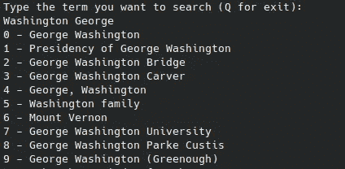

# 很难找到答案？打造一个为你解答的 AI 专家

> 原文：<https://levelup.gitconnected.com/hard-to-find-answer-create-an-ai-expert-who-answers-for-you-e24c1656c42f>

了解如何在没有任何人工智能知识的情况下构建您的助手来回答您的问题。


照片由 [LinkedIn 销售解决方案](https://unsplash.com/@linkedinsalesnavigator?utm_source=medium&utm_medium=referral)在 [Unsplash](https://unsplash.com?utm_source=medium&utm_medium=referral) 上拍摄

嗨，程序员们！我是 StackZero，同名[博客](https://www.stackzero.net/)的拥有者！

在本教程中，我想告诉你如何使用变形金刚库来构建你的人工智能。

别担心，正如我已经预料到的，你不需要人工智能知识来让你的朋友惊讶！

在本教程中，我将指导你一步一步地使用 [HuggingFace](https://huggingface.co/) 的模型之一来构建你自己的个人助理。

但是在开始之前，我们需要一点背景知识。

# 什么是变压器？

Transformer 是一种深度学习架构(如何建立神经网络的设计)，旨在处理顺序数据中的长期依赖关系。

它们基于 transformer 架构，该架构在论文“[关注是你所需要的全部](https://arxiv.org/abs/1706.03762)”(2017)中介绍。

目前，它们是一系列自然语言处理任务的尖端技术，如机器翻译、文本分类和问题回答。

然而，它们的用途不限于它们也用于计算机视觉领域。

您可以找到许多使用它们来提高图像分类和对象检测模型性能的例子。

[](/how-to-build-an-ai-tale-generator-for-your-kids-34b8db153054) [## 如何为你的孩子建造一个人工智能故事发生器

### 这是一个非常简单的教程，讲述了如何使用预先训练好的模型通过 python 生成文本。

levelup.gitconnected.com](/how-to-build-an-ai-tale-generator-for-your-kids-34b8db153054) [](https://medium.com/codex/how-to-turn-your-tales-into-mp3-files-so-you-can-listen-to-them-with-your-kids-297b5fa61519) [## 如何将你的故事转换成 mp3 文件，这样你就可以和你的孩子一起听了！

### 这是一个非常基础和有用的 TTS 项目，适合初学者！

medium.com](https://medium.com/codex/how-to-turn-your-tales-into-mp3-files-so-you-can-listen-to-them-with-your-kids-297b5fa61519) 

# 项目概述

该项目将产生一个简单的脚本:

*   要求您键入一个关键字，它将在维基百科上搜索，以获得在哪里寻找响应的上下文，如图所示。



*   然后你应该选择正确的维基百科元素


*   之后，它会要求您提供您的问题
*   最后，它会在屏幕上打印出答案


应用程序将循环运行，直到您键入“Q”。

这是你能做的一个非常简化的版本，即使仅仅通过改变模型，结果也会改变。

我还想澄清，错误是常见的，因为它没有管理所有的维基百科结果，也没有例外管理。

然而，作为一个项目，它可能非常有趣。

[](https://python.plainenglish.io/up-in-arms-about-code-your-activity-advisor-in-python-84c79215e862) [## 竭力反对用 Python 编写活动顾问？

### 一个初学者的快速教程，让你在空闲时间开发一个活动顾问！

python .平原英语. io](https://python.plainenglish.io/up-in-arms-about-code-your-activity-advisor-in-python-84c79215e862) [](https://medium.com/codex/create-chuck-norris-jokes-application-in-7-minutes-712887cb0956) [## 如何在 7 分钟内创建 Chuck Norris 笑话应用程序！

### 查克·诺里斯将不会出现在《敢死队 3》中，因为史泰龙再也不想感受那种恐惧了。

medium.com](https://medium.com/codex/create-chuck-norris-jokes-application-in-7-minutes-712887cb0956) 

# 开始编码

在开始项目之前，我们需要安装这些库:

*   [维基百科](https://github.com/goldsmith/Wikipedia)
*   [变形金刚](https://github.com/huggingface/transformers)
*   [pytorch](https://pytorch.org/)

我们可以用这个命令来完成:

```
pip install wikipedia transformers torch
```

很容易不是吗？

通常我都是一步一步的展示代码，下面有注释，但是这个时间真的很短。

所以我要马上给你看整个剧本，并对重要的部分进行评论。

简言之，这个程序将在维基百科中搜索一个术语，并选择与该术语最相关的页面索引。选择索引后，它会问一个与页面相关的问题，并返回答案。

您可以通过在终端上键入以下命令来运行该脚本:

```
python ai_assistant.py
```

**第一次启动可能需要一段时间，因为它必须下载模型！**

也许你注意到了，我用的是[精选型号](https://huggingface.co/deepset/tinyroberta-squad2?context=My+name+is+Sarah+and+I+live+in+London&question=Where+do+I+live%3F)，它的性能比原来的好得多。

[](https://medium.com/nerd-for-tech/introducing-the-simple-way-to-create-youtube-downloader-with-python-253637e3067a) [## 介绍用 Python 创建 Youtube 下载器的简单方法

### 初学者快速教程，关于如何建立你的个人 YT 下载

medium.com](https://medium.com/nerd-for-tech/introducing-the-simple-way-to-create-youtube-downloader-with-python-253637e3067a) 

# 结论

感谢阅读！当我继续探索有趣的问题并与你们分享我的答案时，我希望你们会关注我的工作。

如果你对网络安全感兴趣，也可以关注我的[博客](https://www.stackzero.net/)以技术的方式阅读非常有趣的话题。

谢谢你的时间，希望很快见到你！

*你可以通过下面的链接注册，每月只需 5 美元就可以获得所有的媒体报道:*

[](https://medium.com/membership/@stackzero) [## 用我的推荐链接加入媒体- StackZero

### 我们的最新报道(以及数以千计的其他报道)一经发布，您就可以立即获得。成为会员后，您将获得所有权限…

medium.com](https://medium.com/membership/@stackzero)