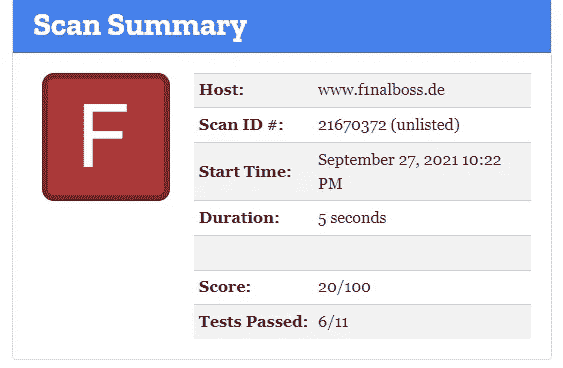
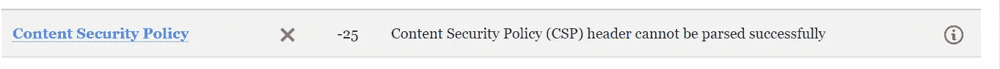
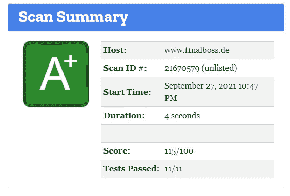

# 用 Traefik 和安全标题强化您的网站

> 原文：<https://levelup.gitconnected.com/harden-your-website-with-traefik-and-security-headers-a595844c4f1b>

## 通过提高您的安全分数来升级您的网站

彼得·康拉德在 [Unsplash](https://unsplash.com/s/photos/it-security-headers?utm_source=unsplash&utm_medium=referral&utm_content=creditCopyText) 上的照片

大家都知道在几个网站上有一个好的安全评分真的很重要。在本教程中，**我将解释我如何使用 traefik 得到一个**。

**重要:** *我写完这篇文章后把截图里的网址从*[*https://www . f1 nal boss . de*](https://www.f1nalboss.de/)*移到了*[*https://FTP . f1 nal boss . de*](https://ftp.f1nalboss.de/)*。*

# 前提

如果你想应用本教程的内容，你需要在 Docker Swarm 模式下拥有一个 Docker 环境。如果你想知道如何为自己设置一个，试着按照我写的教程来做[。](/docker-swarm-in-a-nutshell-ed2a9c42cd7c)

此外，您需要安装 traefik 作为负载平衡器，因为它用于向您的网站请求添加安全标头。我写了另一个教程，展示了如何在 Docker Swarm 环境中集成 traefik。

如果你没有 Docker Swarm 并且你不想建立一个，你可以试着在一台机器上安装 traefik 作为负载均衡器。我会在本教程中解释这是如何做到的。但是请记住，对于非 Docker Swarm 环境，您必须调整 docker-compose 文件。如果你对此有问题，请在评论中提问，如果可能的话，我会回答你。

# 我如何添加安全头

Mozilla 发布了一个非常重要的网站:[Mozilla 天文台](https://observatory.mozilla.org/)

> Mozilla Observatory 已经帮助了超过 240，000 个网站，向开发人员、系统管理员和安全专业人员传授如何安全地配置他们的站点。

我对我的站点进行了检查，得到了以下结果:

在对 traefik 文档进行快速研究后，我想出了这些我想在我的环境中实现的重要头文件:

为了在我的 traefik 安装中添加这些头，我在我的 traefik docker-compose.yml 中添加了一个新的中间件:

添加这个中间件后，我更新了运行在 Docker Swarm 中的 traefik 服务(参见[这篇文章](/the-most-important-services-everyone-should-deploy-in-a-docker-swarm-8e120b5a66))

这一增加使得在部署到我的 swarm 并由 traefik 管理的每个服务中使用这个中间件成为可能。为此，我必须在 docker-compose.yml 中的**标签部分**添加下面一行:

重启 simpleweb 服务后，我运行了另一个测试，因为这个错误得到了 B 分:

我研究并找到了 CSP 的正确 traefik 报头。此外，我创建了一个非常严格的 CSP 指令，并将其添加到头值中:

对于 img-src，我只允许访问 [https://i.postimg.cc](https://i.postimg.cc) ，因为我在 [https://ftp.f1nalboss.de](https://ftp.f1nalboss.de) 使用的唯一一张图片就存放在那里。

因为这个头文件非常严格，所以我没有为它创建一个全局中间件。我升级了我想在其中使用 CSP 指令的服务，方法是向 simpleweb 服务添加以下代码行并调整中间件:

我重启了服务，又进行了一次检查，最终获得了 A+！

# 我如何强化我的网站

因为我也想**加固**我的服务器，所以我在[hardenize.com](https://www.hardenize.com/)进行了检查，得到了不令人满意的 **TLS** 和 **HSTS** 的结果。

由于已经提前调整了 HSTS 的 traefik 头，剩下唯一要做的就是在 [hstspreload](https://hstspreload.org/) 提交我的域名来修复 **HSTS** 的问题。

这部分非常重要:如果你想把你的网站提交给**hstspreload.org**仔细考虑一下。如果你不能完成所有的事情，就会有问题:[阅读这里的信息](https://hstspreload.org/#opt-in)

解决 **TLS** 问题更加复杂。我必须调整 traefik 的配置，使 TLS 的最低版本是 1.2，而**不是默认的** 1.0。为了设置最低的 **TLS** 版本，我在 traefik docker-compose.yml 的命令部分添加了一个文件提供程序:

然后我创建了一个新的配置文件(名为 tls.toml ),它包含一个条目**【tls-options】**,应该用于将最低 TLS 版本设置为 1.2。此外，我添加了优秀的密码套件([阅读此文了解密码套件](https://www.thesslstore.com/blog/cipher-suites-algorithms-security-settings/))。

此配置保证 traefik 将至少使用 TLS 1.2 和提供的密码套件。我选择了这六个密码套件，因为我希望有三个用于 TLS 1.2，三个用于 TLS 1.3，它们都被声明为安全的！

我把文件保存在。/configuration/ folder 并更新了 traefik docker-compose.yml 中的卷部分:

之后，我重启了 traefik 实例。

最后一步是通过添加新标签来激活 simpleweb 服务中的 min TLS 版本:

重启 simpleweb 服务后，我在 **Hardenize** 和 **Mozilla** 上重试了测试，得到了想要的结果:

*   [https://www.hardenize.com/report/f1nalboss.de/1628027450](https://www.hardenize.com/report/f1nalboss.de/1628027450)
*   [https://observatory.mozilla.org/analyze/ftp.f1nalboss.de](https://observatory.mozilla.org/analyze/ftp.f1nalboss.de)

在 [ssl-labs](https://www.ssllabs.com/ssltest) 还有一个检查证书的信息测试。有了新的配置，我也得到了一个 **A+**

*   [https://www.ssllabs.com/ssltest/analyze.html?d=ftp.f1nalboss.de](https://www.ssllabs.com/ssltest/analyze.html?d=ftp.f1nalboss.de)

# 结束语

为了简化一切，您可以使用这个 docker-compose.yml 并在任何 docker 群中作为 www-stack 服务运行它:

我希望本教程对你有所帮助，现在你可以通过添加安全头和优化 SSL 使用来保护你的网站并增加信任。

我很想听听你的想法和想法。如果您已经运行了 traefik 安装并使用了不同的头/中间件，或者您有其他密码套件，请在此评论并解释。另外，如果你有任何问题，请写在下面。如果可能的话，我试着回答他们。

*✍️写的*

***保罗·克努斯*** *丈夫，两个孩子的父亲，极客，终身学习者，科技爱好者&软件工程师*

***问好*** *🙌***:*[*推特*](https://www.twitter.com/paulknulst) *，*[*LinkedIn*](https://www.linkedin.com/in/paulknulst/)*，* [*GitHub*](https://github.com/paulknulst)*