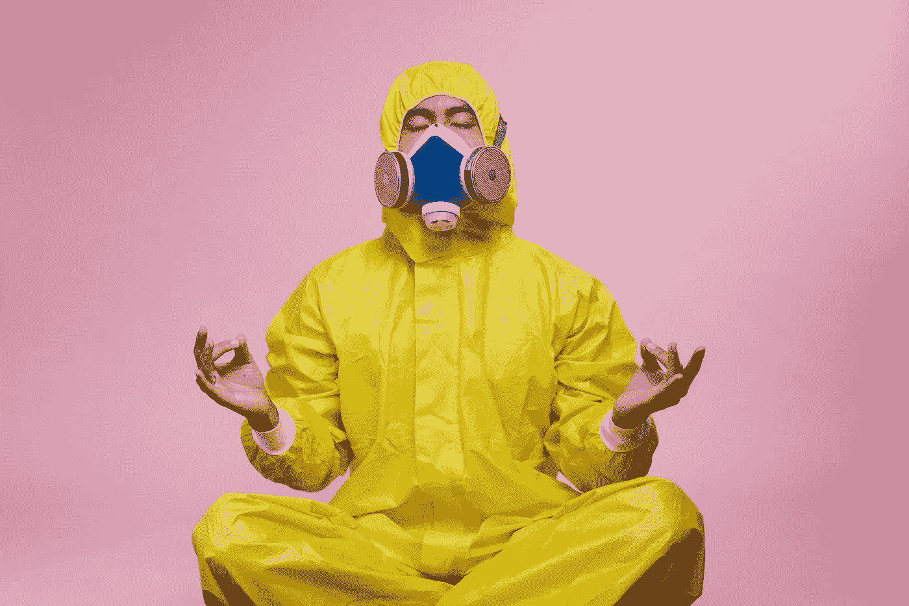

# 利用人工智能的力量预测下一个疫情

> 原文：<https://levelup.gitconnected.com/harnessing-the-power-of-ai-to-predict-the-next-pandemic-37784c121d0a>

## 人工智能能预测下一个疫情吗？

照片由 [**cottonbro**](https://www.pexels.com/@cottonbro?utm_content=attributionCopyText&utm_medium=referral&utm_source=pexels) 发自 [**Pexels**](https://www.pexels.com/photo/man-in-yellow-protective-suit-3951373/?utm_content=attributionCopyText&utm_medium=referral&utm_source=pexels)

自古以来，人类就一直在与自然作战。每当两者之间发生权力争斗时，人类总是臭名昭著地取得胜利。

我们克服了所有的困难，将自己置于所有存在的中心。这种演变的明显特征是纯粹的创新和独创性。我们为自己取得的进步感到自豪。但是新冠肺炎威胁到了它的存在。它对人类物种、社会和我们创造的系统造成了致命的打击。

几个世纪以来，人类第一次在与自然及其热情的斗争中濒临失败。这给我们带来了一个问题:我们有没有可能利用 21 世纪最强大的发明，即人工智能，来预测和更好地管理下一个疫情？我们有可能在下一场战斗中获胜吗？

简单地说，人工智能是一种开发模仿人类智能的程序的计算机科学。在强大的计算机和算法的帮助下，它能够以无与伦比的准确度和精确度收集、整理、分析和预测下一步行动。它在医学领域的应用相对来说是最近的现象，可以追溯到几十年前。

通过“预测下一个疫情”，我们希望达到两个目的，即预防和治疗。就本文而言，我们仅限于前者。如果我们能够确定世界上任何地方的下一个“未确定的相同症状”的大规模集群的来源，我们就可以立即将我们有限的资源用于及时的干预。

一个恰当的例子是中国武汉，那里出现了致命的 SARS-COV-2。尽管中国本可以对已确定的聚集性病例表现得更为积极，但中国疾病预防控制中心采用的流程仍是一个基准。它快速部署了人工智能诱导的患者风险识别机制、患者监测和大数据分析，以进行重大且经济高效的干预。

*识别病毒出现的第一个节点之一*是对患者进行疑似病毒筛查的诊断实验室。使用 ICT 模型将这些实验室连接到一个国家网络，我们可以获得显示“未识别的相同症状”的患者数量的初步指示。

这种模式确保国家的医疗保健和诊断服务网络是连接的和集中的，以便我们获得和分析指向下一个疫情的任何相关数据。

*两个*，利用从识别高风险污染区获得的数据，我们还可以利用“接触追踪、症状测绘和自我评估”应用部署人群控制和监测措施。

这些应用程序现在已经覆盖了全球近 70%的地区，并在监控人群控制和污染区的感染倾向方面发挥了重要作用。

*三*，使用人工智能支持的超级计算网络进一步使医疗保健系统能够有效地利用他们有限的资源。许多像印度这样的发展中国家没有对他们的卫生保健系统进行投资。由于缺乏数字化和高人口，疫情使其人口打内战，以寻求及时的医疗护理。这包括 ICU 病床、呼吸机和氧气瓶的可用性。医疗系统的数字化不仅有助于住院病人的监控，还能在下一次疫情爆发时大幅减少死亡人数。

因此，利用人工智能和大分析的力量，我们可以识别、监视、控制并大幅降低其对普通人群的影响。下一个疫情不再是“如果”和“是否”的问题，而是“何时”的问题？

正如世卫组织最恰当地指出的，结束疫情需要协调一致、深思熟虑和有针对性的全球努力。在我们所有人都安全之前，没有人是安全的。当下一次疫情来袭时，我们可以肯定我们会立即转向人工智能，因为人类的集体自我会拒绝接受在下一场战斗中被打败。

# 参考

1.  Mia Sato，麻省理工学院技术评论，*联系追踪应用现在几乎覆盖了半个美国。用一个*(2020 年 12 月 14 日发布)也不迟。
2.  美国心脏病学会，*来自武汉的教训:来自我们中国同行的见解*(发表于 2020 年 3 月 22 日)。
3.  Vikas Pandey，*印度 Covid:随着越来越多的病人死亡，德里医院恳求氧气*(发表于 2021 年 5 月 2 日)。
4.  弗洛伦西奥·特拉维耶索，*数据情报如何对预测下一个疫情*至关重要，《健康管理杂志》，20 卷 7 期(2020 年 9 月 1 日出版)。