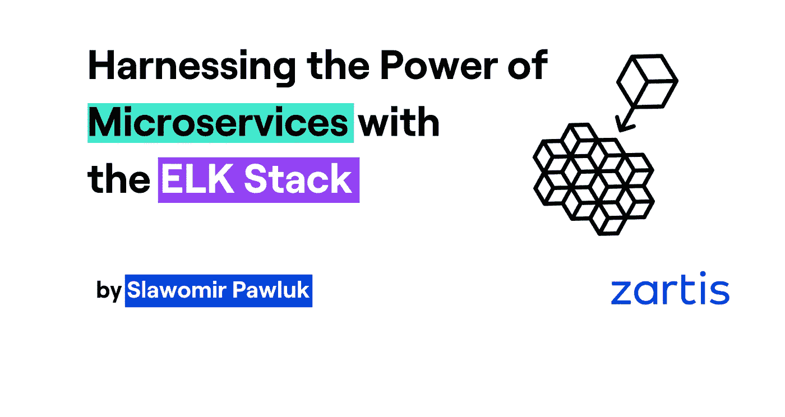

# 利用 ELK Stack-zart is 的微服务能力

> 原文：<https://levelup.gitconnected.com/harnessing-the-power-of-microservices-with-the-elk-stack-zartis-ab3061323ae8>

在本文中，我们将探索 ELK 堆栈的能力，以从软件开发的微服务方法中获得最大收益。微服务为更有效地创建软件产品带来了大量的机会，同时也带来了一些缺点和潜在的风险。如果使用得当，ELK 有可能降低这些风险，并帮助您以高效的方式交付质量。

## 序言

我们不知道先有鸡还是先有蛋，但我们知道巨石 是我们每天在其中观察到的变化的点火器。*巨石*，巨大、可怕、不可改变、易碎、吞噬投资回报(ROI)的东西。然后不知从哪里，[微服务](https://martinfowler.com/articles/microservices.html)来了。那些小的，非常小的软件征服了整块的软件，把它分割成小块，并使软件的改变变得容易。但是你，读者，应该最清楚需求总是变化的。代码变得过时并且难以维护。你可能会有一种感觉，在地平线后面，你的投资回报面临着新的危险。可能是什么？该如何应对？

## 为什么要使用微服务方法？

乍一看，进入微服务似乎很容易。当你需要为你的客户创造新的闪亮的特性时，开发者从零开始创造小的软件片段。开发人员喜欢新软件——它非常干净，易于管理，没有依赖性，没有遗留的东西。他们可以使用新技术，边工作边学习，因此士气高昂。您很高兴特性创建得很快，开发人员也很高兴，但是问题在哪里呢？

正如我们所写的[大小很重要](https://www.zartis.com/size-matters/)。创建数十个、数百个或数千个微服务会在它们之间创建一个巨大的连接和依赖网络([微服务地狱](https://kloudless.com/blog/2019/05/29/escaping-the-microservices-dependency-hell-a-talk-by-joyce-lin-of-postman/))。在微服务出现之前，*Monolith*崩溃是显而易见的——你的客户没有一个能再使用它了。如今，故障可能是间歇性的，很难发现。您确定您的软件产品符合服务层协议(SLA)吗？您确定所有支付交易都以成功结束吗？你确定你的客户喜欢你的产品，在你的目标实现之前不会放弃吗？

## 你能做些什么呢？

[麋鹿栈](https://www.elastic.co/elastic-stack)也许能帮到你。这是一组名为 ElasticSearch、Logstash 和 Kibana 的工具，创建它们是为了帮助监控系统的基础设施和业务目标。这是一个单一的信息点，在这里您可以找到您需要的所有数据。

## 麋鹿栈理论

[ElasticSearch](https://www.elastic.co/elasticsearch/) 是一个 noSQL 文档数据库，用来存储与时间相关的数据。它存储包含与您的需求相关的数据的事件。它可能是来自生产的日志、操作系统的度量，甚至是您的 CI/CD 过程的[度量](https://logz.io/blog/monitoring-gitlab-elk-stack/)。ElasticSearch 实现了许多聚合功能，以实现长时间的快速信息检索(例如，去年您的解决方案中最流行的浏览器是什么)。你还应该支持 ie 浏览器吗？).

是一个可以有多种角色的软件。它被设计成日志文件解析器，因为文本解析可能是一个资源密集型过程。它也可以是所有服务的聚合点。它可以根据你的需要标记你系统中的事件，并将它们存储在 ElasticSearch 或其他类型的服务或数据库中。

## 我在麋鹿栈的经历

一段时间以前，我在一家公司工作，该公司交付一些具有特定 SLA 的产品。该系统从整体发展成分布式服务网络，然后开始向微服务转变。它由一个专门的团队监控，该团队使用开发人员留在代码中的日志。这种模式运行良好，但有时会出现一些问题，这些问题不是由日志指出的，而是由客户打来的，他们对不能使用我们的产品感到愤怒。这让我想知道怎么会这样？

我与专门的监控团队、运营团队和网络团队进行了交谈，他们认为他们的数据没有问题。为了寻求帮助，我找到了 ELK Stack，在与经理、运营和监控团队进行了一些协商之后，我们部署了它。我们从我认为监控系统输入/输出的最重要的部分开始:access.log 文件。

这个神奇的文件是由一个 web 服务器创建的，包含了很多关于您的系统的信息。例如，哪个端点被谁调用，响应是否成功，有效负载有多大，系统处理它需要多长时间，甚至用户使用的是什么浏览器。很多有用的数据。利用这些数据，我们发现了一些不好的事情。一些服务有将近 10%的错误响应是我们不知道的。也有一些时候，请求花费了我们不知道的大量时间。解决这个问题需要一些练习，但是这个例子向我们展示了像一个 **access.log** 文件这样简单的东西可以改善你的 SLA 和用户体验。

## 麋鹿栈的下一步是什么？

你输入的数据越多，ELK Stack 就越强大。您可以在无限的场景中使用它。以下是一些例子:

-找出至少将一件商品放入购物车的顾客中，实际完成结账的顾客比例。如果这个百分比很小，可能表明流程太复杂或支付提供商有问题。

-衡量新功能的投资回报率。了解一个特性的成本可以让你实时监控它的投资回报率。可能是因为它还没有被充分利用来偿还它的投资，并且移除它可能更便宜。

-生产中最昂贵的代码是您没有使用的代码。您可以在 ElasticSearch 中为每个 API 调用编写一个事件，并测量使用情况(或者使用 APM——下面将详细介绍)。可能你的一些微服务已经不用了。现在你有证据证明你可以安全地让它们退役。

-您可以收集历史数据，例如:假设您投资了软件优化。现在你可以观察它有多少回报。

ELK stack 也可以在从*Monolith*迁移到微服务的过程中帮助你。您可以从记录系统中的特性开始迁移。然后，一个特性的每次使用可能会通过 REST API 发送到 ElasticSearch。这些指标有助于发现系统中的热点，并有助于决定首先需要迁移什么。库这样的[度量标准。NET.ElasticSearch](https://github.com/Recognos/Metrics.NET.ElasticSearch) 将帮助你完成这类任务。

ELK stack 非常擅长在一个地方聚合来自许多来源的日志、指标和其他信息。它附带了名为的小型服务，可以为您完成阅读和组织弹性搜索请求的所有工作。只需记住为每个事件添加定制字段(例如，使用 [Logstash mutate 插件](https://www.elastic.co/guide/en/logstash/current/plugins-filters-mutate.html)或 [Beats 配置](https://www.elastic.co/guide/en/beats/filebeat/7.6/configuration-general-options.html#libbeat-configuration-fields)，以指示环境、机器、客户端和服务名称)。然后，可以使用一个 Kibana 仪表板来显示多种环境的同类信息。

ELK 堆栈中最新、最激动人心的部分是应用性能监控。如果您有 Elastic Cloud 或 ElasticSearch on-premise，您只需几行代码就可以使用它来监控应用程序的内部。为 Java、.NET，node.js，python，Ruby 甚至 Go。它可以向开发人员提供关于性能问题的信息，以及服务在生产中如何相互通信，以及它们如何相互连接。

## 但是…

指出所有这些特性，您可能会得到这样的印象:这些工具将解决您的所有问题！像往常一样，这里有一个陷阱。投资麋鹿群[可能会变得昂贵](https://www.chaossearch.io/hubfs/C2020/White%20Pages/ChaosSearch%20ELK%20Stack%20Total%20Cost%20of%20Ownership.pdf?hsLang=en)。你可能会担心免费的开源工具会如何压垮你的钱包。我会试着解释并给你一些如何处理的建议。

ELK 堆栈价格高的第一个明显原因是托管。无论[云托管](https://www.elastic.co/cloud/)还是[本地托管](https://www.elastic.co/elasticsearch/)，都会消耗资源。ElasticSearch 在数据及其存储方式方面相当聪明。一般来说，新数据不会立即写入磁盘存储器。根据配置，新数据会存储在 RAM 中，以便更快地访问。这对于显示实时数据的仪表板尤其有用。

如果您计划接收大量数据，然后对其进行解析或预处理，您可能需要额外的资源。一般来说，当 Logstash 可以访问多个线程时，它会工作得更好。然后，它们成批处理数百或数千个事件，这可能是一项资源密集型任务。

如果你对 Kibana 在其[扩展版本](https://www.elastic.co/subscriptions)中的所有特性不感兴趣，那么考虑使用。像 Kibana 一样，它是一个数据可视化工具，但与 Kibana 不同，它也能够同时显示来自多个来源的数据(ElasticSearch、InfluxDB、Prometheus 甚至直接 SQL 查询)。你可以使用[云托管的](https://grafana.com/products/cloud/)版本，或者[使用安装包、Docker 镜像自行部署](https://grafana.com/grafana/download)，甚至可以安装在 Raspberry Pi 上。

## 教训

微服务改变了如今软件的设计方式。它们很酷，很小，容易制造，而且成本低廉。不幸的是，它们也有缺点，例如它们会增加整个系统的复杂性。为了能够做到这一点，像 ELK Stack 这样的工具有助于利用它们的潜力，并为您的公司带来其他好处。ELK Stack 似乎是一个一体化的、单一来源的解决方案，可以处理基础设施监控、日志聚合、使用统计和业务流程性能数据收集等任务。当您想要交付高质量的产品时，这种单点信息是无价的。试一试吧！

*原载于*[*https://www.zartis.com*](https://www.zartis.com/the-power-of-microservices-with-the-elk-stack/)*。*

*作者*:

 [## Sawa mir paw luk——软件开发工程师——zart is | LinkedIn

### życiu·扎沃多维·杰斯特姆·osobą德拉特戈·波斯塔维姆·纳…

www.linkedin.com](https://www.linkedin.com/in/s%C5%82awomir-pawluk-7b596a51/)