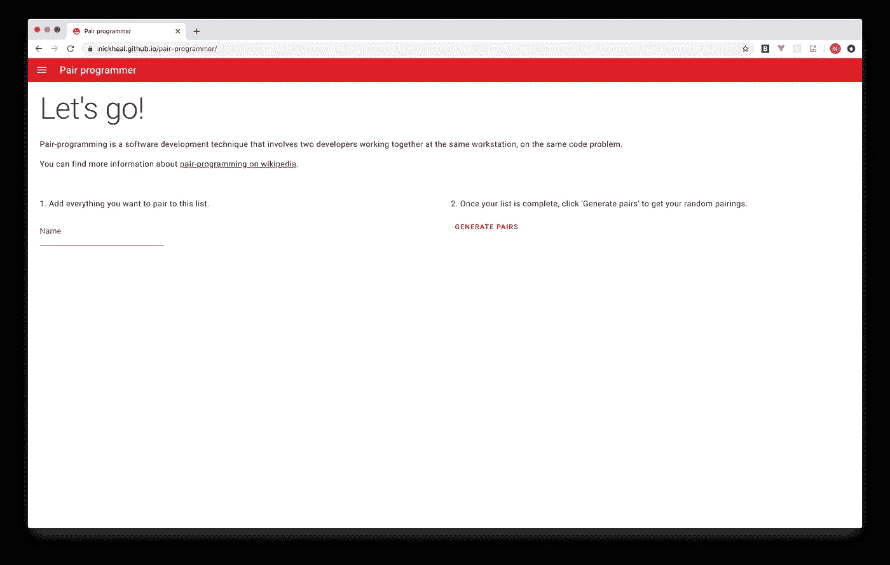
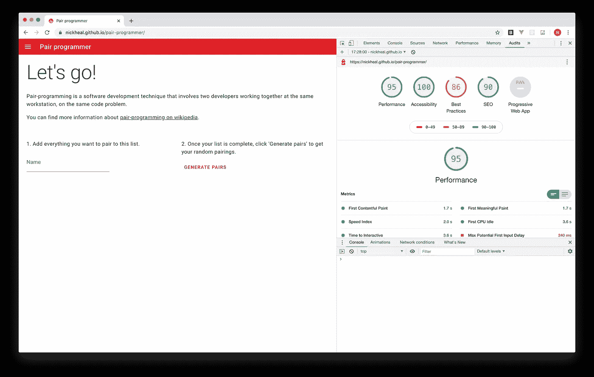
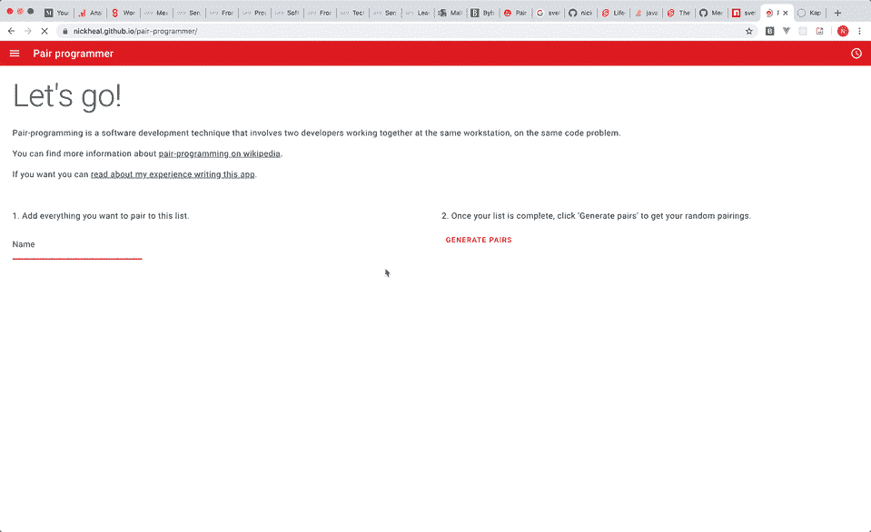

# 苗条已经成年了吗？

> 原文：<https://levelup.gitconnected.com/has-svelte-come-of-age-86ff5c76da9>

什么小东西能推翻巨人？

艾莉森·考特尼在 [Unsplash](https://unsplash.com?utm_source=medium&utm_medium=referral) 上拍摄的照片

没错，就是苗条！将自己定位为大卫，对抗 React、Vue.js 和 Angular 这些巨人。

> 顺便说一下:在这个过程中，我创建了一个名为 svelte-tour 的 npm 包，用于在第一次加载时处理这个包。它得到了麻省理工学院的许可，并且[现在可以在 NPM](https://www.npmjs.com/package/svelte-tour)上下载。

在这个苗条的网站上，它有以下有说服力的描述:

> 出色的性能、小的捆绑包、可访问性、内置风格封装、声明式转换、易用性、它是一个编译器的事实，等等。

我确实想马上说，我对那份名单有一点问题。稍后我会谈到性能，小的包看起来确实如此，尽管我不确定它是否适用于较大的应用程序。可访问性是一个很大的要求。框架无法保证这一点。这似乎符合当前的趋势，即在任何东西上都打上“可及性”的印记，让它听起来更优雅。我还没有确定苗条的任何方面，使它特别容易接近。易用性在很大程度上是一种观点。不管真假，JS 社区似乎还没有意识到这一点。它是一个编译器的事实本身并没有任何区别。

无论如何，这个小小的抱怨解决了这个项目。

## 该项目

令人惊讶的是，如今我们可以如此快速地组装 UI 原型。我想开发一个小小的应用程序，将人们的名字配对在一起，以帮助向我的团队介绍配对编程，我还想尝试 Svelte，因为在过去一年左右的时间里，它的名字经常出现。由此产生了[结对程序员](https://nickheal.github.io/pair-programmer/)。你可以[在这里](https://github.com/nickheal/pair-programmer/tree/develop)查看源代码。

Pair-programmer 代表一个晚上的工作，我以前从未使用过 Svelte/Sapper，或者 Svelte Material UI 库。

尽早摆脱这种方式的一个困惑点是——苗条通常被描述为“无框架的框架”。这是因为从技术上讲，它是一个编译器。在发布之前，它将您需要的功能烘焙到您的代码中。我自始至终把它称为一个框架，因为从概念上讲，它就是这样被使用的。

Sapper 是 Svelte 的应用框架。想想 React 的 Next.js 或 Vue.js 的 Nuxt.js，它提供了 SSR 和其他面向应用的现成功能。

## 苗条的

我这样做的目的是为了对苗条身材有一个更清晰的认识。一开始，我就发现了许多基本功能，并且代码结构非常熟悉。如果我必须画一个平行线，我会把它放在比其他更靠近 Vue.js 的地方。我很大程度上能够按照我日复一日使用 React 所熟悉的相同类型的架构和模式进行开发。我在这里得到的是，他们坚持使用组件方法。

有一件事让我觉得违反直觉，那就是变量的突变。我认为尽可能避免变异变量是最佳实践。我发现代码更容易阅读，因此也更容易预测。在 Svelte 中大量使用`let`似乎是标准的做法，因为那些`let`变量是绑定到视图并由视图更新的变量。

我离开时觉得它比 React 或 Vue.js 更简洁，但我也感觉到幕后有一点魔力。很难说这是因为不熟悉还是真的有点暗箱操作。

我还感觉周围的生态系统还没有 React 那么发达。我发现很难从谷歌搜索中找到我的一些问题的答案，虽然有像 JSS 这样的库，但它们不像其他框架那样有很好的文档。这是一个真正的杀手；文档通常是下沉的框架和游动的框架之间的区别。如果斯韦特要挑战“三巨头”，这方面需要改进。

## 表演

它在性能方面实现了自己的承诺。

Google Lighthouse 的性能得分非常高。在这样一个小而简单的应用程序中，我可以看到一个使用 Svelte 的强大案例，与“三巨头”框架相反，它们总是携带更大的包大小。

## 状态管理

我的观点是，国家管理与其说是一种可取的特性，不如说是一种必要的罪恶。其核心是一个全局变量。没有它，我们的代码会变得耦合，而且冗长。在我看来，内置的苗条商店还不错。这是一个相当基本的发布/订阅模式。开箱即用会给大型应用程序带来问题，因为它非常容易操作，但是没有什么可以阻止您围绕它构建一个更 redux 风格的框架来限制交互。正如编程中的许多事情一样，这是一种权衡。越容易使用，越容易误用。如果你像 redux 一样在它周围搭建支架，它确实会变得很麻烦，但好处是它更健壮，更可预测。

## 测试

测试生态系统通常是一个框架成熟度的重要指标。如果有一件事你可以保证的话，那就是如果没有方便的方法来测试这个框架，它就不会被用在严肃的生产应用程序中。

Sapper starter 项目没有内置任何测试框架。它有一些演示赛普拉斯 E2E 测试，但默认情况下也不会安装赛普拉斯。总有一种观点认为应该由用户来决定他们想要使用什么样的框架，但是我不确定当包含 Cypress 演示时这种观点是否成立。我不确定他们想在这里传达什么信息。

目前有两种范式主导着 UI 测试。一个是[测试金字塔](https://martinfowler.com/bliki/TestPyramid.html)，它说更多的粒度测试(例如单元)运行起来更快，所以我们应该有更多的粒度测试。另一个是[测试奖杯](https://kentcdodds.com/blog/write-tests)，它认为测试金字塔没有考虑到更昂贵的测试(如 e2e)给你增加的信心。我不会在这里讨论这个问题，但我提到它是因为我不确定 Sapper 的想法是否涵盖了 E2E 的所有测试？对于大多数站点来说，这样做是一个梦想(当然，对于独立的可重用代码块来说，这样做不是很好)，但是对于现实世界的应用程序来说，这样做似乎不太现实。

与其他一些事情一样，我发现由于缺乏文档，并且没有足够的 StackOverflow 讨论作为依托，单元测试设置起来有点困难。尽管工具就在那里。它可以和 [Jest](https://jestjs.io/) 挂钩， [@testing-library/svelte](https://testing-library.com/docs/svelte-testing-library/intro) 已经上线运行。

## 包装和包装

不出所料，苗条身材的套装越来越少。我确实找到了所有的关键点。该团队在 GitHub 上提供了一个奇妙的[细长组件模板。我在创建](https://github.com/sveltejs/component-template)[苗条之旅](https://www.npmjs.com/package/svelte-tour)的时候用了这个，发现它很简单，使用起来也很方便。

## 结论

如果我必须用一种适合这样一个小项目的微小方式来总结它，我会说:

> 试一试。找一个你可以利用它的小项目或者副业项目。你可能和我一样，觉得它很可爱。但是，不要把你的高价值生产应用程序捆绑到它上面(除非它们必须很小)。

很难知道 transpilation 的界限在哪里。React、Vue.js 和 Angular——以它们最常见的“风格”——都在某种程度上利用了它。但苗条感觉有点越界了。我有一点担心，它可能会在不完全融入主流的情况下苦苦挣扎。Elm 带来了一系列熟悉的性能承诺，但从未逃脱其局外人的名声。尽管这更像是 Typescript 而不是框架。

从商业投资的角度来看，我不清楚谁在支持斯维尔特。像其他框架一样，它是开源的，但 React 有脸书，Angular 有谷歌，vue . js——不“属于”一家公司——有微软的兴趣，而 Alibaba，Svelte 仍未加入。如果明天出现一个新的 JS 框架——让我们面对它，这不是前所未有的——Svelte 可能会半途而废，而不会给大公司带来太多的动荡。

我不能称之为苗条。我推测它永远不会“起飞”，更多的是因为“框架疲劳”和饱和的市场，而不是工具本身。但是当涉及到微小的应用程序时，它确实解决了一个框架永远不能解决的问题，那就是包的大小。

我也不得不说，我离开时对它充满了深情。有一些可爱的简洁，有用的东西。

> 也许这里的要点是，即使它没有成为主流，也没关系。

它接受一个问题，并巧妙地解决它。不是每个人都有这个问题，但是对于那些有这个问题的人来说，苗条是一个强有力的武器。

## 超薄材质用户界面

快速说明一下，我完全迷上了[的超薄材质 UI](https://sveltematerialui.com/) 。它很容易设置，而且它给用户界面带来的即时光泽是惊人的。我使用了它提供的所有功能中的一小部分。如果你正在寻找一个快速的方法来获得一个简洁的用户界面，你应该看看这个。

祝一切顺利，

缺口