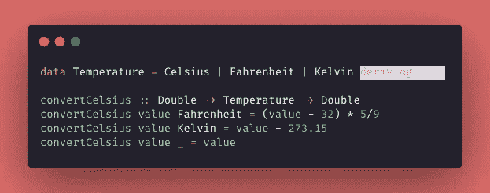
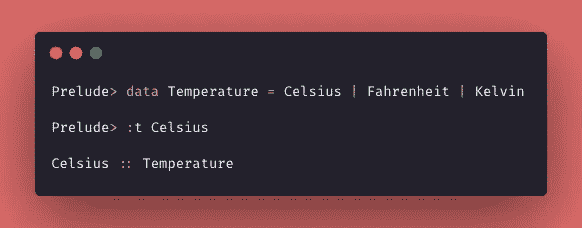
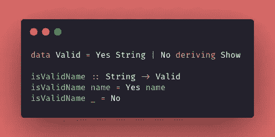
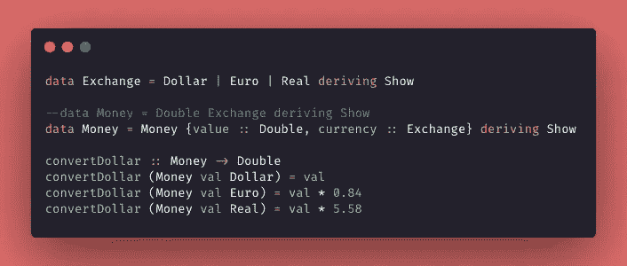

# Haskell 之旅:创建类型

> 原文：<https://levelup.gitconnected.com/haskell-journey-creating-type-1bf808bf5400>

新年到了，关于我穿越 Haskell 之旅的最后一篇帖子也到了！🚀让我们学习如何在 Haskell 中创建自定义类型！

我在学习我的第一门函数式语言时有一次惊人的经历，它非常具有挑战性，实际上我已经有一段时间没有把我的学习时间投入到新的事物中了！一种我从未真正使用过的语言和范式…😵

虽然关于 FP 领域有更复杂的概念——比如单子和函子——但是我想结束这个系列的帖子，这样我就可以写其他主题了👽


邓肯·基德在 [Unsplash](https://unsplash.com?utm_source=medium&utm_medium=referral) 上的照片

我在学习中一直使用的一些有用的链接:
**(1)** 学习基于这些书的概念: [*Haskell* 函数式编程简介](https://www.casadocodigo.com.br/products/livro-haskell) g 和[为了更好的效果，学习一个 *Haskell* ！](http://learnyouahaskell.com/chapters)📚
**(2)** 对该[意见](https://www.notion.so/Haskell-29aac2ea56274d67bde03a529e8e4f09)文件做笔记📝
**(3)** 在我的 [GitHub 库](https://github.com/jennifertakagi/haskell-projects-study) 🗃上编写一些练习

# 创建类型

我已经在以前的帖子中写过关于 [*Haskell* *数据类型*…但是这种语言很酷的一点是我们可以创建一个新的*类型*！也许乍一看，这个特性没有意义，但是让我们跳到一个例子。](/haskell-journey-types-and-data-structures-322bd1392a89)

我们想建立一个程序**将温度从一个单位转换为摄氏度，**使用 *Haskell* 解决这个问题的一个好方法是**将自定义*类型*与*模式匹配*** 结合起来。我们可以按如下方式解决这个问题:



程序转换任何温度单位为摄氏度。

理解魔法:
**(1)** 在第一行我使用*关键字* ***【数据】*** 创建了新的*类型*；
**(2)** 一种新的*型*叫做 ***【求和型】***；
**(3)** 所创建的*类型的值称为 ***【值构造函数】*** ，在本例中，它们是:“摄氏或华氏或开尔文”——***“|”***可读作“或”；
(4)然后我可以使用*模式匹配*并创建*函数*将一个单位转换为摄氏度。注意，我得到的*双*和 ***【温度】*** 值- ***模式匹配*正被应用到*【温度】*值**。*

*只是澄清一下，在下面的 shell 命令中，当我创建新的" ***温度"*** *数据* *类型*时，我可以验证**的*值构造函数* *类型*“摄氏度”是温度！🌡***

**

*显示“值构造函数”类型的外壳*

# *构造函数的字段*

*再深入一点 ***【值构造函数】*** ，它们也可以有*字段*！为了在实践中理解这一点，让我们考虑需要创建一个程序**来验证任何名称是否有效——验证非常简单，只需检查收到的*参数*不是空的*字符串* :***

**

*验证名称是否有效的程序。*

*从每一行得到的想法:
**(1)** 在第一行我创建了一个新的****【有效】***；
**(2)** 这个新的*类型*有两个*值构造函数*，但是第一个**有一个*字符串* *字段*** ，它可以带一个*参数*！；
**(3)** 检查***【isValidaName】****函数:*第一个*模式*取一个名称(作为*字符串*)*返回**值* **【收到的是名称】**；
**(4)** 第二种*模式:*如果函数没有收到有效的*字符串*值(一个数字，一个空字符串……)，则*返回*值“否”。🙈**

# **记录语法**

**还有另一种方法来声明新的*类型*，使用 ***记录语法***——这种方法在有大量值的情况下，或者如果您只是想更清楚地了解新类型会带来什么，这种方法会更加复杂和有用。**

**这个*语法*允许我们从*值* *构造函数*中提取*字段*，就像一个 ***getter*** 。看起来有点混乱，但实际上很简单，**我们只需要命名*构造函数*的*字段*。****

**为了尽可能简化，我们的代码要解决的新问题是:**创建一个程序，将一定数量的货币从一种货币转换为美元:🤑****

****

**理清思路:
**(1)** 在创建了**类型*之后，我创建了 ***【金钱】*** *类型**记录语法，*它看起来像一个对象或者字典或者 hash—***关键字*(值，货币**
**(2)** 使用*模式匹配*有一点不同:我们得到了 ***货币*** *类型*并且我们可以访问这个*类型*的每个*键*，我使用货币匹配并得到*值*作为 *****【③】**最后，要使用这个程序我们调用函数为:******

```
****convertDollar Money{value = 2, currency = Real}****
```

# **奖金:类型类**

**你可能已经注意到，在这篇文章的所有例子中，在创建一个新的*类型*的末尾有一个 ***【衍生秀】*** 。**

> **“Show”是一个“Typeclass”，我们可以把它看作一个接口——因为它最终为某些东西提供了一些通用的行为。**
> 
> ****简而言之，如果一个类型是“类型类”的一部分，这意味着它支持并实现了“类型类”所描述的行为。****

*****【type class】***还有很多，比如 *Eq，Show，Read，Num，Fractional，Real，Integral，Enum，Ord* 等等…**

**但是为了理解为什么所有创建的*类型*都是从*中派生出来的，这个***【Typeclass】***涵盖了到目前为止除函数之外的所有*类型——它取一个*值*，其*类型*是"***Show****的成员，并将其表示为📖*****

> **就是这样，伙计们！我真的希望这一系列的帖子已经帮助你迈出了使用 Haskell 的第一步！我在写作和学习这门神奇的语言中学到了很多。🥳**
> 
> **我对可能作为下一篇帖子的建议出现的主题持开放态度…我相信我会继续写关于 JavaScript 和有助于我作为开发人员的职业生涯的主题。**
> 
> **再见，保重🤓**