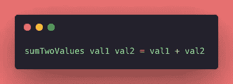
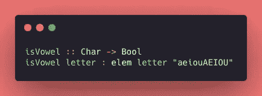
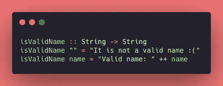
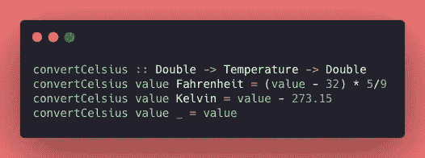

# Haskell 之旅:函数和模式匹配

> 原文：<https://levelup.gitconnected.com/haskell-journey-functions-and-pattern-matching-135ca1f2c692>

欢迎来到*哈斯克尔*系列集锦第二贴！今天，我将用这种不可思议的语言探索*功能*和*模式匹配*🤓

我在学习中使用的一些有用的链接:
**(1)** 学习基于这些书的概念: [Haskell 函数式编程导论](https://www.casadocodigo.com.br/products/livro-haskell) g 和[为了更好的效果，学习 Haskell！](http://learnyouahaskell.com/chapters)📚
**(2)** 对该[意见](https://www.notion.so/Haskell-29aac2ea56274d67bde03a529e8e4f09)文件做笔记📝
**(3)** 在我的 [GitHub 库](https://github.com/jennifertakagi/haskell-projects-study) 🗃上编写一些练习

[Andrew Ridley](https://unsplash.com/@aridley88?utm_source=medium&utm_medium=referral) 在 [Unsplash](https://unsplash.com?utm_source=medium&utm_medium=referral) 上拍摄的照片

# 功能

> 函数被定义为可重用的块代码，可以在同一个程序中多次使用。

在 *Haskell* 中，文件扩展名为**T30。hs 是我们写*函数的地方。*** 语法非常简单明了:***funcName parameter 1 parameter 2…= execution***

Haskell 中函数的代码示例。

我把影响我的区别列为一个 *JavaScript* 和 *Python* 用户:
*没有*关键字*来定义一个*函数*，只要提名就可以了，继续。
*在*参数*之间没有逗号，也没有涉及块的花括号，语言相当干净。😅
*要定义执行代码，只需使用等号，并写出*函数*所做的事情——有点类似于*箭头函数语法 i* n *JS* 。

## 辛德雷-米尔纳型系统

> 辛德雷-米尔纳是罗杰·辛德雷和后来的罗宾·米尔纳独立发现的**型系统**。它是几乎所有静态类型函数语言的类型系统的基础。

在 *Haskell* 中，*函数*可以有*类型*，并且它们可以被显式声明。实际上，编写*函数的类型*是一个很好的实践，为此我们可以使用 *Hindley-Milner 类型系统*来定义这些类型。

就此而言，我们可以说 *Hindley-Milner 类型系统*的工作方式类似于*功能*文档。我们能够知道*函数*接收哪个*参数类型*以及它将返回哪个*类型*(该语言也能够解释这些信息，但是我还没有做到这一步)。

在下面的例子中，我在 ***上使用了*辛德雷-米尔纳*的*** *函数。*函数**接收一个带有*字符类型*的*参数*，并返回一个*布尔值。*语法简单*:***(***function name::type->type***)。
******”:::****可以读作“已类型”
* *->“拆分每个参数，最后一个类型表示返回的那个。
***显式类型总是用大写的第一个字母表示。*
*****这里有一个链接，这样你可以阅读更多关于* [*辛德雷-米尔纳型系统*](http://dev.stephendiehl.com/fun/006_hindley_milner.html)

Haskell 中函数的代码示例。

# 模式匹配

> 模式匹配包括指定一些数据应该符合的模式，然后检查是否符合，并根据这些模式解构数据。(利波瓦卡，米兰)

这个特性很神奇，而且不是 Haskell 独有的。例如，我已经在*药剂*上使用过。 ***模式匹配*使我们能够为不同的模式定义单独的*函数体*，保持代码简单易读。** 🧐

在下面的代码中，我们可以很容易地创建一个*函数*来检查名称是否有效——验证*字符串*是否为空——**没有控制 IF/ELSE** ！🤯

使用模式匹配的代码示例。

综上所述，我写的*函数* ***isValidName*** 行为分 2 种场景:
(1)接收一个空的*字符串*作为*参数*，然后返回一个关于无效名称的消息；
(2)接收任何*字符串*值——注意我将接收的*参数*作为*字符串键入。如果我试图发送一个*数字*而不是一个*字符串*，它会抛出一个错误，然后返回一个包含有效名称的消息。
**如果不在乎在模式匹配上使用显式值，可以随便给它取个名字。在示例中，我使用了“名称”，但也可能是“x”。**

用*模式匹配*能想象出整个可能性吗？它帮助我们在同一个*功能上处理不同的*参数*。L* 让我们试一个稍微复杂一点的例子:

使用模式匹配的代码示例。

在上面的代码中，我们的*函数*将一些温度转换为摄氏度单位。想想解决方案:你需要知道*函数*接收的是哪个温度单位，然后据此应用转换。所以这可能是一个经典的 IF/ELSE 用法，但是我们有*模式匹配*来扭转局面！😲

函数***convertCelsius***必须处理 3 种场景:
(1)接收一个华氏单位作为*双精度类型*，然后应用转换；
(2)接收一个开尔文单位作为*双型*，然后进行转换；
(3)接收其他一些单位而忽略它。
**如果只是想忽略模式匹配上的参数，应该使用符号“_”。*

*好长的帖子！感谢您的阅读，我希望现在，您能和我一样，更加喜欢 Haskell 和函数式编程* 🥰 *也许您在想“循环和条件语句呢，詹妮弗？”好吧，我保证在下一篇文章中回答这些问题。再见，注意安全！*🤟👩🏻‍💻