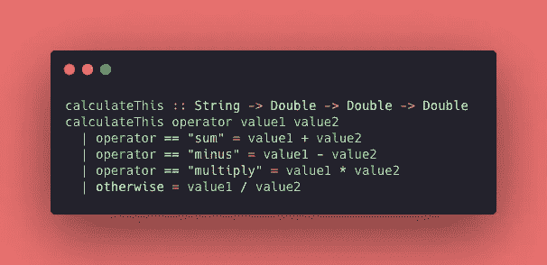
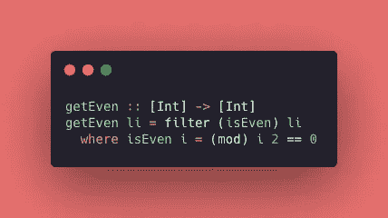
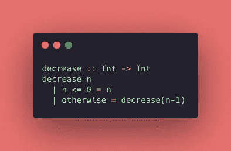

# Haskell 之旅:守护与递归

> 原文：<https://levelup.gitconnected.com/haskell-journey-guard-and-recursion-17109b222823>

欢迎来到*哈斯克尔*集锦系列的第三篇帖子！我希望你喜欢它(如果你没有阅读其他帖子，我强烈建议这样做)。在这篇文章中，我希望回答以下问题: ***“如何在 Haskell 中使用循环和条件语句？”*** 。我不知道你是否知道，但是在 *Haskell* 中，这些动作没有*关键字*😨

女士们先生们，欢迎来到守卫和递归👏

我在学习中一直在使用的一些有用的链接:
**(1)** 学习基于这些书的概念: [*Haskell* 函数式编程简介](https://www.casadocodigo.com.br/products/livro-haskell) g 和[为了极大的好处，学你一个 *Haskell* ！](http://learnyouahaskell.com/chapters)📚
**(2)** 对这份[意见](https://www.notion.so/Haskell-29aac2ea56274d67bde03a529e8e4f09)文件做笔记📝
**(3)** 在我的 [GitHub 库](https://github.com/jennifertakagi/haskell-projects-study) 🗃上编写一些练习

[西蒙·赫里](https://unsplash.com/@bullterriere?utm_source=medium&utm_medium=referral)在 [Unsplash](https://unsplash.com?utm_source=medium&utm_medium=referral) 上拍照

# 防护装置

> 模式是一种确保值符合某种形式并对其进行解构的方法，而守卫是一种测试值的某个属性(或几个属性)是真还是假的方法。(利波瓦卡，米兰)

***Guard* 是一种替代*【if condition】***的方式，对于你有几个条件(拜拜哈都肯链)的时候是一种可读性更强的方式。让我们看看下面的例子，我根据收到的*参数*构建了一个*函数*来计算一些运算(和、减等)。

Haskell 编码示例:使用“守卫”。

深入到例子:
(1)函数*"****calculate this****"*接收一个*字符串*作为操作符和两个 *double* *参数*，并返回结果作为一个*double number*；
(2)***守卫语法*很简单:只要使用一个*管道“|”…*就可以了，为了更简单，我们可以把*守卫*想象成一个*【开关盒】*** 。因此，如果操作符等于*“sum”*，它将实际上对两个值求和并返回结果。
(3)就像*【switch-case】***我们可以使用*关键字【否则】*** 来设置*默认* *行为*。这不是必需的，但是您可以使用它来避免应用程序上的错误——在这种情况下，*默认行为*是将值相除。如果我移除这种行为，并尝试使用*函数*发送*"除数"*作为*参数*，则*函数*会抛出一个错误。

# 在哪里

> 使用关键字“where”使我们有可能定义几个仅在该作用域上可见的名称或函数。

这个定义非常简单，所以让我们跳到一个代码示例。在下图中，我定义了*函数****" get even "***，该函数获取 i *nteger numbers* 的一个 *list* 并返回一个偶数的 *list* 。

Haskell 编码示例:使用“where”。

追赶:
(1)在 main 函数内部我定义了一个新的*函数*:***【isEven】***使用**【where】关键字。*(2)当我定义了一个*函数*，一个*变量*，或者***【where】语句*，**中的任何东西，这些工具就变成对*父上下文*** 可用。
(3)在这个例子中，我可以很容易地遍历一个*整数的*列表，并使用****isEven****函数*来验证*数*是否为偶数。****

# ****递归****

> ****如果你还不知道什么是递归，读读这句话。哈哈！开个玩笑！递归实际上是一种定义函数的方法，在这种方法中，函数被应用到它自己的定义中。(利波瓦卡，米兰)****

****我在 3 年前听说过递归，我必须承认那时我还不能理解它的全部力量。除此之外，那时我没有机会在日常生活中应用它。😮‍💨****

****一年后，在我个人的 Python 项目中，我有了一个激动人心的时刻:*递归*是我的问题的关键，剩下的就是历史……
在 *Haskell* 中，*递归*方法是必不可少的，因为该语言没有提供*循环* *关键字*作为*“do，while，for 或 repeat】*。****

****在下面的例子中，我构建了一个非常简单的*函数*，使用*递归*将一个数减少到零。****

********

****Haskell 编码示例:使用“递归”。****

****亮点:
(1) *递归*是一个*函数*调用自身的行为。在 ***减****函数*中，如果收到的参数大于零，则再次调用函数本身。
(2)不要忘记通过使用*递归*你正在处理*循环*，所以**不要忘记定义停止点**——你的机器感谢你！
(3)还有另一种方法来处理 *Haskell* 上的*循环*:高阶函数 s，但是这个主题值得一整篇文章来讨论。🤗****

*****这只是不可思议的哈斯克尔工具的* *冰山一角。
感谢阅读，在下一篇文章中，我将展示更多的高阶函数……还有可爱的* 🥰 *再见，注意安全！*🤟👩🏻‍💻****