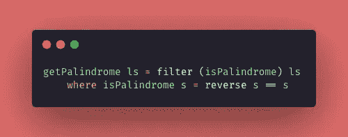

# Haskell 之旅:高阶函数

> 原文：<https://levelup.gitconnected.com/haskell-journey-higher-order-functions-d8f033ec0a1d>

自从我的上一篇帖子以来，已经过去了很长时间😢但是我回来了，现在直接从马德里写信！🇪🇸

下面我们来看 Haskell 集锦系列的第四篇帖子！🚀在这一集里，我将向你们展示一些关于*高阶函数(HOF)* 的东西！也许你已经知道这些人了——我已经在这篇[上一篇](/find-filter-map-and-reduce-put-to-action-e4f1a38e5607)中写了一些关于的*——但是继续阅读并发现一些关于*功能*的新话题……*

我在学习中一直在使用的一些有用的链接:
**(1)** 学习基于这些书的概念: [*Haskell* 函数式编程简介](https://www.casadocodigo.com.br/products/livro-haskell) g 和[为了极大的好处，学习一个 *Haskell* ！](http://learnyouahaskell.com/chapters)📚
**(2)** 在这份[意见](https://www.notion.so/Haskell-29aac2ea56274d67bde03a529e8e4f09)文件上做笔记📝
**(3)** 在我的 [GitHub 库](https://github.com/jennifertakagi/haskell-projects-study) 🗃上编写一些练习

[Artem Kniaz](https://unsplash.com/@artem_kniaz?utm_source=medium&utm_medium=referral) 在 [Unsplash](https://unsplash.com?utm_source=medium&utm_medium=referral) 上拍摄的照片

要记住的第一个概念是 **" *函数被定义为一个可重用的块代码，可以在同一个程序* "** 中多次使用，在 *Haskell* *函数*中看起来是这样的:

Haskell 编码示例:使用“函数”。

*函数*可以有一个额外的亮点: ***“它们可以将其他函数作为参数，也可以将其他函数作为它们的值返回”****——也许现在看起来有点混乱，但希望在这篇文章结束时，你能真正理解这个概念。
因此，我决定将主题分为 4 个部分，以便于理解编程中的这个重要角色。🙏*

# *希腊字母的第 11 个*

*我从来没有如此理解过 *Lambdas* ，但是在对 *HOF* 做了更多的研究之后，我发现了一个简单的方法来解释它:*

> *Lambas 是只使用一次的函数，没有上下文—匿名函数—并且只用作值*

*让我们把 ***【函数 sumTen】***改写成*:**

****

**Haskell 编码示例:使用“Lambda”。**

**理解语法:
(1)*表示一个 *Lambda 函数。*
(2)接收一个***“x”****参数*，增加***“10***”。
(3)通过向函数*发送一个*参数*、**、 *"5 "，你可以看到我们刚刚声明并使用了函数*。*** 这个*λ*的回归就是***【15】。******

# *高阶函数*

*我在这篇帖子的开头已经结束了对 *HOF* 的特点的讨论，所以我在下面留下一个超级总结的定义和例子。*

> *高阶函数是以函数为参数或返回其他函数作为其值的函数。*

**

*Haskell 编码示例:使用“HOF”。*

*深入举例:
(1)*函数****【Hof】***已经声明，并以另一个*函数*作为参数(***【fn】***)。
***【Hof】***体中的***【fn 函数】*** 用一个*整数* *自变量*(***【20】***)。
(3)最后，***【Hof 函数】*** 重复返回的***【fn 函数】*** 值。
(4)要使用***Hof 函数*** ，我们调用它并发送***【sum ten 函数】*** ，甚至发送一个 ***Lamba*** 函数——在两种情况下结果都是 60。*

*一个有趣的观察结果是，Hindley-Milner 类型表明，**“*hof 函数”接受一个函数 fn，该函数接受并返回一个“Int”类型，“Hof 函数”本身也返回一个“Int”。****

# *Currying*

*奇怪的是， *Haskell 的* *函数*只接受一个*参数*——官方说法是——然而，我们可以发送更多的参数……为了支持这一点，该语言使用了一种叫做 Currying 的技术。🤔*

> *Currying 是一种技术，在这种技术中，函数接受乘法参数，然后返回函数的字符串求值——如果参数没有被传递，它将返回一个函数*

*这看起来很复杂，但是看看下面的代码:*

**

*Haskell 编码示例:使用“Currying”。*

*(1)基本上声明了***【join words】****函数*，将 3 个*字符串*以为参数连接起来，一起返回到一个*字符串*。
(2)***【joinOneMoreWord】****函数* 已经声明接收一个*字符串*并返回一个。但这里重要的一点是，这个*函数*调用***【join words function】***只传递 2 个*参数*，换句话说:留下一个空槽*参数*。
(3)当执行***【joinOneMoreWord 函数】*** 时，我们必须再发送一个*参数*——否则，将会产生一个错误。
(4)类似 ***(joinWords(“你好”)(“世界”)(“！”)*** 正在这个*函数*内部发生，主*函数*的一个序列被生成到每个*参数*。*

*你可能知道*功能*为***“map，filter，foldl”。*** 这些函数有两个参数:**一个*函数*和一个*列表*** ，所以它们是 ***高阶函数*** 并使用 ***处理*** 技术将这些*函数*应用到*列表*中的每一项*

**

*Haskell 编码示例:使用“过滤器”。*

# *作文*

**组合*应用于*函数式编程*可以理解为**或者更具体一点:***

> ***复合是一种组合函数并将当前函数的结果传递给下一个函数的技术——执行顺序是从右到左。***

***让我们使用***" sum ten function "***并声明一个新的*函数*名为 ***"double"*** 以在下面的代码中应用 *Haskell* 中的*组合*:***

****

**Haskell 编码示例:使用“复合”。**

**追赶:
(1)我们用*实参****【10】***组成了*函数****【sun ten】******【double】***。正如你可以推导出在 *Haskell* 中使用*组合*一样，你只需要语法`*(fn1 . fn2 . fn3) arg*`。
(2)如前所述关于*构图的顺序*是从右到左。在这个例子中，首先，数字 10 乘以 2，然后再加上 10，结果是 30。**

**希望这篇文章能帮助你更多地了解任何语言中的 HOF 在 JS 中，我们总是使用 map、filter、reduce 等，但是我们经常不明白它们是如何在幕后工作的。
感谢阅读，在下一篇文章中，我想介绍 Haskell 中类型的创建！再见，注意安全！🤟👩🏻‍💻👽**