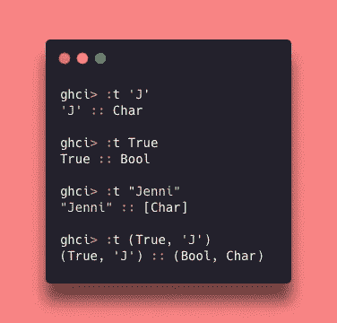
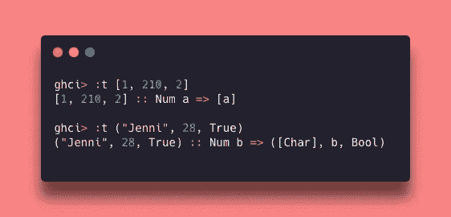
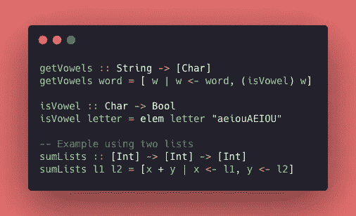

# Haskell 之旅:类型和数据结构

> 原文：<https://levelup.gitconnected.com/haskell-journey-types-and-data-structures-322bd1392a89>

嘿，伙计们，到目前为止，我已经是函数式编程(FP)的爱好者两年了，🥺.我 2021 年的目标是学习一门 FP 语言，所以我开始学习**哈斯克尔** …我已经学习了两周，这是一段有趣而富有挑战性的旅程！

希望我能找到更多的人，并至少让他们轻松一点，我将在一系列帖子上分享我所有的发现和这种奇妙编程语言的亮点，以帮助一些新的 Haskell adventures 学生。👩🏻‍💻🚀


照片由[克莱门斯·范·雷](https://unsplash.com/@clemensvanlay?utm_source=medium&utm_medium=referral)在 [Unsplash](https://unsplash.com?utm_source=medium&utm_medium=referral) 上拍摄

如果你想跟随我的整个旅程…我已经:
**(1)** 学习基于这些书的概念: [Haskell 函数式编程入门](https://www.casadocodigo.com.br/products/livro-haskell) g 和[为了更好的学习你的 Haskell！](http://learnyouahaskell.com/chapters)📚
**(2)** 对该[意见](https://www.notion.so/Haskell-29aac2ea56274d67bde03a529e8e4f09)文件做笔记📝
**(3)** 在我的 [GitHub 库](https://github.com/jennifertakagi/haskell-projects-study) 🗃上编写一些练习

函数式编程是一种**编程范式，**起源于 20 世纪 30 年代。FP 是关于函数的……一些大的概念是**纯(数学)函数、不可变数据、无/少副作用、递归代替循环、高阶函数、应用和组合函数。*🤯***

> FP 有一种不同的方法来解决问题，主要是因为它是一种声明性的范例，**开发者必须写程序必须做什么**而不是如何做！

**Haskell 是一种纯函数式编程语言，静态类型化，具有类型推断和惰性求值**。
用这种语言编码的第一步是在你的机器上安装 [Haskell 平台](https://www.haskell.org/platform/)。为了能够编译你的代码，你需要使用 Haskell 附带的 **Glasgow Haskell 编译器(GHC)** 。

# GHCi 上的命令

这里列出了一些在 GHCi 上使用的有用命令:

```
❯ ***ghci***: to open the interactive terminal❯ **:r**: to recompile the file❯ ***:l File.hs***: to compile the file (you can omit the extension adding on the very first line of your file: ***module FileName where***)❯ ***:t*** Value: to checks the data type
```

# 数据类型

在 Haskell 上，每个表达式的类型在编译时都是已知的。这意味着如果你试图将一个字符串类型和某个数字相加，你的代码将无法编译。
此外，这种语言有类型推理，所以如果你写一个字符串，你不需要告诉它这是一个字符串。

Haskell 中的一切都有类型。在这篇文章中，我介绍了一些基本类型，只是为了澄清类型系统，因为这是学习这门语言的一个重要部分。以下类型被称为 ***【显式类型】*** ，它们总是用大写的第一个字母表示。

*   ***Char*** : 表示一个**字符**(字母、数字、换行符、制表符等符号):如‘J’。
*   ***String 或【Char】***:这只是**一个 *Char、*** 的列表的语法糖，所以我们可以在上面使用所有的列表函数:例如:“Jenni”。
*   ***Bool*** :布尔类型:例如:真/假。
*   ***Int*** :表示整数，如:1。
*   ***整数*** :也表示整数，但也可以用来表示大数，如:30414093201713378043。
*   ***浮点数*** :表示单精度的实数，例如:25.132742。

**我们可以在 GHCi 上使用命令 ***":t Value"*** 来检查数据类型，如下例所示。为了容易理解输出的响应，您可以将符号***":::*理解为 *"has type of "。*****

**例如:*“‘J’具有 Char 类型”，“‘Jenni’具有 Char 列表类型”。***

****

**检查 GHCi 上的数据类型**

# **数据结构**

**使用数据结构是一种组织、管理和存储数据的方式…可能你已经在其他语言中使用过了。在 Haskell 上有两种类型:*“列表”*和*“元组”*:**

*   *****列表*** :具有****相同类型和动态长度**的值的*【列表】*:例如:*【1…10】*****
*   *******Tuple*** :在某些方面，它就像一个*【列表】*，但是值可以有**不同的类型但是长度固定**:例如: *(1，" Hi")*****

********

****列表和元组****

****读取类型的方法遵循我之前解释过的相同逻辑。有很多原生特性(提取值、连接列表、推送新元素……)，你可以在我的[概念](https://www.notion.so/Haskell-29aac2ea56274d67bde03a529e8e4f09)文档中查看其中一些。****

******🌟奖励:列表理解******

****您可能已经从另一种语言(如 Python)中了解了这个特性。
列表理解可以用来**取一个或多个*列表*新建一个**！它遵循数学集合构建符号:集合理解。语法非常简单，请看下面:****

```
****[output function | variable <- input, predicate1, ...predicateN]****
```

****现在逐步解释公式:
**(1)***【输入】*是原来的*【列表】*，它支持 1 个以上；
**(2)***变量*是指来自*输入列表*的每个元素；
**(3)***输出函数*是我们定义每一项动作的地方；
**(4)***谓词*(n)起过滤器的作用，如果*变量* ***满足*** 它，则*输出函数*将被应用，并在新的列表中返回。****

********

****列举理解的代码示例。****

****深入挖掘上面的例子:****

*   *******【get 元音】*** :这个函数接收一个***【String】***，返回一个只有元音字符的列表。使用列表理解，我们可以很容易地迭代每个字符(记住***【String】***是一个***【list of Char】***)并检查它是否包含在***【aeioAEIOU】***术语中—***【isvovel****函数😎*****
*   ********【sum lists】***:该函数接收两个整数列表，并将它们相加。在这里，我们可以对多个列表使用列表理解，获得每个列表的一个项目，并将它们相加。通过列表:[1，2]和[10，20，30]，返回是[11，21，31，12，22，32]😱*****

> *****就是这样！我们给出了 Haskell 的初始步骤，我希望现在你对 FP 和它的语言更感兴趣！
> 如果有什么不清楚的地方，或者在概念上有什么错误，请随时联系我📬*****
> 
> *****下期见，注意安全*🤟******