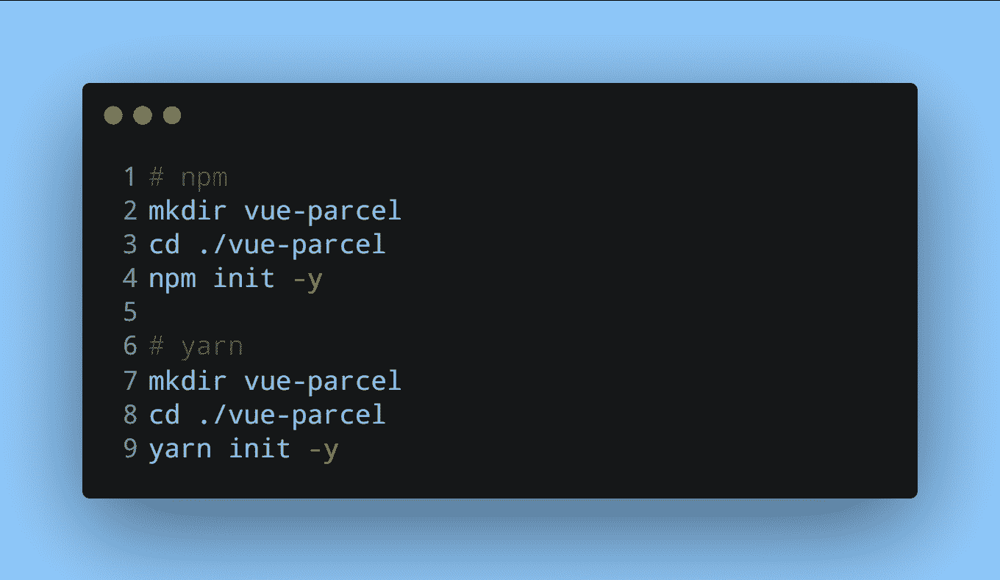
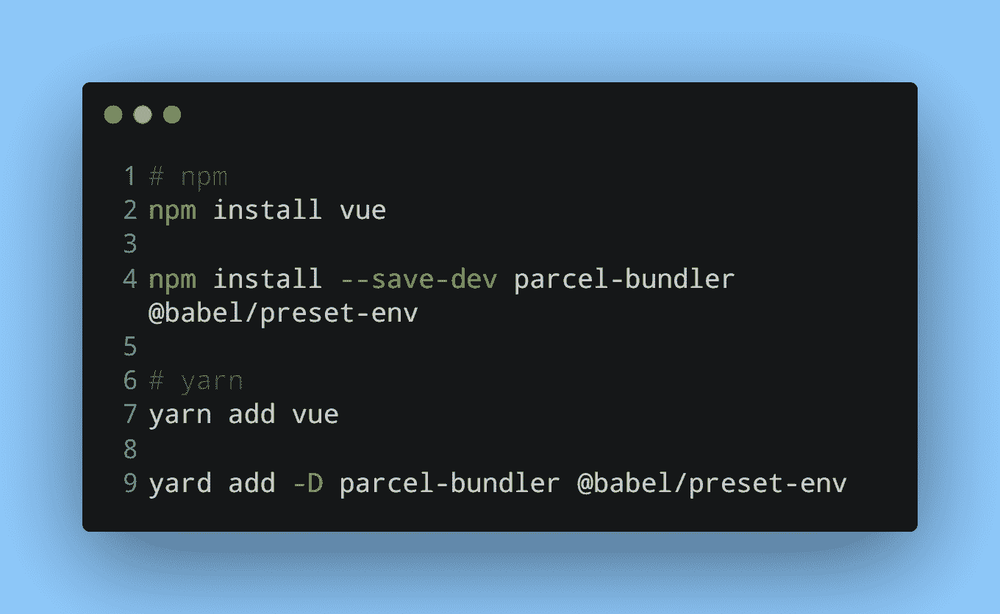
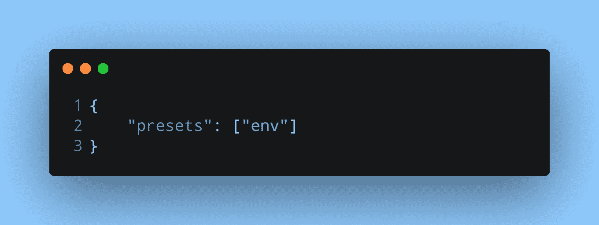
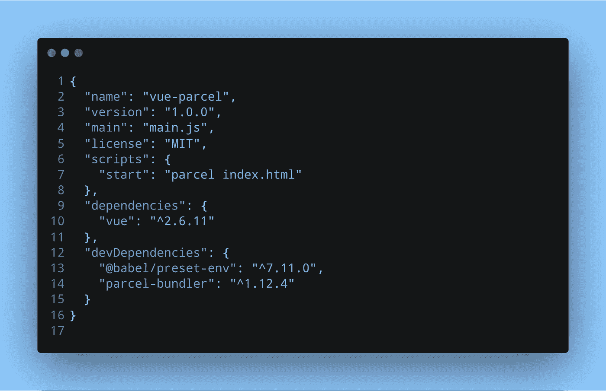

# 你试过为你的 Vue 项目打包吗？

> 原文：<https://levelup.gitconnected.com/have-you-tried-parcel-for-your-vue-projects-f188f7a5c08a>

照片由[克莱门特 H](https://unsplash.com/@clemhlrdt?utm_source=medium&utm_medium=referral) 在 [Unsplash](https://unsplash.com?utm_source=medium&utm_medium=referral) 拍摄

你认为`vue create`给了你一个几乎没有依赖的 Vue 项目吗？再想想。Parceljs 会让你大吃一惊。

使用[包](https://parceljs.org/)，您可以非常快速地创建一个项目，而无需安装一堆依赖项或编辑大量配置文件。当你想测试一个你学到的概念或者练习一些特定的东西，而不是做一个完整的项目时，这是非常有用的。为此，Parceljs 可以让您快速入门。

虽然没有包裹你也能得到同样的结果，但是一个不碍事的包裹总是一件好事。此外，它可以创建一个热重装服务器。

# 使用 Parceljs 创建 Vue 项目

我写过一篇关于用 Parcel 创建一个 [React 项目的文章。创建 Vue 项目的步骤是相似的。](https://niharraoteblog.netlify.app/how-to-create-a-minimal-react-and-parcel-app-in-5-steps)

# 1.创建项目

在安装 Parceljs 和其他依赖项之前，我们需要一个项目目录和一个包文件

# 2.安装依赖项

Vue 项目所需的依赖项甚至比 React 项目所需的还要少。

# 3.编辑 babel 配置和 package.json 脚本

安装完必要的依赖项后，让我们在各自的配置文件中添加`package.json`和 Babel 预置中的包脚本

# 4.使用宗地运行项目

运行服务器非常简单。添加`--open`标志，在默认浏览器中自动打开服务器。如果没有旗子，你需要把它打出来。

# 包扎

用 Parceljs 建立 Vue 项目的四个简单步骤。虽然您需要做一些努力来让 Sass 之类的东西正常工作，但在大多数情况下，Parcel 会按照您的期望工作，并会避开您的方式。

Parceljs 是 Webpack 的一个很好的替代品，我会把它推荐给那些可能看 Webpack 的文档而不知所措的人。Parceljs 正在努力使事情变得更加顺利，但大多数事情都很好。如果您不想在终端中运行命令，并且不想让应用程序捆绑器在幕后工作，而是想负责并与您的捆绑器密切合作，我强烈建议您首先使用 package。

虽然 Webpack 更稳定、更可靠，而且可能支持项目中任何你想要的东西，但是 Parceljs 比 Webpack 简单。尽管像 Webpack 这样功能丰富的应用程序打包器是一个很好的选择，但 Parceljs 是一个不错的选择。

*最初发表在* [*我的博客*](https://niharraoteblog.netlify.app/have-you-tried-parcel-for-your-vue-projects) *。*