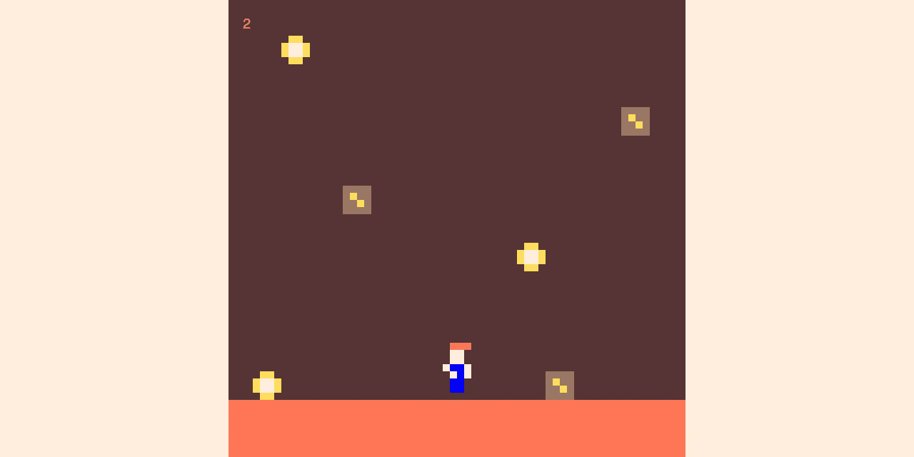
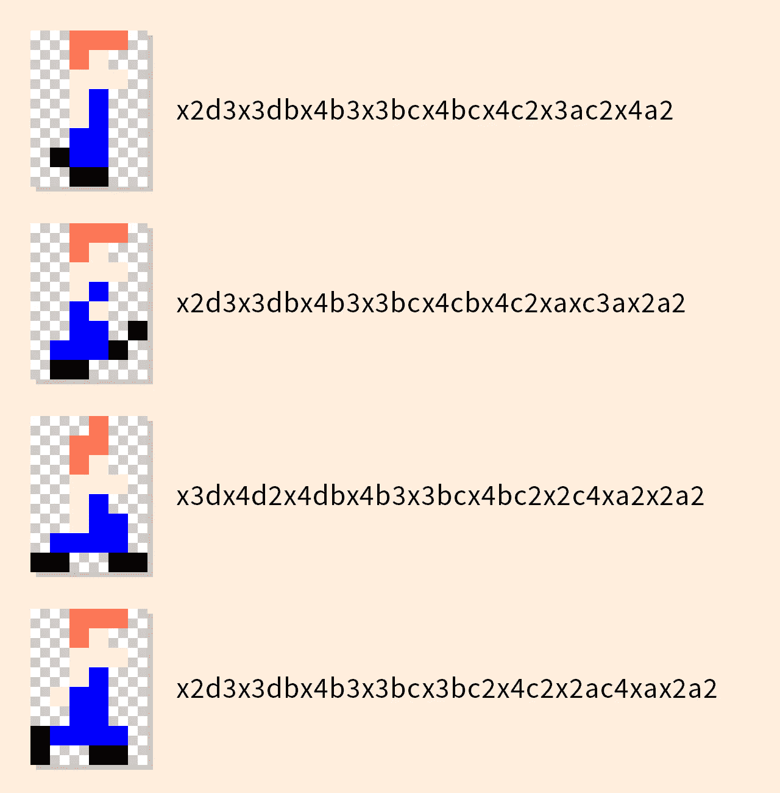
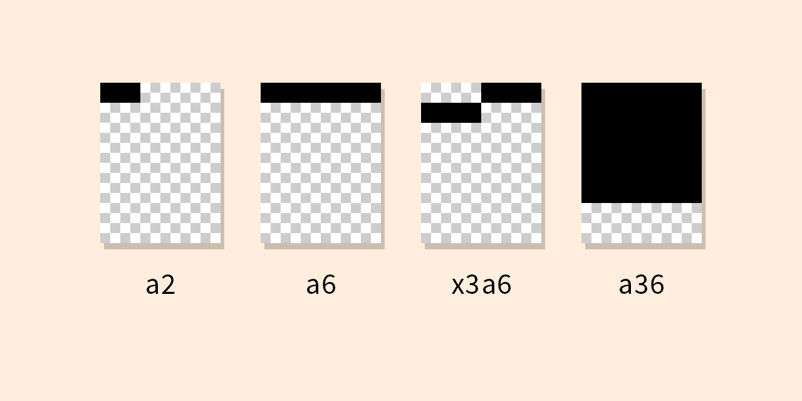
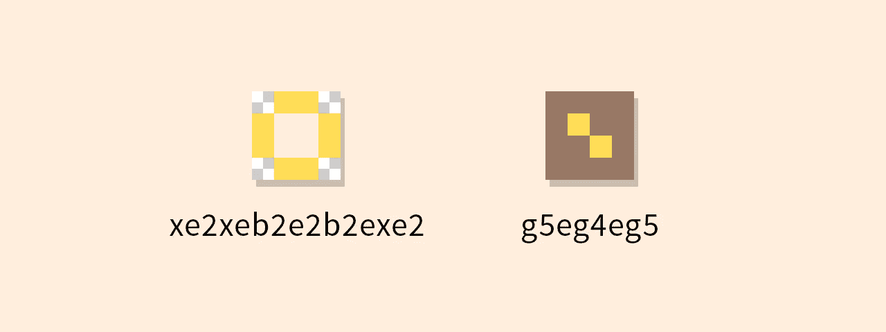

# 享受游程编码精灵的乐趣

> 原文：<https://levelup.gitconnected.com/having-fun-with-run-length-encoded-sprites-662d6a8147c8>

2018 年，我提交了一份参赛作品给 [JS1k](https://js1k.com/) ，这是一个现已停办的 code 高尔夫比赛。那年的主题是“不稳定的硬币矿”，我提交的是一个简单的游戏，你必须在躲避巨石的同时从不稳定的矿里收集硬币。我获得了第十名，这仍然是一个值得骄傲的时刻。

 [## 挥发币矿- JS1k 2018

### JS1k 2018 演示:《硬币和巨石》——矿塌了！去拿硬币。避开巨石。

模拟. xyz](https://mock.xyz/volatile-coin-mine/) 

正如您可能已经猜到的，JS1k 条目必须小于 1KB。你要努力把每个字节的最后一滴都挤出来。有很多真正有趣的字节节省技术，其中一些你可以在我的条目的[未压缩源代码](https://github.com/andrewb/volatile-coin-mine/blob/master/index.js)中看到。很多会让你畏缩——这些不是真实世界的！

我知道我想在我的游戏中包含一个动画角色，但是由于比赛规则，我不能使用精灵表。我的解决方案是使用游程编码(RLE)来代替。

在高级别上，RLE 是一种压缩形式，其中数据的运行被表示为单个值和计数，而不是原始运行。一会儿我将向你展示这是如何工作的。

首先，这是我在游戏中想要的行走动画。只有 4 帧。这也是对我小时候最喜欢的游戏之一的肯定。

步行环路。您也可以在浏览器中查看。

每一帧由一个 RLE 字符串表示。例如，使用`x2d3x3dbx4b3x3bcx4bcx4c2x3ac2x4a2`表示第一帧。

每一帧都用 RLE 字符串表示

乍一看，这些字符串可能看起来有点难以解析，但是一旦理解了规则，就变得非常简单了。

*   每个字母代表一种颜色。在我的代码中`x`是透明的，`a`是黑色，`b`是棕褐色，以此类推。
*   该数字表示前一种颜色应该重复的次数。例如`a2`将是 2 个单位宽。
*   长度为 1 的单位不包括数字。
*   玩家精灵有 6 个单位宽。这意味着一个值为`a6`的 RLE 字符串将代表一条黑线，这条黑线是精灵的全宽。
*   你可以把 RLE 想象成一串像素。例如，在一个 6 单位宽的精灵中，你用`x3a6`而不是`x3a3a3`来描述下面的第三个形状。后者是可行的，但是我们不需要额外的 2 个字节。类似地`a36`会画一个黑色的正方形。

我还为所有其他的角色造型和游戏资产使用了 RLE。其中一些对玩家精灵有不同的尺寸，例如硬币和巨石是 4 个单位宽而不是 6 个单位。

注意，RLE 也可以用不同的方式来表达。在一些实现中，字母的位置被交换，即数字在字母之前。

# 渲染精灵

我的条目中的 [sprite 渲染代码](https://github.com/andrewb/volatile-coin-mine/blob/master/index.js#L21-L54)可读性不是很好，因为它是针对一个非常具体的用例进行优化的。我们改写一下，供一般消费。

首先必须解码字符串。这个函数会将类似于`x3b3`的字符串转换成`xxxbbb`。该函数使用`[replace](https://developer.mozilla.org/en-US/docs/Web/JavaScript/Reference/Global_Objects/String/replace)`和一个简单的正则表达式，该表达式将匹配后面跟有一个或多个数字的任何单词字符。`replace`的第二个参数是一个函数，它将匹配的单词字符(`\w`)重复必要的次数(`\d+`)。

字符串解码后，渲染 sprite 就相对简单了。

第一步是将解码后的字符串转换成一个数组，并遍历每个字符。当前像素的颜色可以通过将字符(例如`a`)映射到调色板来找到。接下来，必须找到 x 和 y 坐标。这些是使用精灵的当前索引和宽度(单位)计算的。

最后，当前“像素”被绘制到屏幕上。在这个例子中，我使用 HTML 画布和`fillRect`。

`width`参数允许该函数渲染不同尺寸的子画面，例如 4 个单位宽。`scale`参数用于增加每个“像素”的大小，例如，`scale`为 5 会将每个精灵的“像素”渲染为一个 5×5px 的块。

您可以在 Repl.it 上看到[完整步行循环示例的示例代码。如果你想在我的 JS1k 条目中看到我是如何处理的，你可以在 Github](https://replit.com/@AndrewBerry1/RLE#script.js) 上查看[未压缩的源代码。](https://github.com/andrewb/volatile-coin-mine/blob/master/index.js)

RLE 可以是一个有用的方式来代表小精灵。在 JS1k 之外，它不一定是我的第一选择，但是除了节省字节之外还有其他好处。例如，调色板可以很容易地改变(包括在飞行中)，资产很容易存储和加载，因为它们只是字符串。

[1]例如可以用`~~n`**代替`Math.floor(n)`，`+'1'`代替`parseInt('1', 10)`。Can 被强调——我绝不会在规范高尔夫之外做这件事。**