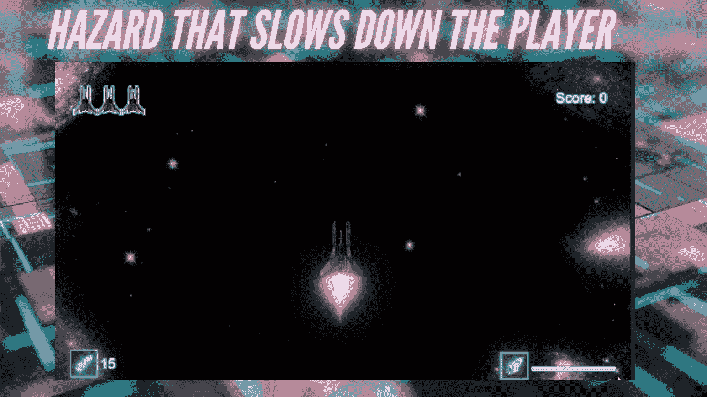
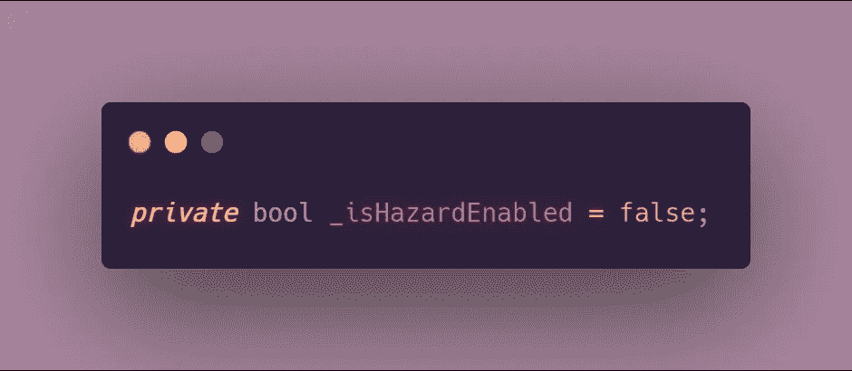
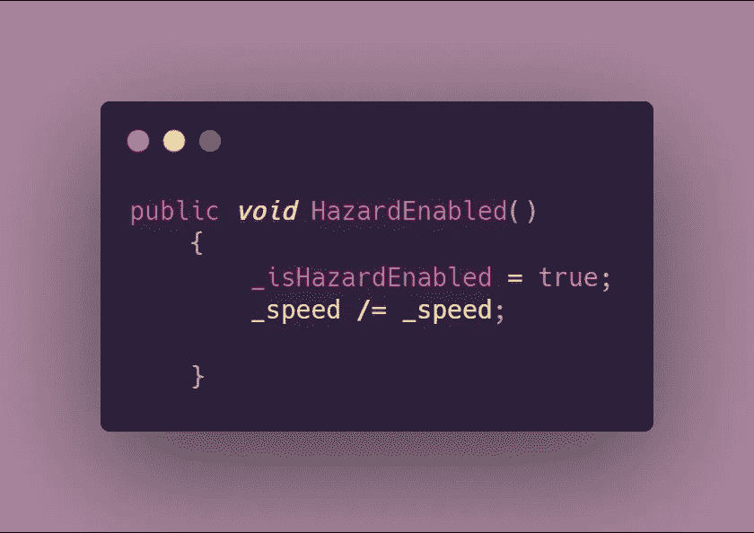
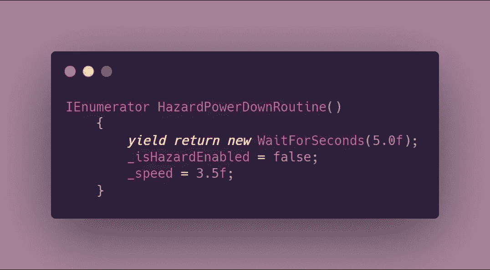
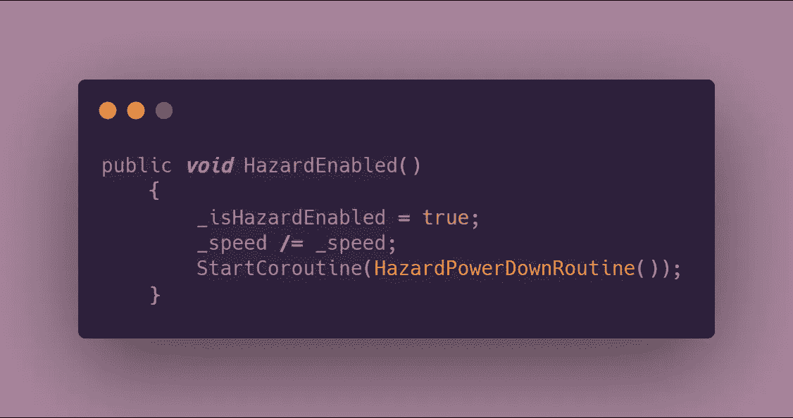
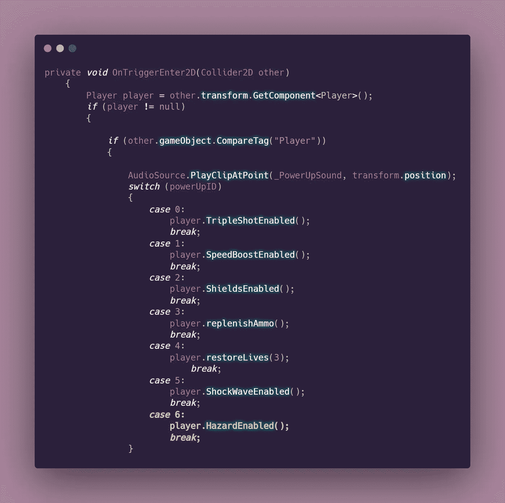
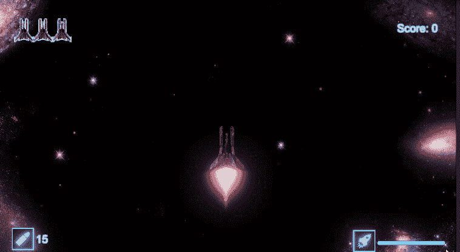

# Unity 中的危险收集

> 原文：<https://levelup.gitconnected.com/hazard-collectible-in-unity-10bb92047116>

## 2D 太空射手—第二阶段:核心程序设计挑战

**目标:**制造一个危险，让玩家在短时间内减速。

> **注意:**这是复古风格的 2D 太空射击游戏的一部分，玩家可以在这里收集能量。这种危险的行为就像一次加电，尽管收集它会对玩家产生负面影响。因此，这将遵循[开机脚本](/adding-power-ups-e4af4ccbd7cb)。

# 危险编程

1.  添加全局布尔变量。这将允许我们稍后触发危险。

2.创建一个方法来处理必要时将 bool 值设置为 true。最好的做法是创建一个方法来处理 bool 值的更改，而不是匆忙地去做。这也是我们通过将速度减半来减慢玩家速度的地方。

3.制作一个[协程](https://medium.com/codex/coroutines-with-unity-b5a2b3fc3426)来确定危险的持续时间。下面的协程被编程，使玩家的速度在 5 秒后恢复正常。先前创建的 bool 变量被设置为 false，这样程序就知道它不再需要将速度减半。

4.现在您有了一个协程，是时候启动它了。这将被添加到先前创建的 void 方法中。

5.当玩家接触到危险时，调用 HazardEnabled 方法。该逻辑依赖于[触发输入检测](/oncollisionenter-vs-ontriggerenter-when-to-use-them-56d42772dd22)。Mine 被放置在一个[模块化加电脚本](/creating-modular-power-up-systems-bcf349e0020)中，该脚本使用一个[开关语句](/switch-statements-to-the-rescue-277cb924c312)来根据检测到的对象执行方法。

**结果:**

本文是 GameDevHQ 的核心编程挑战系列的一部分。在下一篇文章中，我将会写实现一个可以使用屏障/盾牌的敌人！