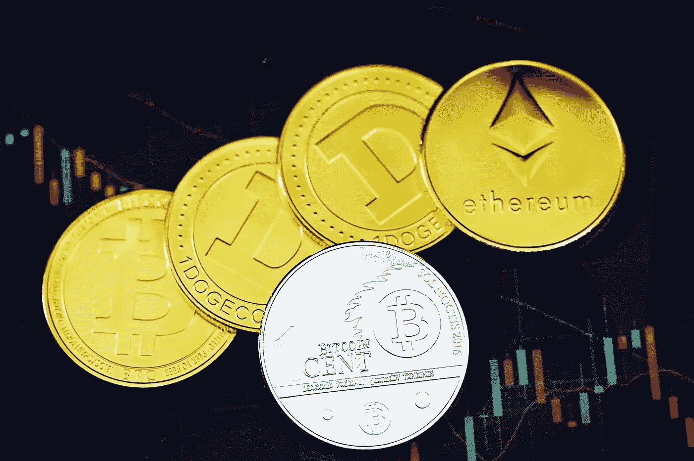
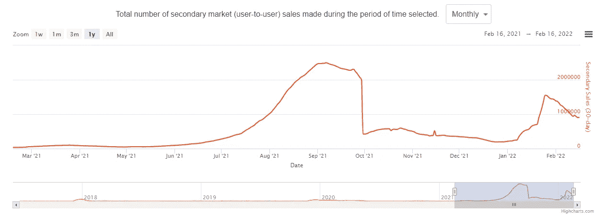

# 走向零:NFT 会重蹈互联网泡沫的覆辙吗？

> 原文：<https://levelup.gitconnected.com/heading-to-zero-could-nfts-go-the-way-of-the-dotcom-bubble-32552a9c0a3f>

在这一年里，华尔街出现了迷因股票卖空，比特币创下了许多历史新高， [NFTs 成为了](/why-nfts-are-moving-into-the-gaming-arena-and-their-future-79baa4ef71cf)整个投资领域的主导力量，这是一个壮举。但是，随着股票市场和许多[加密货币](/cryptocurrencies-dont-have-to-be-bad-for-the-environment-60949611785)在 2022 年面临动荡的开端，NFT 能否在去年积聚的势头上继续努力？

“当我们进入 Web3 提供的可能性时——去中心化的、可拥有的和可编程的网络——我们看到每天都有数百个新项目涌现出来。但重要的是要记住，Web3 不是关于特定的 NFTs，而是关于你可以用它做什么，是提供访问，社会资本还是效用，”[解释道，Nicholas Julia](https://medium.com/sorare/predictions-for-2022-c01d6a39ae9b) ，总部位于 NFT 的梦幻足球游戏 Sorare 的联合创始人兼首席执行官。

“我预计大多数非转移支付将以同样的方式趋于零。炒作并没有否定潜在的趋势，如果你选择长期建设的项目，你会发现亚马逊。网络泡沫。NFT 帮助你拥有一部分互联网，正如我们的好朋友 Alexis Ohanian 解释的那样，互联网是一台文化机器，是一个社区连接器。最终，NFT 现在是文化的一部分，虽然不是每个 NFT 都能幸存下来，但我们绝对会看到一些项目在未来几个世纪都有价值。”

Julia 对 NFTs 的世界略知一二。2021 年 11 月，Sorare 在 B 轮融资中筹集了 6.8 亿美元的巨额资金，使公司估值达到 43 亿美元。新发现的独角兽地位意味着 Sorare 可以合法地成为世界上最有价值的 NFT 创业公司。

*(图片:*[*Nonfungible.com*](https://nonfungible.com/market/history)*)*

很明显，上述数据表明，在 2022 年 1 月出现短暂复苏之前，NFT 的二级市场销售在 2021 年年中快速增长。尽管二级市场的销量在 2021 年初还没有飙升，但在 2 月份已经出现了明显的下降。

数字艺术家迈克·温克尔曼(Mike Winkelmann，更为人所知的名字是 Beeple)呼应了朱莉娅的观点，即许多 NFT 项目最终将归零。2021 年，皮普尔以创纪录的 6900 万美元卖出了一幅 NFT，但此后他一直对市场持怀疑态度。

他在接受《纽约时报》采访时指出，投资基于密码的艺术“是为了那些寻求冒险的人”，然后补充说“这种东西绝对会归零。”

在讨论 NFT 市场的未来时，皮普尔还表示:“我认为这很有可能是一个泡沫。”。

那么，NFT 世界的下一步是什么？尽管一些主要参与者放弃了目前充斥该行业的许多项目，但市场能否继续繁荣？

# 评估非功能性测试的优点

尽管加密领域之外的投资者对此持怀疑态度，但我们已经看到,[的蓝筹 NFT 项目](https://www.fool.com/investing/2021/10/25/the-good-the-bad-and-the-ugly-of-nfts/)的崛起，如 CryptoPunks、Bored Ape Yacht Club 和 CyberKongz，帮助人们对不可替代的令牌产生了更大的兴趣。一些项目甚至带有多种形式的效用，同时以一种被动收入的形式奖励持有者。

NFTs 的兴起导致像佳士得这样的知名拍卖行以数百万美元的价格拍卖数字艺术。

此外，多功能用途的潜力意味着[拥有一件 NFT](/the-most-expensive-nft-in-the-world-25aec5d3c06) 可以比传统艺术品带来更多好处，代币以奖励玩家的方式被纳入游戏中。

然而，对许多投资者来说，NFT 的前景已变得不可持续。由于其稀缺性和受欢迎程度，一流代币对许多散户投资者来说已经变得过于昂贵，导致无数模仿项目出现。这总是意味着，一旦不可替代的淘金热出现消退迹象，绝大多数非金融资产将永远不会增值。

NFT 也高度依赖于加密货币的[成功。加密市场最近的回调对 NFT 投资者来说是一个警告。](https://en.freedom24.com/ideas/11841-cryptocurrency-for-portfolio-diversification)

“加密货币目前是投资股票、债券和大宗商品的最具吸引力的替代品之一。加密货币通常波动性很大，这意味着投资者可以获得高回报。然而，随着波动而来的是更大的风险，”欧洲自由金融公司投资咨询主管马克西姆·曼图罗夫指出。

当波动性变得更加明显时，非金融资产将特别容易受到投资者抛售的影响，因为财富保值是重中之重。

尽管我们已经看到了当互联网网站作为一种虚拟房地产形式吸引大量资金时，数字泡沫破裂会发生什么。网络繁荣和 NFT 的景观之间肯定有一些相似之处。然而，投资者将希望他们的代币的固定稀缺性有助于维持其价值。

投资者可能会意识到，如果没有人对最稀缺的资产感兴趣，那么即使是最稀缺的资产也毫无价值，因此在购买之前完全信任项目是至关重要的。考虑到这一点，许多非功能性测试最终很可能会归零，但是对于那些可信的、管理良好的项目来说，肯定有足够的理由对未来保持乐观。