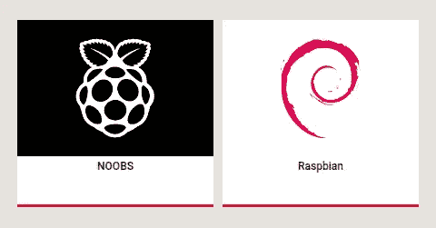

# 使用带 SSH 的 NOOBS 无头安装 Raspberry Pi

> 原文：<https://levelup.gitconnected.com/headless-installation-of-raspberry-pi-using-noobs-and-make-it-ready-for-ssh-ad9a94babd85>



我在网上看到的几乎所有教程都假设读者有一个外部显示器。是啊，如果你有外接显示器的话，安装将是小菜一碟。但是外接显示器的价格和树莓派(raspi)差不多。很多时候，我们要用 raspi 搭建的项目不需要外接监视器，很多时候，我只是用 SSH 来控制我的 raspi。仅仅为了安装而购买显示器是一种浪费。

在没有监视器的情况下安装和控制 raspi 被称为**无头**。有一个安装软件叫做**新的开箱即用软件(NOOBS)** 由 raspi 自己官方提供。NOOBS 提供了几个操作系统来安装在我们的 raspi 中，但是 raspi 的官方操作系统是 Raspbian。这个故事将指导您如何使用 NOOBS 安装 Raspbian，并准备好使用 SSH 远程安装它。在这种情况下，我使用 WI-FI 网络远程访问 raspi。

要求:

*   Raspi ，我用的是 Raspi 3。
*   **Micro SD 卡**，作为硬盘和存储 OS。
*   **微型 SD 卡的读卡器**。
*   **外部电源**，为 raspi 供电。任何配有 raspi 插头的智能手机都可以。互联网上的一些消息来源称最佳电流为 2.5A。
*   无线网络。

下面是一步一步的步骤:

1.  准备好你的 micro SD 卡。如果需要，您必须先格式化 SD 卡。 **Raspi 官方推荐使用** [**SD 存储卡格式化程序**](https://www.sdcard.org/downloads/formatter/) **我个人也推荐使用它**，因为当我想格式化我的 SD 卡时，我在使用 fdisk 命令和 GParted 时遇到了问题。此工具成功格式化了我的 SD 卡。将其格式化为 FAT32。
2.  在 raspi 官网[下载 NOOBS。](https://www.raspberrypi.org/downloads/noobs/)
3.  将 NOOBS 的压缩文件解压到微型 SD 卡上。
4.  在您的 micro SD 卡的 os 目录中，**删除除 Raspian** 以外的所有目录。
5.  在你的 micro SD 卡目录下，**编辑 recovery.cmdline 文件**。您会发现一个单行命令。**那一行，在**行的末尾加上 `**silentinstall**` **。这将使 NOOBS 在您插入 micro SD 卡并首次打开 raspi 时自动安装 raspi。**
6.  在你的 micro SD 卡目录下创建一个文件名为`wpa_supplicant.conf`的文件。其内容是

```
network={
    ssid="ssid_name"
    psk="password"
}
```

**ssid 是您的 WI-FI 网络名称，psk 是 WI-FI 网络的密码**。

7.**创建一个名为**的空文件`**ssh**`。它可以让你通过 SSH 远程操作你的 raspi。

8.将微型 SD 卡插入 raspi 并打开。raspi 会自动安装 Raspbian，然后自动重启并连接到 wifi。安装需要一些时间。

9.当 raspi 连接到 WI-FI 时，通过 ssh 使用

```
User: **pi**
Password: **raspberry**
```

如果找不到 SSH 的 IP，**使用 nmap 命令进行端口扫描**。例如，您的 WI-FI 网络的 IP 范围是 192.168.4.0 到 192.168.4.255

```
nmap 192.168.4.0/24
```

尝试连接所有打开了 ssh 端口的 IP，并使用上述用户和密码通过 SSH 连接。**祝贺您成功连接您的 raspi 无头**。

仅此而已。愉快地完成你的项目

参考资料:

[https://github.com/raspberrypi/noobs](https://github.com/raspberrypi/noobs)，2019 年 9 月 5 日接入

[https://](https://github.com/raspberrypi/noobs)[raspberrypi.org/forums/viewtopic.php?t=173195](https://www.raspberrypi.org/forums/viewtopic.php?t=173195)，2019 年 9 月 5 日接入