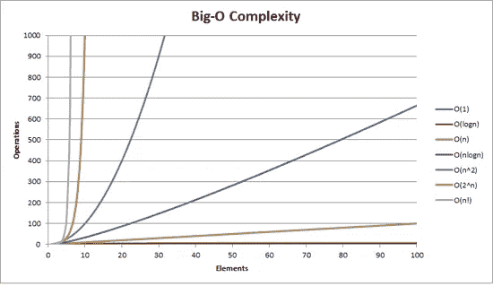

# 堆排序算法 101

> 原文：<https://levelup.gitconnected.com/heap-sort-algorithm-101-dec2aefb0b11>

欢迎来到我关于奇妙、神秘、神奇的**堆排序算法(HSA)** 的教程，我们将使用 JavaScript 来构建它。


# 介绍

老实说，对于任何不熟悉二分搜索法树、最大/最小堆和其他相关概念的初级开发人员来说，这将是一个非常紧张的演练。我的建议是，每一步都要慢慢来，并且在阅读材料的时候，要确保对基础知识掌握得很扎实。正如塞缪尔·L·杰克逊雄辩地指出的那样…

> ***抓紧自己的屁股。***(侏罗纪公园，1993)

# 回顾

好了，首先，在我们能够正确定义什么是 ***堆排序算法*** 及其工作原理之前，我们将回顾以下概念和数据结构:

*   **数组**
*   **二叉树**
*   **堆**
*   **二进制堆**

## 数组

***数组*** 数据结构是地球上每一个 Web 开发人员都应该熟悉的一个基本概念。当数组在我们的*HSA 中实现时，它们不仅会在实践中使用，还会起到某种*概念上的*作用。*

*通常，我们使用数组来存储信息(在我们的例子中是整数)。我们通常认为数组是内存中不同位置的数据列表，可以直接访问(使用索引)或使用循环和内置方法访问。*

*在这种情况下，我们将正常地访问数组 ***中的信息，但是*** 我们将把它的值看作是 ***二叉树*** 中的元素。从概念的角度来看，我们将把每个值分配给树上的一个特定节点。*

## *二叉树*

*为了快速复习，我们将定义并解释什么是 ***二叉树*** 。*

****二叉树*** :一种数据结构，从一个有值的根节点开始，有(最多)两个子节点，通常称为左右节点，它们有自己的值。*

*二叉树可以作为 JavaScript 中的对象初始化，如下所示:*

```
***let tree = {
  val: 2, 
  left: {
    val: 3,
    left: { 
      val: 4,
      left: { ...},
      right: { ...}    
    },
    right: { 
      val: 5,
      left: { ...},
      right: { ...}
    }
  }, 
  right: {
    val: 7,
    left: { 
      val: 8,
      left: { ...},
      right: { ...}    
    },
    right: { 
      val: 9,
      left: { ...},
      right: { ...}
    }
  }
};** **// The resulting binary tree would like this** **2
                                 /    \
                                3      7
                              /  \    /  \
                             4    5  8    9***
```

*虽然这种形式很常见，并且您可以实现一个二分搜索法来遍历和操作它，但是我们将使用一个数组来保存二叉树的值，而不是一个对象。这里有一个说明性的例子来阐明**在我们的实现中**数组将如何表示一个二叉树。*

```
 ***let array = [5,2,1,4,3];

         // What the array represents as a binary tree structure** **[5]           5
                                 / \
                   [2,1]        2   1
                               / \
                   [4,3]      4   3***
```

*值得注意的是，树的每个水平层总是从**顶部到底部**和从**左侧到右侧**布置，并且包含从**到每个**父(或根)节点**的两个子节点**。*

*使用基于代码的方法，我们可以使用一些简单的公式来确定父节点和子节点在数组中的位置。我们可以从假设数组的开头(index 0，integer 5)是根节点开始。*

```
***let array = [5,2,1,4,3];
indexes --> [0,1,2,3,4]****// parent node 
let p = (index - 1) / 2;

// left child node
let left = 2 * p + 1;****// right child node
let right = 2 * p + 2;***
```

## *堆/二进制堆*

*因此，我们已经确定了如何在我们的实现中使用和概念化数组。 ***但是什么是堆，和二叉树有什么关系？****

****堆*** 是一种基于树的数据结构，满足以下两个定义之一的标准。并且 ***二进制堆*** 是采用如上定义的二叉树形式的堆。*

***最大堆二叉树**:每个父节点的值都大于等于其子节点的值。*

```
 ***15
                                 /    \
                               12      18
                              /  \    /  \
                             6    9  4    1***
```

***最小堆二叉树**:每个父节点的值小于等于其子节点的值。*

```
 ***3
                                 /    \
                                8      5
                              /  \    /  \
                             10  18  12   15***
```

*正如您可能已经猜到的那样， ***堆排序算法*** 的最终目标是使用 ***Max 或 Min heap*** 对值列表进行排序。一个警告是，二进制堆可以包含值不按顺序排列的兄弟(子节点)(参见上面的例子)。我们的实现必须考虑到这一点，这样我们就不会得到一个满足二进制堆标准的数组 ***，但不满足升序列表标准的数组****。**

# **履行**

**好了，我们已经完成了回顾，希望您对与我们的实现相关的数据结构和概念有一个适当的理解。我们将概述实际的 Max Heap 函数的两个实现( ***迭代和递归*** )，并一步一步地浏览整个代码库。**

## **交换功能**

**我们将把我们的代码库分成几个不同的函数，以保持整洁和可读性。我们将定义一个 ***交换函数*** ，它将交换数组中的值(*)。我们将在整个实现中重用这个函数。***

```
*****const swap = (input, i, j) => {
  const temp = input[i];
  input[i] = input[j];
  input[j] = temp;
};*****
```

## ***迭代最大堆函数***

***迭代方法几乎等同于递归实现。主要区别在于函数如何循环或重新初始化，直到执行一个基本用例。下面是迭代最大堆函数的快速分解:***

1.  ***初始化一个 while 循环，该循环将无限期地继续，直到基本情况被触发***
2.  ***初始化两个子节点和一个跟踪父索引的 max 变量***
3.  ***如果任一个子索引存在于数组的长度范围内，并且其中一个数组中的值大于父索引/最大索引中的值，则创建两个条件，将最大值重新分配到左侧或右侧***
4.  ***创建一个基本用例，当父索引没有被重新分配给 max 变量时，该用例将退出函数***
5.  ***用父索引和更新的最大索引调用交换函数***
6.  ***将父索引(I)分配给更新的 max 变量。这有效地将父索引更新为(曾经是)其最大的子节点。***

```
*****const iterativeMaxHeap = (array, i, length) => {
  while (true) {
    const left = 2 * i + 1;
    const right = 2 * i + 2;
    let max = i;** **if (left < length && array[left] > array[max]) {
      max = left
    }

    if (right < length && array[right] > array[max]) {
      max = right
    }

    // Once this condition is met, exit the loop
    if (i === max) {
      break;
    }

    swap(array, i, max)
    i = max;
  }
};*****
```

## ***递归最大堆函数***

***这是**最大堆**函数的递归版本。***

1.  ***初始化一个 while 循环，该循环将无限期地继续，直到基本情况被触发***
2.  ***初始化两个子节点和一个跟踪父索引的 max 变量***
3.  ***如果任一个子索引存在于数组的长度范围内，并且其中一个数组中的值大于父索引/最大索引中的值，则创建两个条件，将最大值重新分配到左侧或右侧***
4.  ***如果 max 变量的值已经改变，用 max(左或右)索引交换父索引，并再次递归调用 **maxHeap** 函数。***

```
*****const recursiveMaxHeap = (array, i, length) => {
    const left = 2 * i + 1;
    const right = 2 * i + 2;
    let max = i;** **if (left < length && array[left] > array[max]) {
      max = left
    }

    if (right < length && array[right] > array[max]) {
      max = right
    }

    if (i !== max) {
      swap(array, i, max)
      recursiveMaxHeap(array, max, length)**
    **}
};*****
```

## ***Heapify 函数***

***这个函数从输入数组中创建一个有效的堆。在本例中，我们在循环内部创建了一个 ***Max*** 堆，但是如果我们愿意，我们也可以创建一个 ***Min*** 堆。迭代和递归实现在形式上是相同的。下面是一个简单的演练:***

1.  **我们初始化一个从数组中间开始的循环，并准备将 ***向后*** 移动到数组的开始。我们从中间开始，因为***max heap******函数*** 实际上是从第一个索引(或父节点)到最后一个索引(或子节点)创建一个堆。在每个循环之后，我们用任何更大的子节点有效地覆盖父节点，直到整个事情变成有效的 ***Max*** 堆。**
2.  **我们调用 ***maxHeap 函数*** 带数组，当前父索引和我们要堆的数组长度。**

```
****const heapify = (array) => {
  for (let i = Math.floor(array.length / 2); i >= 0; i--) {
    maxHeap(array, i, array.length)
  }
};****
```

## **堆排序函数**

**这是驱动我们整个实现的主要功能。这个函数从输入数组创建一个堆，然后对数组重新排序(就地)以产生一个排序后的数组。**

1.  **用输入数组的长度初始化 ***len*** 变量。**
2.  **如果数组没有长度，创建一个将退出函数的基本用例**
3.  **我们用数组调用*将其转化为 ***Max 堆******
4.  **我们向后遍历更新后的数组，并将数组末尾的整数与数组开头的整数进行交换。**
5.  **将 ***len*** 变量减 1。在调用了 ***swap*** 函数之后，我们减少这个变量，因为最后一个元素是数组中最大的整数，我们可以认为它已经排序了。在下一个循环中，它将被忽略，不包括在 ***交换*** 或 ***maxHeap*** 调用中。**
6.  **用缩短的***【len】***调用 ***maxHeap*** 函数，在数组值 ***改变后，保持数组正确堆砌。*****

```
****const heapSort = (array) => {
  let len = array.length;** **// If the array doesn't have any values exit the function
  if (!len) {
    return;
  }** **heapify(array);** **for (let i = array.length - 1; i > 0; i--) {
    swap(array, 0, i)
    len--
    maxHeap(array, 0, len)
  }
};****
```

**嘭，我们成功了！这就是用 2 种略有不同的 JavaScript 实现的 ***堆排序算法*** 。您可能想知道为什么有人会使用这种排序算法来代替更简单的解决方案？和往常一样， ***时间和空间复杂度*** 是选择一种算法而不是另一种算法时要考虑的重要因素。**

# **结论**

*****HSA*** 就地改变一个数组**，这意味着它不需要太多内存来完成事情。但是这也意味着它 ***改变了*** 你的输入数组，实际上并没有返回任何新的东西。每个函数都使用一个对内存中数组的 ***引用*** 来操作它的内容。因此，如果你想看到排序后的结果，你需要调用*函数后的***console . log()***数组，就像这样:*****

```
****let array = [2,3,4,2,5,6,3,10];****heapSort(array)****console.log(array) --> [2,2,3,3,4,5,6,10];****
```

**我们的 ***堆排序*** 函数的这个特性也意味着它不像面向对象的方法那样适合函数式编程范例。因此，当您考虑使用哪种排序算法以及它如何适合您的应用程序时，请记住这一点。**

*****HSA*** 在最好的情况下具有 **O(n log n)** 的 ***时间复杂度*** ，在最坏的情况下具有 **O(n)** 的时间复杂度。为了与其他时间复杂度进行比较，请看这张图表:**

****

**为了完整地查看我们编写的代码和一堆测试用例，它们可能会帮助您完全理解 ***堆排序算法*** 请看下面的 my **Github Repo** :**

**[](https://github.com/twjsanderson/heapSort) [## twjsanderson/heapSort

### 这个应用程序是为对堆排序实现的性能感兴趣的初级开发人员设计的…

github.com](https://github.com/twjsanderson/heapSort)** 

# **以下是我用来了解堆排序的一些资料:**

****维基百科的文章出人意料地有用—****

**[](https://en.wikipedia.org/wiki/Heapsort) [## 堆排序

### 在计算机科学中，heapsort 是一种基于比较的排序算法。Heapsort 可以被认为是一种改进的…

en.wikipedia.org](https://en.wikipedia.org/wiki/Heapsort) 

**查看用其他语言实现的代码—**

[](https://www.geeksforgeeks.org/heap-sort/) [## 堆排序-极客论坛

### 堆排序是一种基于二进制堆数据结构的比较排序技术。它类似于选择排序…

www.geeksforgeeks.org](https://www.geeksforgeeks.org/heap-sort/) 

**就是这样！感谢阅读。****