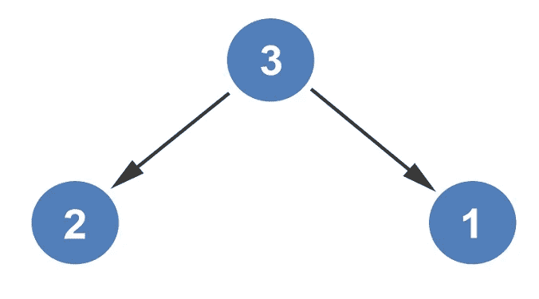

# 堆排序算法直观讲解

> 原文：<https://levelup.gitconnected.com/heap-sort-algorithm-visually-explained-97ca610d0f79>

现在我们知道了如何[创建一个 max-heap](https://medium.com/@dinocajic/constructing-max-heap-from-an-array-2fc01427eeb8) ，我们将进入使用堆排序对一个数组的值进行排序。为了使用堆排序对数组进行排序，我们将继续创建最大堆。每次创建 max-heap 时，根都会被删除，并被视为已排序。让我们从下面的例子开始。

第一步是从数组构造一棵树。

我们将遵循我的另一篇文章[中概述的相同过程，从树中构造 Max-Heap](/constructing-max-heap-from-a-tree-9871bd3b8a87)。首先，用 9 交换 5，然后用 7 交换 5，生成一个最大堆。

考虑到树只是数组的可视化表示，我将向您展示在初始 max-heap 排序后数组的样子。

根节点与数组中的最后一项交换。最后一项现在已排序并从树中移除。

创建了一个新堆。根节点与其最大的子节点 7 交换，并构造一个新的 max-heap。

根节点与树中的最后一个节点交换，并从树中移除。我们现在有两个已排序的节点:7 和 9。

我们通过将 1 与其最大的子堆(即 5)交换来创建新的 max-heap。

因为已经创建了新的 max-heap，所以根节点与树中的最后一个元素(即 2)交换。5 号现在排序了。

该过程继续进行，将 2 与其最大的子级 3 交换，达到最大堆。

根节点与有效排序元素 3 的最后一个元素交换。

该过程再进行一次。根节点与其最大的子节点 2 交换，创建一个最大堆。

根节点与最后一个节点排序元素 2 交换。

由于数组中只剩下一个元素，该元素被标记为已排序，数组也是如此。

这就完成了堆排序过程。

*如果你喜欢你所读的，我的书，* [*算法的说明性介绍*](https://www.amazon.com/Illustrative-Introduction-Algorithms-Dino-Cajic-ebook-dp-B07WG48NV7/dp/B07WG48NV7/ref=mt_kindle?_encoding=UTF8&me=&qid=1586643862) *，涵盖了这个算法和更多。*

迪诺·卡伊奇目前是 [LSBio(寿命生物科学公司)](https://www.lsbio.com/)、[绝对抗体](https://absoluteantibody.com/)、 [Kerafast](https://www.kerafast.com/) 、[珠穆朗玛生物](https://everestbiotech.com/)、[北欧 MUbio](https://www.nordicmubio.com/) 和 [Exalpha](https://www.exalpha.com/) 的 IT 负责人。他还担任我的自动系统的首席执行官。他有十多年的软件工程经验。他拥有计算机科学学士学位，辅修生物学。他的背景包括创建企业级电子商务应用程序、执行基于研究的软件开发，以及通过写作促进知识的传播。

你可以在 [LinkedIn](https://www.linkedin.com/in/dinocajic/) 上联系他，在 [Instagram](https://instagram.com/think.dino) 上关注他，或者[订阅他的媒体出版物](https://dinocajic.medium.com/subscribe)。

[*阅读迪诺·卡吉克(以及媒体上成千上万其他作家)的每一个故事。你的会员费直接支持迪诺·卡吉克和你阅读的其他作家。你也可以在媒体上看到所有的故事。*](https://dinocajic.medium.com/membership)