# Javascript 新手堆排序

> 原文：<https://levelup.gitconnected.com/heapsort-for-javascript-newbies-598d25477d55>

准备好愤怒吧，因为今天我们谈论的是堆排序！我将以一种初学者友好的方式，一步一步地向您介绍这个算法。到这篇文章结束时，我们将成为堆创建和排序的专家。

## **请问什么是 heapsort？**

我很高兴你问了。Heapsort 是一种排序算法！更具体地说，它是一种不稳定的基于比较的排序算法，使用一种称为 max-heap 的数据结构。这意味着什么呢？

## 不稳定

这意味着，如果两个元素具有相同的值，heapsort 可能会切换它们，而不是让它们保持彼此相关的位置。

假设你有三张扑克牌:依次是方块王、梅花 7 和黑桃王。

k♠7♣的 k

你要根据它们的价值把这些卡片按升序排列。

一个稳定的排序会看到两个国王是相同的价值，并会离开方块国王**在**黑桃国王之前。

k♠7♣

一个不稳定的排序可能会交换两个国王，把方块国王**放在黑桃国王**之后。

k♠7♣

这就是我们说堆排序不稳定的意思。这并不理想，但 heapsort 还有其他亮点。太好了！下一个！

## 什么是堆？

堆只是添加了一些规则的二叉树。

第一条规则是，它必须是一个完整的二叉树，这意味着在添加另一层之前，我们要填满当前层上的所有节点。

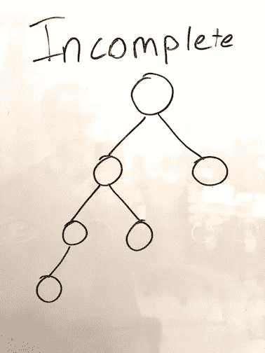

看到我们是如何在没有填满第三层的情况下增加第四层的了吗？

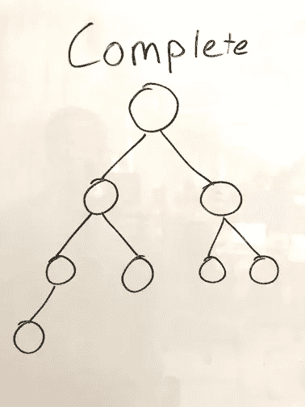

我们走吧！现在第三层已经满了！

第二个规则定义了堆中的父关系和子关系。有两种类型的堆:最大堆和最小堆。

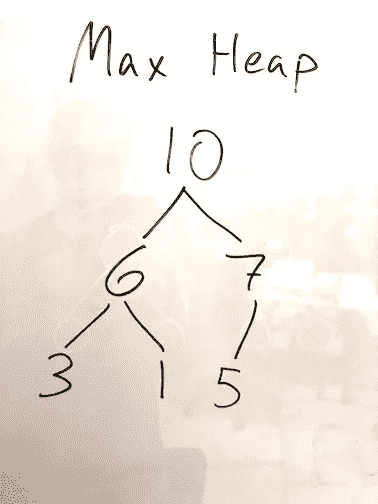

在一个**最大堆**中，所有父元素必须比它们的两个子元素**大**。稍后我们会看到，这对我们非常有用，因为我们知道最大的数字在顶部。

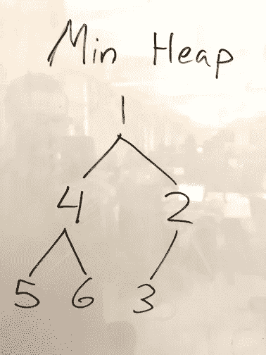

在**最小堆**中，父元素必须**比它们的子元素**小。我们不会在这里讨论 min heaps，但是了解它们是很好的！

## heapsort 是如何工作的？

因此，堆排序的步骤如下:

1.  构建一个最大堆，使具有最大值的元素位于顶部。
2.  将它与最后一个元素交换，并将其从堆中移除。
3.  重复第一步和第二步，直到堆只剩下一个元素。

## 但是等等，javascript 中没有“堆”数据类型…

你完全正确。这似乎是一个很难克服的问题…

所以事情是这样的，我们可以用一个数组 ***表示*** 一个堆。看看下面的 min 堆:

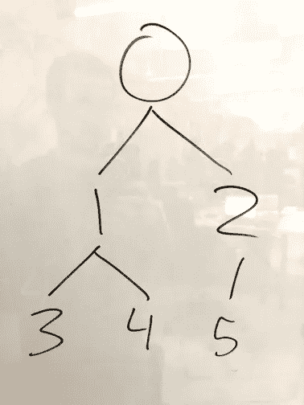

假设这些数字是一个数组的索引。酷的是，我们可以使用数组的索引来表示我们的堆。

要找到任何父元素的左子元素的索引，我们可以将父元素的索引乘以 2，再加 1。像这样:

`let left = 2 * parent + 1`

那么右边的孩子就是左边的孩子加 1。

`let right = left + 1`

于是我们有了:`let array = [6, 5, 3, 1, 8, 7, 2, 4]`

作为一棵二叉树(我们稍后将对其进行填充),它看起来像这样:

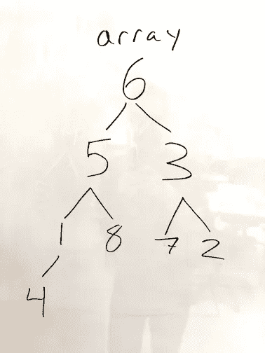

## 太棒了。让我们建造那个堆！

因此，我们将构建一个名为“heapify”的函数来比较三个元素(一个父元素和两个子元素)，并确保它们对于一个 **max heap** 来说顺序正确。这个函数将接受三个参数:数组，我们要用来构建堆的数组的长度，以及我们要堆的父对象的索引。

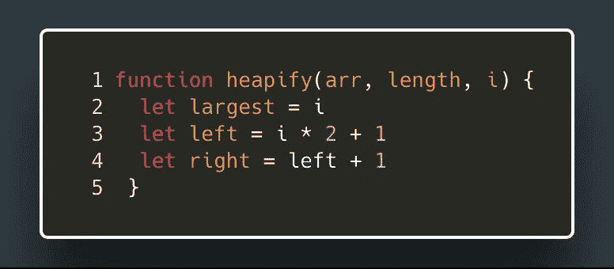

这里，我们像以前一样，相对于父节点来定义我们的左右子节点。我们还创建了这个名为“largest”的变量，我们将使用它进行比较，并在需要时交换元素。

首先，让我们看看我们的父母是否比左边的孩子大。如果不是，我们将把我们的变量`largest` 赋给左边的孩子，因为它目前是最大的！

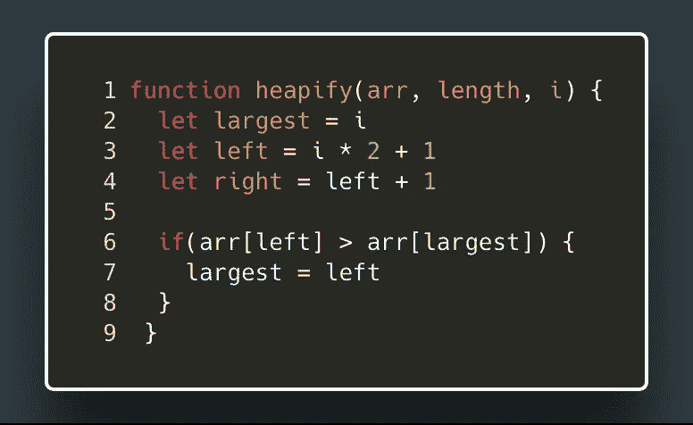

太好了！现在`largest`指的是父母或者左边的孩子，以较大者为准。现在，如果我们将`largest`与正确的孩子进行比较，我们就会知道哪个孩子实际上最大。

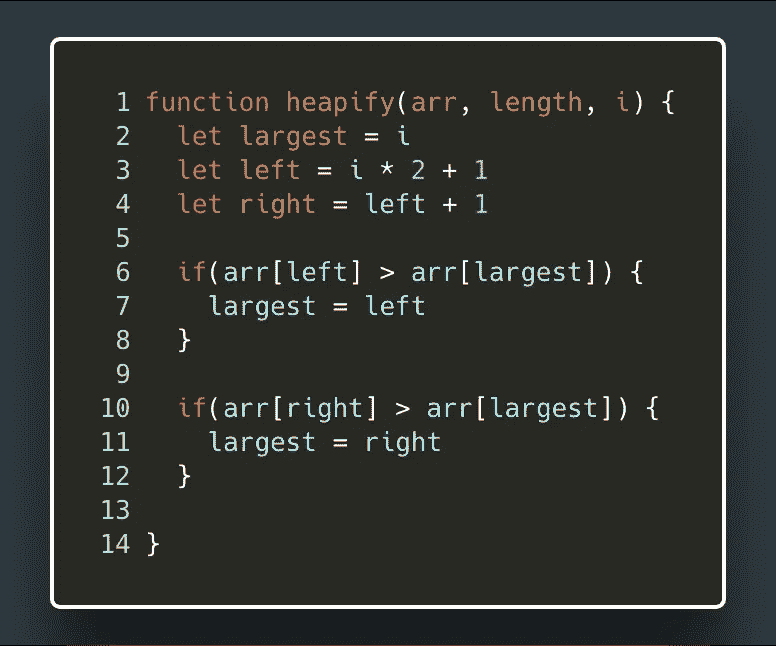

太棒了。现在我们可以检查一下`largest`是否还在引用父元素。如果不是，我们将与父元素交换最大的元素，将它们放入适当的位置。

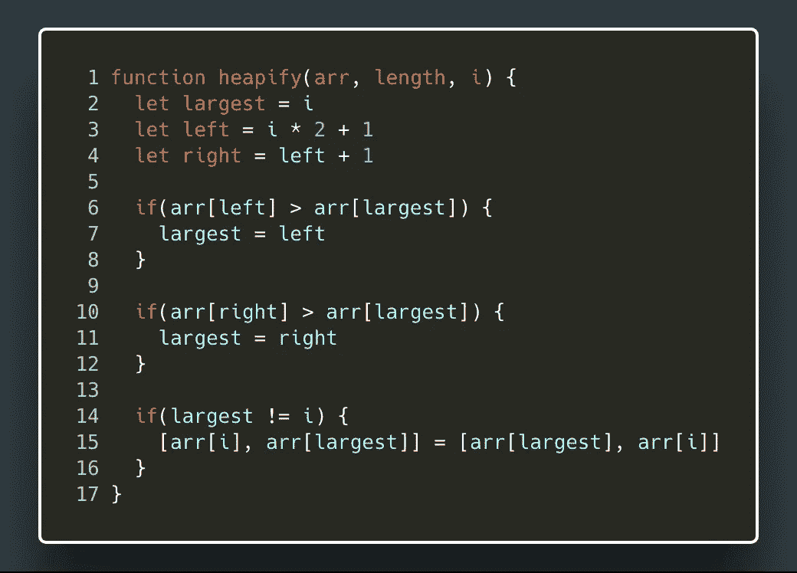

到目前为止还不错，对吧？！

事情变得有点棘手了。

如果我们一次只比较三个元素，我们需要一种方法来确保我们的交换不会影响堆中更靠后的元素。我们将从 ***开始自下而上*** 的堆积这个数组 ***。这意味着我们所做的任何交换都会改变下面节点的父元素。我们需要在适当的位置进行某种检查，以确保我们的下层元素仍然正常！让我们抛出一个递归调用在那里，以确保！***

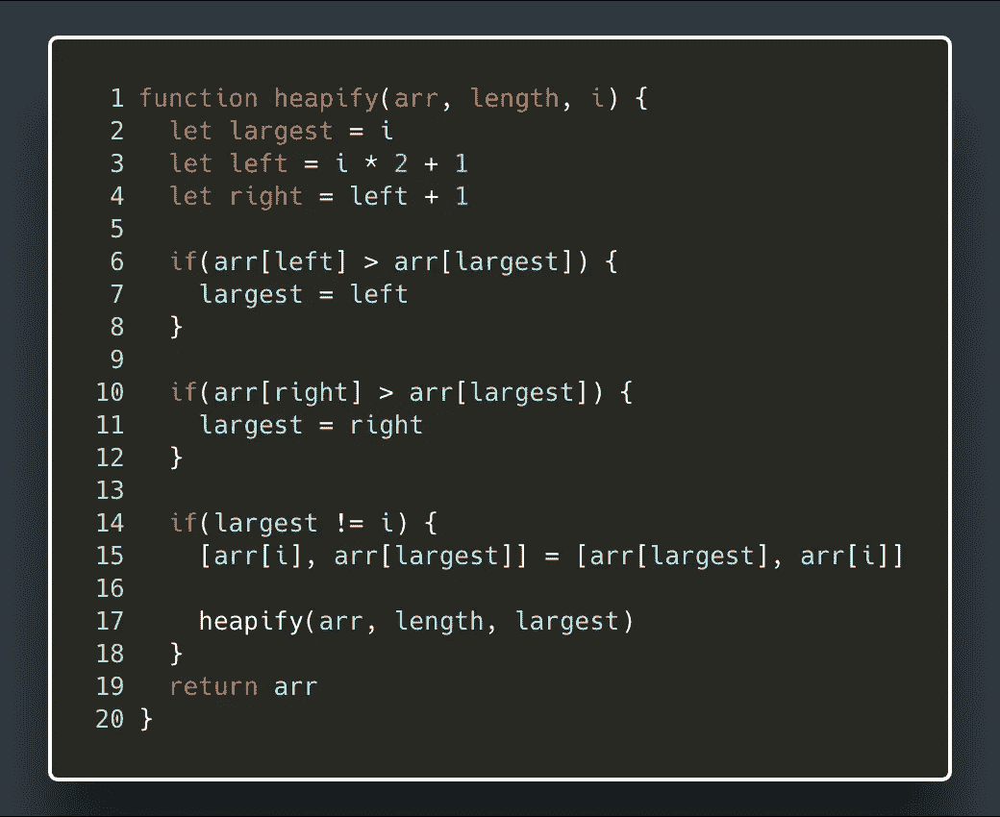

我们需要的最后一样东西。每次我们进行切换时，这个递归调用都会波及到我们的堆。当我们检查堆的底部元素时，它们将紧挨着我们已经从堆中取出并排序的元素。所以我们要确保他们不受干扰。这就是为什么我们传入在堆中使用的数组的长度。让我们确保不要超过那个长度！

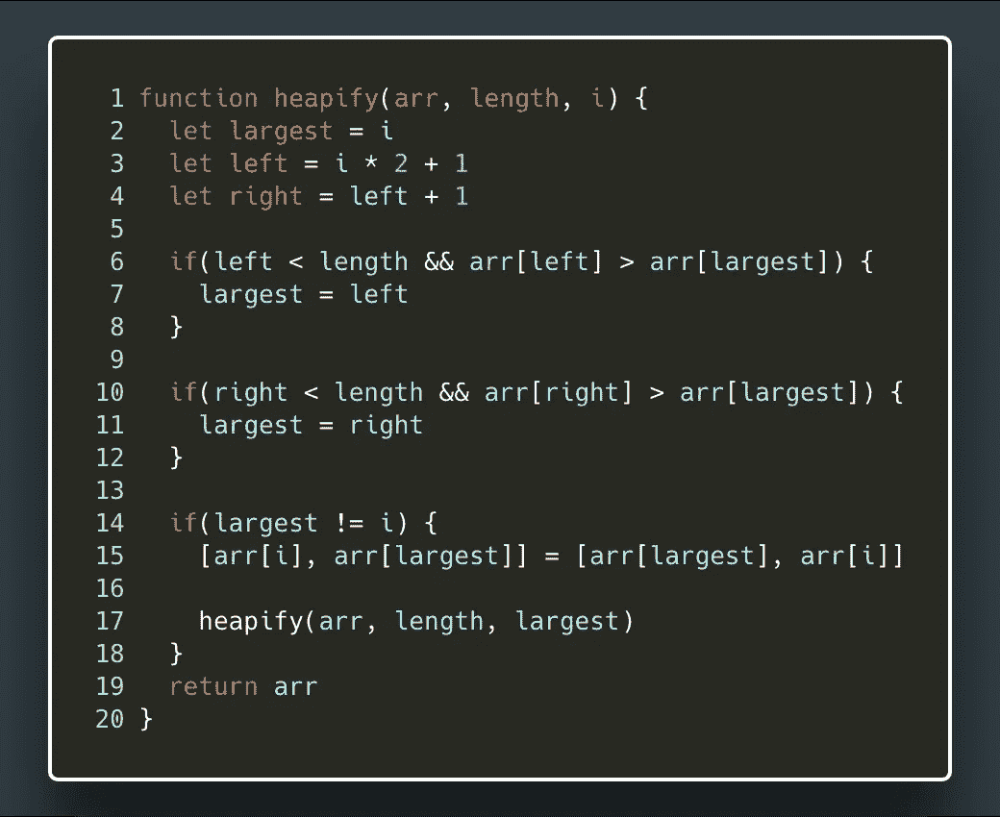

重要的是要记住`largest`和`i`只是指索引。在我们交换那些元素之后，`largest`指的是在交换 之前最大元素为 ***的索引。所以我们可以用它作为递归调用的父对象，来检查它下面的元素。***

邪恶。我们的健康建立了！让我们建立我们的堆！

## 分类堆

还记得我说过我们将从 ***自下而上*** 排序吗？这意味着我们需要找到堆中的最后一个父节点，我们称之为`i`。幸运的是，这将总是等于数组长度除以 2 减 1。不相信我？向上滚动，看看我们的带有索引的示例堆！

我们还需要找到最后一个孩子，我们称之为`k`。这个很简单，因为它是数组中的最后一个元素。

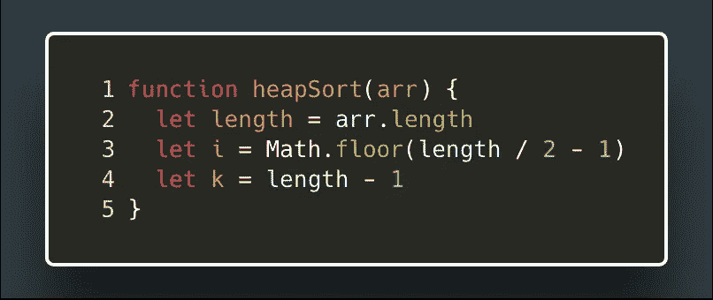

很好。现在我们可以从最后一个父节点开始，然后一路向上！

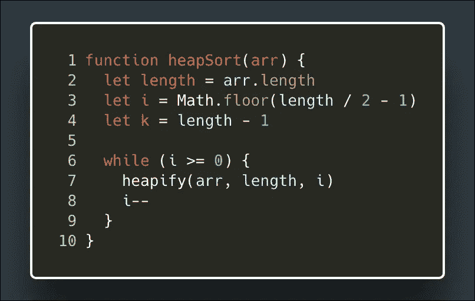

好吧！现在我们有了最大堆。在第一轮堆化之后，我们的堆应该是这样的:

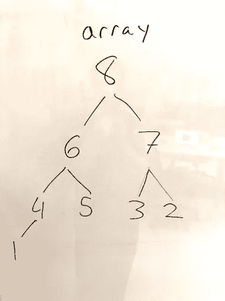

现在我们可以进入算法的第二步了！让我们再来看看我们的步骤:

1.  构建一个最大堆，让值最大的元素在最上面。(搞定！)
2.  将它与最后一个元素交换，并将其从堆中移除。
3.  重复第一步和第二步，直到堆只剩下元素

好了，现在我们要把 8 和 1 换一下，这样我们就有了:

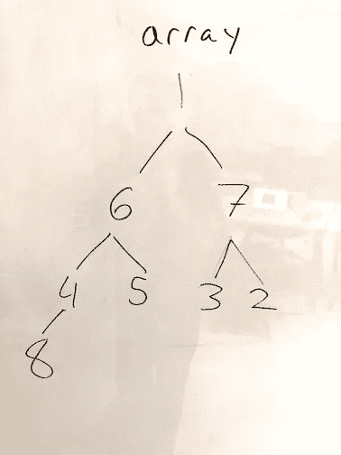

然后我们从堆中移除 8:

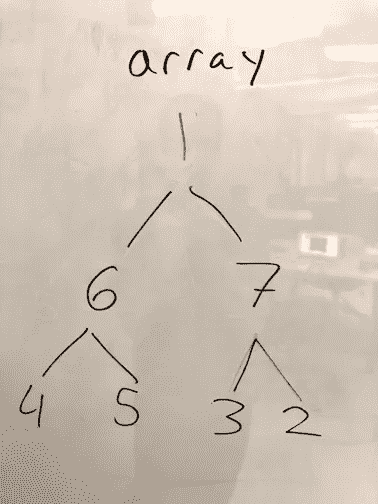

我们将通过简单地缩短我们正在堆积的数组的长度来表示最大元素的移除。此时，我们的数组如下所示:

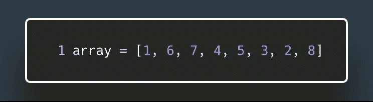

所以我们可以再次 heapify 我们的数组，这次传入的长度是 7，所以我们的 heapify 函数将忽略最后一项。步骤 3 说我们将“重复步骤 1 和 2，直到堆只剩下一个元素。”听起来像是一个 while 循环！

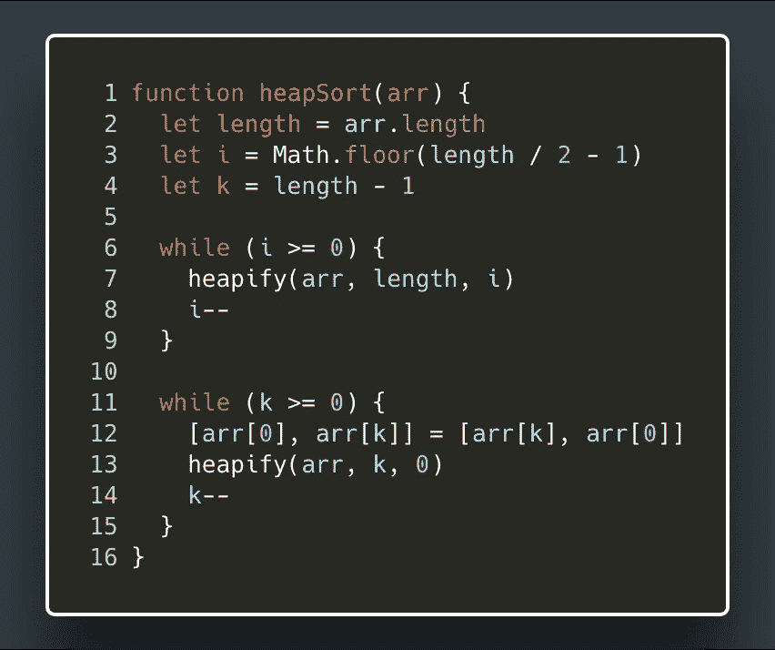

这里记住`k`是我们堆里最后一个**的孩子。它目前等于`length — 1`，这意味着我们可以在第 12 行 ***和*** 的交换中使用它，作为我们下一个 heapify 调用的长度参数。然后，我们可以继续递减它，并将其用作 heapify 的长度参数，直到堆中没有任何内容，并且所有内容都已排序。不错！**

**由于这个算法将我们的数组 ***排序到*** 的位置，这意味着它切换了我们原始数组的元素，而不是创建一个新的数组，它是我们原始数组的排序版本，我们可以简单地返回原始数组。**

**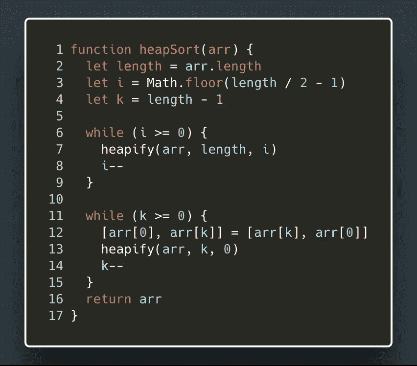**

**所以现在把我们所有的代码放在一起，我们得到…**

**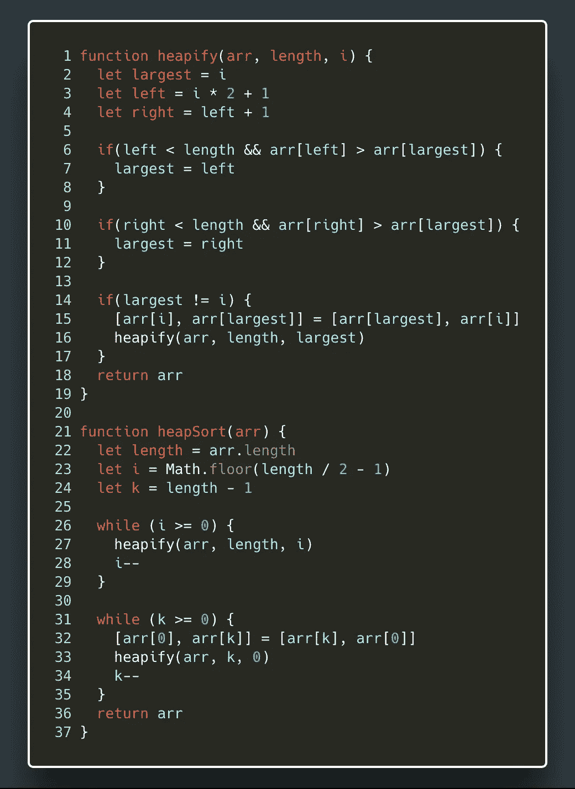**

**去吧！试试吧！**

## **最后的想法和 GIF**

**我知道这很难理解。但是，如果我不提及几件事，那我就失职了。**

**首先，这个堆排序就地对我们的数组*进行排序，这是一个副作用，因为它改变了我们的原始数组。这意味着它不适合函数式编程范式。所以如果你想让你的程序保持在函数式编程的范围内，就不要使用堆排序！***

***这样做的好处是，它不会消耗太多额外的内存来运行，这使它比其他一些排序算法(如 quicksort)更有优势。对于你们这些大 O 怪胎来说，heapsort 的空间复杂度是 O(1)，这真的非常好。***

***这就是我现在所有的额外想法。感谢阅读！我希望你受到鼓励，走出去尽情享受吧！如果您仍然感到有些困惑，请查看这张 gif，看看 heapsort 的运行情况。***

***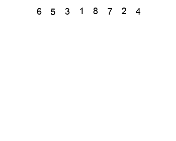***

***从维基百科的堆排序页面中提取***