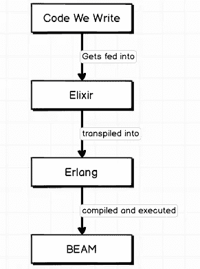

# 你好灵丹妙药！

> 原文：<https://levelup.gitconnected.com/hello-elixir-c7e49f7624e8>

## 介绍市场上最激动人心的后端语言之一。


伙计，差不多了

我以前学过一些 Ruby，我很喜欢它，这是一种有趣的面向对象的语言，它给出了很棒的错误，读起来像英语，简化了复杂的编程，同时允许了很多灵活性。

[我后来学习了一些 Python](/get-started-with-flask-aa0f7b76f235) ，我发现它们的语法与 Ruby 非常相似，具有易读的语法、强大的功能、[比 Ruby](https://www.quora.com/Which-language-is-faster-Python-or-Ruby) 稍快的速度，以及在[机器学习](https://en.wikipedia.org/wiki/Machine_learning)和[超级棒/简单的网络抓取](https://www.youtube.com/watch?v=ng2o98k983k)的“热门”领域中真正有趣的应用。

我终于学会了一种最流行的语言，也是我在前端工作中学会的一种语言的延续， [Node.js](/a-pirate-y-intro-to-node-cli-apps-and-yargs-4af9410f034d) ，它利用 C++以连续且格式良好的方式来完成后端任务，以满足您的前端代码，这非常酷，比之前的所有选项都快，非常棒。

但是不同的东西呢？


嗯，长生不老药…

我进入长生不老药有两个原因:

1.  我想学习一种新的语言，我听说 Elixir 是学习[“函数式编程](https://en.wikipedia.org/wiki/Functional_programming)”概念的好方法，这是一种范式，其中代码不位于“类”或俱乐部中，在那里数据在人们之间共享，就像一个巨大的盟誓，而是一系列轻量级函数，其中每个函数都有一个输入和一个输出，您的代码将它们链接在一起做特定的工作，而不必挂在一起。就像一个非正式的朋友圈 vs 一个运动队(而且我不喜欢运动)！
2.  一个朋友得到了一份灵丹妙药的工作，我申请了一份灵丹妙药的工作，我开始看到更多这样的人:猴子见雇佣，猴子做。

Elixir 的概念化有点令人困惑，尽管在实践中学习起来并不困难，尤其是对于任何有 Ruby 或 Python 经验的人来说。难以概念化的原因是仙丹是建立在语言基础上的语言。


呃……是阿郎？

没错，Elixir 实际上是一个将我们的代码传输到 Erlang 中的**运行时。这实际上类似于 Node.js 如何将它的一些操作转换成 C++！Erlang 本身的故事是疯狂的，Erlang 是一种有 30 多年历史的语言，而 Elixir 则相对年轻。**

据我所知，这个故事的“悬崖笔记”版本是由[瑞典电信公司爱立信](http://www.ericsson.com/)开发的，用于处理大量“并发”或同时发生的请求。

并发是一个完全不同的话题，但是如果你不了解它，我建议你去看看。通常，我们想象计算机的方式是，我们输入一个任务，计算机执行该任务，并返回您所要求的内容(打开网络浏览器，输入一些内容)，但并发意味着同时处理多个任务的能力。当一个人在处理时间敏感的交易时，这变得更加重要，比如在金融领域，在谷歌的广告平台上“竞价”广告，或者在开发该平台的公司的情况下，在电信领域，许多呼叫意味着许多请求。

它本质上是“多线程的”，这意味着虽然可以执行多个任务，但是如果一个任务由于某种原因(例如，API 调用)失败了，您的整个系统不会崩溃。这与 Node.js 相比，Node . js 通过使用回调/事件循环来模拟并发性，但它是*单线程的* ，这意味着如果一件事情失败了**所有事情都会失败**，这是对 Node 最大的批评之一，也是实现称为 Deno 的东西的[大原因，这是另一篇令人愉快的文章的主题。](https://deno.land/)

Erlang 曾经是一种非常强大的语言，它被编译成一个名为“BEAM”的“虚拟机”,但是它也是传说中的……很难理解。关于 Erlang 的更多信息，我建议查看这些文档。

因此，2014 年，一家名为 Plataformatec 的公司发布了 Elixir，目的是为后端 web 开发创建一种容错并发语言，这种语言利用了 Erlang 的强大功能，在语法上也不难理解。



这里有一个方便的图表！

这是我公然从斯蒂芬·格里德那里偷来的好照片，去上他的课吧！无论如何，让我们进入一些代码。

要创建一个新的 Elixir 项目，您必须在 Mac 上执行以下命令

```
brew install elixir
mix new <your-project-name>
```

这将生成一个新项目，就像运行:

```
rails s
npx create-react-app 
gatsby new
```

诸如此类。

我们得到的是一个以您的项目名称命名的文件夹和一个名为<your-project-name>的文件，在我的例子中是“cards”。ex 里面的东西看起来像:</your-project-name>

```
Defmodule Cards do
end 
```

很简单。这是一个*模块* ，对于那些使用过 Ruby 或 Typescript 的人来说应该很熟悉，这是一个可以在应用程序的任何地方使用的函数或方法的集合。在 Elixir 中，不像其他语言那样有“类”。除了将一个函数传递给另一个函数之外，不传递任何数据！例如:

```
//inside of Cards module*def* *create_deck* *do* cards = ["Ace", "Two", "Three", "Four", "Five"] suits = ["Hearts", "Diamonds", "Clubs", "Spades"] *for* suit <- suits, card <- cards *do* "#{card} of #{suit} " *end**end*
```

这是一个*列表的领悟* 虽然有些。你可能只是从其他语言中知道它是一个返回列表的“for-loop”(实际上是一个链表！)的绳子，把牌和花色连在一起。在 Erlang 中，所有的列表理解都会返回列表，除非你弄乱了它们。相比之下，在 JavaScript 中，您可能会这样做:

```
const createDeck = () => { cards = ["Ace", "Two", "Three", "Four", "Five"] suits = ["Hearts", "Diamonds", "Clubs", "Spades"] let finalArray = [] cards.forEach(card => { suits.forEach(suit => { finalArray.push(`${card} of ${suit}`) }) }) return finalArray}
```

通过比较，看看我们用 Elixir 节省了多少代码。

Elixir 也不会在整个模块中保存变量！你的模块就像一个社会距离悬挂，不同的方法只有在他们有一个关于安全的深入持久的对话时才会出现。

那么他们会怎么做呢？他们使用文件系统，例如下面的代码:

```
//inside the Cards module, assume we've created a deck with the previous function*def* *save*(deck, file_name) *do* binary = :erlang.term_to_binary(deck) File.write(file_name, binary)*end**def* *load*(file_name) *do* *case* File.read(file_name) *do* {:ok, binary} ->  :erlang.binary_to_term(binary) {:error, *_reason*} -> "That file does not exist" *end**end*
```

哇哦。怪异的权利！但是短而有力！如果我们想保存一副牌以便在函数之间使用，我们可以使用 Erlang 的强大功能将数据写入一个二进制文件，然后将该文件加载到另一个函数中，并将其转换回我们需要的内容。*这意味着任何函数都可以与整个程序中的任何其他函数进行通信*！带上那个 React/Redux！

你还会看到一种叫做“模式匹配”的东西，这是 Elixir 最酷的部分之一，在 Python 中叫做“元组解包”，在 JS 中叫做“析构”。从核心库“文件”模块导入的函数(记住一切都是模块！)返回一个有两个条目的 ["tuple](https://en.wikipedia.org/wiki/Tuple) "，可以通过分配与 tuple 中条目数量相匹配的变量来解包！这使得访问和处理数据变得非常容易(这在 Elixir 中也是不可变的，看看吧！)

另请参见“case”语句，在其他一些语言和框架中通常称为“switch/case ”,最近是超级流行的 Redux 包的一部分。

```
*case* File.read(file_name) *do*{:ok, binary} ->  :erlang.binary_to_term(binary){:error, *_reason*} -> "That file does not exist"
```

这段代码说的是如果 File.read 返回的 tuple *的第一个元素*被称为“:ok”(在 Ruby 中是一个“atom”或者“Symbol”)，然后把它变回一些数据，否则如果它被称为“:error”，就给我们一个错误消息！我们实际上不会使用原因，在灵药中，这将给我们一个警告，因为灵药是伟大的，它帮助我们看到我们的错误。但是我们可以用“原因”开头的下划线来解决这个问题，它告诉 Elixir 我们不会使用它。

相比之下，让我们看看 Node 中的对等项:

```
const fs = require('fs') 
//note we didn't actually have to import anything in Elixir!const load = (fileName) => { try { const *dataBuffer* = *fs.readFileSync*('fileName') const *dataJSON* = *dataBuffer.toString*() *return JSON.parse*(dataJSON) } catch(error) { throw new Error("The file is not present or could not be read") }}
```

看看我们要做的所有转变！我们必须写入 JSON，这样才能以代码可读的方式解析数据，我们还必须处理异步数据缓冲区或使用回调/async/await 来尝试处理事情，每个错误对于我们代码正在做的任何其他事情都可能是灾难性的。Elixir 为我们提供了简洁地编写代码和处理有趣任务的简单方法。


诋毁

汪，这是一个很大的代码和解释！我希望我已经给了你一个为什么要检查灵药的理由和一些背景。

但你知道 haz 追求什么，不需要解释？我昨天在东河州立公园遇到的这只美丽的大丹犬和这只敏捷的拳师犬。大丹狗怀疑我，但只是因为他太爱他的爸爸了。

继续保持社交距离，丹麦狗。

白现在来说，

网络信息中心(Network Information Center)ˌ网路界面卡(Network Interface Card)ˌ全国工业理事会(National Industrial Council)ˌ航行情报中心(Navigation Information Center)