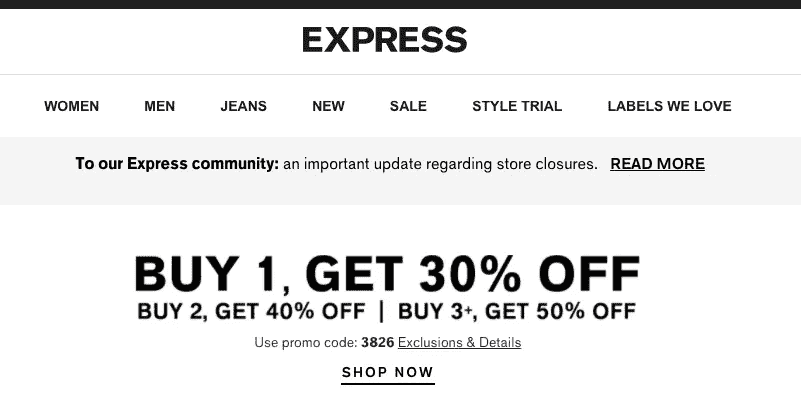
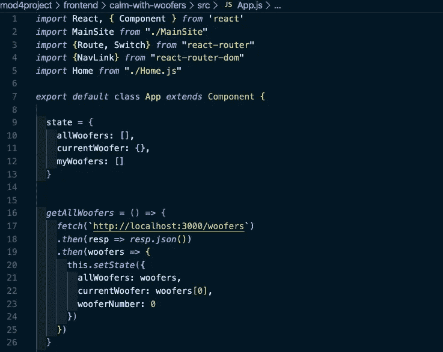
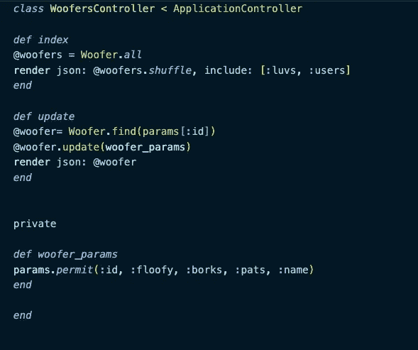
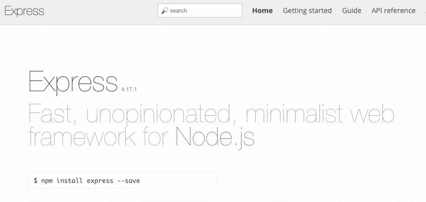
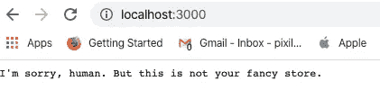
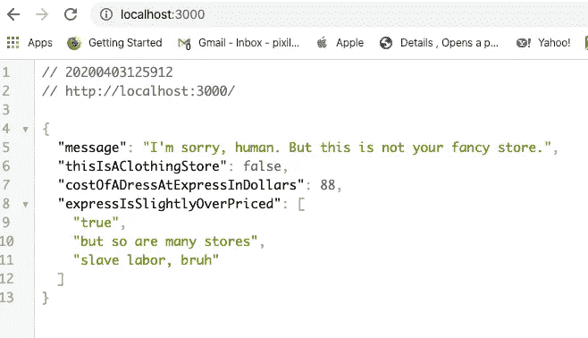

# 你好快递！

> 原文：<https://levelup.gitconnected.com/hello-express-44db467f47de>

## 第一个基于节点的 API 的婴儿指南。



是的，我也喜欢快速时尚的女装，但这不是重点！

作为排名第一并且[可能很快就要成为非 WeWork 子公司](https://dealbreaker.com/2020/04/softbank-wont-buy-wework-shares) — [熨斗学校](https://flatironschool.com/)的毕业生，我被训练成一名“全栈工程师”，这意味着我能够创建一个前端，当用户访问网站时，他们将在那里进行交互，以及一个后端(对我来说是无数笑话的来源，[前喜剧演员](https://www.youtube.com/watch?v=PNHyKWhf69M))，这是一个服务器/数据库，处理不同人对网站的所有不同使用，存储他们的数据，并将数据提供给

例如，脸书知道你的朋友是谁，他们在做什么，并能给你这些信息的方式是，你“登录”到他们的服务器，它用你特有的数据填充前端网站。他们的“前端”永远不会改变，但你看到的信息是不同的。

我学的前端语言框架是 JavaScript/React/Redux，很棒。React 是一个非常受欢迎的框架，尽管一群巨魔可能会告诉你去上 Vue，React 仍然是美国第一。反应看起来是这样的。



类组件？？恶心！

当然，我们这里有一些花哨的语法和一些浏览器 API，如“fetch”(你们知道它在 Node 中不起作用吗？)但本质上，我们这里拥有的是包含数组、类、对象等的 JavaScript。

然而，我为创建我的服务器而学习的后端语言看起来完全不同。是 [Ruby on Rails](https://rubyonrails.org/) 。



是的，我的许多项目都包括狗，因为它们很棒。

现在，我不认为这是一件坏事。Ruby 是一门美丽的语言！它充满了功能强大的工具，没有太多经验的人也可以使用。它给出的错误是惊人的，交互式的，告诉你哪里有问题，然后帮助你尝试解决它。Rails 本身，一个 Ruby 的 web 框架，甚至比 Ruby 更擅长处理错误！就更好用了。制作一个 API 非常简单。

```
rails new example-project --api 
cd example-project
rails g resource user name password
rails g resource jokes content user:belongs_to
rails db:create && rails db:migrate
```

然后你就差不多完成了。

当然，你必须写下你想让它在 RESTful 动作[的情况下做什么，比如“GET，PATCH，POST”，但是你在控制器中写这些，看起来几乎和我上面显示的一模一样，而且文件大部分已经为你做好了！](https://restfulapi.net/)

我认为 Ruby 很棒，它在语法上类似于更流行的后端语言 [Python](https://www.python.org/) ，同时也更容易学习。

但是我想做一些看起来像我的前端！而我就是在那里了解到[快递的！](https://expressjs.com/)



这才是真正的快递！不是那个购物网站！在这里购买你的女装！

现在，这篇文章将假设你对 Node 有一些了解，如果没有，你可以查阅[我以前的文章](/a-pirate-y-intro-to-node-cli-apps-and-yargs-4af9410f034d)或者查看 [Node 的网站](http://nodejs.org/)。

但是用 Express 创建一个 API 真的很简单，尽管它不像 Rails 那么简单(Rails 被设计成“固执己见”或“这是我们认为事情应该做的方式，这里有很多免费的内容与之配套”，而不是“不固执己见”或“做任何你想做的事情，但是你必须写更多的东西！”).

让我们来看一些简单的命令，再次假设您已经安装了 Node 和[节点包管理器(NPM)](https://www.npmjs.com/) 。

```
mkdir express-testing-not-clothes
cd express-testing-not-clothesnpm init --y
npm install express
touch this-is-not-a-clothing-website.js
```

所有这些将建立您的快速体验，而`--y`标志只是为您创建一个默认的“package.json”文件，它基本上是您的项目的信息和脚本。

开始时，我们只需要你的新文件中的几行代码！

```
//this-is-not-a-clothing-website.jsconst express = require('express')const app = express()app.get('/', (req, res) => { res.send("I'm sorry, human. But this is not your fancy store.")})app.listen(3000, () => console.log('The store is open!'))
```

现在我们可以稍微分解一下。

```
const express = require('express')
```

这只是 Node 包含其他人代码的语法！因为我们已经完成了“npm 快速安装”和“npm 初始化”,我们现在可以在我们的应用程序中包含 express。

```
const app = express()
```

说到我们包含的 Express，原来它是一个函数，只要调用它，我们就能得到一个完整的应用程序！

```
app.get('/', (req, res) => { res.send("I'm sorry, human. But this is not your fancy store.")})
```

这是一个模仿 [HTTP 请求/响应周期](https://www.w3schools.com/tags/ref_httpmethods.asp)的**路由**！

基本上，它是说当获得基本 URL 或“/”时，“发送”一个响应或“res ”,在这种情况下是一个字符串或通俗地说，只是一串单词。

```
app.listen(3000, () => console.log('The store is open!'))
```

这里我们告诉我们的应用程序监听一个端口，比如 3000。如果我们要部署它，我们可能会将其抽象为:

```
const port = process.env.PORT || 3000
```

它只是说，如果有一个像 [Heroku](http://herokuapp.com/) 这样的服务指定的端口，你可能会部署，使用它，或者，如果它不存在，使用 3000，然后这一行看起来像这样。

```
app.listen(port, () => console.log('The store is open!'))
```

现在，我的 express 服务器已经基本完成了！

我在终端输入一个命令:

```
node this-is-not-a-clothing-website.js
```

我转到“http://localhost:3000 ”,看到:



成功！

但是等等！这是奖金！

JSON 呢？那是 JavaScript 对象符号！这是最流行的运行 API 的方式，也是成千上万的后端服务器如何与它们的前端对话的方式！

所以让我们自己做一些改变吧！

```
const *express* = *require*('express')const *app* = *express*()*app.use*(*express.json*())*app.get*('/', (req, res) => { *res.send*({ message: "I'm sorry, human. But this is not your fancy store.", thisIsAClothingStore: false, costOfADressAtExpressInDollars: 88, expressIsSlightlyOverPriced: ["true", "but so are many stores", "slave labor, bruh"] })})*app.listen*(3000, () => console*.*log('The store is open!'))
```

在这里，您可以看到一些变化，包括一些“中间件”或一些改变我们应用程序工作方式的代码，在本例中为“app.use(express.json())”我们现在可以为 get 请求提供一个 json 对象！



必须说实话。

我们在这里有各种各样的数据，包括一个数字，一个字符串，一个布尔值，甚至一个数组！所有这些都来自几行代码。

而这只是快递的冰山一角。你可以使用[mongose](https://mongoosejs.com/)和 [MongoDB](https://www.mongodb.com/) 来制作一个带有数据库的 REST API！你可以使用[序列](https://sequelize.org/)来制作你自己的 MySQL 数据库！您甚至可以做一些很酷的 web 抓取或者聚合对其他 API 的调用来提供定制数据。

这里有完整的代码供任何想要的人使用！

不管是谁，我希望这些东西对你有帮助，如果没有，我可以给你介绍一个人，他就是曼尼。


曼尼。

曼尼尽职尽责地在 7-11 店外等着他的主人。我不得不去告诉他曼尼很可爱。他是一只乐于分享等待可爱的小狗。

谢谢你曼尼。

到目前为止，

网络信息中心(Network Information Center)ˌ网路界面卡(Network Interface Card)ˌ全国工业理事会(National Industrial Council)ˌ航行情报中心(Navigation Information Center)