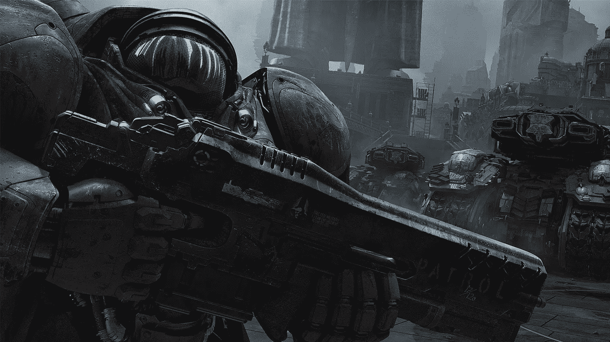
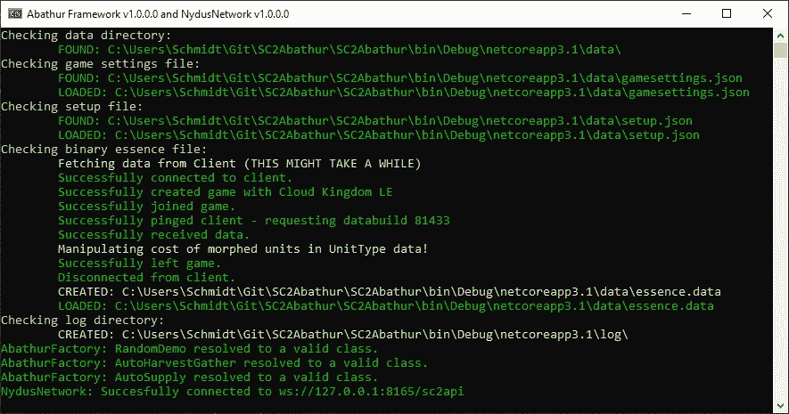
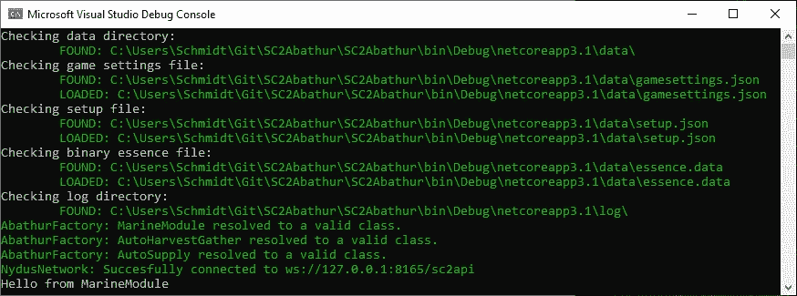

# 你好，海洋——SC2 人工智能指南

> 原文：<https://levelup.gitconnected.com/hello-marine-a-sc2-ai-guide-67f77543016c>



暴雪娱乐公司的官方作品

**先决条件:**

*   [星际争霸 2 安装完毕。](https://starcraft2.com/en-gb/)
*   [NET Core 3.1 SDK(或更新版本)](https://dotnet.microsoft.com/download/dotnet-core/3.1)
*   分叉克隆 [SC2Abathur](https://github.com/schmidtgit/SC2Abathur)

第一次运行 SC2Abathur 项目将生成开始使用 Abathur 所需的一切。您应该会看到类似如下的输出:



SC2Abathur 首次在 Windows 机器上推出。图片作者。

该项目将自动启动包含的演示，但一旦开始播放就可以安全地关闭。此过程将在您的计算机上生成三个文件，以及一个日志文件夹，默认情况下，每次运行后都会用一个新文件填充该文件夹。

*essence.data* 是一个包含游戏具体细节的二进制文件——比如单位成本、单位生命值、升级成本等。暴雪经常调整这些东西，所以最好在新补丁发布时重新生成这个文件。

*setup.json* 是一个小文件，描述您的 Abathur 代理将运行哪些模块。这个文件是用一个小的演示程序初始化的。

```
{
  "IsParallelized": false,
  "Modules": [
    "RandomDemo",
    "AutoHarvestGather",
    "AutoSupply"
  ]
}
```

最后一个文件是 *gamesettings.json* ，它包含了启动客户端和设置第一个游戏时 Abathur 需要知道的所有内容。在此编辑以更改地图或比赛。默认情况下，该文件将被初始化为启动*云王国 LE* 与*随机竞赛*对抗*非常简单的*随机 AI 的设置。

```
{
  "FolderPath": "C:\\Program Files (x86)\\StarCraft II",
  "ConnectionAddress": "127.0.0.1",
  "ConnectionServerPort": 8165,
  "ConnectionClientPort": 8170,
  "MultiplayerSharedPort": 8175,
  "InterfaceOptions": {
    "Raw": true,
    "Score": true,
    "FeatureLayer": null,
    "Render": null
  },
  "Fullscreen": false,
  "ClientWindowWidth": 1024,
  "ClientWindowHeight": 768,
  "GameMap": "Cloud Kingdom LE",
  "DisableFog": false,
  "Realtime": false,
  "ParticipantRace": 4,
  "Opponents": [
    {
      "Type": 2,
      "Race": 4,
      "Difficulty": 1
    }
  ]
}
```

# 添加新模块

消毒代理由*模块*组成。模块必须继承自 *IModule* 或 *IReplaceableModule —* 后者允许在游戏中添加和删除模块，例如启动特殊策略。

本教程将使用一个简单的 IModule。文件可以添加到解决方案中的任何地方，但是我建议放在 SC2Abathur.Modules 中，由于都是 void 方法，所以坚持接口相对简单。

```
using Abathur.Modules;
using System;

namespace SC2Abathur.Modules
{
  class MarineModule : IModule
  {
    void IModule.Initialize() {}
    void IModule.OnGameEnded() {}
    void IModule.OnRestart() {}
    void IModule.OnStart() => Console.WriteLine("Hi from Marine");
    void IModule.OnStep() {}
  }
}
```

Abathur 将调用这些方法，但是首先我们需要指定我们希望在代理中包含我们的 MarineModule。这是通过更新 *setup.json* 文件来完成的。我们选择仍然包括“自动收割”和“自动供应”——它们是简单的助手模块，让空闲的工人工作，并在达到供应极限时创建新的供应站/塔/领主。

```
{
  "IsParallelized": false,
  "Modules": [
    "MarineModule",
    "AutoHarvestGather",
    "AutoSupply"
  ]
}
```

我们还需要更新 *gamesettings.json* 来指定我们想玩哪个种族。*人族(1)，虫族(2)，神族(3)或者随机(4)。*

```
{
  ... [removed for brevity] ...
  "ParticipantRace": 1,
  ... [removed for brevity] ...
}
```

再次启动该解决方案应该会产生类似这样的结果。请注意，它的启动速度明显更快，因为基本文件已经存在。



使用 MarineModule 启动。图片作者。

# 转移一名陆战队员。

我们已经确认 Abathur 承认我们模块的存在，现在有趣的部分来了。Abathur 公开了许多服务或*管理器。*这些都是可以通过依赖注入获得的，所以我们可以在我们模块的构造函数中添加我们需要的。

> **IProductionManager****处理单位和建筑的生产。* **IIntelManager***处理与当前游戏状态相关的一切。* **ICombatManager***为控制单元提供快捷方式。**

*在游戏的第一帧，Abathur 将调用 *OnStart()* 方法。我们在这里向生产经理添加了一个单个海洋生物的请求。海军陆战队需要兵营，兵营需要补给站——但默认情况下，这都是由生产经理为我们处理的。*

*然后，我们在*United self*事件上注册我们的自定义处理程序 *OnUnitCreated* ，告诉 IIntelManager 在发现(创建)新的非工作单元时通知我们。*

*最后，我们告诉我们勇敢的新陆战队员去战斗。这是通过查看所有的*菌落来完成的。* Abathur 指一个适合作为基地的地点(附近有船只和矿藏)作为殖民地。敌人可能的起始位置标有“IsStartingLocation”标志——这使我们很容易找到敌人在云王国 le 的基地，因为只有一个。*

```
*using Abathur.Constants;
using Abathur.Core;
using Abathur.Model;
using Abathur.Modules;
using System.Linq;

namespace SC2Abathur.Modules {
  class MarineModule : IModule {
    private IProductionManager pm;
    private IIntelManager im;
    private ICombatManager cm;
    private IUnit raynor;

    public MarineModule(
      IProductionManager pm,
      IIntelManager im, 
      ICombatManager cm) {
      this.pm = pm; this.im = im; this.cm = cm;
    }

    void IModule.OnStart() { 
      pm.QueueUnit(BlizzardConstants.Unit.Marine);
      im.Handler.RegisterHandler(Case.UnitAddedSelf, OnUnitCreated);
    }

    void OnUnitCreated(IUnit unit) {
      if (raynor != null || unit.UnitType != BlizzardConstants.Unit.Marine)
        return;
      raynor = unit;
    }

    void IModule.OnStep() {
      if(raynor?.Orders.Count == 0) {
        IPosition p = im.Colonies
          .Where(c => c.IsStartingLocation)
          .FirstOrDefault();
        cm.AttackMove(raynor.Tag, p.Point);
      }
    }

    void IModule.Initialize() {}
    void IModule.OnGameEnded() {}
    void IModule.OnRestart() {}
  }
}*
```

**注意，攻击动作可以直接在 OnUnitCreated 处理程序中完成，但是我想展示 IUnit 类可以作为一个单元的持久引用。**

*这就是创建和移动我们第一个陆战队员所需要的全部代码。即使不是最好的特工，也是一名特工。下面的视频展示了这段代码的预期行为；*

*运行 MarineModule 的结果。作者视频。*

# *结论*

*我们设法用相当有限的代码移动了星际争霸 2 中的一个陆战队员。耶！SC2Abathur 包括三个原始的样本机器人，可以对抗内置的“非常简单”的人工智能。我建议在扩展您的简单代理时从那里汲取灵感——参见 [*模块。*例题](https://github.com/schmidtgit/SC2Abathur/tree/master/SC2Abathur/Modules/Examples)*

**原载于 2020 年 9 月 5 日*[*【https://adequatesource.com】*](https://adequatesource.com/hello-marine/)*。**

# *分级编码*

*感谢您成为我们社区的一员！ [**订阅我们的 YouTube 频道**](https://www.youtube.com/channel/UC3v9kBR_ab4UHXXdknz8Fbg?sub_confirmation=1) 或者加入 [**Skilled.dev 编码面试课程**](https://skilled.dev/) 。*

*[](https://skilled.dev) [## 编写面试问题

### 掌握编码面试的过程

技术开发](https://skilled.dev)*