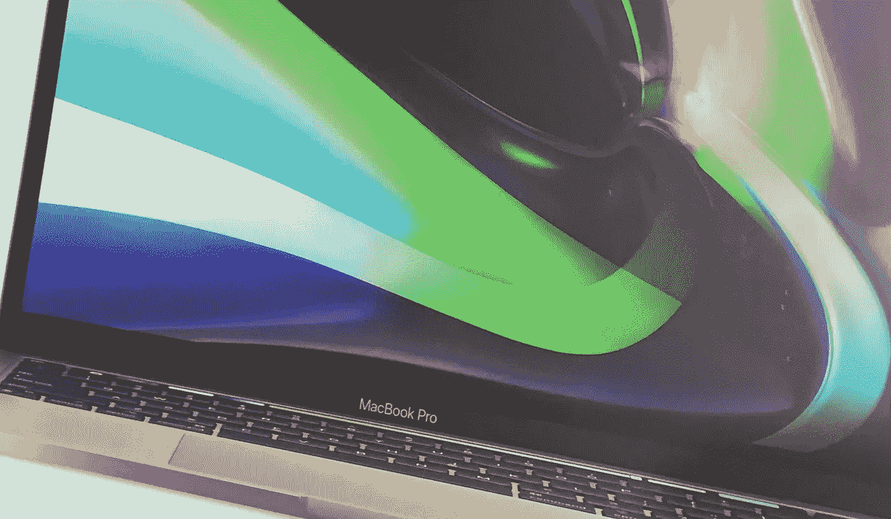
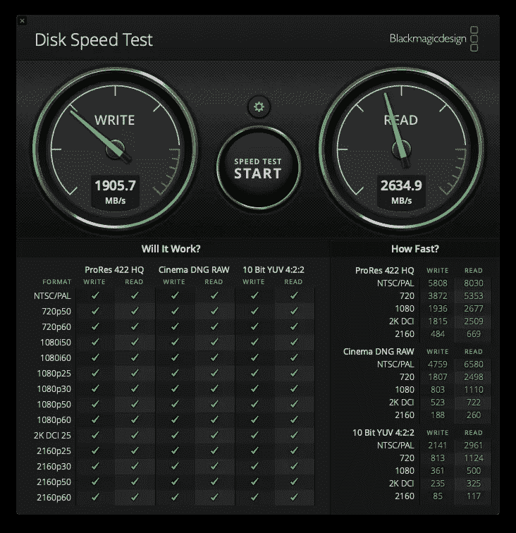
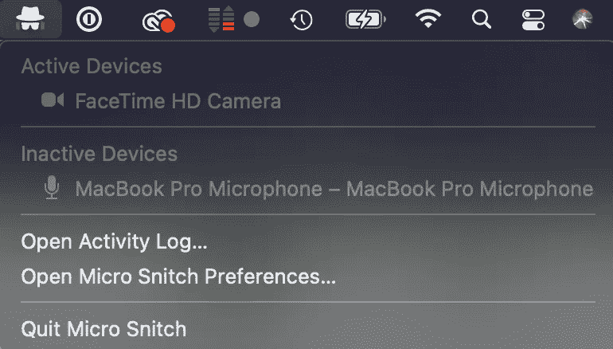
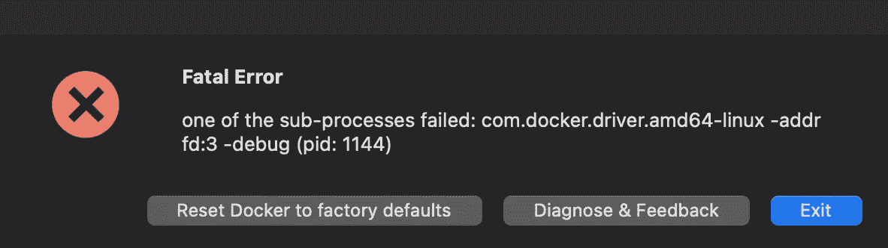

# 你好(新世界)！—在苹果硅 M1 生活和发展

> 原文：<https://levelup.gitconnected.com/hello-new-world-living-with-and-developing-on-apple-silicon-m1-6bbc3617c9be>

在苹果开始在他们的商店销售新的苹果硅 M1 MAC 电脑的两天后，我把我将近两年的 2019 年 MacBook Air 和它的充电器扔进我的背包，向我最近的高级经销商*走去，开始了一段激动人心的、价格适中的旅程，进入稍微不为人知的世界。

在商店里，我不得不澄清我是在寻找*【培训】*还是*【以旧换新】*(口罩对可达性有巨大的不利影响，但没有多少人谈论它)，经过一场有点尴尬的对话后，五分钟后，我拿着一台全新的 MacBook Pro 13”走出了商店，引擎盖下有苹果硅 M1。为简洁起见，我将继续称之为亲 M1(是的，我知道这篇文章不会老)。

## 以旧换新可以牛逼！

我认为，在追随 M1 潮流的过程中，我必须指出的第一个要点是，如果我没有选择用现有设备进行交易，我可能不会这么做。据我所知，在爱尔兰，不仅仅提供通常的苹果花生回收价值的以旧换新选择以前是不存在的，所以仅仅是体验以旧换新这个事实就让我兴奋不已。

我非常想知道旧设备上检查了什么，检查过程有多快，以及评估是如何进行的。我过去仅有的另一次类似经历是通过 [CEX](https://ie.webuy.com/) ，虽然这仍然是一个可行的选择，但它突然感觉不那么实际了。他们不仅为你的设备提供比我当地的高级经销商 [CompuB](https://www.compub.com/trade-in) 更少的钱，而且钱需要几个工作日才能到达你的银行账户。我敦促每个人在草率行事之前，比较一下他们通过苹果附属的以旧换新商店或其他独立商店会得到什么。在我的案例中，CompuB 在 CEX 的基础上提供了 25 美元，而且这也是一个即时的过程。

在检查方面，这是一个快速的外观测试，以寻找划痕或凹痕，对键盘和充电器的存在进行视觉完整性检查，机器是否设置为出厂默认设置，以及触摸板是否工作。感觉整个过程不到 60 秒。令我惊讶的是，当我问这些机器最终是否会出现在翻新的商店时，我被告知它们实际上会被拆开来做零件，铝底盘会被回收到新机器中— *因为这有助于环境保护*。我想，虽然我仍然认为倒卖一台完全正常运行的机器比上述方法更环保。但是，嘿，我有什么资格和苹果争论呢？我很高兴我的 MacBook Air 得到了一个好的估价，并以 890 美元(含税)的价格获得了一台 Pro M1！

## 为什么从 Air 转向 Pro？

我承认，正如论坛和 YouTube 上的许多人一样，我也非常中立，但我最终还是支持 M1，原因如下:

*   **更亮的屏幕** —在 2019 年的 Air 上，我偶尔会觉得如果有额外的亮度就好了。
*   **touch-bar**——与其说是因为我喜欢它，不如说是因为我是一名开发者，所以能够测试这些功能，并为 touch-bar 更可靠地开发，是有意义的。
*   **更好的麦克风** —我计划很快创作一些视听内容，这些内容将受益于录音室级别的麦克风。
*   **20 小时的电池续航时间** —我并不指望在任何情况下都能获得实际的 20 小时，但即使在非最佳情况下，它也能给我带来比空气更多的动力。
*   **尺寸**—Pro 和 Air 的尺寸差异可以忽略不计。
*   我真心希望尝试让 M1 机器成为我的主要日常驱动和开发机器，不管是 web、Flutter 还是 native。如果它如我所愿，那么我的 2018 年 MacBook Pro 15 英寸可能会在 2021 年以旧换新，换成苹果硅 iMac 或 iMac Pro。
*   我可能会在 2 年保修期前(是的，我有 2 年，因为它是一个高级经销商)将这台 M1 Pro 换成一台新的型号，但在那之前，我想看看这台神奇的新 CPU 能处理什么。

如你所见，我的理由分为三类:

1.  我想用*这台*机器实现什么。
2.  我从这台机器*中获得了什么独特的收获。*
3.  长期战略规划。

## 设计和建造

不管世界上的 Linus 和 Louis Rossmans 对 M1 机器的设计不变有多少抱怨，我发现在这方面缺乏变化是令人欣慰的。是的，这是我们已经使用了几年的同一块旧铝板。就我个人而言，我对自 2012 年以来几乎没有变化的设计和制造非常满意，这是第一款 Retina MacBook Pro，我拥有它要感谢我最好的朋友[安德鲁·格里本](https://medium.com/u/5265a6f1b5b9?source=post_page-----6bbc3617c9be--------------------------------)。

我感到高兴的一个**重要变化**是**键盘**，因为它现在是他们在 2019 年年中左右带回的同样可靠的键盘，使用了非常熟悉和喜爱的剪刀机制的改进版本。别再胡说什么蝴蝶了！他们在想什么？！？

对我来说，一个不太重要的积极变化是物理 escape 键的出现，以及 touch-bar——我自己喜欢并经常使用，但客观地说，它不被视为十年的发明。缺少功能键干扰我的工作流程的唯一情况是通过 Cmd+F5 切换 VoiceOver，我现在通过鼠标或触控板进行切换，尽管公平地说，我总是可以将 VO 重新映射到键盘设置中的其他键。

虽然有些人可能会说这不完全是一种设计津贴，而是一种整体架构的附带利益，但我认为值得一提的是，Pro M1 不仅沉默，而且冷漠。没错，*冷*和 *MacBook Pro* 同一句话！有史以来第一次，我认为…还没老到可以记住旧的 PowerPC 型号，但据我所知，它们比现在的英特尔芯片更差。虽然我已经连续使用这台机器三天了，但我还没有听到风扇启动或感觉到任何热量从机箱散发出来。

## 强制性基准

基准不是让我过分兴奋的东西，而是给人们他们想要的东西，对吗？因此，这里有必要截图的数字可能意味着什么，也可能不意味着什么。如果你想看我的 2018 年 15 英寸 MacBook Pro 和 Pro M1 之间的对比[，你可以在 Geekbench 上查看。长话短说，**在职业 M1** 上，每一个分数几乎都是双倍或者更多。](https://browser.geekbench.com/v5/cpu/compare/4894534?baseline=4884653)

CPU Geekbench 分数

金属 Geekbench 评分

OpenCL Geekbench 分数

Blackmagic 磁盘速度测试结果

我能得出的所有分数都与主要网站之前发布的结果 100%一致。如果你想要更详细的结果，我强烈建议你去看看雷内·里奇的视频或者 T2·佐纳弗泰克自己的结果。

# 你能在 Pro M1 上开发吗？

在我回答这个问题之前，我认为有必要看一下大图——它是否涵盖了我日常的所有软件需求。我不打算仅仅为了开发而使用这台机器。我的目标是最终用这台机器做所有事情，除了煎鸡蛋和保持我的咖啡热，我现在不能，因为这台机器像图坦卡蒙一样冷。

## 网页浏览

我的主要浏览器是 **Chrome** ，但这主要是因为我是一名开发者。然后我有几个二级浏览器比如:**火狐开发者版**，接着是 **Safari** 和 **Tor 浏览器**(技术上还是火狐)。**勇敢**和**边缘为了 Mac** ，我纯粹出于好奇留了下来。根据我的测试，它们都可以工作，我也没有遇到任何安装问题，但值得注意的是，只有 Chrome 和 Safari 对 M1 芯片有原生支持。所有其他的都在罗塞塔 2 下运行。

## 生产力

对许多人来说，生产力是一个相对的术语，但对我来说，它是与文档、电子表格、演示文稿、电子邮件客户端、虚拟会议等相关的一切。**Office 365 套件作品**——或者至少 Word、Excel、PowerPoint 和 Outlook，都可以。请注意，安装往往会在 95%左右停止，但是等待它结束，它最终会安装。话虽如此，让他们安装出乎意料地麻烦，向导的第一步往往会使安装程序崩溃，直到我决定关闭在 Rosetta 2 下运行的其他应用程序。也许翻译引擎有一个它能处理的*“带宽”？*

*微软团队、Zoom 和 **Whatsapp** 似乎也能顺利运行——尽管它们都没有针对 M1 进行优化。在我购买这台机器仅仅 8 小时后，我就在这台机器上进行了两个小时的缩放对话，并且没有注意到任何打嗝。 **iA Writer** 也安装了，没有问题，工作正常。我遇到一点麻烦的地方是密码。它安装得很好，直到最后一步，它声称它不能安装，因为我试图在一个不支持的机器上。然而令我惊讶的是，我还是启动了这个应用程序，并且运行良好，现在依然如此。*

## *娱乐*

*说到娱乐，我是相当基础的，我不玩任何游戏，所以我只关心音频和视频。其中大部分是通过原生的苹果应用程序实现的，比如苹果音乐(T8)、苹果电视(T10)。我偶尔依赖的另一个应用程序是 **Plex Media Player** ，它安装得很好，看起来像预期的那样工作——除了它的鼠标和滚动支持不稳定。感觉就是 Apple TV 的应用。*

## *创造力*

*虽然我认为自己是一个相当有创造力的人，但我主要使用三个除了 **iA Writer** 之外的应用程序，我在“生产力”一节中提到过。这三个是 **Apple Motion、Audacity** 和 **Photoshop** 。所有的工作，尽管 Adobe 确实指出，优化版本是他们还没有发布的东西，导入图像确实感觉有点慢。*

## *安全性*

*安全是我第一次遇到实际问题的地方。正如在“生产力”一节中提到的，密码虽然有效，但设置可能会让你误以为它无效。然而，我就没那么幸运了，微型飞贼会报告相机已经打开，即使它并没有打开。鉴于我在英特尔 MacBook Pro 上也有几乎相同的设置，我相当有信心，这不是一个大 Sur，而是一个 M1 相关的错误。*

**

*好消息是，至少**小告密者**工作起来没有任何打嗝，或者至少我没有注意到。*

## *发展*

*我把开发留到了最后，因为这里有很多东西需要解开。编写简单的 HTML 和 CSS 网站是一回事，构建 Apple 或 Flutter 应用程序是完全不同的另一回事。对像 Docker 这样的虚拟机的需求也可以极大地改变这种情况。我相当肯定我不会涵盖所有，见鬼，甚至没有一半的开发类型，一个人会想在这样的机器上做，所以我很想听听那些在评论中专注于测试其他类型的开发工作流而不是我的想法。*

***网站开发** —如果你正在开发使用 HTML、CSS 和 JavaScript 的网站，并且不太依赖或根本不依赖节点和节点包管理器，那么你很幸运。所有这些都很好。 **Webstorm** 管用， **Visual Studio Code** 也管用。我这里说的显然是前端开发。如果你是依赖于 **PHP** 或 **Python** 的全栈开发人员，这些也能很好地工作。在撰写本文时，前者还没有得到优化，但 M1 完全支持后者，无论是第 2 版还是第 3 版。*

***Web 应用开发** —这意味着你严重依赖节点生态系统，你使用 React、Angular、Vue 等库以及林挺带来的所有其他疯狂的东西，构建 Web 应用并将其部署到网络上。您可以在本地运行 React 应用程序。我当然设法做到了，但是举例来说，我必须重新构建 node-sass。我的直觉告诉我，你的网络应用越复杂，你遇到的问题就越多。 [**码头工人**支援](https://www.docker.com/blog/apple-silicon-m1-chips-and-docker/)也还没到。家酿啤酒是另一个潜在的主要障碍。如果你真的需要它，这里是他们的工作地点。*

**

*苹果发展——一个响亮的肯定。当然是了。如果苹果不确保为他们的生态系统开发应用的开发者不高兴，他们的手臂移动会在第一天就死了。**如果你打算用 M1 Pro 来开发 MacOS、iOS、iPadOS、TvOS 或 WatchOS 应用程序，那么这台机器非常棒**，很可能*是你应该得到的*机器。当然，除非你想支持现有的基于英特尔的应用程序，在这种情况下，你需要保留你的旧机器来修复这些错误。*

***跨平台开发**——我在这里真正谈论的是 **Flutter** 。这对我来说是非常重要的发现和测试。好坏参半，但好消息是，不会太久。**安卓工作室**在罗塞塔 2 下运行时，它像昏睡的树懒一样迟钝。用 **Visual Studio 代码**运行 Flutter 在某种程度上改善了事情，但是在几个小时的编码之后，我可能会有点沮丧。微软正在开发一个实验性的 ARM64 版本，但是我没有安装它。我设法在模拟器中运行演示应用程序，但是在模拟器中运行我在过去几个月中构建的几乎所有依赖于 Flutter 插件的应用程序，都会导致失败。*

*和我一样是 Flutter 粉丝的你们，[这个帖子](https://github.com/flutter/flutter/issues/60118)值得一读并密切关注！值得注意的是，一旦 VSCode 或 Android Studio 有了 M1 优化版本，只要你是以物理设备连接为构建目标来开发你的应用，你就应该没问题。另一个有趣的注意事项:**在 M1 Pro 上，构建演示 Flutter 应用程序所需的时间比我的 15 英寸 6 核英特尔 MacBook Pro 少 5 倍左右**。*

***Android 开发** —这在某些方面类似于 Flutter 开发，主要是因为它依赖于相同的 IDE，Android Studio 来实现开发。然而，在其他方面，它实际上比用 Flutter 开发要糟糕得多，这归结于仿真器。当安装 Android Studio 时，你会发现对 Android 的英特尔 HAXM 加速支持消失了，因为你不再运行在英特尔机器上了！Android 模拟器是基于 QEMU 的，M1 或苹果的芯片支持一般来说似乎不是优先考虑的。将来会是吗？你的猜测和我的一样好。你可能不得不永久地保持你的构建目标是一个实际的 Android 设备。*

## *关于 M1 发展的思考*

*基本上有三种主要的开发人员类型可以在第一天就拿起这台机器并富有成效。**苹果开发者，Python 开发者，全栈网站开发者。***

*其他人呢？其他人应该等等。我不是说不要买这台机器，尤其是如果你能在黑色星期五或圣诞节交易期间买到它，那就去买吧，但也要保留英特尔的机器，因为 M1 可能会成为一个大热门，哪怕只有一两个月。*

*我还想强调的是，从技术上讲，这些都不是硬件问题。**就 Pro M1 的硬件规格而言，它是一只野兽，即使在最低的时候**，我会非常非常惊讶地看到它与我提到的任何开发类型进行斗争。硬件能力绝对是有的。**软件兼容性却滞后**。*

# *那么，现在怎么办？*

*出于多种原因，这是一个有内涵的问题。苹果在 2020 年 11 月 17 日发布了 M1 机器，这是一件革命性的事情，我这么说是客观的。对我来说，Pro M1 重新定义了电脑的含义，更是便携式专业电脑的含义。虽然这不是我第一次体验运行类似桌面操作系统的无风扇硬件包，但无论是运行在戴尔平板电脑上的简化版 Windows 8，还是运行在 Raspberry Pi 上的各种 Linux 发行版，都没有感觉到这是历史上的一个决定性时刻。前者仍然是一个平板电脑，而后者似乎永远受到操作系统的无能和专注于将硬件成本保持在 50 美元以下的阻碍。*

*从 2020 年 11 月 17 日开始，在强大的机器中对风扇的需求不是内在的，那些有风扇的人这样做是为了保持性能，而不是防止你的机器着火或你的 CPU 尝试神风。只有英特尔或 AMD 处理器才能统治专业和创意世界的假设已经过时了。现在，将无穷无尽的神秘规格与性能和交付成果的能力联系起来几乎是不必要的。价格和性能之间的相关性现在也不那么重要了。例如，M1 Mac Mini 可以做最近 15 英寸或 16 英寸 Pro 所能做的一切，而且价格只是后者的一小部分。*

*同样显而易见的是，ARM 处理器已经非常成熟，完全适用于笔记本电脑和台式机。这个阶段由英特尔主导，在某种程度上也由 AMD 主导，现在变得越来越分散。但我认为，不会太久。虽然我对这两家公司深表敬意，因为它们几十年来推动并支持了当前的工业革命，但苹果和 TSMC 向世界展示了 ARM 可以做得更多，而且这样做的方式既具有成本效益，又能为每个购买他们机器的人带来真正的好处。*

## *现在的问题是，PC 行业的其他人会怎么做？*

*OEM 市场可能很难说服普通消费者和专业人士购买价格相似但速度慢 5 到 10 倍的机器。我认为，苹果的举动可能会让很多专业人士转向苹果设备，从而转向以苹果为中心的开发。微软依靠原始设备制造商来销售其软件和提供许多服务，但如果人们开始选择相对便宜但功能强大的 Mac Mini 或 Air，而不是戴尔、惠普、联想等，结果可能是巨大的。苹果似乎在玩一种不同的游戏，它的核心是人们可以通过技术而不是无意义的数字实现什么。*

*作为一个曾经从事电脑销售工作的人，我理解并赞同苹果的营销。这不是盲目的赞美，而是对他们的营销实际上是如何精心制作的商业和消费者中心的理解。每当我开始谈论规格时，大多数走进商店的顾客都会茫然地盯着我。他们很少关心我会把什么 CPU 放进机箱，机器会有多少内存或者主板的品牌。一些人想知道他们可以用这些规格玩什么最新的游戏，他们可以在硬盘上放多少部电影，以及这一切在两三年后是否仍然有效。*

*告诉某人，他们可以在一个马尼拉信封大小的笔记本电脑上一次充电看 14 部电影，他们会比商店里的其他任何东西都想看。告诉一个商人或任何一种专业人士，他们可以乘坐一架 Pro M1 飞机从新加坡飞到新泽西(飞行时间 18.5 小时)，他们会说*“闭嘴，拿走我的钱】*。与 M1 航空公司或 M1 专业公司价格相近的竞争对手的很可能是[微软 Surface Laptop 3](https://www.microsoft.com/en-ie/surface/devices/surface-laptop-3/tech-specs) ，除了它的电池寿命差了 40%以及基准测试中的[被抹杀。另一个类似的可能是惠普 Spectre Folio，虽然它在电池方面拥有与 Air 相同的小时数，但谈到性能，Folio 开始看起来像一个非常昂贵的儿童玩具。](https://browser.geekbench.com/v5/cpu/compare/4894534?baseline=4895652)*

> ***我只能推测苹果的计划，但如果从现在起 5 到 10 年后，主导操作系统将是 MacOS 和 iOS，苹果设备几乎进入每个家庭和每个包包，我也不会太惊讶。***

*虽然台式机市场已经在萎缩，而且已经萎缩了一段时间，但我可以看到很多人放弃制造个人电脑，转而选择 ARM 驱动的 iMac 或 Mac Mini。配备 600 瓦以上 PSU 的高耗电台式机的日子已经一去不复返了，花哨的水冷技术可以阻止至强 CPU，Linus 和他刻薄的技术技巧只会出现在科技历史爱好者的【YouTube 频道列表中。你知道吗？我没意见。我不需要过多考虑买一台电脑，也不需要把规格转换成我能用它做什么。更贴切的说法是，我可以一次充电看 20 小时的电影，在 x 时间内导出 30 分钟的视频，或者在 x、y 或 z 秒内构建一个应用程序，或者我的月功耗将减少五倍。因为真的，这才是最重要的。其他一切都无关紧要。*

***就我而言，我已经准备好迎接苹果硅驱动的未来**，虽然我的下一个 Flutter 应用不会在 M1 Pro 上实现，但我肯定会在我的所有音频视频项目中使用它，以及除了网络应用和跨平台应用之外的几乎所有其他应用，尽管我完全预计在未来 6 个月内，Flutter 开发也将在 M1 照常进行。我也很兴奋地知道，这台新机器将非常适合我的 Python 和苹果开发训练营，后者我是在英特尔机器上开始的，但从未完成。现在，我觉得我有额外的动力去这样做。*

***爱尔兰没有官方苹果商店。优质经销商有望填补这一空白，提供相同或接近相同的服务。**

*Attila Vago — *高级软件工程师打造令人惊叹的 ed-tech 软件。永远的酷呆子，代码和博客的作者。网络无障碍倡导者。乐高迷。喜欢精酿啤酒！**

# *分级编码*

*感谢您成为我们社区的一员！ [**订阅我们的 YouTube 频道**](https://www.youtube.com/channel/UC3v9kBR_ab4UHXXdknz8Fbg?sub_confirmation=1) 或者加入 [**Skilled.dev 编码面试课程**](https://skilled.dev/) 。*

* [## 编写面试问题+获得开发工作

### 掌握编码面试的过程

技术开发](https://skilled.dev)*