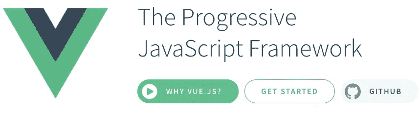

# 你好，维！

> 原文：<https://levelup.gitconnected.com/hello-vue-9a910ca11f52>

## 这不是很反应，不是很有棱角，但容易和有趣！



谁啊！

在我从编码学校毕业后失业的这段时间里，我主要做了三件事:申请工作/为工作做准备，在布鲁克林一个奇妙的动物收容所做志愿者，以及学习新的网络框架。我擒过[现在，我不会假装完全理解它的神奇之处，尽管那个“$”让我想起了 jQuery。基本上，我们似乎正在导入 npm 包 Vue，一个名为`App.vue`的文件，然后最终告诉 Vue 将那里的内容放入带有*应用*的 id 或“#”的 html 元素中，这就是我们在索引文件中看到的内容。所以这是有道理的。](https://medium.com/javascript-in-plain-english/why-you-should-be-using-gatsby-a94c1c6efc15#app')</span></pre><p id=)

[最后来看看我们的`App.vue` 档。现在，出于本演练的目的，我将使用我在项目中使用的代码。因此，请随意复制并粘贴到您的文件或只是跟着做。](https://medium.com/javascript-in-plain-english/why-you-should-be-using-gatsby-a94c1c6efc15#app')</span></pre><p id=)

[首先让我们看看*模板*元素。](https://medium.com/javascript-in-plain-english/why-you-should-be-using-gatsby-a94c1c6efc15#app')</span></pre><p id=)

```
<template> <div id="app" class="container"> <div class="row"> <div class="col-md-6 offset-md-3 py-5"> <h1>Welcome to Take A Peek!</h1> <br /> <h5>Enter a URL below to see a screenshot of whatever website you'd like! </h5> <br /> <form v-on:submit.prevent="makeWebsiteThumbnail"> <div class="form-group"> <input v-model="websiteUrl" type="text" id="website-input" placeholder="Enter a site to take a peek at!" class="form-control" /> </div> <div class="form-group"> <button class="btn btn-primary">Generate!</button> </div> </form>  </div> </div> <footer class="footer fixed-bottom text-center"> <p><strong>Created by Nicholas Feitel, 2020</strong></p> </footer> </div></template>
```

[对于那些对 Angular 或 React 感兴趣的人来说，这应该包含两者的元素。](https://medium.com/javascript-in-plain-english/why-you-should-be-using-gatsby-a94c1c6efc15#app')</span></pre><p id=)

[首先，*模板*元素类似于 React *组件*，因为最终，像 React 的 JSX 一样，它只返回 HTML 的一个元素，在本例中是一个包装了我们所有内容的 *div* 。](https://medium.com/javascript-in-plain-english/why-you-should-be-using-gatsby-a94c1c6efc15#app')</span></pre><p id=)

[第二，像 Angular 一样，你可能会注意到我们有一些你以前可能没有见过的定制外观的 html 元素，比如 *v-on* 和 *:src。有*指令*和*数据绑定*是那个角度世界中最熟悉的(至少对我来说)。*](https://medium.com/javascript-in-plain-english/why-you-should-be-using-gatsby-a94c1c6efc15#app')</span></pre><p id=)

[`<form v-on:submit.prevent="makeWebsiteThumbnail">`这条线类似于 React 中的 JSX，它可能会说:](https://medium.com/javascript-in-plain-english/why-you-should-be-using-gatsby-a94c1c6efc15#app')</span></pre><p id=)

```
<form onSubmit= {e => {
  e.preventDefault()
  makeWebsiteThumbnail()
 }}/>
```

[我们还有另一行`<input v-model="websiteUrl"/>`，我们稍后会说它实际上是*指导*我们的表单将提交的数据放在哪里，以及*将该数据绑定到*我们已经定义的变量。这些是我之前提到的定制*指令*和*数据绑定*。](https://medium.com/javascript-in-plain-english/why-you-should-be-using-gatsby-a94c1c6efc15#app')</span></pre><p id=)

[现在让我们看看我们的`App.vue`的第二个元素，我们的`<script>`标签。](https://medium.com/javascript-in-plain-english/why-you-should-be-using-gatsby-a94c1c6efc15#app')</span></pre><p id=)

```
<script> import axios from 'axios'; export default { name: 'App', data() { return { websiteUrl: '', thumbnailUrl: '', }; }, methods: { makeWebsiteThumbnail() { axios .post('http://take-a-peek.herokuapp.com/api/thumbnail', { url: this.websiteUrl }) .then((response) **=>** { this.thumbnailUrl = response.data.screenshot; }) .catch((error) **=>** { window.alert(`The API returned an error: ${error}`); }); }, },};</script>
```

[同样，对于我们这些有 React 或 Angular 经验的人来说，这应该看起来相当熟悉。在本例中，我们导出了一个匿名对象*，它有一个名为`data()`的*方法*，该方法返回两个变量:`websiteUrl`和`thumbnailUrl`。我们在这个对象中也有一个*方法*键，我们在其中导出了一个函数`makeWebsiteThumbnail`，通过 Vue 的魔力，它能够使用`this`关键字访问`data`方法中的变量，甚至能够设置它们，并通过模板中的*数据绑定*以我们之前看到的`:src`的形式将它们发送回我们的站点。*](https://medium.com/javascript-in-plain-english/why-you-should-be-using-gatsby-a94c1c6efc15#app')</span></pre><p id=)

[这些元素是一个简单的 Vue 应用程序的非常小的基础块，但是我不得不说，与 Angular 的 TypeScript 接口相比，我需要的代码少得多，并且有状态值比 React 容易管理得多，这给我留下了深刻的印象。](https://medium.com/javascript-in-plain-english/why-you-should-be-using-gatsby-a94c1c6efc15#app')</span></pre><p id=)

[我想，可悲的是，我可能会成为那些“Vue”的人之一:(。](https://medium.com/javascript-in-plain-english/why-you-should-be-using-gatsby-a94c1c6efc15#app')</span></pre><p id=)

[](https://medium.com/javascript-in-plain-english/why-you-should-be-using-gatsby-a94c1c6efc15#app')</span></pre><p id=)

[我们在这篇文章中已经谈论了很多关于 Vue 的事情，但是 Vue 是“view”的同音异义词，没有什么比 Hutch being 更好的了。](https://medium.com/javascript-in-plain-english/why-you-should-be-using-gatsby-a94c1c6efc15#app')</span></pre><p id=)

[](https://medium.com/javascript-in-plain-english/why-you-should-be-using-gatsby-a94c1c6efc15#app')</span></pre><p id=)

[哈奇。](https://medium.com/javascript-in-plain-english/why-you-should-be-using-gatsby-a94c1c6efc15#app')</span></pre><p id=)

[哈奇是个英俊的反叛者，喜欢用嘴抓东西。害怕的人认为他想咬他们，但哈士奇喜欢到格拉布兹。动物收容所的人信任我和他在一起，尽管他是一只“难相处”的狗。我喜欢认为他是一个“难相处”的朋友。](https://medium.com/javascript-in-plain-english/why-you-should-be-using-gatsby-a94c1c6efc15#app')</span></pre><p id=)

[爱你，哈奇，](https://medium.com/javascript-in-plain-english/why-you-should-be-using-gatsby-a94c1c6efc15#app')</span></pre><p id=)

[网络信息中心(Network Information Center)ˌ网路界面卡(Network Interface Card)ˌ全国工业理事会(National Industrial Council)ˌ航行情报中心(Navigation Information Center)](https://medium.com/javascript-in-plain-english/why-you-should-be-using-gatsby-a94c1c6efc15#app')</span></pre><p id=)

[](https://medium.com/javascript-in-plain-english/why-you-should-be-using-gatsby-a94c1c6efc15#app')</span></pre><p id=)