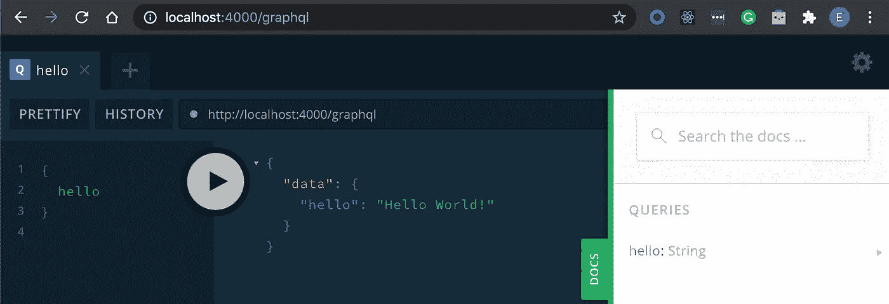
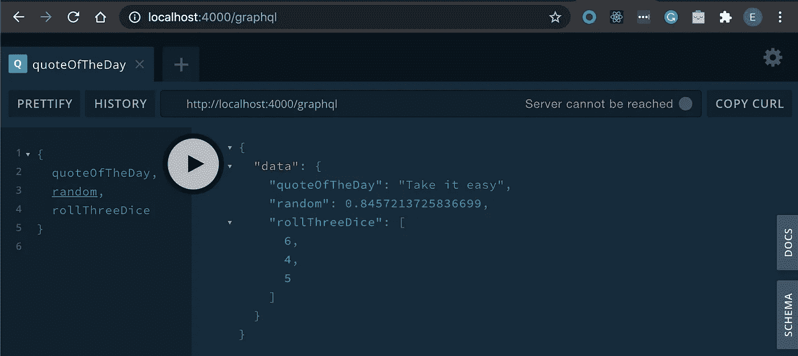
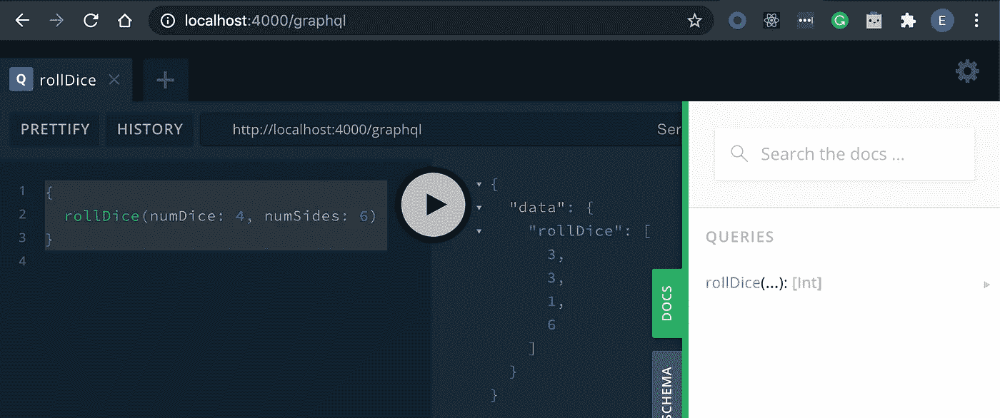
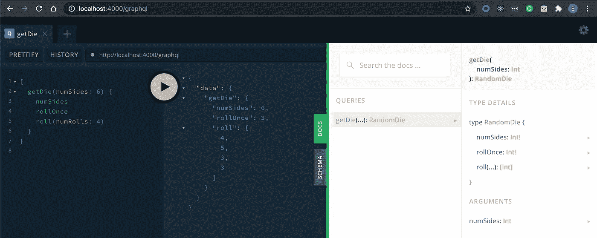
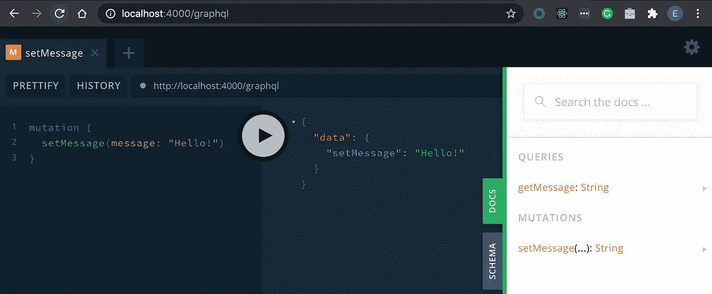
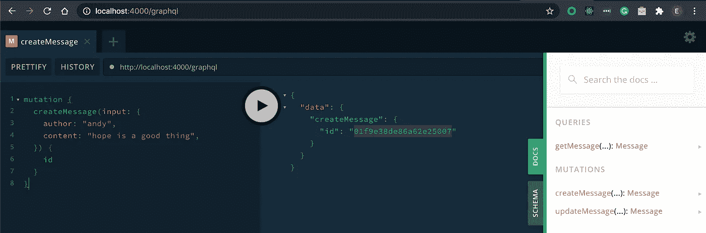
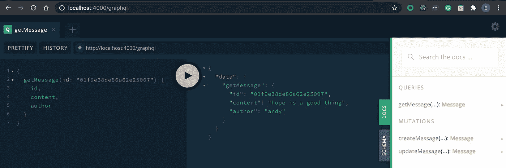
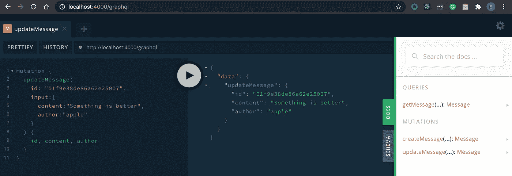
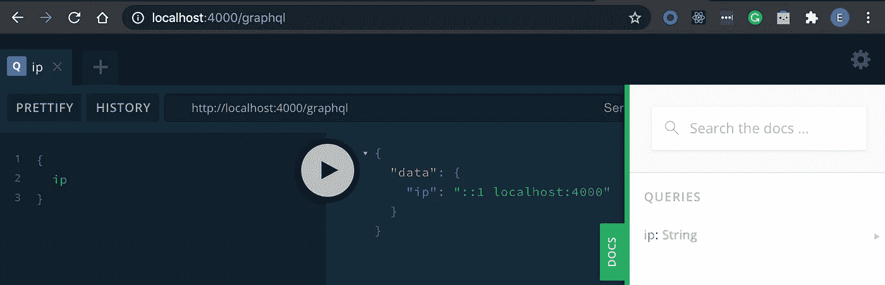

# Apollo GraphQL 的 Hello World

> 原文：<https://levelup.gitconnected.com/hello-world-for-apollo-graphql-8f4821db2a44>

## 学习图表 QL

## 轻松开始学习 Apollo GraphQL


照片由[格雷格·罗森克](https://unsplash.com/@greg_rosenke?utm_source=medium&utm_medium=referral)在 [Unsplash](https://unsplash.com?utm_source=medium&utm_medium=referral) 上拍摄

raphQL 是一个越来越受欢迎的 API 服务接口。GraphQL 官方页面提供了一个优秀的教程，从一个非常简单的 [Hello World 示例](https://graphql.org/graphql-js/)开始。

有一个名为 Apollo 的流行库，它用更好的接口包装了 GraphQL，以提供全栈解决方案。不过，它的教程是从一个[相对复杂的例子](https://www.apollographql.com/docs/tutorial/introduction/?_ga=2.41604450.1775628954.1593240900-1235240513.1592695685)开始的。

因此，我在这里写博客来提供一个简单的关于 Apollo 的 Hello World 示例，以弥补 GraphQL 和 Apollo 的基础不足。

# 你好世界服务

这是基于[教程这里的](https://graphql.org/graphql-js/running-an-express-graphql-server/)，除了它是直接使用 Apollo-Server 而不是 Express 和 GraphQL 库。

使用文件夹中的以下命令安装 Apollo-Server 库。

```
yarn add apollo-server
```

> Yarn 是 npm 的另一种变体，[更多详情请参考此处的](/know-yarn-before-learning-node-js-bf39a50fb27f)。

*   在文件夹中创建一个文件名为 *index.js* 的文件。
*   从`apollo-server`中获取所需的功能

```
const { ApolloServer, gql } = ***require***('apollo-server');
```

*   从 Apollo-Server 库中定义`gql`中的第一个查询类型`hello: String`。

```
const typeDefs = gql`
    type Query {
        hello: String
    }
`;
```

*   定义解析器(或 GraphQL 教程中的根)来解析给定的查询

```
const resolvers = {
    Query: {
        hello: () => {
            return 'Hello World!';
        }
    }
};
```

*   最后，实例化`ApolloServer`，您将启动服务。

```
const server = new ApolloServer({typeDefs, resolvers})server.listen(4000).then(({ url }) => {
    ***console***.log(`🚀 Server ready at ${url}`);
});
```

整个代码如下

```
const { ApolloServer, gql } = ***require***('apollo-server');const typeDefs = gql`
    type Query {
        hello: String
    }
`;const resolvers = {
    Query: {
        hello: () => {
            return 'Hello World!';
        }
    }
};const server = new ApolloServer({typeDefs, resolvers})server.listen(4000).then(({ url }) => {
    ***console***.log(`🚀 Server ready at ${url}`);
});
```

你只需要用

```
node index.js
```

你现在可以看到如下的浏览器。



# 基本类型

这个是基于[教程这里](https://graphql.org/graphql-js/basic-types/)。

GraphQL 查询的基本类型可以由`String`、`Int`、`Float`、`Boolean`、`ID`及其列表(即在`[]`中)组成。

这里，我们用不同的类型将`typeDefs`定义如下。`!`表示不可为空的结果。

```
const typeDefs = gql`
    type Query {
        quoteOfTheDay: String
        random: Float!
        rollThreeDice: [Int]
    }
`;
```

让我们也相应地设置解析器。

```
const resolvers = {
    Query: {
        quoteOfTheDay: () => {
            return ***Math***.random() < 0.5 ? 
                'Take it easy' : 'Salvation lies within';
        },
        random: () => {
            return ***Math***.random();
        },
        rollThreeDice: () => {
            return [1, 2, 3]
                .map(_ => 1 + ***Math***.floor(***Math***.random() * 6));
        },
    }
};
```

一旦我们有了如下的完整代码，

```
const { ApolloServer, gql } = ***require***('apollo-server');const typeDefs = gql`
    type Query {
        quoteOfTheDay: String
        random: Float!
        rollThreeDice: [Int]
    }
`;const resolvers = {
    Query: {
        quoteOfTheDay: () => {
            return ***Math***.random() < 0.5 ?
                'Take it easy' : 'Salvation lies within';
        },
        random: () => {
            return ***Math***.random();
        },
        rollThreeDice: () => {
            return [1, 2, 3]
                .map(_ => 1 + ***Math***.floor(***Math***.random() * 6));
        },
    }
};const server = new ApolloServer({typeDefs, resolvers})server.listen(4000).then(({ url }) => {
    console.log(`🚀 Server ready at ${url}`);
});
```



# 传递参数

这是基于[教程这里](https://graphql.org/graphql-js/passing-arguments/)。它展示了如何使用查询将一些参数传递给服务器。

为此，让我们将查询定义如下，将`numDice`和`numSides`作为参数。

```
const typeDefs = gql`
    type Query {
        rollDice(numDice: Int!, numSides: Int): [Int]
    }
`;
```

然后在解析器中，注意对于 Apollo，它与基本的 GraphQL API 略有不同。这些参数通过第二个参数`rollDice: (_, {numDice, numSides})`发送，也就是说，我们现在忽略第一个带 _ 的参数。

```
const resolvers = {
    Query: {
        rollDice: (_, {numDice, numSides}) => {
            var output = [];
            for (var i = 0; i < numDice; i++) {
                output.push(1 + ***Math***.floor(***Math***.random() 
                    * (numSides || 6)));
            }
            return output;
        }
    }
};
```

这样，完整的代码如下所示

```
const { ApolloServer, gql } = ***require***('apollo-server');const typeDefs = gql`
    type Query {
        rollDice(numDice: Int!, numSides: Int): [Int]
    }
`;const resolvers = {
    Query: {
        rollDice: (_, {numDice, numSides}) => {
            var output = [];
            for (var i = 0; i < numDice; i++) {
                output.push(1 + ***Math***.floor(***Math***.random()
                    * (numSides || 6)));
            }
            return output;
        }
    }
};const server = new ApolloServer({typeDefs, resolvers})server.listen(4000).then(({ url }) => {
    console.log(`🚀 Server ready at ${url}`);
});
```



# 对象类型

这是基于[教程这里](https://graphql.org/graphql-js/object-types/)。

有时我们想返回一个由基本类型构造的更复杂的对象。我们可以通过为它声明一个类(JavaScript ES6)类型来做到这一点。

假设我们有一个名为`RandomDice`的复杂对象，并将查询定义如下

```
const typeDefs = gql`
    type RandomDie {
        numSides: Int!
        rollOnce: Int!
        roll(numRolls: Int!): [Int]
    } type Query {
        getDie(numSides: Int): RandomDie
    }
`;
```

我们可以构造如下的类

```
class RandomDie {
    constructor(numSides) {
        this.numSides = numSides;
    } rollOnce() {
        return 1 + ***Math***.floor(***Math***.random() * this.numSides);
    } roll({numRolls}) {
        const output = [];
        for (let i = 0; i < numRolls; i++) {
            output.push(this.rollOnce());
        }
        return output;
    }
}
```

类似地，解析器，我们只是传递一个简单的查询给它。

```
const resolvers = {
    Query: {
        getDie: (_, {numSides}) => {
            return new RandomDie(numSides || 6);
        }
    }
};
```

完整的代码如下所示

```
const { ApolloServer, gql } = ***require***('apollo-server');const typeDefs = gql`
    type RandomDie {
        numSides: Int!
        rollOnce: Int!
        roll(numRolls: Int!): [Int]
    } type Query {
        getDie(numSides: Int): RandomDie
    }
`;class RandomDie {
    constructor(numSides) {
        this.numSides = numSides;
    } rollOnce() {
        return 1 + ***Math***.floor(***Math***.random() * this.numSides);
    } roll({numRolls}) {
        const output = [];
        for (let i = 0; i < numRolls; i++) {
            output.push(this.rollOnce());
        }
        return output;
    }
}const resolvers = {
    Query: {
        getDie: (_, {numSides}) => {
            return new RandomDie(numSides || 6);
        }
    }
};const server = new ApolloServer({typeDefs, resolvers})server.listen(4000).then(({ url }) => {
    console.log(`🚀 Server ready at ${url}`);
});
```

我们可以有一个更复杂的表单，如下图所示。



# 突变和输入类型

这是基于[教程这里](https://graphql.org/graphql-js/mutations-and-input-types/)。

## 变化

要修改一些服务器端数据，让我们用`mutation`代替`query`。

```
const typeDefs = gql`
    type Mutation {
        setMessage(message: String): String
    } type Query {
        getMessage: String
    }
`;
```

在分解器中，让我们也放入`Mutation`案例中。

```
const resolvers = {
    Mutation: {
        setMessage: (_, {message}) => {
            fakeDatabase.message = message;
            return message;
        }
    },
    Query: {
        getMessage: () => {
            return fakeDatabase.message;
        }
    }
};
```

整个代码如下所示。

```
const { ApolloServer, gql } = ***require***('apollo-server');const typeDefs = gql`
    type Mutation {
        setMessage(message: String): String
    } type Query {
        getMessage: String
    }
`;const fakeDatabase = {};const resolvers = {
    Mutation: {
        setMessage: (_, {message}) => {
            fakeDatabase.message = message;
            return message;
        }
    },
    Query: {
        getMessage: () => {
            return fakeDatabase.message;
        }
    }
};const server = new ApolloServer({typeDefs, resolvers})server.listen(4000).then(({ url }) => {
    console.log(`🚀 Server ready at ${url}`);
});
```

为了运行它，这次我们将使用`mutation`来代替。



## 输入类型

有时我们喜欢把相似的输入放在一起。我们可以使用`input`对它们进行分组。

让我们把`MessageInput`作为一组输入。让我们定义类型定义

```
const typeDefs = gql`
    input MessageInput {
        content: String
        author: String
    }

    type Message {
        id: ID!
        content: String
        author: String
    }

    type Query {
        getMessage(id: ID!): Message
    }

    type Mutation {
        createMessage(input: MessageInput): Message
        updateMessage(id: ID!, input: MessageInput): Message
    }
`;
```

我们有下面的`Message`对象类型(在上面的课程中讨论过)

```
class Message {
    constructor(id, {content, author}) {
        this.id = id;
        this.content = content;
        this.author = author;
    }
}
```

那么对于解析器，我们只需要做相应的操作。

```
const resolvers = {
    Mutation: {
        createMessage: (_, {input}) => {
            var id = require('crypto')
                .randomBytes(10).toString('hex');

            fakeDatabase[id] = input;
            return new Message(id, input);
        },
        updateMessage: (_, {id, input}) => {
            if (!fakeDatabase[id]) {
                throw new Error('no message exists with id ' + id);
            }
            fakeDatabase[id] = input;
            return new Message(id, input);
        },
    },
    Query: {
        getMessage: (_, {id}) => {
            if (!fakeDatabase[id]) {
                throw new Error('no message exists with id ' + id);
            }
            return new Message(id, fakeDatabase[id]);
        },
    }
};
```

将所有代码缝合在一起，我们得到了以下代码

```
const { ApolloServer, gql } = ***require***('apollo-server');

const typeDefs = gql`
    input MessageInput {
        content: String
        author: String
    }

    type Message {
        id: ID!
        content: String
        author: String
    }

    type Query {
        getMessage(id: ID!): Message
    }

    type Mutation {
        createMessage(input: MessageInput): Message
        updateMessage(id: ID!, input: MessageInput): Message
    }
`;

class Message {
    constructor(id, {content, author}) {
        this.id = id;
        this.content = content;
        this.author = author;
    }
}

const fakeDatabase = {};

const resolvers = {
    Mutation: {
        createMessage: (_, {input}) => {
            // Create a random id for our "database".
            var id = require('crypto').randomBytes(10).toString('hex');

            fakeDatabase[id] = input;
            return new Message(id, input);
        },
        updateMessage: (_, {id, input}) => {
            if (!fakeDatabase[id]) {
                throw new Error('no message exists with id ' + id);
            }
            // This replaces all old data, but some apps might want partial update.
            fakeDatabase[id] = input;
            return new Message(id, input);
        },
    },
    Query: {
        getMessage: (_, {id}) => {
            if (!fakeDatabase[id]) {
                throw new Error('no message exists with id ' + id);
            }
            return new Message(id, fakeDatabase[id]);
        },
    }
};

const server = new ApolloServer({typeDefs, resolvers})

server.listen(4000).then(({ url }) => {
    console.log(`🚀 Server ready at ${url}`);
});
```

从那里我们可以创建消息



并得到消息



或者更新消息



# 证明

这是基于[教程这里](https://graphql.org/graphql-js/authentication-and-express-middleware/)。

这里我们不涉及中间件，相反，我们关注访问 IP 等。

让我们将类型定义如下

```
const typeDefs = gql`
    type Query {
        ip: String
    }
`;
```

为了获得`request`信息，可以通过 ApolloServer 的`context`来传递它。

```
const server = new ApolloServer({
        typeDefs,
        resolvers,
        context: ({ req }) => {
            ***console***.log(`${req.ip} ${req.headers.host}`);
            return { req };
        }
})
```

在`resolvers`中，我们可以相应地访问`request`。

```
const resolvers = {
    Query: {
        ip: (parent, args, context) => {
            return `${context.req.ip} ${context.req.headers.host}`;
        }
    }
};
```

完整的代码如下所示

```
const { ApolloServer, ***gql*** } = require('apollo-server');

const typeDefs = ***gql***`
    type Query {
        ip: String
    }
`;

const resolvers = {
    Query: {
        ip: (parent, args, context) => {
            return `${context.req.ip} ${context.req.headers.host}`;
        }
    }
};

const server = new ApolloServer({
        typeDefs,
        resolvers,
        context: ({ req }) => {
            ***console***.log(`${req.ip} ${req.headers.host}`);
            return { req };
        }
})

server.listen(4000).then(({ url }) => {
    console.log(`🚀 Server ready at ${url}`);
});
```



在控制台中，我们也可以看到它打印出来


以上所有代码都可以从

[](https://github.com/elye/demo_nodejs_graphql_apollo_basic) [## elye/demo _ nodejs _ graph QL _ Apollo _ basic

### 此时您不能执行该操作。您已使用另一个标签页或窗口登录。您已在另一个选项卡中注销，或者…

github.com](https://github.com/elye/demo_nodejs_graphql_apollo_basic) 

完成这些之后，现在您可以继续学习

[](https://www.apollographql.com/docs/tutorial/introduction/?_ga=2.34142689.1775628954.1593240900-1235240513.1592695685) [## 0.介绍

### 从这里开始，了解如何使用 Apollo 构建全栈应用

www.apollographql.com](https://www.apollographql.com/docs/tutorial/introduction/?_ga=2.34142689.1775628954.1593240900-1235240513.1592695685)