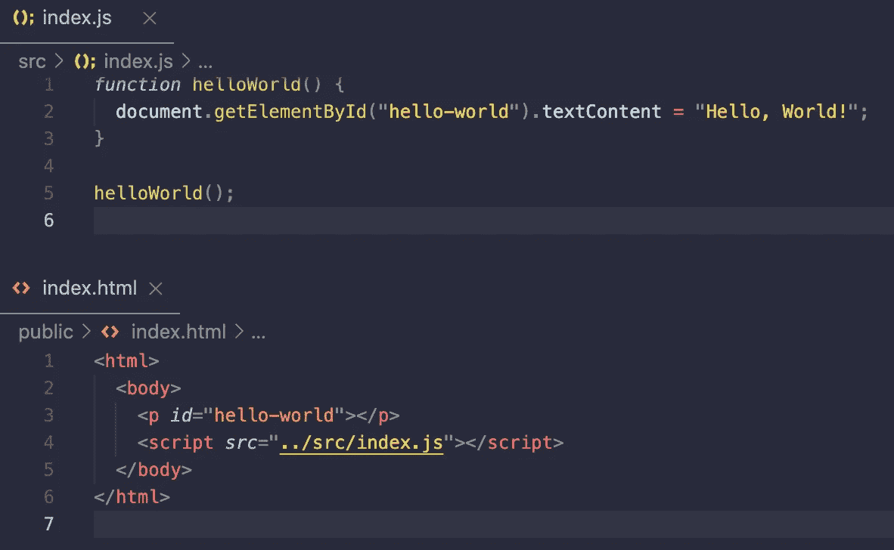

# 这一切都始于“你好，世界！”

> 原文：<https://levelup.gitconnected.com/hello-world-starting-a-web-app-from-a-blank-canvas-9b73fa2cb7e6>



*这篇文章记录了我创建一个完整网站的旅程的一小部分，这个网站可以在三个并行框架和三个并行设计系统中呈现(*[*React*](https://reactjs.org/)*+*[*Material UI*](https://material-ui.com/)*)；*[](https://angular.io/)**+*[*清晰度*](https://clarity.design/)*；* [*【香草】JS*](https://www.javascript.com/)*+*[*碳*](https://www.carbondesignsystem.com/) *)。**

*[下一篇文章:建立一个简单的类型脚本项目](https://simon-lutterbie.medium.com/setting-up-a-simple-typescript-project-b11140877e24) →*

*我的目标是从一个“空白画布”(一个空目录)开始，构建一个完整的 web 应用程序，它可以在三个并行框架(或者没有框架)和三个并行设计系统中运行:*

*   *[反应](https://reactjs.org/) + [材质 UI](https://material-ui.com/)*
*   *[角度](https://angular.io/) + [清晰度](https://clarity.design/)*
*   *[【香草】JS](https://www.javascript.com/) + [碳](https://www.carbondesignsystem.com/)*

*…同时共享尽可能多的代码。*

*我想完全从零开始做这件事，我计划记录这一过程中的每一步。*

****免责声明:*** *如果你还没有聚集，这是* ***而不是*** *一个教程，给想快速建立网站的人。事实上，虽然从技术上来说是一步一步的，但我怀疑它是否能算作一个教程。说实话，除了学习的乐趣之外，没有什么好的理由去做这件事。**

*那么，从哪里开始呢？不妨尊重传统，说声“你好，世界！”*

> **“每一次冒险都需要第一步。陈腐，但真实，即使在这里。”*
> ——*柴郡猫*，[美国麦基的爱丽丝](https://www.ea.com/games/alice/american-mcgees-alice)*

*从一个空目录开始，我想建立一个非常简单的网站，同时也利用一点 Javascript，只是为了概念验证。它将有一个用于模板的 HTML 文件和一个用于呈现模板中某些内容的 Javascript 文件。我还将设置一个`git repo`，以便跟踪我的进度(*剧透:这里有一个链接指向* [*这篇文章的提交*](https://github.com/sjlutterbie/parallel-frameworks-website/commit/ae0face5a1d619281a9feab24f173916ce981c4c) )。*

*我从一个空白目录开始。展望未来，我将需要一个文件夹来存放不加修改地(或多或少)提供给公众的文件，以及(至少一个)包含源代码的文件夹，以便在提供之前进行打包。*

*我的`index.html`文件或多或少会是静态的，所以会活`public`；我的`index.js`将是我的应用程序的主要入口点，所以它放在`src`:*

```
*mkdir public
touch public/index.htmlmkdir src
touch src/index.js*
```

*现在，`index.html`我会尽可能的简单。只是一个包含内容主体的 HTML 文档和一个包含唯一 id 的段落:*

```
*<html>
  <body>
    <p id="hello-world"></p>
  <body>
</html>*
```

*你可以在浏览器中打开它，但是除了一个空白页之外，你什么也看不到。*

*将最终成为一个奇妙世界的入口。目前，它只包含一个将一些文本插入页面的函数，并调用该函数:*

```
*function helloWorld() {
  document.getElementById('hello-world').textContent =
    'Hello, World!'
}helloWorld();*
```

*当导入到`index.html`中时，`helloWorld()`将在站点中查找带有`id="hello-world"`的元素，并将其内容设置为“Hello，World！”。`function`定义提供了指令，`helloWorld();`直接调用它。*

*要连接这些点，需要做最后一个改变:从`index.html`内装载`index.js`:*

```
*<html>
  <body>
    <p id="hello-world"></p>
    <script src="../src/index.js"></script>
  <body>
</html>*
```

*老实说…这是目前所有的发展。我有一个工作网站。我可以把它发布到一个服务器上，连接到一个域，它就会“工作”。*

*剩下的一件事就是保存我的作品。由于我将逐步建立我的网站，我不仅希望保存我的工作，而且能够回顾每一步。我可能还想把网站带向不同的方向，也许是为了追求一个额外的冒险，或者在不影响代码主要分支的情况下开发一个更大的功能，直到该功能准备就绪。因此，我将在一个 [git 存储库](https://git-scm.com/)中记录我的项目的全部进展。*

*在我的网站目录中，我初始化了一个存储库:*

```
*git init*
```

*我将所有更改过的文件添加到我的(不再是空白的)目录中，并提交结果:*

```
*git add .
git commit*
```

*我现在在`master`分支上有一个`commit`，这是默认的。然而，`master`这个词已经失宠了，因为它植根于`master / slave`关系中。我支持脱离这个惯例，所以一个快速命令会将我的`master`分支更改为`main`:*

```
*git branch -m master main*
```

*最后，我想把我的工作保存在 GitHub 上，这样我就可以分享它，这样我就有了一个备份，以防我的电脑坏了…也许我甚至会有灵感实现一个 CI/CD 管道，就这样！*

*我的 [Github repo](https://github.com/sjlutterbie/parallel-frameworks-website) 已创建，我将其添加为我的本地 repo 的`origin`:*

```
*git remote add origin <MY_GITHUB_REPO'S_SSH_ADDRESS>*
```

*最后，我将我的工作`push`到我的 Github repo，在远程创建一个`main`分支，我将与我的本地工作保持同步。*

```
*git push --set-upstream origin main*
```

*[本次提交的变化](https://github.com/sjlutterbie/parallel-frameworks-website/commit/ae0face5a1d619281a9feab24f173916ce981c4c) | [浏览截至本次提交的回购](https://github.com/sjlutterbie/parallel-frameworks-website/tree/ae0face5a1d619281a9feab24f173916ce981c4c) | [我的今日回购](https://github.com/sjlutterbie/parallel-frameworks-website)*

*[下一篇文章:建立一个简单的打字稿项目](https://simon-lutterbie.medium.com/setting-up-a-simple-typescript-project-b11140877e24) →*