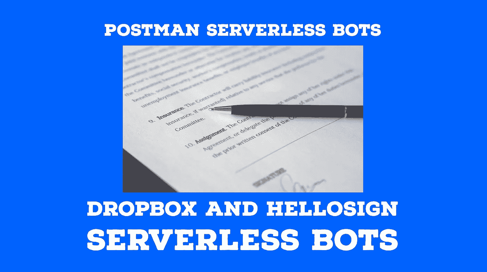
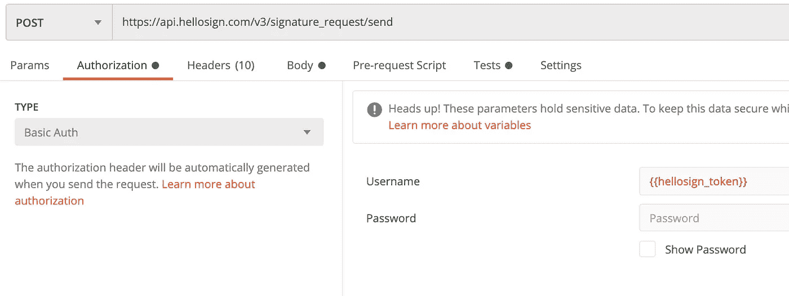
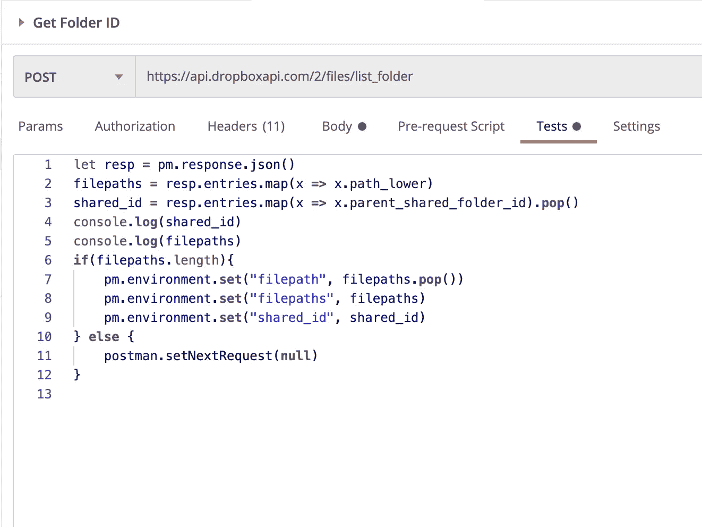
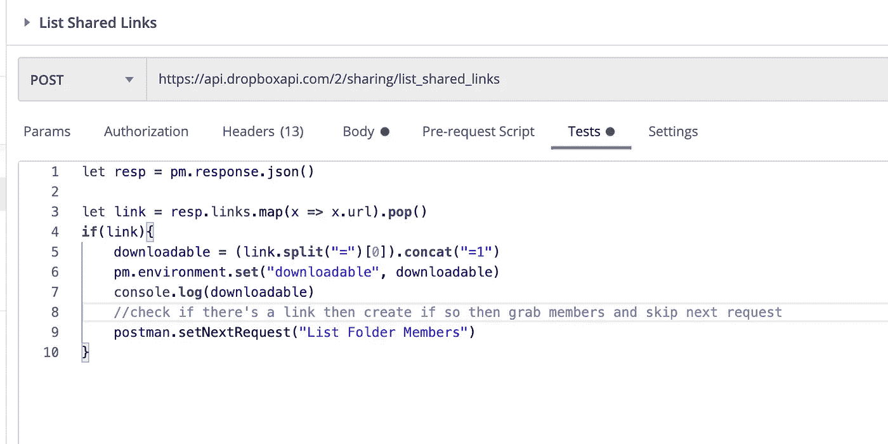
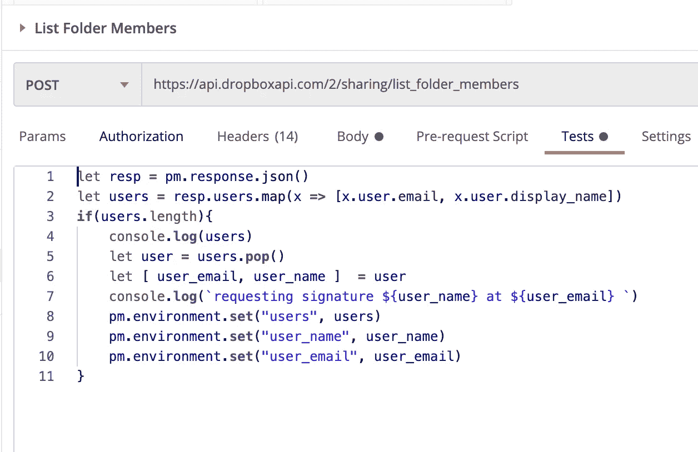
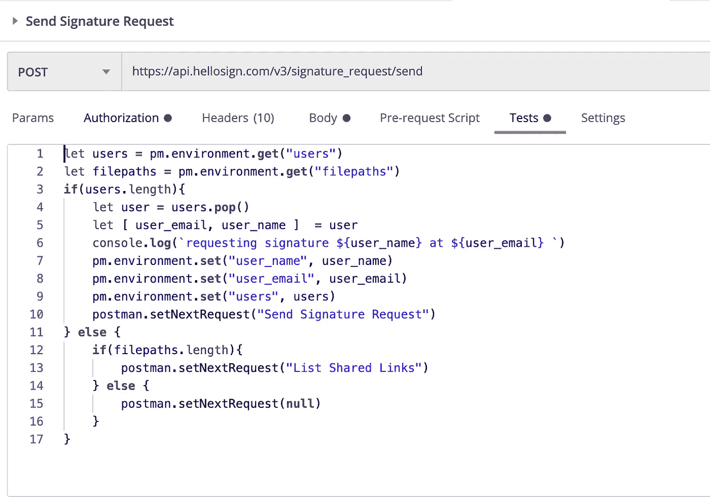
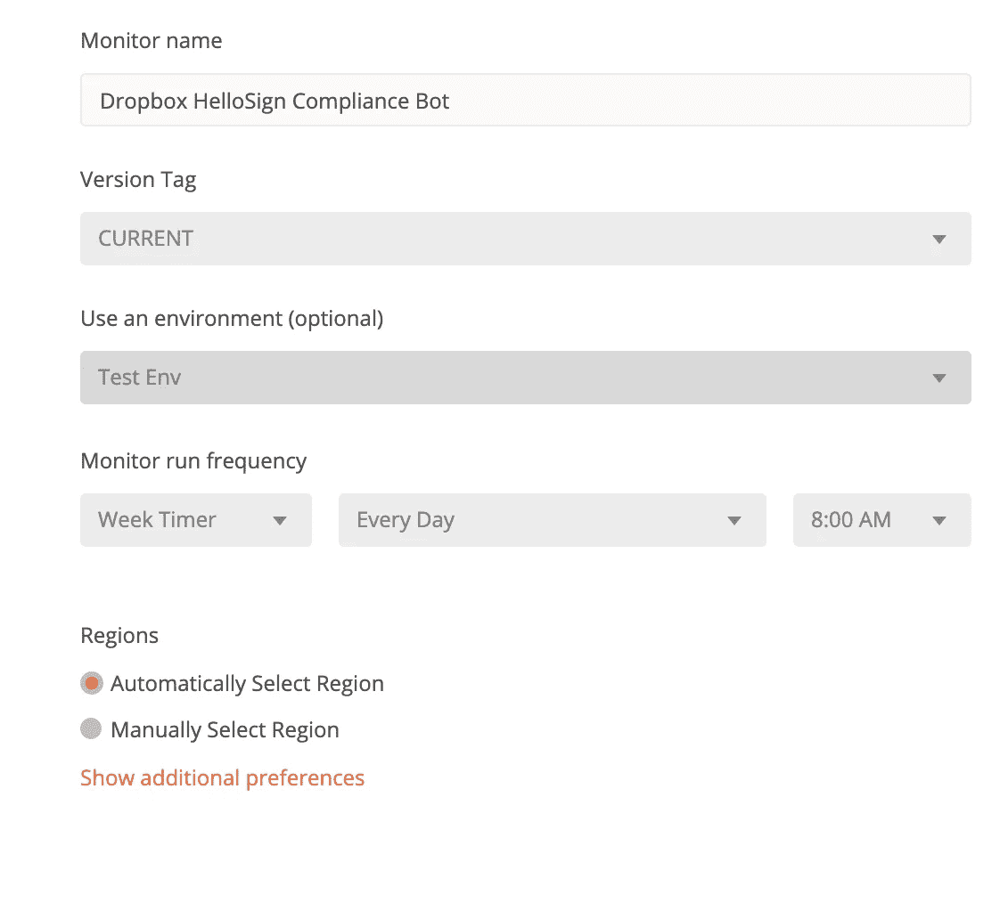
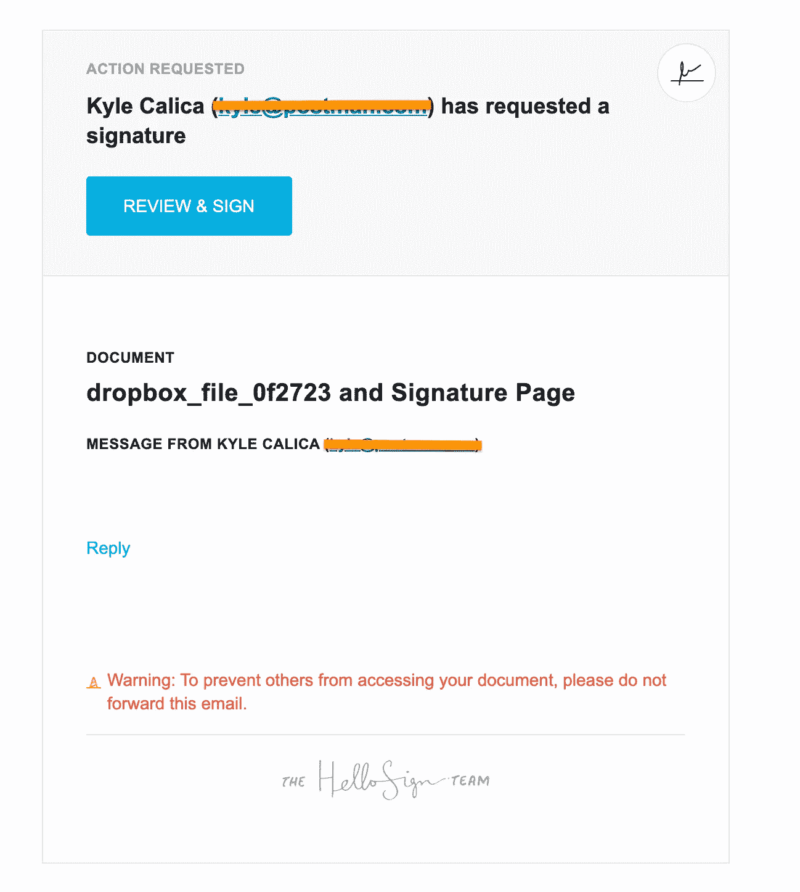

# 邮递员无服务器机器人:HelloSign & Dropbox

> 原文：<https://levelup.gitconnected.com/hellosign-dropbox-postman-bot-9605694314b2>

Postman 集合连接两个 API 并发送 Dropbox 文件夹成员列表提醒签名文档

不久前，我和 Dropbox 的 Marcel Ribas 一起成为了“邮差网”的嘉宾。我们的任务是使用 Dropbox 和 HelloSign APIs 实时构建一些东西。所以很明显，我就是我，我们开始创造一个机器人。

Dropbox 收购了 HelloSign，但他们的产品和 API 还没有相互集成，所以我们想创造的功能受到了限制。

我喜欢从高层次的用户角度来思考，所以在我的脑海中:

> “一位招聘经理想提醒新员工签署存储在 Dropbox 中的重要文件。他们需要做的只是将新员工添加到共享的 Dropbox 文件夹中，并添加他们想要签名的文档。该机器人将在每天早上 8 点发送 HelloSign 签名请求电子邮件。他们可以签署文件，招聘经理可以从 HelloSign 下载签署的文件。”

虽然这看起来很简单，但是在这个工作流集合中有一些事情需要考虑:

1.  我们将对文件夹中的每个文件进行递归循环，并对每个文件的每个文件夹成员进行循环。
2.  我们需要访问一个帐户上的任何文件夹，因此令牌将链接到一个用户，并使用 Dropbox 的完全帐户访问权限
3.  HelloSign 可以使用 Dropbox 共享链接，并将可下载标志设置为 true

理解了这一点，这个系列就更容易理解了。

我将掩饰 Dropbox 和 HelloSign 应用程序的创作。前者是最难的，但是通过阅读 Dropbox 文档或响应错误，你会知道你需要添加什么权限。您确实需要确保提供对`Full Dropbox Access`的访问，并创建一个`non-expire access token`来传递给 Dropbox 请求的授权头。对于 HelloSign，生成一个用户令牌是非常容易的，但是您需要在 Postman 中将它添加为基本身份验证，并将访问令牌作为`user`给出，并将`password`留空。

HelloSign 需要在 Auth 选项卡中将令牌作为用户名，密码为空

首先，我们将获取文件夹内容的文件路径和父文件夹的共享 ID。我们将保存将要循环的文件路径数组和共享 ID 作为环境变量。

获取我们将要循环的文件路径和共享文件夹 ID 作为环境变量

这下一个花絮开始进入邮递员工作流的内容，我们将**有条件地选择**在当前请求的结果之后运行集合中的哪个邮递员请求！

其次，我们要去获取 Dropbox 共享链接。每当您想要在用户之间共享文件时，就会生成这些链接。Dropbox 共享链接可以在 UI 中生成，所以它们可能存在。我们将检查该文件是否已经有我们可以使用的公共共享链接。

Postman 收集总是按顺序运行，但是通过使用***postman . set next request***我们实际上可以改变在当前请求执行之后运行哪个请求。在这种情况下，如果我们有一个链接，那么让我们跳过 ***创建共享链接*** 并使用 ***列出文件夹成员*** 来代替。 **OMG！分支请求**！

检查是否有链接，然后创建如果有，然后抓取成员，跳过下一个请求

**注意我们需要传入带有空格的请求名称。**

现在，在 ***列出文件夹成员*** 中，我们只需收集所有共享文件夹成员。

获取文件夹成员并弹出第一个用户

我在最后弹出一个用户，这样我就可以从第一个用户开始下一个请求，然后在**测试选项卡**中弹出下一个循环。这是我的循环索引的开始。

现在我们正在处理一个递归的工作流。我们将检查是否有当前用户，然后在 HelloSign 的端点*上循环发送签名请求*，直到不再有用户。然后检查是否有更多的文件路径，如果有，我们将获取文件路径的下一个共享链接。再次获取所有协作者，然后在 ***上循环，再次发送签名请求*** 。

postman.setNextRequest 设置为循环处理此请求、返回共享链接或结束收集

剩下的就是在 Collection Runner 中测试它，如果看起来不错，那么我们可以把它扔进监视器:

在这里，我们为每天早上 8 点创建提醒

以下是我们系列的主要分支和循环:

> **共享文件链接→ … →**
> 
> **获取文件夹成员→发送签名请求**
> 
> **→发送签名请求/共享文件链接/结束**

现在，我们的新员工可以打开他们的电子邮件来签署文件，我们的招聘经理可以在 HelloSign 中查看和下载签署的文件。

找到了。

# TL；速度三角形定位法(dead reckoning)

*   Dropbox 对 HelloSign 的最新收购开辟了一个领域，我们可以使用 Postman collections 在它们之间创建一个集成
*   使用 Dropbox，我们可以为一个无服务器机器人创建一个存储项目的地方
*   ***postman . setnextrequest()***允许我们在单个集合中进行分支或递归调用和循环
*   当一个 API 不存在时，API 之间的简单和容易的业务解决方案
*   看看上面的视频，看看它是如何现场完成的
*   这里有一个集合和环境的链接:[https://documenter.getpostman.com/view/1034536/TVRrUPuJ](https://documenter.getpostman.com/view/1034536/TVRrUPuJ)

如果你喜欢你读到的内容，请在 [Twitter](https://twitter.com/bass2neck) 或 [LinkedIn](https://www.linkedin.com/in/stcalica/) 或媒体上关注我:)

如果你想看这个编码的现场观看下面的 Twitch 或 Youtube 视频！