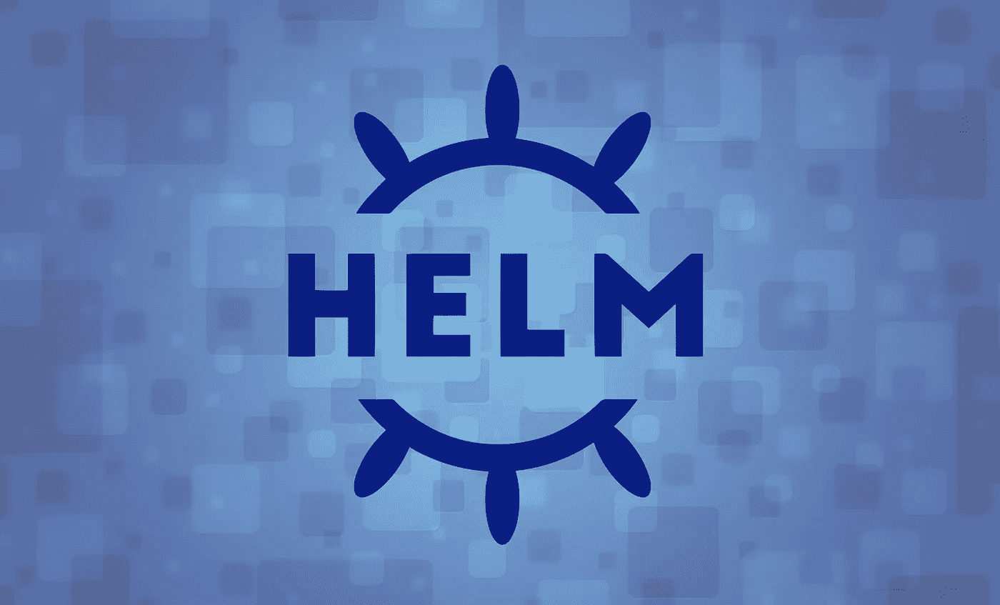
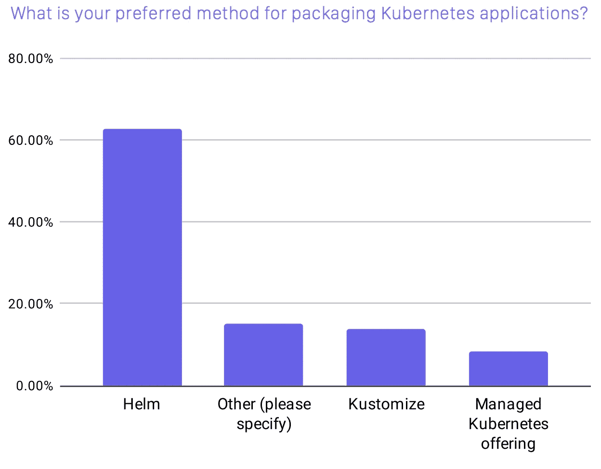
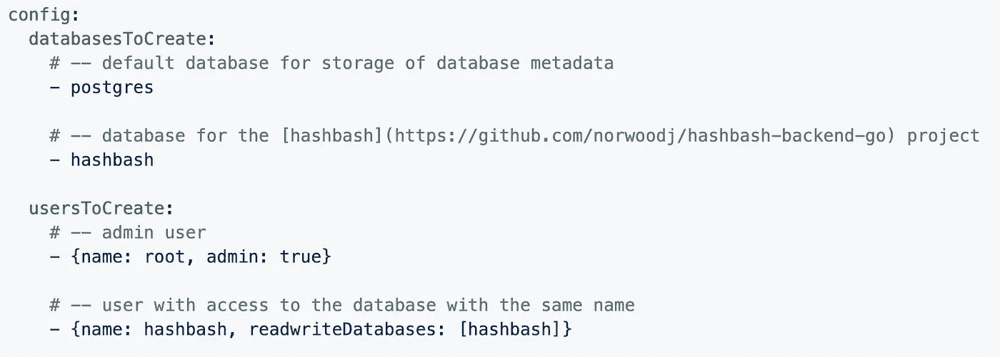
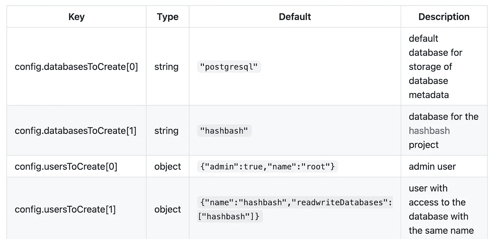

# 面向开发者的 101 号头盔

> 原文：<https://levelup.gitconnected.com/helm-101-for-developers-1c28e734937e>

非 Kubernetes 专家如何使用、创建和发布舵图



随着 Kubernetes 继续蚕食容器编排领域，开发人员不可避免地被迫与 Kubernetes 进行本地开发或代码交付。即使在拥有专门的平台团队或 DevOps 工程师的组织中，开发人员仍然需要在一定程度上与 Docker 和 Kubernetes 合作，以帮助将他们的功能和应用程序推广到生产中。对于大多数组织来说，这种互动是通过 [*掌舵*](https://helm.sh/) 促成的。

Helm 是 Kubernetes 应用程序的包管理器，提供了将 Kubernetes 清单模板化和分组为版本化包的机制。自从加入[云本地计算基金会](https://www.cncf.io/) (CNCF)后，Helm 成为首选的软件包经理，超过 60%的 CNCF 调查受访者更喜欢 Helm 而不是替代解决方案。作为其受欢迎程度的证明，Helm 拥有大量开源图表，可以在一个命令中轻松部署有用的应用程序，如 [PostgreSQL](https://github.com/bitnami/charts/tree/master/bitnami/postgresql) 、 [Redis](https://github.com/bitnami/charts/tree/master/bitnami/redis) 、 [Nginx](https://github.com/kubernetes/ingress-nginx) 和 [Prometheus](https://github.com/prometheus-community/helm-charts) 。



图片来源:[2020 年 CNCF 调查](https://www.cncf.io/wp-content/uploads/2020/11/CNCF_Survey_Report_2020.pdf)

因此，对于在 DevOps 或 Kubernetes 方面经验不多的开发人员来说，我们如何适应使用 Helm 呢？在本帖中，我们将分解理解舵结构的关键概念和最佳实践，以轻松驾驭舵世界。

# 关键概念

Helm 将应用程序打包成**图表**，这是一个 YAML 和助手模板的集合，按照以下方式组织:

```
my-chart/
├── .helmignore      # Contains patterns to ignore 
├── Chart.yaml       # Information about your chart
├── values.yaml      # The default values for your templates
├── charts/          # Charts that this chart depends on
└── templates/       # The template files
    └── tests/       # The test files
    ...
```

让我们来分解每个文件:

*   **。helmignore** :类似`.gitignore`，包含打包舵图时要忽略的模式(如`.vscode/`、`.git`等)。
*   **Chart.yaml** :与 Node 中的`package.json`类似，包含关于图表的元数据(如版本、作者等)，如果该图表打包了多个图表(如部署我的应用程序+ MySQL)，还包含依赖关系。
*   **values.yaml** :图表所有模板化部分的默认值。这些值可以通过`--values`或`--set`标志覆盖。
*   **图表:**保存相关图表，如果在`Chart.yaml`中指定
*   **模板**:包含所有定义应用程序行为的 Kubernetes 清单(如部署、服务、自动缩放、配置映射等)以及其他模板助手、注释和测试文件。

在很大程度上，要使用公共图表，开发人员需要熟悉`values.yaml`上的 YAML 语法。常见任务可能包括更新 Docker 图像标签、设置新的环境变量或添加图表预期的秘密值:

```
$ helm upgrade --install demo-app --set image.tag=v1.2.0 
```

每个`install`或`upgrade`命令触发一个舵**发布，**是一个版本化、模板化图表的部署。由于每个图表都是独立的，因此在一个名称空间或一个集群中可能会有同一个图表的多个版本。

最后，舵图被打包成 tar 文件并存储在**库**中，类似于 Docker 注册表。一些库管理器如 Artifactory 可以自动索引掌舵图，或者开发者可以使用 [ChartMuseum](https://chartmuseum.com/) 在 S3、谷歌云存储或 Azure Blob 存储上提供公共或私人掌舵图。

# 赫尔姆最佳实践

现在我们对什么是舵有了一个基本的了解，我们将回顾一些最佳实践和有用的提示，开始创建和部署我们的第一个舵图。

## 使用头盔创建

通常，当我和一个不熟悉 Kubernetes 的开发人员一起工作时，他们的第一反应是从 Kubernetes 文档中复制一些清单，然后从头开始手工制作他们的头盔图。虽然这是快速部署单个 Kubernetes 清单(如`pod.yaml`或`deployment.yaml`)的好方法，但这种方法容易出错且很麻烦。

相反，利用内置的 Helm 命令来引导您的图表:

```
$ helm create <my-chart>
```

这将提供所有常见的 Kubernetes 清单(`deployment.yaml`、`hpa.yaml`、`ingress.yaml`、`service.yaml`和`serviceaccount.yaml`)以及助手模板，以规避资源命名约束和标签/注释。默认情况下，这将为`nginx`提供可伸缩的部署。只需编辑`values.yaml`文件来部署您的 docker 映像。

## 线头，模板，模拟运行

在幕后，Helm 使用 go 模板语言来生成 Kubernetes 清单。习惯这种语法需要一段时间，但在大多数情况下，Helm 问题是由缩进、空值或错误的 YAML 类型(例如，maps vs array)引起的。为了更早地捕捉这些错误，Helm 提供了一些有用的命令:

1.  `helm lint <my-chart>`:检查图表中可能存在的问题，包括 YAML 问题(如缩进)或舵模板问题(如缺少图表版本)。您可以运行这个带有`--debug`标志的命令来获得更多信息。不幸的是，stacktrace 中的行号经常会产生误导，因此通常需要进一步的调查。
2.  `helm template <my-chart>`:使用`values.yaml`在本地渲染模板。要覆盖任何值，使用`--set`标志或通过`--values`或`-f`标志提供另一个包含自定义值的 YAML 文件。要关注单个模板(例如，只想呈现`deployment.yaml`，使用`-s`标志，如果图表随着大量模板而变大，这将很有帮助:`helm template my-chart -s templates/deployment.yaml`
3.  `--dry-run`:由于`lint`和`template`命令只捕捉模板问题，一些错误没有被捕捉到，直到 Kubernetes API 被调用。在执行`upgrade`或`install`命令之前，使用`--dry-run`标志运行以检查其他错误(例如，弃用的 Kubernetes API 版本)

有关 go 模板和舵功能的更多信息，请查看“海图模板指南”下的舵文档:

[](https://helm.sh/docs/chart_template_guide/functions_and_pipelines/) [## 模板函数和管道

### 到目前为止，我们已经看到了如何将信息放置到模板中。但是这些信息被放入模板中…

helm.sh](https://helm.sh/docs/chart_template_guide/functions_and_pipelines/) 

## 浏览公共图表

也许 Helm 最大的卖点是它庞大的社区。当你陷入困境时，花些时间去探索一些公共图表，以获得灵感或常见任务的简洁解决方案(例如，如何处理 AWS SSL 入口重定向、定义存储类、挂钩)。

要搜索图表，你可以直接谷歌或者使用内置的`helm search`命令:

```
$ helm search hub redis
```

要从存储库中下载图表，首先将其添加到本地设置中:

```
$ helm repo add bitnami https://charts.bitnami.com/bitnami
```

由于舵图只是简单的 tar 文件，您也可以在本地下载并检查它:

```
$ helm pull bitnami/nginx-ingress-controller --version 5.3.19
```

如果您想检查已经部署的舵图，您也可以使用:

```
$ helm get all RELEASE_NAME
```

这将打印出与部署打包在一起的所有 Kubernetes 清单、注释和用户提供的值。

## 带有子图表的包装

虽然每个舵图表都是独立的(即可以单独部署)，但有时将图表组合在一个部署中是有意义的。例如，Django 应用程序可能与 PostgreSQL 和 Redis 打包在一起。要定义这些依赖关系，请在`Chart.yaml`中列出它们:

```
apiVersion: v2
name: django-app
description: A Helm chart for my django-app...dependencies:
 - name: postgresql
   version: "10.3.18"
   repository: "[@bitnami](http://twitter.com/bitnami)"
 - name: redis
   version: "14.6.5"
   repository: "[@bitnami](http://twitter.com/bitnami)"
   condition: global.redis.enabled
```

通过`values.yaml`可以有条件地禁用/启用相关图表。在上面的例子中，可以通过将`global.redis.enabled`设置为`false`来禁用 Redis。定义完依赖项后，要下载这些图表，运行`helm dep up <my-chart>`来生成`Chart.lock`文件以及 tar 文件。或者，我们可以直接将图表放在`charts/`目录下，省略`Chart.yaml`中的`version`和`repository`字段，使用本地图表。

```
django-app/
├── Chart.yaml    
├── values.yaml 
├── templates/
└── charts/
    └── postgres/ 
    └── redis/
```

## 了解舵的极限

尽管 Helm 很有用，但它是一个**包管理器**，而不是一个完整的**持续部署(CD)** 工具。换句话说，对于 Kubernetes 应用程序的 CI/CD 策略，您不应该只依赖 Helm，而是应该将其与其他工具(例如 ArgoCD、Spinnaker 等)集成。也就是说，有一些方法可以最大限度地发挥 Helm 的优势:

*   通过分别使用`helm upgrade --install`命令而不是`install`和`upgrade`命令来保持部署幂等。
*   如果部署失败，使用`--atomic`标志自动回滚。
*   [当配置图或密码改变时自动滚动部署](https://helm.sh/docs/howto/charts_tips_and_tricks/#automatically-roll-deployments):

```
**kind**: Deployment
**spec**:
  **template**:
    **metadata**:
      **annotations**:
        **checksum/config**: {{ include (print $.Template.BasePath "/configmap.yaml") . | sha256sum }}
[...]
```

*   使用 Helm 注释保留资源(对不删除机密或名称空间最有用):

```
**kind:** Secret
**metadata:**
  **annotations:**
    **"helm.sh/resource-policy"**: keep
[...]
```

*   使用[头盔挂钩](https://helm.sh/docs/topics/charts_hooks/#helm)在安装、升级、回滚或删除之前或之后触发作业

```
**apiVersion**: batch/v1
**kind**: Job
**metadata**:
  **annotations**:
    *# This is what defines this resource as a hook. Without this line, the*
    *# job is considered part of the release.*
    **"helm.sh/hook":** post-install
    **"helm.sh/hook-weight":** "-5"
    **"helm.sh/hook-delete-policy":** hook-succeeded
```

*   由于 Helm 使用明文 YAML，通常机密在外部处理(例如 Kubernetes 机密、Vault、external-secrets、AWS 机密管理器)。但是组织可以将加密的秘密签入版本控制，查看[头盔秘密](https://github.com/jkroepke/helm-secrets)(使用 SOPS 或 KMS)。

## 生成文档

和任何软件一样，文档是可用性的关键。在舵图中，有三个选项可以添加此信息:

*   **行内注释**:因为所有的清单和值文件都是用 YAML 语言编写的，所以可以用`#`添加行内注释
*   **NOTES.txt** :这是一个特殊的文件，一旦图表被部署，就会在控制台中打印出来。它通常包含与部署交互的信息，如服务/入口信息或如何提取密码(如果密码是自动生成的)。内容也可以用 Helm 函数模板化。
*   **自述:**大多数公共舵图表都包含一个描述`values.yaml`中默认值的部分。它通常列出一个包含变量的键、类型、默认值和描述的表。要在 markdown 中轻松生成此表，您可以使用名为 [helm-docs](https://github.com/norwoodj/helm-docs) 的工具。它检查来自`values.yaml`的行内注释并输出一个表格。



示例值. yaml



helm-docs 的输出示例

## 阅读文件

最后，阅读 Helm 的[官方文档，了解更多最佳实践和常见问题解答](https://helm.sh/docs/chart_best_practices/conventions/)，为 Kubernetes 应用创建和管理生产就绪的 Helm 图表。Kubernetes 是一个复杂的工具，具有陡峭的学习曲线，但 Helm 可以承担一些操作负担，使过程变得稍微容易一些，即使对于那些害怕任何操作工作的开发人员来说。