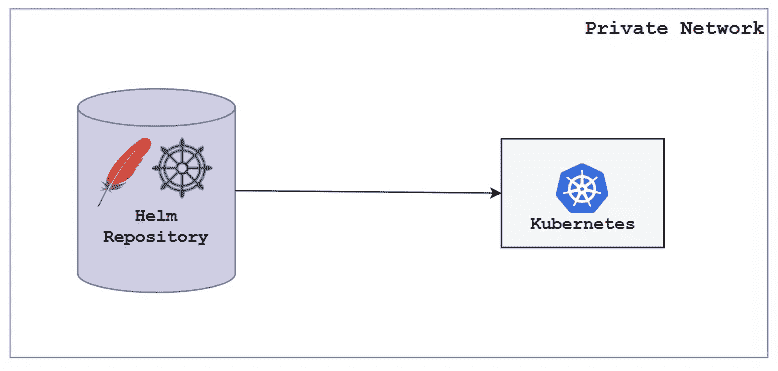

# Helm —使用 Apache Webserver 创建私有存储库

> 原文：<https://levelup.gitconnected.com/helm-create-a-private-repository-using-apache-webserver-e80e5dd7569e>

## 从私人存储库分发舵图


由 [Unsplash](https://unsplash.com?utm_source=medium&utm_medium=referral) 上的 [Venti Views](https://unsplash.com/@ventiviews?utm_source=medium&utm_medium=referral) 拍摄的照片

假设，我们有一个场景，我们想在内部或组织内分发我们的掌舵图。实现这一点的方法之一是使用 **Apache 服务器**创建一个私有存储库，该服务器将作为一个 helm 存储库。



## 1.Apache 服务器配置

**●安装 Apache 服务器:**

```
**Repo-$** yum update **Repo-$** yum install httpd
```

**●配置基本认证:**

```
**Repo-$** vim /etc/httpd/conf/httpd.conf**# Add the below lines at the end**

<Directory "/var/www/html">
      AuthType Basic
      AuthName "Restricted Content"
      AuthUserFile /etc/httpd/.htpasswd
      Require valid-user
</Directory>
```

**●启动并启用 Apache 服务器:**

```
**Repo-$** systemctl start httpd
**Repo-$** systemctl enable httpd
**Repo-$** systemctl status httpd
```

## **2。创建一个舵库**

在“/var/www/html”目录下创建一个目录。新创建的目录将作为存储库。

```
**Repo-$** mkdir /var/www/html/charts
```

图表存储库应该有一个 **index.yaml** 文件。索引文件将包含存储库下的图表列表。每当我们在存储库下添加一个新图表时，我们都必须更新 **index.yaml** 文件。使用下面的命令，我们可以生成一个 **index.yam** l 文件。

```
**Repo-$** helm repo index /var/www/html/charts/
```

由于存储库目前是空的，这就是为什么 **index.yaml** 文件看起来像这样:

```
**# index.yaml**apiVersion: v1
entries: {}
generated: "2022-11-02T05:28:16.054800151Z"
```

另一件需要记住的重要事情是，我们必须将舵图以打包格式存储在存储库下。

假设，我们有一个名为“webserver”的舵图。为了使用存储库来分发它，我们必须将它打包并存储在存储库目录下。然后我们必须更新 **index.yaml** 文件。

```
**Repo-$** helm package ~/webserver/ -d /var/html/www/charts/# Update the index.yaml file:**Repo-$** helm repo index charts/
```

如果我们现在检查 **index.yaml** 文件，我们会看到 **index.yaml** 中填充了当前位于存储库目录下的图表信息。

```
**# index.yaml**apiVersion: v1
**entries:
  webserver:**
  - apiVersion: v2
    appVersion: 1.16.0
    created: "2022-11-02T05:36:05.101051659Z"
    description: A Helm chart for Kubernetes
    digest: d4c08bc9cb975e4dcc0a486e4faace801685071686daa4f6aff74408eb5d714e
 **name: webserver**
    type: application
    urls:
    - webserver-0.1.0.tgz
    version: 0.1.0
generated: "2022-11-02T05:36:05.09986321Z"
```

## 3.访问私有存储库

在上面的两个步骤中，我们配置了 apache 服务器和 helm 存储库。在这一步中，我们将尝试从同一网络中的其他机器或 kubernetes 集群访问这个存储库。

为了访问存储库，我们需要存储库服务器的 IP 地址和图表所在的目录名。以及我们在 apache 服务器配置期间配置的凭证。

让我们在所需的机器中添加私有 helm 存储库(helm 必须安装在机器上) :

```
**Server-1 $** helm repo add **customrepo** [http://172.31.3.183/charts/](http://172.31.3.183/charts/) --username admin --password Admin@123**Server-1 $** helm repo ls
--------------------------------------------------------------------NAME            URL                        
customrepo      [http://172.31.3.183/charts/](http://172.31.3.183/charts/)
```

搜索图表。尽管此时只有一个名为“webserver”的图表位于存储库之下。

```
**Server-1 $** helm search repo webserver
--------------------------------------------------------------------
NAME                    CHART VERSION   APP VERSION     DESCRIPTION                
**customrepo/webserver **   0.1.0           1.16.0          A Helm chart for Kubernetes
```

将图表从“custom repo”helm 存储库中安装到 k8s 集群中。

```
**Server-1 $** helm install app websrever
--------------------------------------------------------------------
NAME: app
LAST DEPLOYED: Wed Nov  2 05:55:44 2022
NAMESPACE: default
STATUS: deployed
REVISION: 1
TEST SUITE: None
```

> ***注 1(用于回购):*** *每次我们在存储库目录下增加一个图表。我们必须更新****index . YAML****文件。*
> 
> ***注 2(回购用户):*** *从存储库中获取最新的可用图表。在从相应的存储库中搜索图表之前，我们需要更新存储库。*

> *如果您觉得这篇文章很有帮助，请点击* ***跟随*** *👉******拍拍*** *👏* *按钮帮助我写更多这样的文章。
> 谢谢🖤***

## **👉所有关于 Helm 的文章—**

**

[Md 沙米姆](https://medium.com/@shamimice03?source=post_page-----e80e5dd7569e--------------------------------)** 

## **HelmーSeries**

**[View list](https://medium.com/@shamimice03/list/helmseries-6e2076d48ba8?source=post_page-----e80e5dd7569e--------------------------------)****11 stories**************

## **👉所有关于 Kubernetes 的文章—**

**

[Md 沙米姆](https://medium.com/@shamimice03?source=post_page-----e80e5dd7569e--------------------------------)** 

## **关于 Kubernetes 的所有文章**

**[View list](https://medium.com/@shamimice03/list/all-articles-on-kubernetes-7ae1a0f96f3b?source=post_page-----e80e5dd7569e--------------------------------)****24 stories**************

# **分级编码**

**感谢您成为我们社区的一员！在你离开之前:**

*   **👏为故事鼓掌，跟着作者走👉**
*   **📰查看[升级编码出版物](https://levelup.gitconnected.com/?utm_source=pub&utm_medium=post)中的更多内容**
*   **🔔关注我们:[Twitter](https://twitter.com/gitconnected)|[LinkedIn](https://www.linkedin.com/company/gitconnected)|[时事通讯](https://newsletter.levelup.dev)**

**🚀👉 [**加入升级人才集体，找到一份惊艳的工作**](https://jobs.levelup.dev/talent/welcome?referral=true)**