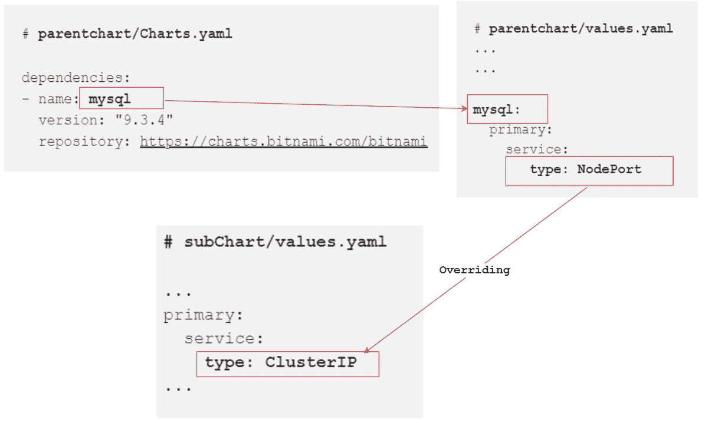

# Helm 父图表和子图表之间的数据共享

> 原文：<https://levelup.gitconnected.com/helm-data-sharing-between-parent-and-child-chart-c4487a452d4e>

## helm 中父子图表之间的数据交换


照片由[维达尔·诺德里-马西森](https://unsplash.com/ja/@vidarnm?utm_source=medium&utm_medium=referral)在 [Unsplash](https://unsplash.com?utm_source=medium&utm_medium=referral) 拍摄

**上一篇:**[**Helm—Dependencies**](/helm-dependencies-1907facbe410)

在 helm 中，我们可以在子图表和父图表之间交换数据。我们还可以操纵父图表中的子图表值。本文讨论了实现这一目标的各种方法。

## 覆盖父图表中的值

在 helm 中，子图表/子图表也被认为是“独立的”，这意味着子图表/子图表永远不能明确依赖于其父图表。因此，子图表不能访问其父图表的值。但是父图表可以覆盖子图表/子图表的值。

让我们看看如何覆盖子图表的一些配置。
假设我们在**‘parent chart/chart . YAML’**中定义了一个依赖项

```
# **parentchart/Charts.yaml**dependencies:
- name: **mysql**
  version: "9.3.4"
  repository: [https://charts.bitnami.com/bitnami](https://charts.bitnami.com/bitnami)
```

要将值覆盖或传递给定义为依赖关系的 MySQL 子图表，我们必须使用**' parent chart/values . YAML '**文件来定义我们想要传递给子图表的值。为了将值覆盖到 MySQL 图表中，我们必须找出允许我们覆盖的值的类型。

```
 **helm show values [CHART]**
**>>** helm show values **bitnami/mysql**---**# subChart/values.yaml**...
primary: 
  service:   
    **type: ClusterIP** 
...
```

在上面的演示中，我们可以看到默认情况下 **MySQL** chart 会在安装后配置一个 **ClusterIP** 类型的服务。

但是如果我们想覆盖上面的配置，我们可以在**‘parent chart/values . file’**中设置值

定义我们想要在子图表中覆盖的值(MySQL):

```
# **parentchart/values.yaml
...
...****mysql:**
  primary:
    service: 
      ** type: NodePort**
```

为了更好地理解，请参见下图:



现在，如果我们安装了 **parentChart** ，那么作为依赖关系 **MySQL** chart 将安装一个 **NodePort** 类型的服务。

## 使子图表数据可用于父图表

有两种方法可以使子图表/子图表值在父图表上可用。

**●使用导出和导入-值:** 如果子图表的`**values.yaml**`文件包含一个`**exports**`字段，那么可以通过指定“**parent chart/
chart . YAML”**的“ **dependencies** ”块下的`**import-values**`字段，将其内容直接导入父图表的值中

```
**# subChart/values.yaml**...
**exports:**
  data:
    db_info:
       username: admin
       dbname: userinfo
```

然后通过定义'**parent chart/chart . YAML '**'的' **dependencies** '块下的`**import-values**`字段，从子图表中导入值

```
**# parentChart/Chart.yaml**dependencies:
- name: mysql
  version: "9.3.4"
  repository: [https://charts.bitnami.com/bitnami](https://charts.bitnami.com/bitnami)
  **import-values:
    - data**
```

现在，上面定义的子图表数据可以被父图表使用:

```
**# parentChart/templates/configMaps.yaml**apiVersion: v1
data:
**{{- toYaml .Values.db_info | nindent 2 }}**
kind: ConfigMap
metadata:
  creationTimestamp: null
  name: test
```

如果我们生成父图表的模板，我们将得到如下输出:

```
>> helm template webserver ~/webserver---
apiVersion: v1
**data:
  dbname: userinfo
  username: admin**
kind: ConfigMap
metadata:
  creationTimestamp: null
  name: test
```

以下是子图表到父图表之间的数据共享的可视化。


**●使用“导入-值”字段下的子和父映射:**

```
**# parentChart/Chart.yaml**dependencies:
- name: mysql
  version: "9.3.4"
  repository: [https://charts.bitnami.com/bitnami](https://charts.bitnami.com/bitnami)
  **import-values:
    - child:** < import-source > **parent:** < export-destination > **- child:** < import-source > **parent:** < export-destination >

      ...
```

要访问不在子图表值的`**exports**` 键下的值，我们仍然可以通过在`**child**` 字段中指定要导入的值的源键并在`**parent**`字段中指定目标路径来访问子图表数据。

假设子图表在其 values.yaml 文件中包含以下条目:

```
**# subChart/values.yaml**...config:
  data:
     db_info:
       username: admin
       dbname: userinfo
```

正如我们看到的，没有指定`exports`关键字。要从父图表中访问上述定义的数据，我们可以按以下方式配置依赖关系块:

```
**# subChart/values.yaml**dependencies:
- name: mysql
  version: "9.3.4"
  repository: [https://charts.bitnami.com/bitnami](https://charts.bitnami.com/bitnami)
  **import-values:
    - child: config.data.db_info
      parent: configmaps**
```

现在我们可以从父图表中访问子图表数据，尽管子数据没有在`**exports**`关键字下指定。

```
**# parentChart/templates/configMaps.yaml**apiVersion: v1
data:
**{{- toYaml .Values.configmaps | nindent 2 }}**
kind: ConfigMap
metadata:
  creationTimestamp: null
  name: test
```

在这两种情况下，父图表总是假设它正在访问的数据驻留在它自己的 **values.yaml** 文件中(尽管它实际上来自于**子图表的 values.yaml** 文件)

## 全局图表值

全局值是可以通过完全相同的名称从任何图表或子图表中访问的值。全局变量需要使用`**global**`关键字进行显式声明。

假设在父级的 **values.yaml** 文件中定义了一个全局值:

```
**# parentChart/values.yaml**global:
  env: prod
```

现在，可以跨任何图表和子图表访问该值。

```
**# subChart/templates/configmaps.yaml**apiVersion: v1
data:
 **name: {{ .Values.global.env }}**
kind: ConfigMap
metadata:
  creationTimestamp: null
  name: test
```

## 与子图表共享模板

父图表和子图表可以共享模板。任何图表中定义的任何模板都可用于其他图表。

假设在**父图表**中定义了一个命名模板:

```
{{- define "**parentchart.labels"** -}}
app: {{ .Chart.Name }}
{{- end }}
```

任何子图表都可以使用上面定义的模板。可以使用`**include**`或`**template**` 关键字嵌入命名模板。

```
**# inside the sub-chart**{{- include "**parentchart.labels**" . | nindent 8 }}
```

要了解更多关于**命名模板的信息，**请阅读本文:— [**Helm —命名模板**。](/helm-named-templates-de2efc3875d0)

> *如果你觉得这篇文章很有帮助，请不要忘记***去点击* ***跟随*** *👉******拍拍*** *👏* *按钮帮助我写更多这样的文章。
> 谢谢🖤****

## ***👉*舵图上的所有文章—**

**

[Md 沙米姆](https://medium.com/@shamimice03?source=post_page-----c4487a452d4e--------------------------------)** 

## **HelmーSeries**

**[View list](https://medium.com/@shamimice03/list/helmseries-6e2076d48ba8?source=post_page-----c4487a452d4e--------------------------------)****11 stories**************