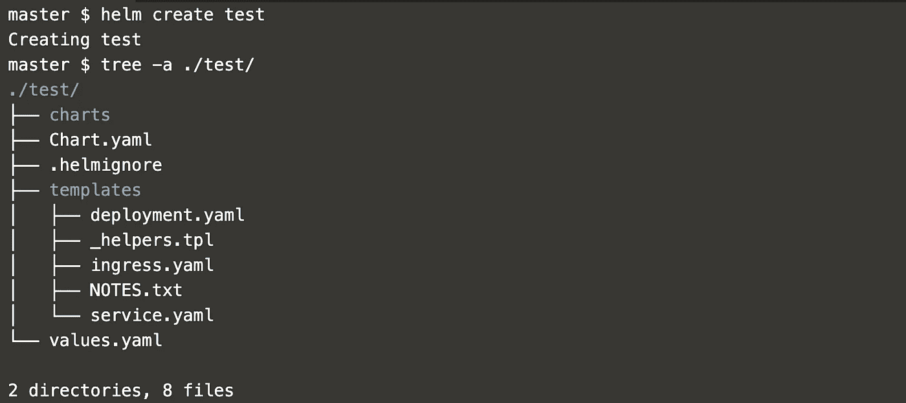
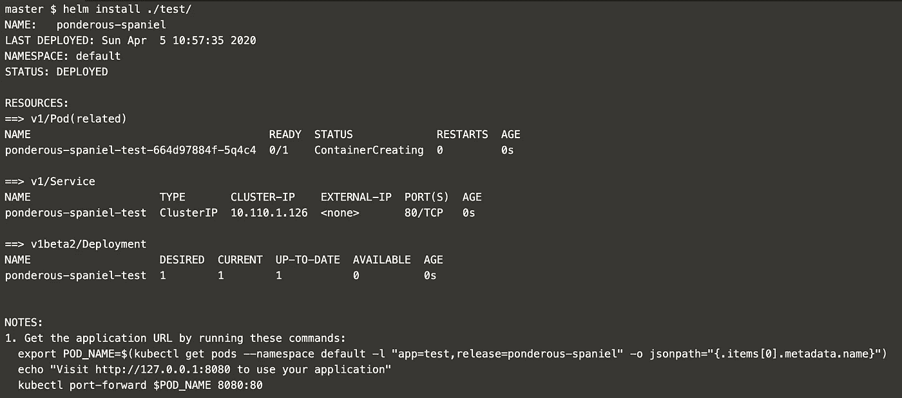

# 舵:深潜

> 原文：<https://levelup.gitconnected.com/helm-deep-dive-ecdde487ee70>


在我的上一篇[博客](https://medium.com/@vaibhavr847/an-arsenal-of-kubernetes-tools-f8e623d52d96)中，我谈到了我尝试过的各种工具，在列表的最开始，驻留了 Helm and Tiller。

# **概述**

Helm 是一个老项目，在 Kubernetes 之后不久开始，在第一届 Kubecon 上宣布。它是 Kubernetes 的软件包管理器，通过它你可以在你的 Kubernetes 集群中创建、搜索、安装、升级和删除**图表**。不仅限于这种用途，Helm 也作为一种协作工具在团队中使用。

那么我说的图表是什么意思呢？让我们从熟悉 Helm 的组件和术语开始

> **图表**

图表可以描述为 Kubernetes ready 应用程序或包，可以直接安装到集群中使用。它包含在 Kubernetes 集群中运行应用程序、工具或服务所需的所有资源定义。您可以在 [Helm Hub](https://hub.helm.sh/) 知识库中找到 1000 多张这样的图表，这些图表旨在解决和帮助社区范围的需求。

> **储存库**

存储库是存储、收集和共享图表的地方。

> **释放**

发布是 Kubernetes 集群中图表的运行实例。一个图表可以多次安装到同一个集群中，每次安装时都会创建一个新版本。

# 头盔设置是如何工作的？

Helm 由两个组件组成，一个是在用户端查看和管理软件包的命令行客户端，另一个是在集群上安装软件包的服务器 Tiller。

Helm 客户端允许开发人员创建新的图表，管理图表库，并与 tiller 服务器进行交互。

在服务器端，Tiller 服务器运行在 Kubernetes 集群内部。它与 Helm 客户端交互，并将图表定义和配置转换为 Kubernetes API 命令。Tiller 将图表和它的配置结合起来构建一个发布。Tiller 还负责升级图表，或者从 Kubernetes 集群中卸载和删除图表。

# **安装**

我们可以非常轻松地安装头盔，这都要归功于现成的[脚本](https://raw.githubusercontent.com/kubernetes/helm/master/scripts/get)，你可以直接卷曲并执行它，或者你可以下载你想要的[版本的二进制文件](https://github.com/helm/helm/releases)并存储在`/usr/local/bin/helm`中。对于更多平台的安装，检查[文档](https://helm.sh/docs/intro/install/)中的步骤。

执行这些步骤后，可以使用`helm version`命令验证安装。如果一切按计划进行，该命令将打印 helm 的客户端版本，但会提示服务器端安装出错或超时。这是因为我们的客户端舵已经就位，但我们还没有在服务器端初始化舵。为此，运行`helm init`。这将把 Tiller 安装到您正在运行的 Kubernetes 集群中，还将设置任何必要的本地配置。

成功执行后，您将得到以下消息

```
Tiller (the Helm server-side component) has been installed into your Kubernetes Cluster
```

`helm version`应返回客户端和服务器版本。

下一个可选但建议的步骤是使用`helm repo update`命令更新本地缓存，使最新的可用包与环境同步。

舵柄和舵杆装置可以使用了。快乐驾驶！

# **知道你的命令**

> **搜索图表** : `helm search <source> <chart>` | `helm search <chart>`

来源可以是`hub`，它将在舵毂上搜索图表，也可以是您添加的回购。

要添加一个 repo，使用命令`helm repo add <name> <repository-url>.` 现在您可以使用命令`helm search repo <chart>`搜索您的存储库。

> **检查图表** : `helm inspect <chart-name>`

检查图表会给出大量关于图表的细节，包括但不限于名称、来源、应用程序版本、api 版本、描述和值文件。我们将在这篇博客的后面了解更多关于价值文件的内容。

> **安装图表** : `helm install <release> <chart>`

此命令将使用指定的版本名称安装指定的图表。在执行 install 命令时，cli 上将显示以下信息。

*   **最后部署**:部署的日期和时间。
*   **名称空间**:在其中创建部署的名称空间。
*   **状态**:发布的当前状态。完成后，该值将为`DEPLOYED`。使用命令`helm status <release-name>`可以随时查看发布状态。
*   **资源**:作为图表的一部分创建的资源。
*   **注释**:图表作者提供的对用户使用图表有帮助的注释。我们将在本博客稍后创建自己的图表时更详细地讨论它。

如果使用 Helm 的更高版本，可以不指定发布名称，而是使用`generate-name`标志。在早期版本中，该标志默认设置为 true。

> **自定义安装图表**:

图表有一个[值文件](https://helm.sh/docs/chart_template_guide/values_files/)，其中包含可被覆盖的变量。可以使用`helm show values <chart>`查看这些值。

要提供包含变量新值的自定义文件，请按以下格式传递它`helm install -f <value-file> <release-name> <chart>`或`helm install --values <value-file> <release-name> <chart>`。

或者指定几个值，使用`set`标志作为`helm install --set <variable1>=<value1>,<variable2>=<value2> <chart>`。

注意，如果在同一个命令中使用了`set`和`values`标志，那么两个提供的值将被合并，如果有任何重叠，由`set`提供的值将优先于由`values`提供的值。

此外，`set`和`values`也可以与`helm upgrade`命令一起使用。

> **观察头盔装置** : `helm list`

要列出已安装的版本，使用`helm list`命令。此外，要查看现在卸载的版本，请使用`helm list --all`。这将显示如下详细信息

*   **名称**:发布名称。
*   **修订**:任何图表的首次安装都被视为首次修订。每次后续升级或更改都会创建一个新版本。如果安装失败，可以使用该整数值进行回滚。
*   **UPDATED** :发布上执行的最后一次更新的时间戳。
*   **状态**:发布的当前状态。
*   **图表**:作为发布的一部分安装的图表。

> **升级图表** : `helm upgrade <release> <chart> <flags>`

升级命令用于使用新值或新图表升级现有版本。如图表主题自定义安装所示，使用`values`、`f`或`set`提供新值，同时像`helm install -f <new-value-file> <release> <chart>`一样升级。升级时，先前版本的状态变为`SUPERSEDED`。

> **回滚升级** : `helm rollback <release> <revision>`

`rollback`该命令用于在出现故障时回滚任何版本。请注意，任何回滚都将在历史中创建一个新的修订版本，类似于升级的情况，将先前修订版本的状态更改为`SUPERSEDED`。

> **查看修订历史** : `helm history <release>`

要查看图表、状态和版本各种修订的更新时间戳，可使用`history`命令。

> **卸载图表** : `helm uninstall <release>`

要清除任何释放，可以使用`uninstall`命令。在 Helm 的以前版本中，当一个版本被卸载时，它的删除记录将会保留。在更高版本中，删除也会删除发布记录。如果你想保留一个删除释放记录，使用`--keep-history`标志和`uninstall`命令。

创建图表本身就是一个很大的主题，因此应该有一个单独的部分，所以继续创建你自己的图表吧。

# **创建图表**

要开始创建自己的舵图，从`helm create <chart-name>` 命令开始。这将在一个名为指定图表名的文件夹中创建以下目录结构。



让我们首先了解所有这些文件和目录意味着什么

*   **图表**:包含该图表将要使用和依赖的图表。
*   **Chart.yaml** :包含图表的元数据，如图表名称、版本、作者/维护者等。
*   **。helmignore** :包含文件或文件模式，完成后打包舵图时将忽略这些文件或文件模式。
*   **模板**:包含安装图表时应该创建的资源模板。
*   **values.yaml** :如本博客前面所讨论的，这个文件用于存储变量的默认值。在安装或升级版本时，可以覆盖这些变量。

在这个阶段，可以使用命令`helm install ./<chart-name>/`安装软件包。并将给出类似于以下内容的输出



因为我们没有给我们的释放命名，它被命名为笨重的猎犬。对你来说会不一样。我喜欢这些有创意的名字，所以我会让它保持这样，不过你可以随时给一个发布名称。

在名称之后，我们可以看到部署的时间戳、名称空间和状态。

接下来是资源，包括部署、服务和作为部署的一部分而创建的 pod。部署和服务是使用`<chart-name>/template/`文件夹下的模板文件创建的。如果你查看这些部署文件，你会看到这些是在`values.yaml` 文件和`Chart.yaml`中定义的选择变量。另外，你一定注意到了模板文件夹中的一个`ingress.yaml`文件没有被部署。这也是由于存在于`values.yaml`文件中的值。

`templates/ingress.yaml`从以下 if 条件开始

```
{{- if .Values.ingress.enabled -}}
```

该条件规定，如果值文件中入口部分的 enabled 标记为真，则该条件将保持为真。

在我们的`values.yaml`中，默认值设置为

```
ingress: enabled: false
```

因此，`template/ingress.yaml`的内容没有被部署。

类似地，在`template/deployment.yaml`文件中，我们在 spec 部分看到以下内容

```
spec: containers: - name: {{ .Chart.Name }} image: “{{ .Values.image.repository }}:{{ .Values.image.tag }}”
```

这里，pod 的名称将取自`Chart.yaml`中定义的名称标签，图像将取自存储库，标签来自`values.yaml`文件的图像部分。

我希望这澄清了如何使用`values.yaml`和`Chart.yaml`文件从`template`目录中定制和选择要部署的模板。

除了从这些文件中提取值之外，它们还可以用于使用不同的模板函数、管道和流程控制来操作和格式化模板，如[图表模板开发人员指南](https://helm.sh/docs/chart_template_guide/)中所示。

回到我们从安装图表中得到的输出，我们还在底部看到了一些`NOTES`。这些是使用`templates/NOTES.txt` 文件生成的。这些用于提供对安装该图表的用户有帮助的任何补充数据。

> **提示**:要完全忽略任何模板文件的打包，可以将该文件添加到`.helmignore`文件中

是的，这是一个非常基本的图表，并不能解决太多的问题，但是它可以帮助读者理解图表是如何打包并安装到集群中的。要根据您的需求添加更多的资源，您可以在`templates`文件夹中添加更多的模板文件，它们将随着图表的安装而部署。

# **创建自己的图表时的一些有用的提示和技巧**

> **林挺**

使用`helm lint ./<chart-name>`命令查看你的图表是否格式良好。它不仅可以帮助您找到致命错误，还可以帮助您找到最佳实践建议。

> **空转**

使用像`helm install ./<chart-name> --dry-run`一样的`dry-run`标记来检查您的图表在安装时是否会出错。它不会安装图表资源，所以没有必要在失败时清理残余。

> **调试**

使用 debug 标志作为`helm install ./<chart-name> --debug`来获得安装的更深入的视图。这将向您显示以下详细信息

*   **服务器:“127 . 0 . 0 . 1:39348”**:这表示 Helm 客户端创建了一个到 Tiller 的连接来安装图表。请注意，每个系统的端口可能不同。
*   **图表路径**:图表在本地系统上放置的路径。
*   **名称**:发布的名称。
*   **修订版**:如前所示，理想情况下，在我们第一次安装时，它将为 1，并随着随后的每次升级或回滚而递增。
*   **RELEASED** :图表打包的时间戳。可以使用`helm package <chart-name>`命令创建一个包，将图表目录转换为图表档案。
*   **图表**:图表的名称和版本。
*   **用户提供值**:安装时使用`values`或`set`标志提供的值。如果没有提供值，它将显示`{}`。
*   **计算值**:在`values.yaml`文件中提供的值。
*   **钩子**:钩子用于介入一个版本生命周期的特定点，包括安装、删除、升级或回滚之前和之后。创建模板时，如果在`metadata`中提供了带有关键字`”helm.sh/hook”`和有效值的注释标签，那么在该模板中定义的资源将被视为一个钩子。它们的用途之一是执行运行状况检查，以验证 pod 资源已启动并正在运行，例如，对作为图表的一部分创建的服务器进行 TCP 调用，以查看它们在安装后是否按照预期进行响应。
*   **清单**:用渲染值替换模板函数、流控制和管道后的模板文件，从而创建最终的可部署模板文件。安装完成后，可以随时使用`helm get manifest <release-name>`查看清单文件。

# **舵 2 对舵 3**

正如本博客的架构部分所述，Helm 由两个组件组成，一个是在用户端查看和管理包的命令行客户端，另一个是名为 Tiller 的服务器。在 Helm 2 发布之前，您的集群中有一个持续运行的 Tiller 服务器。为了能够创建和删除资源，Tiller 拥有管理员权限，这是一个安全问题，因为这种许可性配置可能会授予用户广泛的权限，而他们并不打算拥有这些权限。

因此，当 Helm 开发团队观察社区成员如何在特定场景中使用 Helm 时，他们发现 Tiller 的发布管理系统不需要依赖集群内的操作员来维护状态或充当 Helm 发布信息的中心枢纽，并且考虑到自定义的资源定义，Tiller 已经不再需要它了。因此，Helm 3 进行了重新架构，删除了 Tiller，并将许多这种逻辑转移到更现代的 Kubernetes 技术中，如操作符和客户端模板，该模板现在从 Kubernetes API 服务器获取信息，在客户端呈现图表，并在 Kubernetes 中存储安装记录。

如果您正在使用 Helm 2，并希望转移到 Helm 3 支持的所有现代安全、身份和授权功能，Helm 为您创建了一个[文档](https://helm.sh/blog/migrate-from-helm-v2-to-helm-v3/)以跟上步伐。