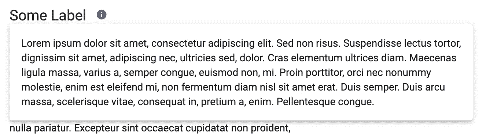
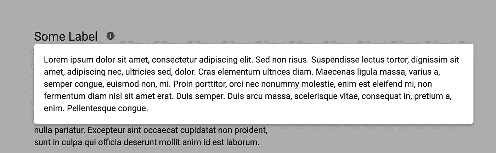

# 帮助弹出有角度的材料 CDK 覆盖

> 原文：<https://levelup.gitconnected.com/help-popup-with-angular-material-cdk-overlay-babc2ab127a>


像 Material Design 这样的设计语言为开发人员提供了构建模块，帮助我们创建好看且直观的设计。您可以找到任何类型的组件，从简单的按钮和卡片到日期选择器和复杂的数据表。它涵盖了一个开发人员的大部分需求，但是我最近面对一个 UX 需求，我找不到任何合适的组件，即使有一点定制。

当用户点击“信息”图标时，我想在卡片上显示一些额外的信息:



如果用户在其外部单击，该面板应该关闭，并保持相对于其标签的位置，即使用户向下滚动。我们还希望能够在弹出窗口中嵌入组件，而不仅仅是显示文本。一个解决方案可以使用 CDK 的`overlay`包来构建。

如果你只需要最终的解决方案，你可以检查这个[回购](https://github.com/Dornhoth/info-popup.git)。在本文中，我们将深入探讨实现的要点。

# 设置

如果您已经在项目中使用了角度材质，则可以跳过这一部分。如果没有，您有两个选择:

*   仅安装和设置角形材料 CDK
*   安装和设置角形材料(推荐我们的例子)

## 安装和设置角材料 CDK

使用`overlay`包不必安装完整的 Angular Material 包。然而，对于这个例子的信息弹出窗口，我们需要来自角状材料的`MatIcon`和`MatCard`组件。但是从技术上讲，您可以用另一个图标和自制的卡分别替换这些组件，这样您就可以自行安装 CDK 了:

```
npm i @angular/cdk --save
```

并在全局样式中导入以下代码行:

```
@import '~@angular/cdk/overlay-prebuilt.css';
```

## 安装和设置角形材料

因为我们将在示例中使用`MatCard`和`MatIcon`，如果你想跟着编码，这是推荐的选项。您可以在这里找到完整的指南[，但是要快速设置，只需运行:](https://material.angular.io/guide/getting-started)

```
ng add @angular/material
```

并确保`BrowserAnimationsModule`被导入到您的`app.module.ts`中。

*注意:如前所述，我们将需要* `*MatCardModule*` *和* `*MatIconModule*` *。由于你在你的* `*app.module.ts*` *中，你现在已经可以导入它们了。*

# 指示的

我们首先创建一个指令:

我们希望能够轻松地将此弹出窗口添加到任何标签/按钮组合中。这里有不同的策略使其可重用和可配置。我们可以在标签上使用一个结构指令来自动添加图标，但是这将使得按钮的选择及其位置更难配置。我们决定手动添加按钮，并在按钮上设置弹出窗口的行为。

`app-info-button`组件是一个简单的图标按钮:

它是有样式的，单击时会发出一个事件，但不会影响弹出窗口的行为。

我们在标签旁边添加了一个按钮，并附上了一个指令`appInfoPopup`。该指令将一个模板作为输入，该模板包含我们想要在弹出卡中显示的信息。该指令还带有一个额外的参数，`label`，这是弹出窗口将实际附加到的元素。在本文开头的例子中，您可以看到弹出窗口是相对于“某个标签”定位的，而不是图标。

我们的弹出窗口是完全可配置的:我们可以选择它链接到什么元素，完全自由地显示什么，并可以决定哪个按钮打开/关闭它。

# 覆盖物

我们现在必须将逻辑添加到我们的指令中。该指令首先必须用`overlay.create()`函数创建覆盖元素。这个函数返回一个`OverlayRef`实例，我们将能够*附加*和*分离*。

我们可以将一些选项传递给`create`函数。您可以在 [API 文档](https://material.angular.io/cdk/overlay/api#OverlayConfig)中找到选项的完整列表，但是对于我们的用例，我们将只使用其中的几个。

我们可以定义覆盖行为的两个重要部分:它是如何定位的，以及当用户滚动页面时会发生什么。

## 位置策略

有两种方法定位您的覆盖:它们可以在视窗中全局定位，或者它们可以连接到一个元素。我们希望使用第二种策略:我们的弹出窗口应该相对于`label`元素定位。

```
const positionStrategy = this.overlay
  .position()
  .flexibleConnectedTo(this.label);
```

我们仍然可以指定我们想要的确切位置:顶部、左侧、右侧…但是可能并不总是有足够的位置来像我们指定的那样放置弹出窗口，这就是为什么我们可以传递一个首选位置的*列表*，从最首选位置到最不首选位置:

```
const positionStrategy = this.overlay
  .position()
  .flexibleConnectedTo(this.label)
  .withPositions([
     new ConnectionPositionPair(
       { originX: 'start', originY: 'bottom' },
       { overlayX: 'start', overlayY: 'top' },
     ),
     new ConnectionPositionPair(
       { originX: 'start', originY: 'top' },
       { overlayX: 'start', overlayY: 'bottom' },
     ),
  ])
  .withPush(false);
```

`ConnectionPositionPair`的语法可能看起来有点复杂，但是让我们来解密第一个:它告诉覆盖图的哪个点和`origin`的哪个点，也就是`label`，应该是公共的。线条`{ originX: 'start', originY: 'bottom' }`表示覆盖将相对于标签的左下角定位。使用`{ overlayX: 'start', overlayY: 'top' }`线，我们更具体地说，覆盖图的左上角应该与`origin`的参考点对齐。这种配置将导致文章开头的图像中的位置。如果标签下缺少位置，我们需要一个后备。这是第二个`ConnectionPositionPair`物体。如果必须使用这个，覆盖的左下角将与标签的左上角对齐。

您可能已经注意到了最后一个选项`withPush`。如果设置为`true`，这意味着如果没有合适的首选位置，CDK 可以强制推动屏幕上的覆盖。在我们的例子中，我们可以将其设置为`false`。

## 滚动策略

我们还可以定义覆盖如何与滚动交互。有四个选项:

*   `noop`:当用户滚动时什么都不会发生，覆盖图停留在原来的位置。我们不希望这样，因为标签的位置可能会受到滚动的影响，我们希望覆盖图跟随它。
*   `block`:完全阻止用户滚动。当您的覆盖图是屏幕中间的重要信息时，这很有用。
*   `close`:我们可以让覆盖图在用户滚动时自动关闭。
*   这是我们想要的行为。用户可以滚动，覆盖层将相对于标签重新定位。

```
const scrollStrategy = this.overlay.scrollStrategies.reposition();
```

## 叠加的创建

现在我们已经定义了位置和滚动策略，我们可以创建覆盖图:

```
this.overlayRef = this.overlay.create({
  positionStrategy,
  scrollStrategy,
  hasBackdrop: true,
  backdropClass: 'cdk-overlay-transparent-backdrop',
});
```

最后两个选项也很重要。当`hasBackdrop`为`true`时，覆盖图有一个背景元素，它是一个渲染在覆盖图下的元素，覆盖整个视口。我们以后会明白为什么我们需要它。最后一个选项告诉背景应该是透明的，因为默认情况下，背景是透明的灰色，使背景看起来是禁用的。



## 附着/分离覆盖

现在叠加已创建，但还看不到任何东西。我们希望当用户单击按钮时，显示一个弹出窗口，其中包含我们指定为指令参数的内容。在`afterViewInit`生命周期钩子中，我们听点击按钮

```
ngAfterViewInit(): void {          
  this.infoButton.infoButtonClicked
    .asObservable()
    .subscribe(() => {
       this.attachOverlay();
    });
 }private attachOverlay(): void {
  if (!this.overlayRef.hasAttached()) {
  const periodSelectorPortal = new TemplatePortal(
    this.appInfoPopup,
    this.vcr,
  );
  this.overlayRef.attach(periodSelectorPortal);
}
```

当用户点击按钮时，我们从信息模板创建一个门户，并将其附加到`overlayRef`。此时，弹出窗口可见。

最后，当用户点击它的外部时，我们必须让它消失。这就是我们需要背景的原因。我们可以直接听到背景点击并关闭覆盖:

```
this.overlayRef
  .backdropClick()
  .pipe(takeUntil(this.unsubscribe))
  .subscribe(() => {
    this.detachOverlay();
  });private detachOverlay(): void {
  if (this.overlayRef.hasAttached()) {
    this.overlayRef.detach();
  }
}
```

以下是完整的指令:

如前所述，你可以在[这个资源库](https://github.com/Dornhoth/info-popup)中找到完整的代码。我希望通过创建和显示弹出窗口的步骤让您更好地理解了 CDK 叠加包。请在此处或存储库中随意提问。