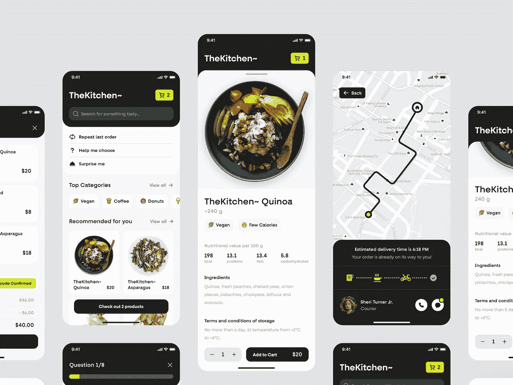
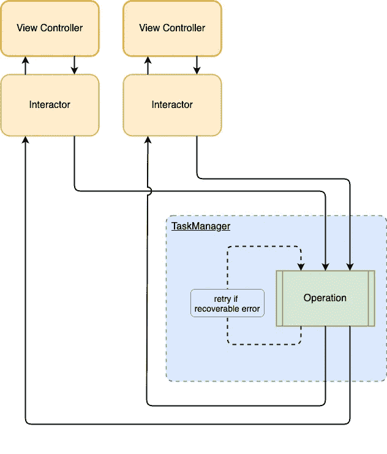
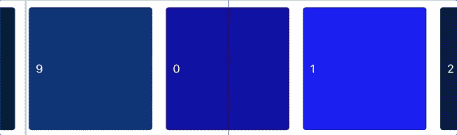
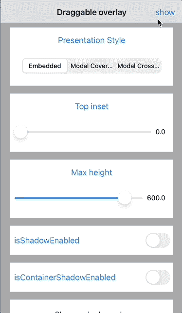
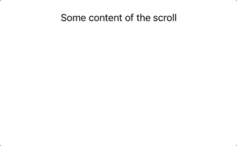
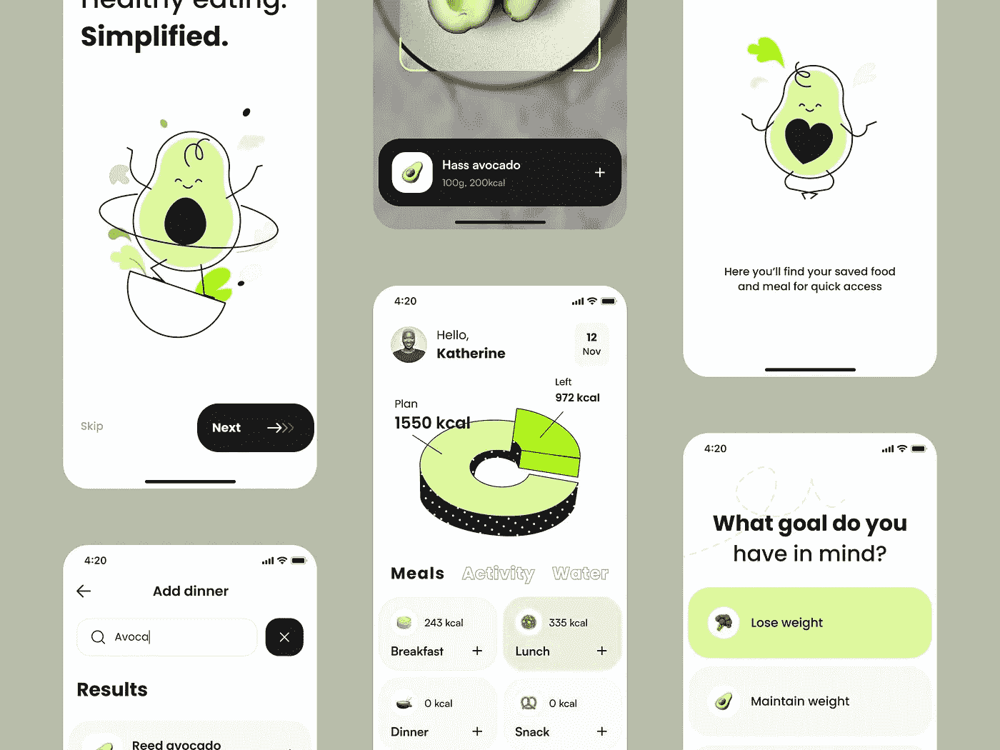

# 有助于推动 iOS 应用开发的 Swift 库

> 原文：<https://levelup.gitconnected.com/helpful-swift-libraries-to-boost-your-ios-app-development-4aa8208ed186>

*由弗拉德·奥尼普琴科&玛丽·摩尔从* [到*三郎*](https://shakuro.com/blog/helpful-swift-libraries-to-boost-your-ios-app-development)

沙克罗的概念

没有人喜欢做别人已经做过的工作，这是浪费时间。在软件和应用程序开发中，这意味着从头开始编写大量代码，而不是使用现成的解决方案和工具包。如果你熟悉这种痛苦，并且想改善你的团队的工作流程，那么这篇文章就是为你准备的。

在 iOS 应用程序开发期间，我们的程序员多次陷入“自己动手”的陷阱。我们每个人都不断创造自己的小解决方案，而不是借用完美的解决方案。一旦我们意识到这个决定是错误的，我们就开始应用现成的解决方案和重用工具包来处理 iOS。

在本文中，我们想与您分享由 Shakuro 开发人员制作的几个组件。它们在我们的项目中经过了时间的考验和证明。有了这些框架，您可以提高效率，提高代码质量，帮助新来的程序员融入这个过程，并为更紧迫的问题节省大量时间。

Conceptzilla 的送餐应用程序概念

# 访问和集成 CoreData 的工具

Swift CoreData 是一个面向对象的数据管理系统。这是一个用于访问数据库的苹果原生框架。这看起来简单，但是，往往会导致无数的问题。例如，很少使用这个框架的开发人员，要花很长很长的时间来使用它。此外，将 CoreData 集成到一个项目中是痛苦的:它有一个陡峭的学习曲线，并带来大量的错误。

为了简化这个过程，我们创建了一个包装器来消除所有的困难。你只需要将 [PoliteCoreData](https://github.com/shakurocom/PoliteCoreData) 连接到你的项目，输入两行代码，然后开始使用这个系统。这将减少可能的崩溃，关机等。PoliteCoreData 还支持增量迁移，解决不相邻版本之间的迁移问题(例如从版本 1 到版本 5)。

当然，也有第三方库提供类似的功能。比如一首流行的 [MagicalRecord](https://github.com/magicalpanda/MagicalRecord) 。然而，它有几个相当大的缺陷，并显示出在三郎的项目差的结果。这就是为什么我们的开发人员在开发 iOS 应用程序时更喜欢使用 PoliteCoreData。

# 库来管理异步代码

如果您的项目在业务逻辑上有永无止境的变化，那么您就会知道在其中实现任何修改有多难。如果不将这些变化封装到操作中，它们将会非常痛苦，因为业务逻辑分布在整个应用程序中。因此，当您切换或删除功能时，出现 bug 的可能性更大。

任务管理器是我们从头开始做的一个库，允许你隔离异步和后台代码。然后将它组织成独立的操作，并在它们之间创建交互。这有助于将业务逻辑从 UI 中分离出来，并在整个应用程序中重用操作。

使用任务管理器，您可以将服务器、数据库和其他后台操作封装到类似单元的操作或任务中。只要将这个库连接到您的项目，您就一切就绪了。

# 改善应用导航的方法

在使用 iOS 时，我们经常会遇到导航及其管理方面的问题。您需要跟踪屏幕切换、转换和用户流向。尤其是如果重定向是在应用程序之外创建的，比如来自推送通知。

为了组织和控制导航，我们创建了[路由器](https://github.com/shakurocom/Router)。它可以访问所有控制器，并帮助您管理导航，而无需将它分散到整个应用程序中。

# 访问钥匙串的框架

钥匙串是各种证书、密钥和密码的安全储存装置。在 iOS 中，它也像登录一样存储用户的凭证。这些数据是解密的，不可能被窃取。可惜处理 Keychain 的系统框架比较低级，用起来不是很方便。您必须编写额外的函数或类来向应用程序的其余部分隐藏这些底层代码。

我们的 [Keychain 框架](https://github.com/shakurocom/Keychain)是一个设计良好的包装器，用于底层库访问 Keychain。在它的帮助下，您可以去掉不必要的代码块，而不用花费宝贵的时间去弄清楚这个库是如何工作的。此外，它还允许您添加、删除和读取存储中的可编码对象。

# 做一个无限的水平卷轴

水平滚动是移动应用中非常流行的动画。当有很多物品或卡片要展示时，通常会用到它。但是，如果需要无限卷轴怎么办？也就是说，当该行到达末尾时，第一个元素重新出现，动画重新开始。是的，有现成的 UI 控件可以使用这个选项，但是，大多数控件在某些情况下会出现故障。

这就是为什么我们的团队创建了一个 Swift 库，允许您向不同的项目添加无限的水平滚动。 [InfinityScrollView](https://github.com/shakurocom/InfinityScrollView) 有多种配置选项:

*   快速减速率
*   对齐中心项目
*   可配置的捕捉减速动画

有了这个库，你可以立刻创建引人注目且易于使用的滚动动画。

# ViewControllers 的 Swift 组件

在 iOS 开发中，使用的是 ModelViewController 架构(MVC)。为了管理显示所有图形的视图，我们使用各种控制器。经常发生的情况是，您需要将这些控制器堆叠在彼此之上，就像在嵌套的玩偶中一样。当然也有像 TabBarController 或者 NavigationController 这样的原生容器。但是，它们有一定的局限性。有时，这些本地的 Swift 视图控制器是不够的，因为 UI/UX 设计者喜欢创建自定义的过渡或层次。

为了满足这些需求，Apple 提供了一个 API，您可以在其中手动重新创建 TabBarController 或 NavigationController。为什么？例如，列表中使用的 NavigationController 不能包含同类型的另一个控制器，因为你不能用一个包做一个包。然而，有时你必须创建一个。由于每次都需要手动操作，不是很方便。

这就是为什么我们创建了 [ContainerViewController](https://github.com/shakurocom/ContainerViewController) 。这是一个 Swift 组件，允许您在父容器中呈现子控制器。这个组件更加灵活。它不是孤立的，所以如果需要，您可以应用更改。

ContainerViewController 有各种演示动画:

*   推
*   流行音乐
*   乏味的
*   习俗

# 增强 iOS 开发的几个小库

[CommonTypes](https://github.com/shakurocom/CommonTypes) 是一个庞大的工具包，在处理应用程序时会很有帮助。它们旨在解决不同的任务。例如，它提供了一个创建标准淡入淡出动画的工具。您还将找到根据特定模式验证用户电子邮件的方法。还有一些其他有用的工具来处理 Swift 错误，监督键盘动画，形成 MD5/SHA 散列，生成十六进制颜色，等等。

# 集成 Alamofire 的 Swift 库

Alamofire 是最受欢迎的库之一，开发人员使用它来处理应用程序中的网络。它是开源的，将各种网络工具包装成一个漂亮的界面。在实现这个库时，团队应该记住一系列需求，并编写代码来集成 Alamofire。通常，这些需求和代码对于大多数应用程序来说是相同的。

这就是为什么 Shakuro 创建了 [HTTPClient](https://github.com/shakurocom/HTTPClient) 。它是一个 Swift 库，旨在抽象出对 Alamofire 的访问，并遵循这些要求。HTTPClient 组件的主要目的是将端点描述封装在某个网络抽象层中，以避免直接调用 Alamofire。枚举用于定义端点。这允许对正确的 API 端点访问进行编译时检查。

一般来说，不用每次都为 Alamofire 编写代码，只需做最小的改动就可以集成 HTTPClient 包装器。

# 创建可拖动的覆盖图

从顶部或底部滑动的可拖动覆盖图是一种流行的控件，最早出现在标准的 iOS 地图中。这种动作表有许多开源控制器，但是，大多数都是由爱好者创建的。所以代码质量相当低，而且只适合特定的项目。

[DraggableOverlay](https://github.com/shakurocom/DraggableOverlay) 是一个 Swift 库——一个动态显示或隐藏其中内容的覆盖层。它可以上下拖动，以固定在预定义的锚点上。每当拖动手势结束时，覆盖运动将继续，直到它到达它的一个锚点。

DraggableOverlay 有各种配置选项:

*   违约；
*   启用阴影和容器阴影，自定义可拖动的容器高度；
*   自定义手柄角和手柄容器角半径，自定义手柄颜色，并更改顶部插图。
*   弹跳动画。

# 处理键盘更改的包装器

[KeyboardHandler](https://github.com/shakurocom/KeyboardHandler) 是一个键盘通知包装器。它有助于跟踪键盘的变化:它的出现，消失，以及这些过程的持续时间。它还跟踪在动作过程中应该使用什么动画。该组件允许您有效地设置和管理键盘通知，而无需创建许多代码行。

# 文本视图的多行占位符

在 iOS 开发中，TextView 是一个可以处理多行文本或大量文本的字段。没有可用的占位符。如果有很多符号，会出现一个卷轴。TextField 是同样的东西，但是只为一行文本提供空间。它还支持占位符。

占位符有助于用户理解该功能的用途:搜索栏、图库、注释等。没有它们，有些元素会不方便使用。如何在文本视图中添加多行占位符？

可以使用 [PlaceholderTextView](https://github.com/shakurocom/PlaceholderTextView) 。它是一个具有附加功能的 UITextView 子类。PlaceholderTextView 的主要特性是占位符文本和根据文本改变其大小的能力。

# 自定义 pull to 刷新控件

iOS 提供了一个标准的 PullToRefresh 控件，它有一个巨大的缺点——你不能改变默认的旋转图标。在你所有的应用程序中，它将是一个不同颜色的动画圆圈。UI/UX 设计者经常想在表格和列表中实现自定义刷新动画。

在这种情况下，您可以使用 [PullToRefresh](https://github.com/shakurocom/PullToRefresh) :一个附加到任何 UIScrollView 对象的自定义控件，包括表和集合视图。PullToRefresh 有各种配置选项:默认、带有动画徽标或粘性标题。例如:

# 用户默认的 Swift 库

UserDefaults 是一个存储器，您可以在其中保存不需要解密的设置和用户数据。提供存储访问的本机框架是用 Objectve-C 编写的。因此，如果您使用 Swift 编程语言创建应用程序，将很难找到合适的本机包装。

这就是为什么我们的开发者做了[设定](https://github.com/shakurocom/Settings)。它是一个 UserDefaults 的包装器，将 Objective-C 代码隐藏在其中，允许您像使用原生 Swift 库一样使用 UserDefaults。它还提供了观察变化的能力。

# 用于创建自定义摄像机 UI 的框架

有两种类型的框架与声音和视频记录以及照片捕捉设备一起运行。第一个是苹果提供的；它是高级的，所有的元素都是隐藏的，很难改变。如果你需要创建一个定制的接口，你必须使用第二种类型——底层框架。他们没有很好的文档，所以通常要花很多宝贵的时间来解决所有问题。

为了避免不必要的时间浪费，你可以使用[摄像机](https://github.com/shakurocom/VideoCamera)——av foundation 摄像机的包装器。它支持多种数据输出，如元数据、视频数据和静态图像捕捉。在应用这个框架时，你不必钻研底层代码来定制接口。

Taras Migulko 的卡路里应用程序

# 控件来构建可滚动的选项卡

有时标签需要包含大量信息，你必须使用滚动条来实现其中的许多信息。然而，原生控件不允许你创建这样的东西——用户只能在几个选项卡之间切换。不可能以任何方式定制它们。

对于这种罕见但仍然不错的情况，我们构建了 [ScrollableTabs](https://github.com/shakurocom/ScrollableTabs) 。它是标准控件的替代，允许您使用水平滚动制作多个选项卡。该组件有各种配置选项。例如，下面是一个默认选项:

# 最后

移动应用开发的成功依赖于快速的行动和高质量的产品。为了提高团队的效率，你可以将这个工具箱整合到工作流程中。由于有现成的、经过时间验证的解决方案，开发人员可以加快开发过程，并关注更紧迫的问题。结果，你的产品会看起来很坚固，平衡，而且功能多样，解决了大多数用户的问题。

如果你正在寻找更多有用的工具，比如 Swift UI 组件，请查看我们的 [GitHub 库](https://github.com/shakurocom)。有了它们，您只需点击几下鼠标，就可以创建流行的界面动画和平滑过渡。如果您计划构建类似的项目，它们也可以作为完美的代码示例。您将能够深入研究并检查这个或那个解决方案在现实中是如何工作的。

【https://shakuro.com】原载于

# *分级编码*

*感谢您成为我们社区的一员！在你离开之前:*

*   *👏为故事鼓掌，跟着作者走👉*
*   *📰查看[升级编码出版物](https://levelup.gitconnected.com/?utm_source=pub&utm_medium=post)中的更多内容*
*   *🔔关注我们:[Twitter](https://twitter.com/gitconnected)|[LinkedIn](https://www.linkedin.com/company/gitconnected)|[时事通讯](https://newsletter.levelup.dev)*

*🚀👉 [**加入人才集体，找到一份令人惊喜的工作**](https://jobs.levelup.dev/talent/welcome?referral=true)*