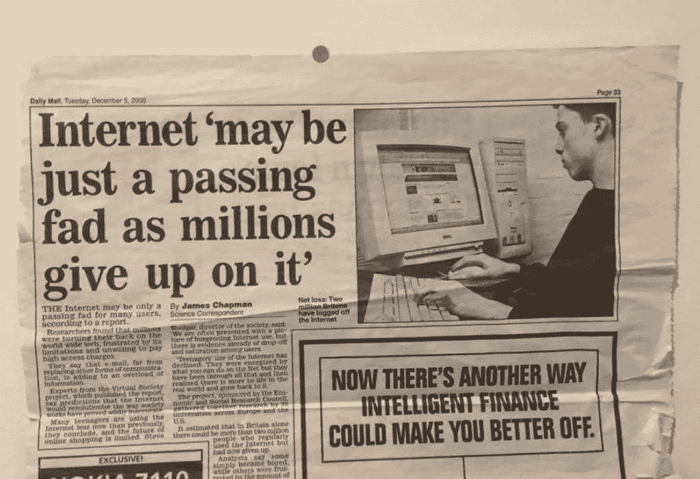
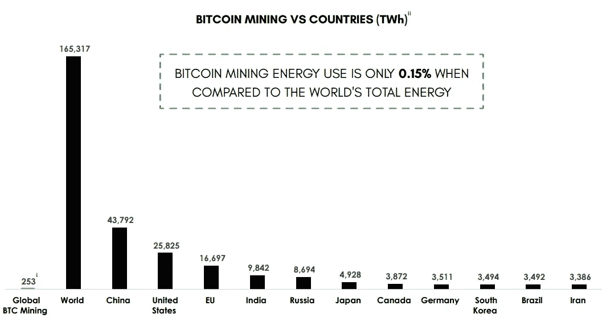

# 以下是我认为比特币完全是胡扯的所有事情。

> 原文：<https://levelup.gitconnected.com/here-are-all-the-things-i-believed-about-bitcoin-that-ended-up-being-total-bs-1cab63b5a7bb>

克里斯蒂安·威迪格在 [Unsplash](https://unsplash.com/s/photos/bull-shit?utm_source=unsplash&utm_medium=referral&utm_content=creditCopyText) 上拍摄的照片

在 [YouTube](https://www.youtube.com/channel/UCctXZhXmG-kf3tlIXgVZUlw) 与[加里·维纳查克](https://medium.com/u/c4ec9163657c?source=post_page-----1cab63b5a7bb--------------------------------)的对话中，作家兼公关策略师[瑞安·哈乐黛](https://medium.com/u/2e2701ae378f?source=post_page-----1cab63b5a7bb--------------------------------)说了一些有趣的事情。

在某种程度上，我以前从未听说过。

它就像疼痛的拇指一样突出。

> “我们将旧习惯应用于新技术。
> 
> 音乐剧在 20 年代很出名，收音机出现了，我们只是把它们录下来。
> 
> 然后，我们突然有了电视，认为这将是一个拍摄广播的好主意。"

他是对的。

我看不出我们对区块链技术的态度有任何不同。

媒体标题催眠了大众。

通常是通过你当地的理发师或者你痴迷于新闻的阿姨。

我们利用过去的成功，把过去放在一个基座上，把昨天的成功浪漫化。

如果技术没有消失，我们就把它当成一种时尚。

以下是《每日邮报》对 2000 年 dot.com 泡沫破裂的反应。

[新闻文章—每日邮报— 2020 年](https://www.webbedfeet.uk/news/internet-a-passing-fad)

# **比特币没有内在价值。**

内在价值是我们告诉自己的谎言。

你不可避免地会听到比特币批评者的论点，即比特币是你无法感受和触摸的东西。

那么我们为什么要给它定价呢？

你母亲的爱，你为之支付额外费用的最喜欢的品牌，以及你著名的步行路线上的风景都有内在的价值。

你不能碰任何东西。

价值是由评估它的人驱动的，而不是实际的东西。

你可能会同意一个装满百元大钞的大行李箱很值钱，直到我提到你被困在沙漠里，你唯一想要的就是食物和水。

是等式中的人赋予了事物价值。

在一个日益数字化的沉浸式世界中，比特币给了我们一种不能被没收或审查的自我主权资产。它是完全去中心化的，所以没有单点故障，并且有保证的稀缺性。

如果你听过这句话，你已经听过无数次了；只会有 2100 万个比特币。

永远不会。

超过 [1 亿比特币持有者](https://earthweb.com/how-many-people-use-bitcoin/)的采用曲线与它的价值主张一致。

# **比特币对环境有害。**

比特币的能耗相对于大多数行业来说可以忽略不计。

来自[比特币采矿委员会](https://bitcoinminingcouncil.com/wp-content/uploads/2022/07/2022.07.19-BMC-Presentation-Q2-22-Presentation.pdf)的数据显示，比特币采矿的 59.5%的能源来自可再生能源，这一比例每年提高 [47.4%。](https://bitcoinminingcouncil.com/wp-content/uploads/2022/07/2022.07.19-BMC-Presentation-Q2-22-Presentation.pdf)

此外，比特币每四年减半一次，比特币矿工获得的数量也减半。

比特币矿工每成功挖掘一个区块可获得 6.25 个比特币。下一次减半将发生在 2024 年，届时区块回报将降至 3.125。

随着时间的推移，每减半的影响将减少采矿，因为区块奖励接近零。

来源— [比特币矿业委员会](https://bitcoinminingcouncil.com/wp-content/uploads/2022/07/2022.07.19-BMC-Presentation-Q2-22-Presentation.pdf)

著名比特币投资者迈克尔·塞勒(Michael Saylor)回应了白宫关于比特币能源使用的负面报告。

> “比特币挖矿是最高效、最清洁的工业用电方式，在所有重要行业中，它的能效提高速度最快。
> 
> 再加上协议中规定的每四年比特币挖矿奖励减半。"

我在这里写了白宫的报告— [最新的白宫报告对比特币不利](/the-latest-white-house-report-isnt-good-for-bitcoin-5208b646cffc)。

# **比特币可以归零。**

这不是真的。比特币的技术设计阻止它触及零

与石油不同，比特币没有存储成本，所以人们永远不会像商品一样亏本出售。

有人要卖比特币，需要有买家。

在疫情开始的时候，石油生产商不得不付钱给买家来购买他们手中的商品，这在历史上还是第一次。

担心储存能力会耗尽，从而使油价跌至每桶负 37 美元。

研究分析师惠特尼·塞蒂亚万说:

> “暗示比特币价格可能会降为零……几乎是不可想象的，”
> 
> “它的供应不受当前全球供应链官僚体系的影响。原油供应几乎是无限的，这可能会影响人们愿意支付的价格，并降低价格。”

# **比特币是唯一真正的区块链。**

比特币最大化主义者认为只有一个有效的区块链。

这是部落错觉。

当加密货币之外的世界有 75%的人否认比特币甚至是一种合法资产时，你不可能是那个对其他网络不屑一顾的讽刺的人。

你可以的。但是你必须让它有意义。

还有其他几种加密货币，它们都有区块链和分布式账本架构。

以太坊已经成为了迪菲和 NFT 之王。索拉纳凭借其更快的交易吞吐量和无汽油的 NFT 交易赢得了市场份额。

真的可以有一个坚实的区块链数字回声系统。

# **对我来说，投资比特币已经太晚了。**

我相信这一点，这是最重要的。

所以我把它留到最后。

1000 倍的收益可能不大。

在我有生之年不会，也没有必要让时光倒流。

在一个储蓄率极低的世界里，在股市中获得 2 倍的收益会让你觉得自己像是占卜者，我会拿我的 50 倍赌比特币，不会怨恨早期的区块链老手。

如果你想无限制地访问 Medium 上的所有故事，点击订阅按钮，每日文章将直接发送到你的收件箱— [**订阅**](https://medium.com/@jayden_levitt/membership) **。**

成为会员后，你将支持我的咖啡瘾，并收到独立作家每日撰写的内容丰富的故事— [**点击此处**](https://medium.com/@jayden_levitt/membership) **。**

*本文仅供参考；不应将其视为财务、税务或法律建议。在做出任何重大财务决定之前，请咨询财务专家。*