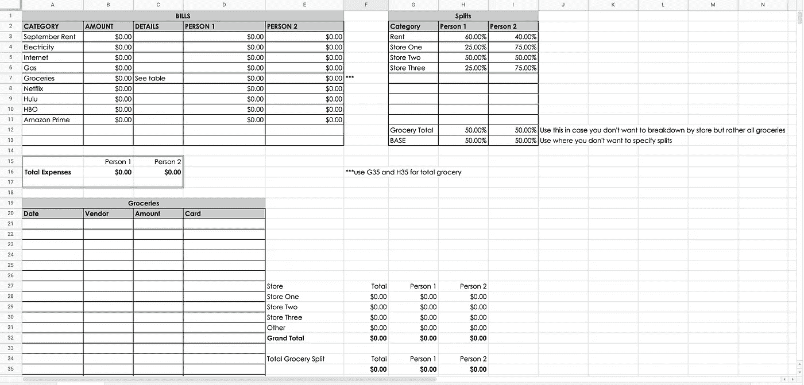
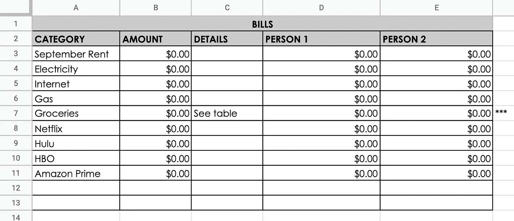
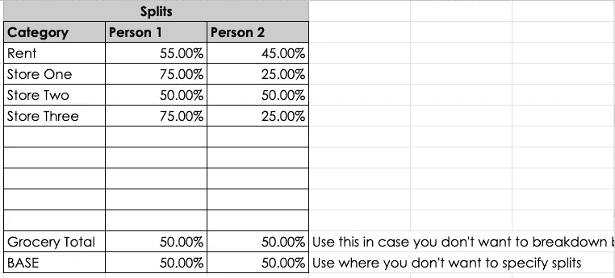
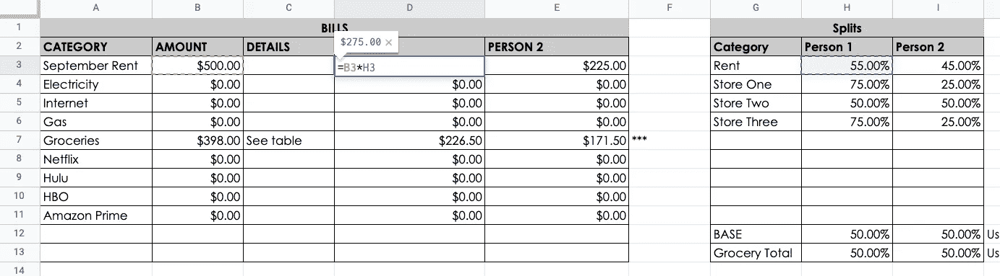
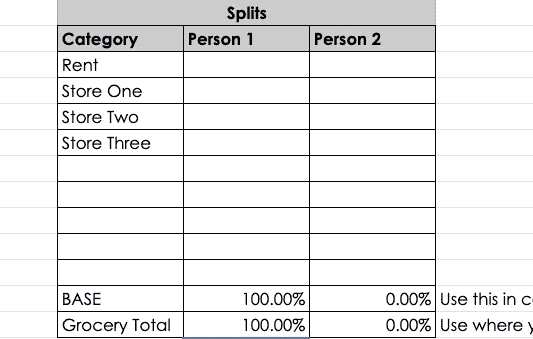
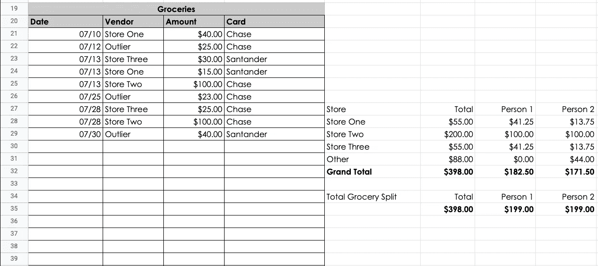
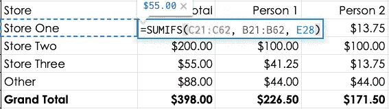
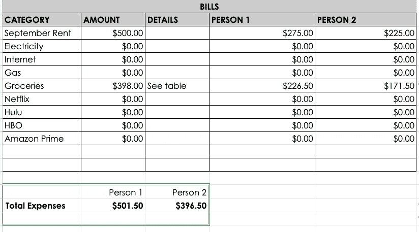

# 这是一个使用 Google Sheets 的费用模板

> 原文：<https://levelup.gitconnected.com/here-is-an-expenses-template-using-google-sheets-41cbc63f714>

## 相应地记录、组织和分配每月费用


[斯科特·格雷厄姆](https://unsplash.com/@homajob?utm_source=unsplash&utm_medium=referral&utm_content=creditCopyText)在 [Unsplash](https://unsplash.com/s/photos/expense-report?utm_source=unsplash&utm_medium=referral&utm_content=creditCopyText) 上拍照

我和大多数人一样，有开销。恶心，我知道。

这些费用可能以水电费、食品杂货费、房租以及流媒体服务等不必要的花费(T4)的形式出现。我也和我的女朋友住在一起，我和她一起分享了很多。

很自然地，我决定使用电子表格来跟踪支出，并以一种更容易管理(和分享)的方式组织支出。我想其他人也可能会得到一些使用它！

# 如何复制(格式和一切)

你可能认为你可以选择所有的单元格，复制并粘贴到另一个工作表中。可以，但不幸的是，您会丢失一些格式，并且可能需要您进行额外的工作。

一个更安全的方法是复制到*上，准确地说是*，就像这样…

1.  **文件**
2.  **制作副本**
3.  **重命名工作表**
4.  **选择文件目的地**
5.  **制作副本**

现在你知道如何完全复制它了，[你现在就可以去复制它了](https://docs.google.com/spreadsheets/d/1qxlmk8b8dNllqPOqPiYFUJfUQoPS0OWAkUe6ilnNZWE/edit?usp=sharing)！让我们来分析一下这张床单。

# 床单

下面是它的样子。



它就像 expenses resonate 一样丰富多彩(随意使用你喜欢的任何颜色)，但是每个部分都是指定和组织的。

# 工柞道

第一部分(A1-E13)包含一个表格，该表格收集了整个表格中的 ***所有*** 费用，并提供了一个概述。它包括租金、电费、煤气费，以及一些流媒体服务和杂货。如果您想要添加任何新项目，只需在表格的剩余行中键入它们。

*如果您需要向表格中添加新行…*

1.  **高亮显示 A13-E13**
2.  **右击高亮显示的单元格**
3.  **插入单元格**
4.  **插入单元格并向下移动**

它还显示了这些费用类别是如何在一个或多个人之间分配的。



您可以看到费用类别列表，随后是金额、任何详细信息以及人均明细(如果只有您，则此表中的 E 列及之后的内容可以忽略不计)。我要注意的第一件事是租金类别，单元格 A3。

我可以只写“租金”,但我想在我写支票的时候写得更清楚些。虽然现在是八月，但是下一张支票将会是九月的租金(我喜欢早点寄出而不是晚点)。

我通常可以自己记住，但是…我不能对你撒谎。

我*让*不小心把当前月份放到了备忘行。


不是世界末日，但有点提醒也无妨。

月份会自动更新为当前日期。我找到当前日期的月份，加一，转换成字符串，然后用“租金”连接。见下文。

```
=CONCATENATE(TEXT(EDATE(TODAY(), 1),"MMMM"), " Rent")
```

我使用`[TODAY()](https://support.google.com/docs/answer/3092984?hl=en)`从今天的日期得到当前的月份。`[EDATE](https://support.google.com/docs/answer/3092974?hl=en)()`函数预测特定月数之前/之后的给定日期。在我们的例子中，我下个月使用`1`。`[TEXT](https://support.google.com/docs/answer/3094139?hl=en)()`根据提供的格式将特定数字转换成文本。

在这种情况下，提供的格式是字符串月份格式的`"MMMM"`(`"MM"`会将其转换为`"09"`而不是`"September"`)。最后，`CONCATENATE`函数简单地组合或连接了`"September"`(来自`TEXT(EDATE...)`)和`" Rent"`这两个文本值。

B 列接受用户输入，除了 B7，它来自一个单独的表，我将在后面介绍。

D 列和 E 列根据我们将要查看的第二个表中提供的百分比值拆分 B 列中的相应值，*拆分表*。请看下面的详细介绍。



# 拆分表格

在该表中，您可以为各种费用提供自己的“分割”值。如果你不是唯一一个支付费用的人，这很有用，它允许你在一个地方添加拆分，并将其应用于整个表。

例如，如果您想将租金分成 55%和 45%,而不是 50/50，您可以将它们添加到拆分表中各自的单元格中。完成后，主表将根据相应的 splits 值进行相应的更新。

见下文。



为了得到人员 1 所欠的金额，我们将`September Rent`(在单元格 B3 中)的值乘以拆分表(在单元格 H3 中)中相应的拆分值。对于人物 2，我们做同样的事情，除了我们使用 I3 代替 H3。

人 1 支付租金的 55%(275 美元)，而人 2 支付 45%(225 美元)。如果你不想使用特定的分割，而是想把它从中间分割，你可以使用我称之为*基础*分割。如果您不指定自定义拆分，这些是您想要使用的常规拆分。

为了自动完成这项工作(而不是直接用 H12 替换 H3)，我们可以更新单元格 D3 中的函数，如下所示…

```
=IF(ISBLANK(H3), B3*H12, IF(H3>-1, B3*H3, B3*H12))
```

基本上，这一行检查 H3 是否有值。如果是，那么检查该值是否大于-1(稍后我将解释应该允许 0%分割的情况)。如果是，那就用吧！


否则，默认为 H12。我们可以对人物 2 使用相同的函数，只是分别用 I3 和 I12 替换 H3 和 H12 的实例。

## 为什么要用 0%？

如果你想只计算一个人，最简单和最少干扰的方法是简单地删除所有的分割，并将基本分割和杂货设置为 100% Person 1 和**0% Person 2**。我计划将来采用更简单的解决方案。

见下文。



您可能已经注意到，我还包括了各个*商店*的值。这些商店代表了你和其他人可能会去购买食品杂货或其他物品的不同“热点”。

我指定了这些拆分，因为有些商店我去的次数(有时只是为了我自己)比我女朋友去的次数多，比如一号店和三号店。然而，二号店是我们购买杂货的大型综合商店，所以一号店从中间分开。

这些拆分对应于我们第三部分中对*杂货*的计算。


塔拉·克拉克在 [Unsplash](https://unsplash.com/s/photos/groceries?utm_source=unsplash&utm_medium=referral&utm_content=creditCopyText) 上拍摄的照片

# 杂货(桌子和计算器)

这一部分有一个表格，用于存储所有交易和交易信息，以及合并了拆分的计算(或*calc*)。见下文。



让我们从桌子开始。

你基本上是与你的关联银行核对你的信用卡账单，并检查哪一天发生了哪些交易，金额是多少。把它们合计起来，加到表上。

计算有点复杂。


您可以看到交易的每个类别都有列。这些列是商店名称、消费总额，然后是人均消费。

底下的劈叉你看我称之为 ***总劈叉*** 。这些值用于您希望平均分摊所有*杂货费用的情况，而不管商店或人均频率如何。*

如果不指定杂货拆分，则它使用通用杂货拆分(位于基本拆分下方)。

我能够计算每个商店的总数的方法是因为我只对相应的供应商与商店名称相匹配的值进行合计。见下文。



我正在检查整个表(C21:C62)中的金额，只有当它们在表(B21:B62)中对应的商店名称值与相关 calc (E28) 中对应的商店名称值相同时，我才对它们进行求和*。为此，我使用 Google 的`[SUMIFS](https://support.google.com/docs/answer/3238496?hl=en)`函数，因为它根据指定的标准对一个范围求和(例如，检查相邻的 B 单元格是否与相应的 E 单元格匹配)。*

> 如果您用完了表格中的空间，只需像前面对主表格所做的一样，在表格最后一行的上方插入单元格。这将相应地更新范围以超过 C62。

现在，在主表中，如果您想要使用食品杂货总拆分，您将需要引用每个人下面的*食品杂货总单元格*。这意味着，对于人员 1，您需要在主表(B7)中将他们的杂货单元格设置为等于表中更下方的总杂货拆分值(G35)。如果要使用指定的杂货分割，请使用 G32。这次只对人员 2 进行同样的操作，分别使用 H35 或 H32。

*我计划将来采用更简单的解决方案，但现在你需要这样做。*

# 最后一部分

最后，我们有 ***总计*** 部分，用绿色双边框表示。这是 ***所有*** 费用类别收集信息后谁欠谁的总和。



# 即将推出

以下是正在开发的功能列表…

1.  按钮，允许用户重置整个表(减去租金，因为这可能是每月不变的，除非开始新的租赁)。
2.  允许用户在每个月末重置工作表的复选框。
3.  复选框使用杂货一般拆分和自定义拆分(而不是直接替换主表格中的单元格引用。
4.  突出显示合计超过 100%或小于 100%的拆分单元格(突出显示不完整或超出拆分值)。
5.  包括选项，允许用户说出有多少人包括在该表中。相应地更新工作表和拆分。这一个肯定是最棘手的。
6.  允许用户根据日期、商店名称、信用卡等对他们的杂货交易进行排序。

我目前正在开发一个定制的谷歌应用程序脚本，允许大量的这种功能，并希望很快将它结合进来。我以前试验过 Google Apps 脚本，很高兴将这些特性整合到电子表格中！要阅读如何在你自己的 Google 表单中包含 Google Apps 脚本，请查看我在[之前的帖子](/how-to-add-a-google-apps-script-to-your-google-sheet-a1262ed86d5)！

你还想让我增加什么功能？你认为我目前有什么功能是没用的吗？请在评论中告诉我！

[***升级您的免费 Medium 会员资格***](https://matt-croak.medium.com/membership) *并接收来自各种出版物上数千名作家的无限量、无广告的故事。这是一个附属链接，你的会员资格的一部分帮助我为我创造的内容获得奖励。*

*您也可以通过电子邮件* [***订阅，每当我发布新内容时，您都会收到通知！***](https://matt-croak.medium.com/subscribe)

# 参考

[](/how-to-add-a-google-apps-script-to-your-google-sheet-a1262ed86d5) [## 如何将 Google Apps 脚本添加到您的 Google 表单中

### 将 JavaScript 与您的 Google Sheet 一起使用以获得高级功能

levelup.gitconnected.com](/how-to-add-a-google-apps-script-to-your-google-sheet-a1262ed86d5) [](https://docs.google.com/spreadsheets/d/1qxlmk8b8dNllqPOqPiYFUJfUQoPS0OWAkUe6ilnNZWE/edit?usp=sharing) [## 费用模板

### Sheet1 账单，拆分类别，金额，明细，人员 1，人员 2，类别，人员 1，人员 2 九月…

docs.google.com](https://docs.google.com/spreadsheets/d/1qxlmk8b8dNllqPOqPiYFUJfUQoPS0OWAkUe6ilnNZWE/edit?usp=sharing)  [## 今天

### 以日期值的形式返回当前日期。请注意，TODAY 是一个不稳定的函数，会影响电子表格的性能…

support.google.com](https://support.google.com/docs/answer/3092984?hl=en)  [## EDATE

### 返回一个比另一个日期早或晚指定月数的日期。EDATE(日期(1969，7，20)，1) EDATE(40909，-2)…

support.google.com](https://support.google.com/docs/answer/3092974?hl=en)  [## 文本

### 根据指定的格式将数字转换为文本。TEXT(1.23，“0.00 美元”)TEXT(DATE(1969，7，20)，“yyyy-MM”)…

support.google.com](https://support.google.com/docs/answer/3094139?hl=en)  [## SUMIFS 函数

### 根据多个条件返回一个范围的总和。SUMIFS(A1:A10，B1:B10，" > 20") SUMIFS(A1:A10，B1:B10，" > 20"…

support.google.com](https://support.google.com/docs/answer/3238496?hl=en) [](https://developers.google.com/apps-script) [## 应用脚本|谷歌开发者

### 轻松开发高质量、基于云的解决方案。

developers.google.com](https://developers.google.com/apps-script)