# 以下是为什么以及如何用 Flutter 为 Kotlin 和 Swift 编写本地代码

> 原文：<https://levelup.gitconnected.com/here-is-why-and-how-you-can-write-native-code-in-flutter-for-both-kotlin-and-swift-91fd020ed4f5>

欢迎来到我的编写 Kotlin 和 Swift 原生集成代码的 Flutter 教程。

下面的内容是一个用 Kotlin 和 Swift 编写的本地示例，用于检索设备的名称和电池电量。

我在这里使用 GetX 作为状态管理(我不再推荐它了。但是您可以在自己的实现中使用任何您想要的状态管理。

# 为什么我们需要写原生代码？

正如你可能知道的，我们有[https://pub.dev/](https://pub.dev/)来支持我们日常的 Flutter 开发者生活，比如相机、许可处理、设备信息等等。

但是，如果我们没有任何本地编程语言经验，也没有任何像获取设备信息、处理权限或能够调用相机这样的包，那该怎么办呢？

当然，你会立即被解雇，由过去在 Kotlin 或 Swift 工作过的人接替你:)

感谢上帝我们有 pub.dev 没有让 Flutter Devs 失业。

## 职业

当我面试 Flutter jobs 时，10 家公司中有 6 家向我询问 Kotlin 知识。当然，我并不是说如果你不了解科特林，你就不能在 Flutter 找到工作。现在看来这是个谎言。

但如果你了解科特林或斯威夫特，你真的可以在比赛中走得很远。

## 编写定制集成或包

如果您的公司使用定制的第三方软件包，您可能需要本地代码知识来进行集成。

如果你的公司希望你为设备的平台实现新的特性，如果在 pub.dev 中没有任何这样的包，你需要本地代码知识才能做到这一点。

最后，学习一些新的东西并没有坏处，如果你像我一样考虑长期投资，你应该学习科特林或者斯威夫特。

# 密码

首先，我们将创建一个视图和一个控制器。作为一个例子，我将只检索设备名称和电池电量(注意，如果你使用模拟器，你不能检索电池电量，因为你需要一个真实的设备)

## 视角

这只是一个简单的视图，我使用 GetX controller 将值作为文本小部件放入 UI。

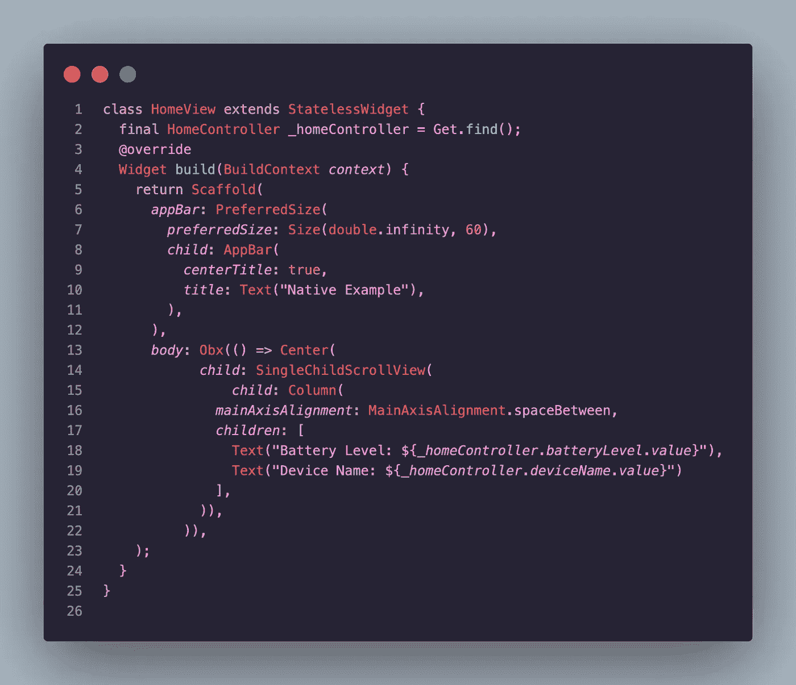

## 控制器

这里我们有处理跨平台通道调用的控制器。

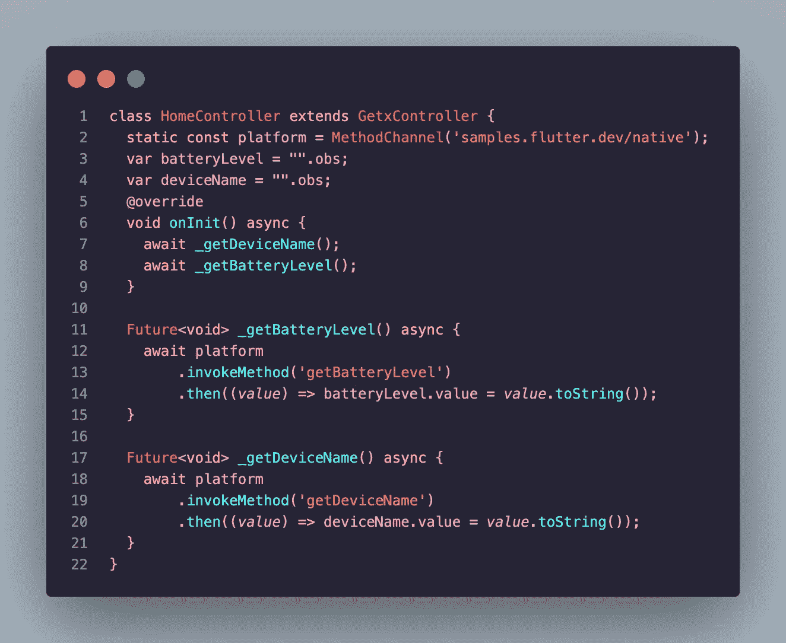

首先，我们需要定义一个具有给定名称的 MethodChannel 变量，如下所示:

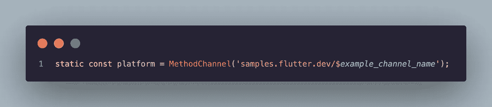

示例通道名称将在我们的本机代码文件中使用。我的是“本地的”

然后，我将创建两个名为 getBatteryLevel 和 getDeviceName 的函数，它们将在 onInit 生命周期方法的初始启动时被调用。

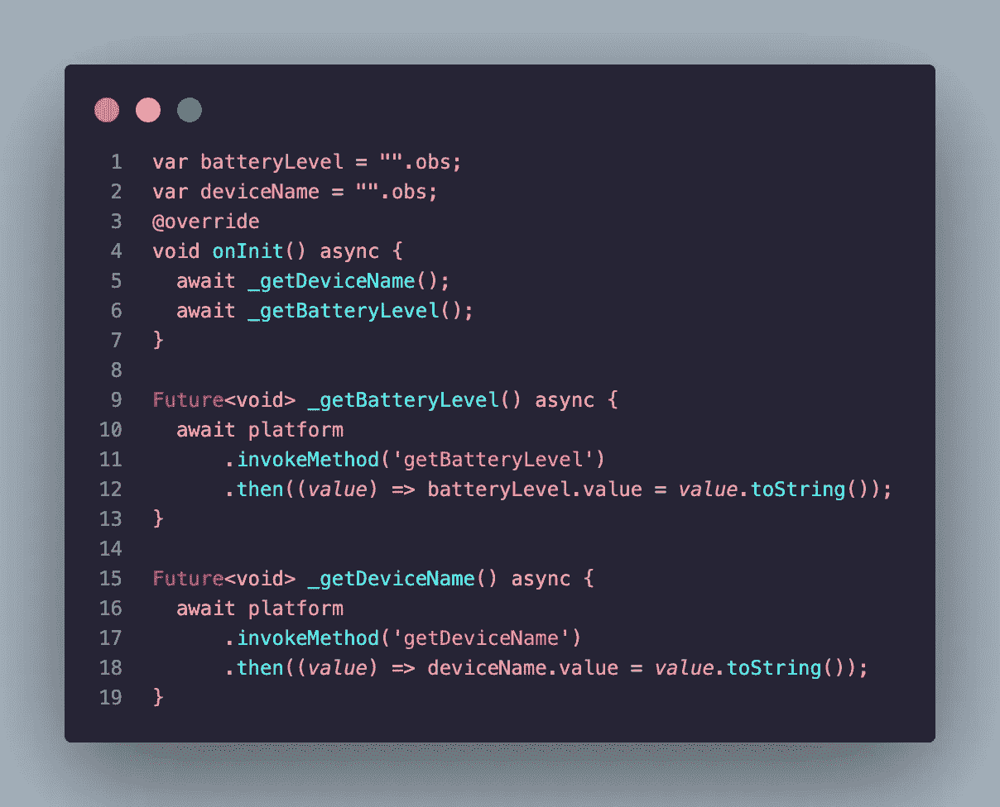

当两个方法将被调用时。它将使用示例频道名称(我们的是“**本地**”)调用基于平台的功能

# 科特林

在“Android/app/src/main/kotlin/com/example/flutter _ native/”路径中，我们将找到“MainActivity.kt”文件来编写我们的自定义 kot Lin 代码。

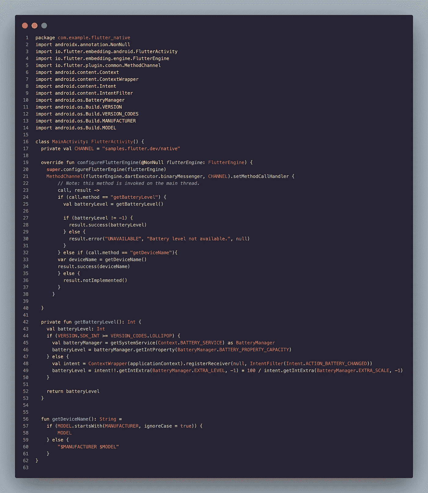

先做最重要的事情；顶部的 channel 变量应该与我们的 dart 代码中的 CHANNEL 名称相同，以便进行集成。

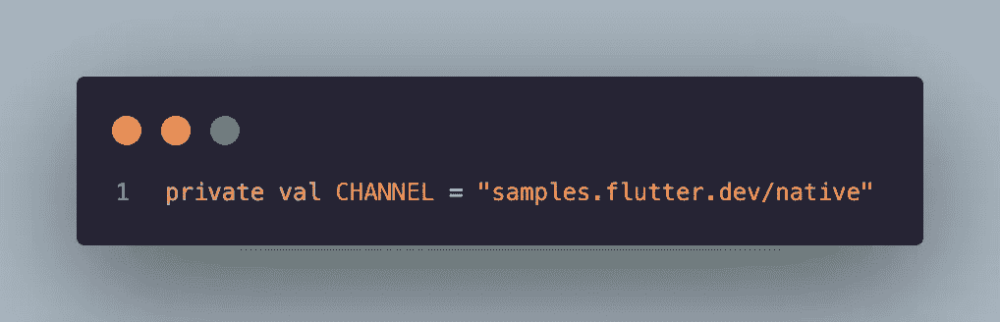

example_channel_name 应称为“native ”,与本机代码中的名称相同。

然后，我们将创建 configureFlutterEngine 函数。

这将允许我们从 dart 代码中处理方法调用，并执行业务逻辑。

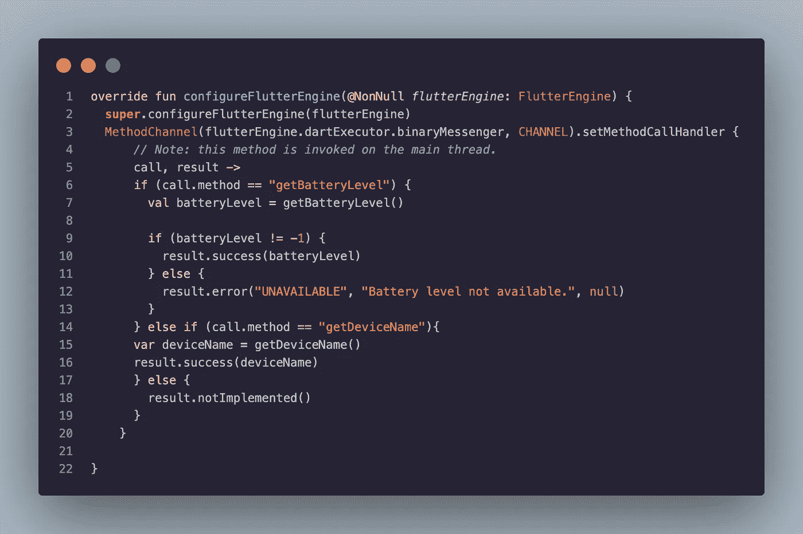

如您所见，我们正在为我们的业务逻辑实现检查方法名，如“getBatteryLevel”。我们确实在前面的控制器中给 invoke 方法起了一个名字。

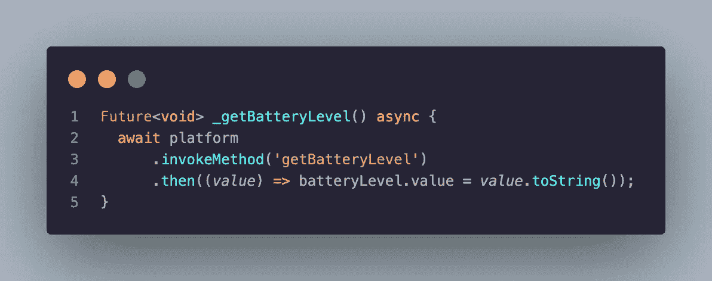

获取电池电量和设备名称的函数

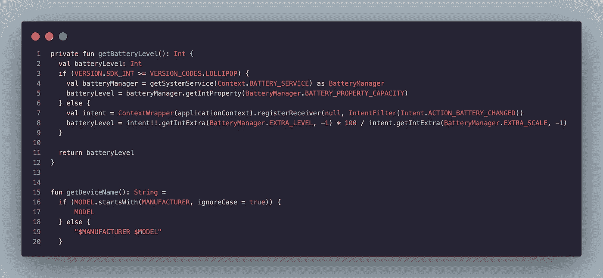

# 迅速发生的

它有一个非常相似的本地代码处理实现，就像 Kotlin 一样。

在“ios/Runner/”路径中，我们将找到“AppDelegate.swift”文件来编写我们的自定义 swift 代码。

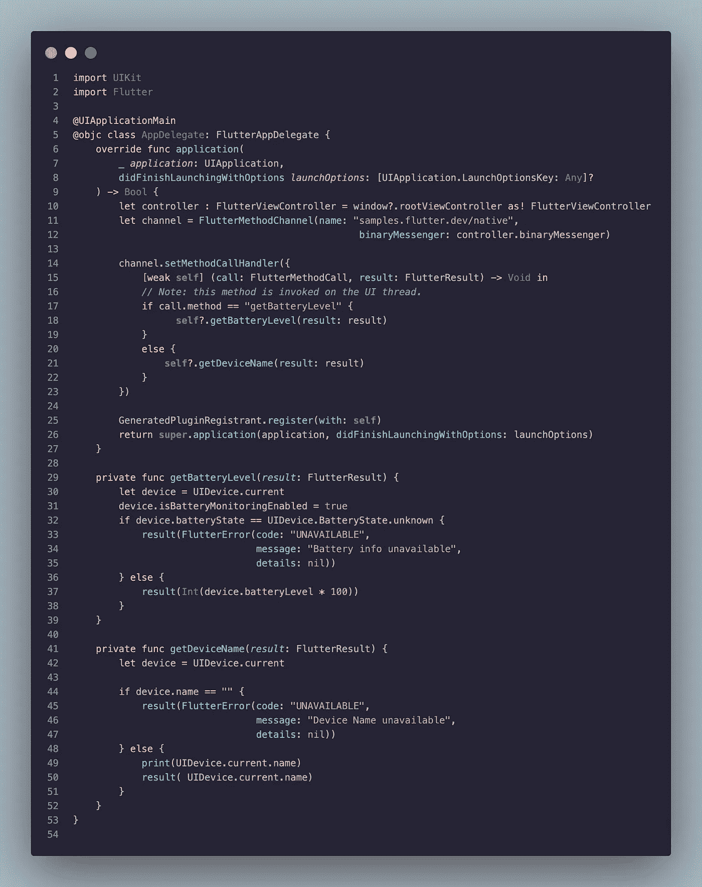

在应用程序函数内部，我们将编写我们的方法处理

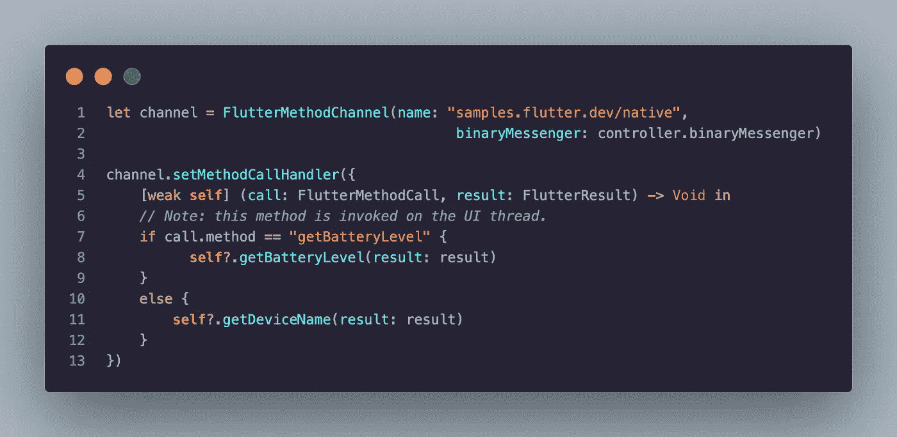

获取电池电量和设备名称的函数:

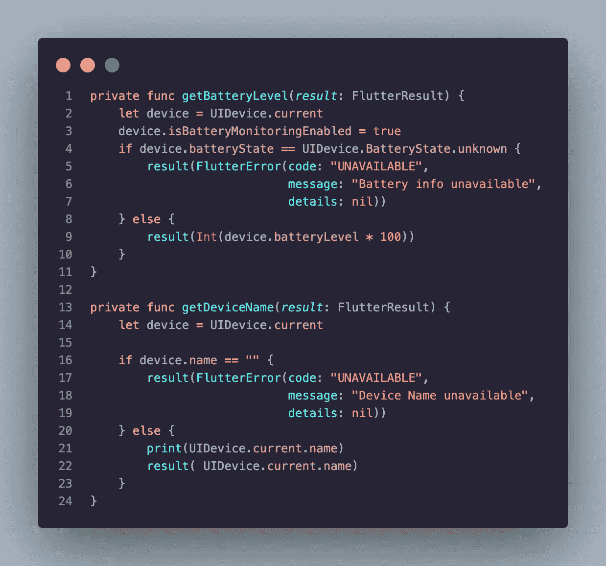

感谢您的阅读。

您可以在此处找到相关的存储库:

[https://github.com/umutarpat/flutter_native](https://github.com/umutarpat/flutter_native)