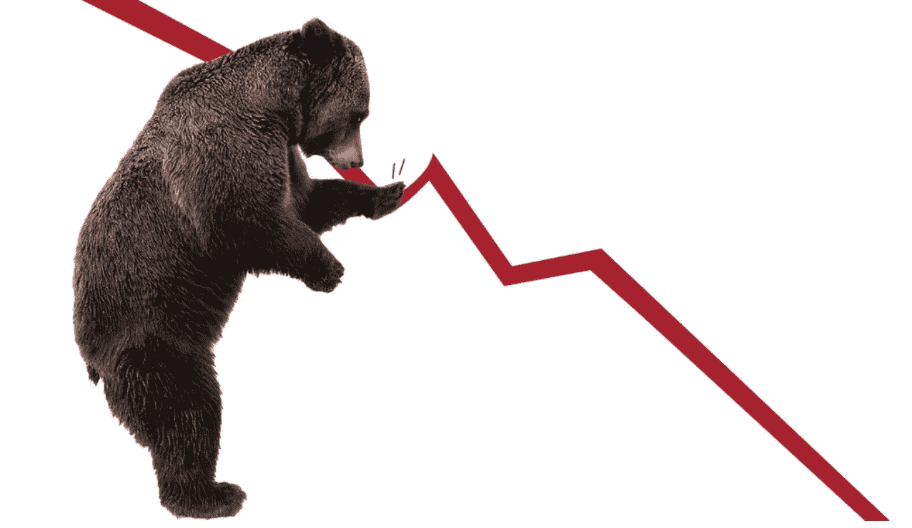
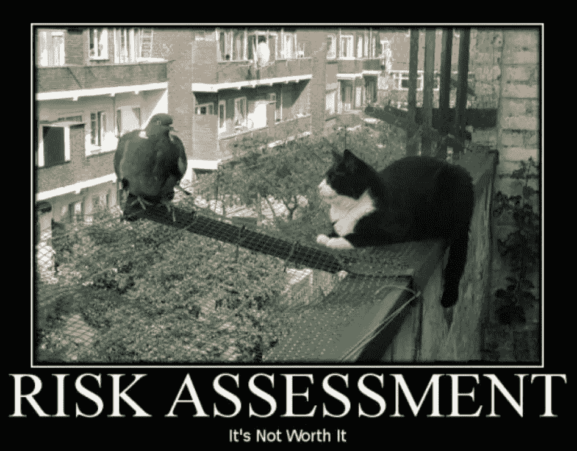
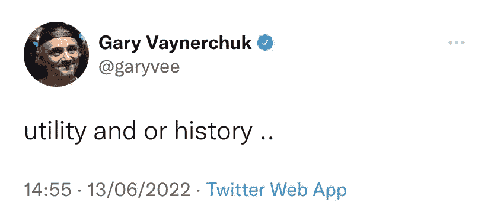

# 这是你的 NFT 熊市生存指南。

> 原文：<https://levelup.gitconnected.com/heres-a-quick-nft-bear-market-survival-guide-c21b2042f6b6>

[信用——Slate.com](https://slate.com/business/2022/06/stock-market-bear-s-and-p500-inflation-fed.html)

他们说向后看只会弄乱你的脖子。

好吧，给我一个颈托，因为我和其他人一样是人。我的 NFT 包被核弹炸成碎片。

在 2021 年 NFT 盛夏期间，我会坐在我的工作岗位上，看着多个 50ETH 报价涌入我的电子邮件收件箱。

幸运的是，我的同事们并不知道我对 Jpeg 的痴迷，也不知道在一笔 NFT 交易中，我可以获得相当于五年薪水的收入。

从我的行为来看，你可以说我也幸福地不知道。

我到底在想什么？如果我没有不断提高自己想象中的门槛，我经常会做白日梦，梦见我可以清扫的 NFT 地板，我可以买到的蓝筹股。

一个我无法控制的酒吧。

事实是，我很擅长挑选伟大的项目，但却是一个糟糕的短线交易者。

对你来说可能会不一样。我对它没有兴趣。

花时间对一个创始人和团队做深入研究，花我能承受损失(不是永久损失)的钱，然后在一个项目上睡一觉，这就是我的行事方式。

这就是我将如何进入下一个 NFT 的夏天，你也应该如何。

如果这一次你错过了一些早期的收获，要有更多的信心，在游戏中获得一些皮肤，并购买你的第一个 NFT。这项技术会一直存在下去。

在我开始讲述如何应对 NFT 熊市之前，让我们先澄清一下什么是熊市…

> 熊市是指股票或整个市场价格长期下跌，通常从近期高点下跌 20%或更多

NFTs 是“资产风险”，它更像是 70%

【Quotesgram.com】[信用——T3](https://quotesgram.com/)

# 以下是你处理事情的方法…

> **“花钱不要超过你能承受的损失”**

我一直认为人们会说这是一个合理的建议，这样你就不会在高速公路桥下和一家人的猫在一起。

事实是，它远没有那么令人担忧。

如果你在游戏中负债过多，你不可能在不使你紧张或完全亏损的情况下持有一切。

在熊市中，人们亏本卖出，因为他们失去了耐心，失去了信心，或者杠杆过高。

玩钱，你能承受损失解决了这三个问题。

# 找工作，最好是在 Web3。

如果你已经过了过度负债的阶段，是时候回归基础，找一份全职工作了。

我甚至不是在开玩笑；在这个市场中生存是至关重要的，你以接近合理的价格出售非流动资产的可能性很小。

甚至不知道你买了什么。

你可能会说，“谢谢你，明显队长！”

但是，你稳定的收入流会给你长寿和信念，并帮助你维持你所拥有的。

在 Web3 中找工作的原因是它能让你随时掌握市场的脉搏。我最大的遗憾是在 2018 年 ICO 崩盘后保持被动旁观。

记住，回头看会乱搞你的脖子。

# ETH、SOL 和/或比特币的平均美元成本

老实说，选你的毒药。

按照比特币、以太坊(Ethereum)和索拉纳(Solana)的顺序进行分层，将投资分散到这三个领域将是公平的。

类似这样的。

50%比特币
30%以太坊(我有更高比例的 ETH)
20%索拉纳
当你有稳定的收入流时，现在是时候在市场悄悄拉屎的时候开始堆积你的蓝筹加密货币了。

一切都是物有所值。

以太坊合并看起来像是一次“死猫反弹”，但显示出一些令人欣慰的缓解。换句话说，市场似乎在展示一种虚假的复苏，让我们都沾沾自喜。

没有人能准确预测市场的顶部或底部。不可能的。

你唯一能做的就是建立一个对冲市场崩溃的框架。也就是说，当市场下跌时，每隔一段时间买入，如果你在交易，在上涨时，每隔一段时间卖出并获利。

我一直是以太坊最大化主义者，但我也对索拉纳和比特币大开眼界。Solana 的 NFTs 经济正在增长，市值很小，这使得它对增长很有吸引力。比特币是一种极好的价值储存手段。

# 加倍你的知识

研究 NFT 的历史，因为供给总是有限的。每当一段历史被买卖时，它就会落入更强大的手中，从而变得越来越稀缺。

信用— [加里·维纳查克](https://medium.com/u/c4ec9163657c?source=post_page-----c21b2042f6b6--------------------------------)

看看最优秀的经营者是如何度过衰退和熊市的。

如此多做了“糟糕赌注”的人完全离开了这个领域，主要是受到负面媒体标题和他们个人战争创伤的驱使。

新闻标题通常是通过公众反馈回来的。

我的理发师最近说，

“哦，那些 NFT 是你可以保存到你的桌面上的东西；孩子们为此支付了数千美元。”

我不再被卷入在公共场合灭火的事件中。我以前看过这部电影。有太多的迹象表明这不仅仅是一种时尚。

*   脸书变 Meta(元宇宙的简称)
*   比特币基地向其 6800 万用户发布了 NFT 市场
*   NFT 6900 万美元的销售
*   2021 年，Openseas 的 NFT 交易量将达到 130 亿美元

最重要的是，几个发布 NFT 项目的空前的企业家的名誉岌岌可危。

猫从袋子里出来了。不要被落下。

> 以上都不是财务建议。我不是一个合格的财务顾问，尽管我尽了最大努力，我也无法预测未来。
> 
> NFT 空间充满风险。
> 
> 专家称当前 99%的项目都将走向 0。

# 分级编码

感谢您成为我们社区的一员！在你离开之前:

*   👏为故事鼓掌，跟着作者走👉
*   📰更多内容请查看[升级编码刊物](https://levelup.gitconnected.com/?utm_source=pub&utm_medium=post)
*   🔔关注我们:[推特](https://twitter.com/gitconnected) | [LinkedIn](https://www.linkedin.com/company/gitconnected) | [时事通讯](https://newsletter.levelup.dev)

🚀👉 [**加入升级人才集体，找到一份神奇的工作**](https://jobs.levelup.dev/talent/welcome?referral=true)