# 下面是我如何创建一个远程团队建设的测验应用程序:一步一步的指南

> 原文：<https://levelup.gitconnected.com/heres-how-i-created-a-quiz-app-for-remote-team-building-a-step-by-step-guide-b45935b16170>

新冠肺炎·疫情和全州范围内的居家命令已经导致包括我的公司在内的许多公司关闭办公室，限制旅行，并要求所有员工远程工作。

这导致了人们互动方式的重大转变。但让它变得更容易管理的是，我和我的大多数同事在某种程度上已经彼此认识。但是，那位在居家命令生效后几天就签约的新员工呢？

作为现在的团队领导，管理着一个远程团队，包括一个不认识任何人的新员工，我想尝试用一些有趣的事情来开始我们的会议。所以我在我整天工作用的平台上建了一个问答 app——sales force。

# 在 Salesforce 上构建测验应用程序

作为一名 Salesforce 应用程序架构师和顾问，我每天大部分时间都在平台上度过，但我并不总是有机会尝试更新的技术来为我的客户解决现实世界的问题，更不用说用我自己的时间为我自己的团队解决问题了。

当决定在哪里部署应用程序时，Salesforce 可能不是您的第一想法，但由于 Lightning Web Components 开源(LWC OSS)的发布以及与 Heroku 等平台的本机集成，该平台不仅高度可配置，而且越来越具有可扩展性。

我去寻找如何建立一个测验的想法，我偶然发现了这个由 Salesforce 的开发者 [Philippe Ozil](https://github.com/pozil?ref=hackernoon.com) 创建的[开源测验应用](https://developer.salesforce.com/blogs/2020/01/introducing-a-multiplayer-quiz-app-built-on-salesforce-technology.html?ref=hackernoon.com)，它在 Dreamforce 2019 上发布。测验应用程序实际上是两个应用程序——一个安装在 Salesforce org 中的主机应用程序，以及一个使用 LWC 操作系统构建的播放器应用程序，运行在 Heroku 上部署的 Node.js 上。

主持人应用程序是主持人管理多项选择测验问题和答案、实时测验会话以及使用 URL 或 QR 码轻松注册玩家的地方。玩家应用程序是任何拥有 URL 或 QR 码的人都可以加入的地方，不需要认证。

看起来它可以满足我的开箱即用的需求，让我探索 LWC，用 Heroku 练习托管应用程序，并更好地开发 scratch orgs。尽管如此，我知道我也想定制一点品牌和功能，使它真正成为我自己的。

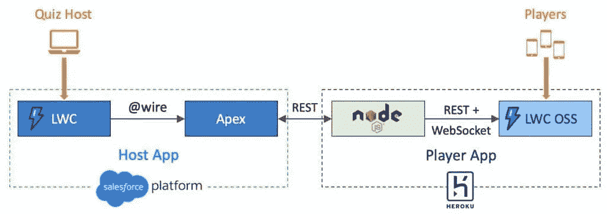

# 安装应用程序

安装整个解决方案的[步骤非常简单，因为我遵循了最初开发者概述的说明。这包括创建一个 Salesforce scratch org，使用他的自动化部署脚本来安装主机应用程序和加载样本数据，并将播放器应用程序部署到 Heroku。](https://github.com/pozil/quiz-host-app?ref=hackernoon.com)

一旦我在一个临时环境中设置了它(默认情况下，临时组织在 7 天内到期，如果您在创建它时设置了持续时间，则在 30 天内到期)并弄清楚如何使用示例问题来运行它，我就开始考虑如何在我的团队中使用它，并在我公司的 Salesforce 组织中重复安装步骤。

至于该应用的功能，我喜欢能够轻松地添加我自己的问题，我喜欢它如何自动提供新问题，收集答案，并统计每个人在测验环节的分数。我还想保存一段时间内每个人的分数，并在每个新游戏开始时显示一个排行榜。因为公司里的任何人都有可能加入到这个乐趣中来，所以我决定用我们公司的标志和颜色来标记这个应用程序。

# 添加自定义问题

当我在定制应用程序的功能时，我让我们的新员工(姑且称他为 Dan)想出 5 个关于他自己的选择题，每个选择题有 4 个答案选项，只有 1 个正确答案。

将它们添加到测验问题对象很容易；丹自己手动输入的(这样我就可以不作弊的玩游戏了！)，但他也可以很容易地从 CSV 导入它们。

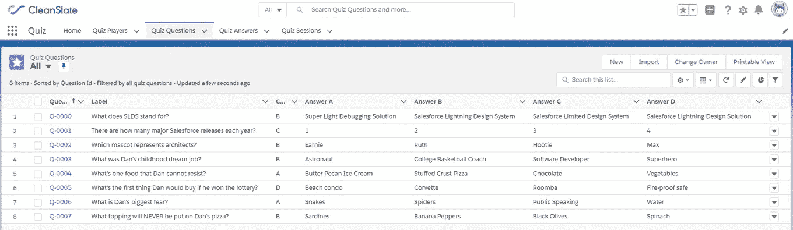

# 创建自定义品牌

重塑应用品牌是最简单的改变。在安装在 Salesforce 平台中的测验主机应用程序中，只需在设置>应用程序管理器下更改应用程序的徽标即可。

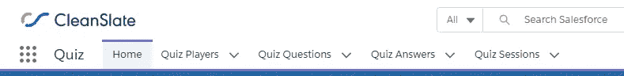

在 Heroku 上部署和运行的问答播放器应用程序中，对 header.css 和 footer.css 中的背景颜色样式定义进行了快速更改，将所有页面的顶部和底部重新绘制为我们的签名海军蓝。

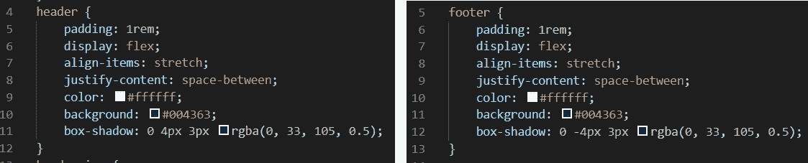

然后，我用我们自己的徽标替换了它，并用新徽标的相对 URL 和一个名为“CleanSlate Quiz”的应用程序更新了 header.html。

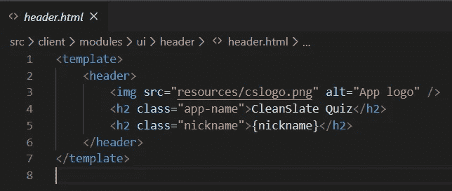

# 自定义点

作为玩家加入问答游戏就像输入昵称一样简单。唯一的规则是，它必须是一个独特的昵称。按照设计，在游戏结束时，问答游戏玩家的列表和他们的所有答案都会被删除。

为了跟踪我的团队在一段时间内的总分数，我向用户对象添加了一个名为“总测验分数”的数字字段，并在测验玩家对象和用户对象之间创建了一个查找关系。为了更容易地在主机应用程序的注册主页上创建排行榜，我还在测验播放器对象上添加了一个公式字段，它只是显示用户的总测验分数作为参考(稍后将详细介绍)。

在问答播放器应用程序中，我所做的唯一更改是 registrationForm.html，我将标签更新为“选择昵称/ salesforce 用户名”,这样用户就有希望记住输入他们的用户名来跟踪他们的总积分。

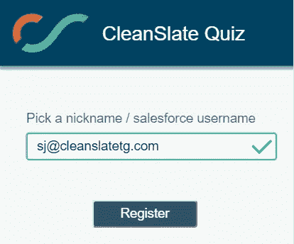

如果玩家输入了有效的用户名作为她的昵称，测验应用程序将正常创建测验玩家，然后 process builder automation+auto launched 流将确定是否存在具有该用户名的用户，将测验玩家链接到该用户，并且仅出于装饰目的，将测验玩家昵称更新为用户的全名。

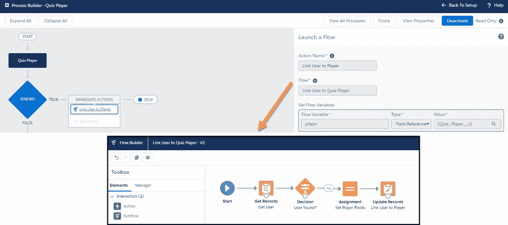

如果玩家输入了一个不是有效用户名的昵称，他仍然可以玩游戏，但是他的总分数不会被记录下来。

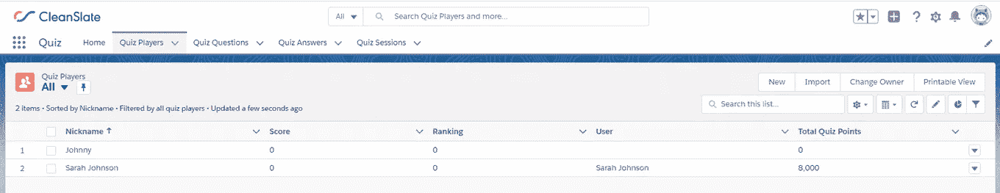

在游戏会话开始时，所有玩家在注册时都会列在 Salesforce 中主机应用程序的主页上。

# 合计总点数

在游戏结束时，我希望在应用程序的默认行为清除测验参与者和测验答案之前，每个用户的总分数都按照他们在测验中获得的分数递增。为此，我必须修改主机应用程序。

在现有的游戏结束时删除竞猜玩家和竞猜答案的方法中，我注入了自己的方法调用，首先更新用户的总竞猜分数。该方法获取与用户相关的所有测验参与者，然后将当前测验的分数与他们在之前所有测验中已经获得的总分数相加。

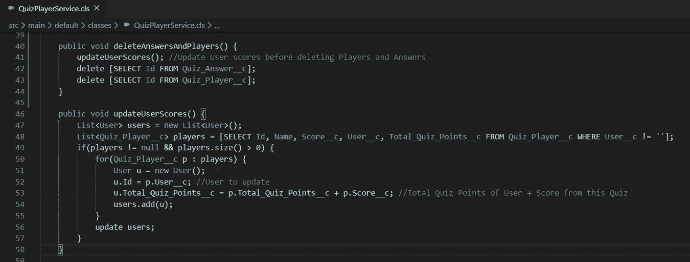

# 使用 Lightning Web 组件创建领导板

最后，我使用 Quiz Player 上引用用户总测验分数的公式字段，在主机应用程序注册页面上创建了一个排行榜，供所有人在等待游戏开始时通过屏幕共享查看！

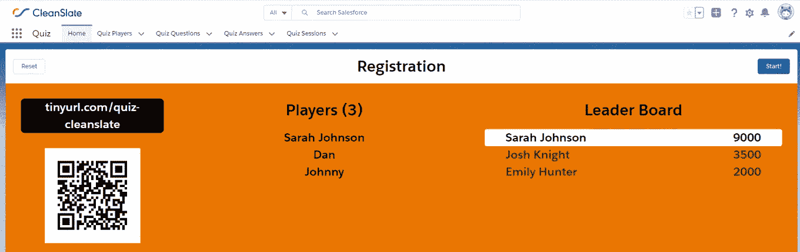

为此，我在我的应用程序中创建了一个名为 leaderBoardAllTime 的新 Lightning web 组件，并将其嵌入到现有 gameApp.html 页面的一个新列中，这样它就会显示在 playerList 和 registration 组件的右侧。

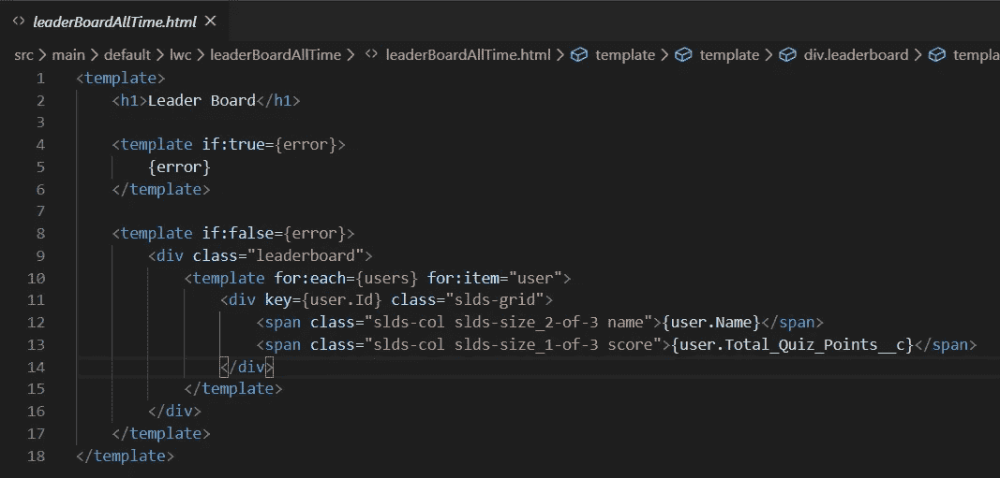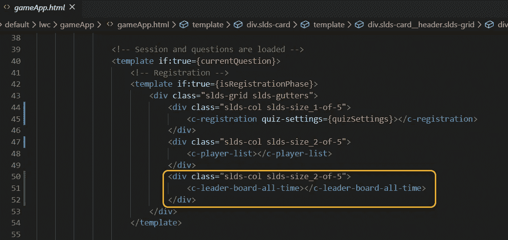

# 连接我们的团队—游戏时间

在会议开始时，我很快介绍了我们的新人丹，然后分享了我的屏幕，以便每个人都可以看到如何连接到播放器应用程序。一些人把手机举到屏幕前，捕捉二维码，直接进入应用程序，另一些人只是在电脑上打开网址。

每个人都使用他们的 Salesforce 用户名，这样他们的积分就会被跟踪。在开始游戏之前，我打开了测验环节，把丹的所有问题都拉到了当前环节中。然后一旦每个人都注册了，我就开始游戏，我们试着猜测关于我们新同事的一些随机的事情。

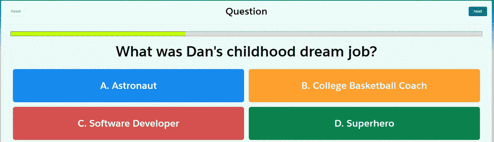

团队总是在寻找更好地合作的方法，只要有可能，在团队的动态中加入一点乐趣和笑声总是一个好主意。在这个疫情和我们完全远程的劳动力中导航很少是容易的，但我认为使用这个测试应用程序真的让每个人都振奋了。

我们当然对我们的新队友了解了很多，丹尤其高兴的是他不用笨拙地介绍自己——这个小测验帮他做到了！在比赛结束时，我们提名了下一位队友，他已经在准备他的问题清单了。

# 总结

我把这个想法分享给了公司的更多人，我们正在讨论如何在季度市政厅会议或周五快乐时光期间利用它来培养一点健康的竞争！我们将在应用程序体验之外创建一个排行榜，作为 Salesforce 仪表板，每个人都可以随时查看和刷新，有人提出了另一个基于总积分或回答特定类型问题授予徽章的功能。无论我们决定做什么，由于这个测验应用程序和我在这里的经验，我相信我可以进一步定制它，并真正使它成为我们自己的。

你会如何为你的团队使用和/或定制这样的测验应用程序？在这次疫情期间，你采取了什么策略来让你的团队参与进来？最重要的是，你认为丹童年梦想的工作是什么？