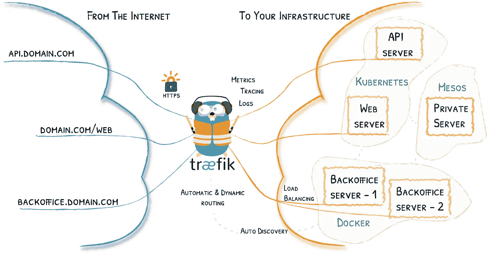
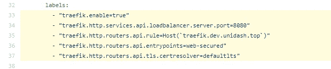
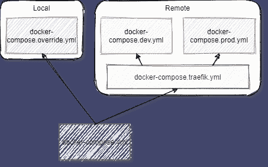
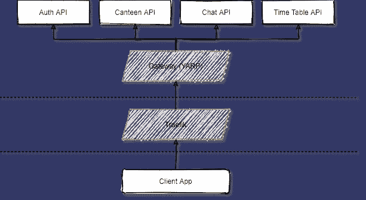
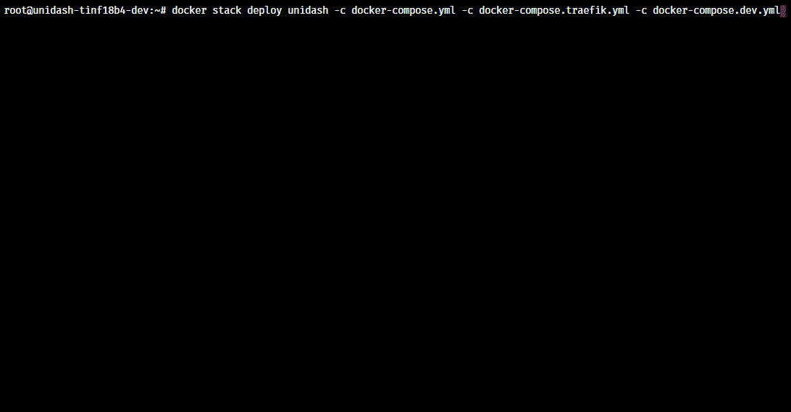
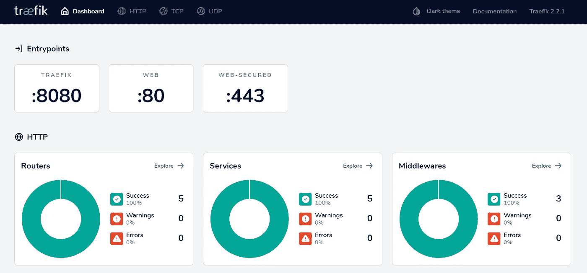

# 下面是我如何用 Traefik 部署我的大学项目

> 原文：<https://levelup.gitconnected.com/heres-how-i-deployed-my-university-project-with-traefik-8a9df1f369b5>

## 让网络变得无聊，它摇滚

## 以及如何轻松自信地部署容器化的应用程序

照片由[布伦丹·丘奇](https://unsplash.com/@bdchu614?utm_source=medium&utm_medium=referral)在 [Unsplash](https://unsplash.com?utm_source=medium&utm_medium=referral) 上拍摄

我目前在德国合作州立大学卡尔斯鲁厄分校学习应用计算机科学，即将结束另一个学期(【2020 年特别版)。

在过去的两个学期里，我和我的几个朋友一直在为我们的软件工程讲座做一个项目。该项目将我们大学的许多在线服务整合到一个中心枢纽中，该中心枢纽将于本周完成期末考试。

我们的最终目标之一是部署一个用作现场演示的环境。以下是我是如何做到的，以及我可以为第一次使用 Traefik 的初学者推荐的内容。

就本文的范围而言，我还将提供我在整个旅程中积累的一些见解和最佳实践。

# 为什么是特拉菲克？

过去，我以各种方式部署我的 web 项目。从 IIS(回到什么时候。NET Core 甚至不是一个东西)、Apache (lol)、NGINX 到 [Traefik](https://containo.us/traefik/) 。

在这些阶段，我学到了很多东西，但我记得我花在配置和修复反向代理上的时间可能比花在改进代码上的时间还多。配置网络和不熟悉的工具会变得很麻烦，尤其是当最终结果不符合您的期望时。

对于 IIS，我记得当从本地系统路径而不是默认的 IIS 文档路径提供文件时，与文件权限的斗争。你不想花很多时间来管理和修复文件权限(这在一开始并不明显)，这不是你作为开发人员的主要任务。这一点，以及需要特定配置的复杂 IIS 模块都是一个巨大的痛苦。

我第 60 次配置 IIS

此外，我们不要谈论为这些工具配置 HTTPS。

作为一个追求干净代码开发的软件开发人员，你希望事情尽可能简单，而不需要处理每一个配置。更聪明地工作，而不是更努力。使用简化你生活的工具。

随着 DevOps 相关任务的兴起和作为新平台的容器化应用的兴起，这些方面已经发生了巨大的变化。

Traefik 改变了这一点。用 HTTPS、SSL 证书更新、中间件、负载平衡等特性为容器化的应用程序连接反向代理很容易。在几分钟内。

# 发现 Traefik

Traefik 是 Containous 开发的一款开源的顶级边缘路由器，旨在与云原生应用程序协同工作。他们声称让网络变得无聊。没错，从好的方面来说。

我在 2018 年末的工作中发现了 Traefik 版本，在我的研究开始时，我需要部署我的工作项目以进行演示。我不太记得我是如何偶然发现它的(我想是 [Reddit](https://www.reddit.com/r/Traefik/) )，但当我看到这些功能的那一刻，我就想:我需要试试这个。

从那时起，我就在所有其他项目中使用它，从 v1 到当前版本 v2。

# 它是如何工作的？

Traefik 与各种提供商合作，如 Docker、Kubernetes、AWS 和许多其他提供商。您可以选择使用哪个提供商。我选择 Docker 是因为与许多其他提供者相比，它是轻量级的，还因为我将它用于本地开发。

它会自动从选定的提供商处发现您的服务，并将其与您的配置进行匹配。对于所有单独的服务，您可以配置您的端点、负载平衡、路径重写、基本身份验证，甚至使用由[支持的 SSL 证书自动 HTTPS 让我们加密](https://letsencrypt.org/)。

没有什么好说的了，因为所有的魔法已经自动为你发生了。所以让我们开始吧。

# 入门指南

*如果你想参考的项目与工作 Docker 撰写文件，* [*查看我们的大学项目*](https://github.com/unidash-team/unidash/tree/master/src) *(WIP)。*

## 准备 Traefik

在运行 Traefik 之前，要求 Docker [完全启动并运行](https://get.docker.com/)。我总是建议在生产或准备阶段以集群模式运行 Docker。这使得集群内的部署变得容易(是的，Traefik 甚至可以在 Docker Swarm 上开箱即用)。

要初始化 Swarm，运行`docker swarm init`并按照说明操作。

一旦你进入蜂群模式，你就可以开始为 Traefik 制作你的第一个 [Docker 合成文件](https://docs.docker.com/compose/):

docker-compose.traefik.yml

我希望你熟悉 Docker compose。我将快速浏览一下 Traefik 的一些值得注意的配置条目:

`--api-dashboard=true`
启用美观的仪表盘，您可以在其中检查您的路线、服务和配置。

`--providers.docker.swarmMode`
Traefik 默认运行在*非* -swarm 模式的 Docker 主机上，但是我们需要说明我们使用的是 Docker Swarm。

`--providers.docker.exposedbydefault`
默认情况下，所有发现的容器都自动暴露给任意端点，但是我们需要抑制这种行为。

除此之外，我们还指示 Traefik 应该只发现加入指定 Docker 网络的容器，如在组合文件末尾的`providers.docker.network`和*网络*条目中所述。

> **最佳实践#1** :您的网络必须是 Docker Swarm 实例的覆盖网络。当我在 Traefik v1 中使用它时，我浪费了很多时间，直到我弄明白了[覆盖驱动](https://docs.docker.com/network/overlay/)到底是什么。不要犯同样的错误。
> 
> (手动创建覆盖网络)，键入:`docker network create proxy -d overlay`

在 volumes 部分中，我们为我们的 Let's Encrypt (LE)证书存储指定了一个 Docker 卷，这样我们就可以在开发过程中跨崩溃持久化它。

> **最佳实践#2** :确保持久保存 LE 证书，否则在特定时间段内第五次左右从头开始部署主机时，您将面临问题。证书颁发机构有速率限制，不允许您续订给定 DNS 名称的证书。你基本上是注定要失败的，尤其是在全面生产的时候(真实的故事，这发生在我过去的 QA 环境中——不好)。

对于 Docker Swarm 部署，我们[为 Traefik 容器](https://success.docker.com/article/using-contraints-and-labels-to-control-the-placement-of-containers)设置了一个约束，因为我们总是希望在主 Docker 节点上运行它。

现在，大部分已经配置好了，从现在开始，我们只需要为我们的容器化应用程序配置配置 Traefik 的标签。在撰写文件中，我们将把网络流量路由到 Traefik 的仪表板。

在此之前，我想解释一些基本的 Traefik 术语。

**—路由器**
路由器决定如何处理特定的请求。您通过提供主机名、入口点、中间件等等来指示路由器*如何将请求路由到它的目的地(服务)*。现在，只需关注主机名。

**—服务**
服务是处理输入流量的应用。在 Docker 领域，这就是你的容器化应用程序。

**—入口点**
我们已经在第一个合成文件中配置了两个入口点。入口点定义了接收网络数据包的端口。在配置了 Traefik 实例之后，您不需要担心它，它就可以正常工作。

好了，现在有了基本的术语，配置应该非常语义化&不言自明:

*   因为我们告诉 Traefik 不要自动发现服务，所以我们需要将 *traefik.enable* 设置为 true。
*   在*服务*部分，我们告诉 Traefik 在哪里连接到我们的容器化应用程序。仪表板使用端口 8080。
*   对于*路由器*部分，我们指定主机名、期望的入口点和证书解析器。

> **最佳实践#3:** 我们也可以使用带有拖尾路径的复杂主机规则，但只有当你的应用程序兼容不同于`/`的路径库时才这样做，否则你将面临不明显的问题。

## 准备应用程序

现在 Traefik 已经配置好了，您需要编写应用程序的编写文件。这是一个案例一个案例的基础上，但我会告诉你我是如何做我的项目。

> **最佳实践#4:** 对于容器化的应用程序，我有两个单独的 Docker 合成文件。第一个用于本地**和**远程部署，第二个用于**特定环境覆盖**，分别用于本地和远程部署。

啊，是的，古老的遗产😋

docker-compose.yml —基本合成文件

这样做的明显好处是，我可以将它用作所有环境的模板。对于本地构建，它将基于`build:`属性从头开始构建我的图像。对于 Docker 栈部署，它将使用来自 Docker Hub 的映像，而忽略 build 属性。

现在我们需要环境的特定覆盖。这将是我们的开发/生产环境。

unidash . docker-compose . dev . YAML—我们特定于环境的覆盖

*开发微服务时，建议使用集中式 API 网关。你是否应该使用它是一个完全不同的话题，不是本文的一部分，但是如果你想冒险，你可以在这里阅读更多。*

我的后端项目的拓扑

正如你可能看到的，当我们配置 Traefik 时，我使用了类似于第一个的配置。

我指示 Traefik 在哪里找到容器化的应用程序(*服务*)以及如何路由到它(*路由器*)。为了取得进一步的进展，我们需要添加新的术语。

**—中间件**
中间件扩展了路由器的行为。它可以在请求被传输到服务*或*返回到客户端之前对请求进行微调。常用的中间件有*头文件、速率限制、重定向方案*和[等等](https://docs.traefik.io/v2.2/middlewares/overview/)。

因为我们的项目由前端和后端组成，所以我在处理 CORS 的网关中添加了一个头部中间件。如果您已经熟悉 CORS，配置条目是不言自明的，但是如果您想了解更多内容，请查看 Traefik 的文档。

> **最佳实践#5** :确保你的容器化应用支持[转发头](https://developer.mozilla.org/en-US/docs/Web/HTTP/Headers/X-Forwarded-For)。Traefik 会自动将邮件头转发到您的服务。您可能还需要在应用程序级别调整 CORS。

另外，不要忘记将我们在第一个 compose 文件中创建的`traefik`网络添加到堆栈中，否则，Traefik 不会按照我们的初始配置发现服务。

好了，现在这是相当多的配置。在部署我们的堆栈之前，让我们慢慢理解并喝杯咖啡。

# 释放北海巨妖

部署是最简单也是最令人满意的部分。让我们快速回顾一下我们在部署之前创建的所有文件:

*   这是作为我们的父文件的基本配置文件。它有关于在哪里可以找到我们的 Docker 图像的所有细节。
*   **docker-compose . traefik . yml**
    该合成文件包含 trae fik 实例和配置，位于*命令*和*标签*部分。请记住，这是我们第一次配置 *Traefik 服务*。
*   **docker-compose . dev . yml***或 docker-compose。{env}。yml* 这个合成文件是对我们的基本 *docker-compose.yml* 文件的补充。它包含应用程序和 Traefik 的特定配置。

现在，让我们*用我们最喜欢的工具把这些文件*复制到我们的主机上。

> **最佳实践#6** :我们配置中的这种层次结构也使其对 CI/CD 非常可靠。假设您有一个部署到 *prod* 或 *dev* 的发布管道。您可以丢弃基本文件，然后添加特定于环境的文件(列表中的第三个)作为附加覆盖。这使得它在未来的变化中保持组织性和可维护性。

一旦它们安装到我们的服务器上，我们只需运行:

`docker stack deploy <your project's name> -c docker-compose.yml -c docker-compose.traefik.yml -c docker-compose.dev.yml`

…瞧，我们的应用程序现在已经启动并运行，并且完全通过 SSL 启动。

要验证这一点，您可以尝试访问 Traefik 仪表板和您的应用程序的端点。要访问仪表板，再次查看您的 Traefik 特定合成文件，然后复制主机名，在它的末尾添加一个`/dashboard`,然后嘣，您现在就在仪表板上了。

我希望你喜欢这篇文章，并发现这是有帮助的。如果你有反馈或问题，我很乐意回答。

另外，请随时在 [Medium](https://medium.com/@ginomessmer) 和 [Twitter](https://twitter.com/ginomessmer) 上关注我，或者如果你觉得慷慨，[请给我买杯咖啡](https://buymeacoff.ee/ginomessmer)。

感谢您的阅读，一如既往地保持安全。