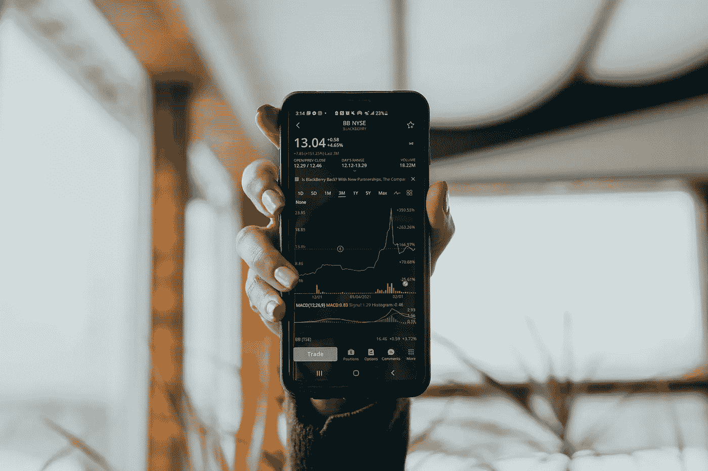

# 以下是拥有一整枚比特币的真实感受

> 原文：<https://levelup.gitconnected.com/heres-how-it-really-feels-to-own-an-entire-bitcoin-94ed393c9608>

## 提示:太可怕了。

科技日报在 [Unsplash](https://unsplash.com/s/photos/bitcoin?utm_source=unsplash&utm_medium=referral&utm_content=creditCopyText) 上拍摄的

起初我很害怕——我被吓呆了。我一直在想，把几万美元转到一个应用程序里，去买一些我永远看不到或摸不着的东西，是多么容易，因为它只存在于 shard imagination 里。我基本上是用钱去买不同的 T4 币。

然后是内啡肽。我被迷住了。

原因如下:

# 我厌倦了对我的钱负责。

面对现实吧，我们的文化奖励赌徒。它不再奖励那些努力工作、存钱的有才华的人了。

像我这样的人会受到惩罚和嘲笑。华尔街的混蛋嘲笑我们，因为他们知道当他们陷入困境时，我们总是在那里帮他们摆脱困境。他们拿着别人的钱玩得不亦乐乎，几乎从不面对后果。我厌倦了。

所以，这就是我买比特币的原因。我厌倦了负责任的，失败的一方。我想知道做一个鲁莽、自私的混蛋是什么感觉——哪怕只有几个星期。我想知道一夜暴富的快感。我想感受一下，就这一次，我没有错过一个巨大的机会。轮到我玩钱了。

很有趣，但也很糟糕。

我会解释的。

# 一开始，拥有一枚比特币感觉棒极了。

在我购买之后，比特币开始了一轮激进的牛市。这让我觉得自己很聪明，甚至是不可战胜的。我对自己非常满意。我幻想着与埃隆·马斯克和凯西·伍德一起喝酒。

我每十分钟检查一次手机。每一次，数字都在上升。我的未来开始闪烁着可能性。也许我会在即将到来的通货膨胀中幸存下来。或者买个稍微大点的家。或者不用卖血浆来支付我孩子的大学学费。

也许我们会过得很好。

坏消息没那么困扰我。当然，价格在上涨。气候变化正在使世界上的一些地区变得不适合居住。但是比特币就像一面盾牌。每个人都说它会升值，飞向月球，而世界其他地方陷入暴力疯狂。

我终于感到安全了。

# 我的良心开始折磨我。

不投资比特币的一个重要原因是能源成本。对于每一笔比特币交易，你都可以开着特斯拉从洛杉矶到纽约。那是完全没有道理的。

当你拥有一枚比特币时，你就在找借口。

我知道我做到了。

我寻找解释比特币对环境影响的文章，我找到了。他们很有说服力。但在这个问题上，事实有点让你难堪。如果开采比特币是环保的，我们就不需要数千个特别设计的钻机。

其他加密货币不会破坏环境，它们可能值得研究。但就像比尔·盖茨自己最近说的那样，加密货币是这个世界不可或缺的创新。

因此，这又是一个讽刺:你买了一枚比特币来抵御气候变化，结果却加剧了气候变化。

你觉得有必要证明这一点。

但是你不能。

# 统计占据了我的生活。

有钱人可以将大量现金投资于不稳定资产，然后一次忘掉它们几个星期。

还有谁能做到？

过了一天，我就离不开手机了。

有生以来第一次，我开始把它放在床头柜上，这样我可以在半夜查看我的资产。我很痛苦，但是不断的价格上涨掩盖了这一点。

损失几千美元不会让我破产，但有了比特币，你永远不知道下跌何时停止。对于一个有经验的投资者来说，我的情绪波动超过 10 个点可能看起来很业余。但你知道，当埃隆·马斯克的一条推文可以让你的资产在一小时内飙升或下跌 15%时，这有点令人不安。

埃隆·马斯克被允许一直想着钱。他可以像玩玩具一样玩它。作为一个职业父母，我不是。拥有一枚比特币两周就让人痛苦地明白了这一点。

# 狂热几乎控制了我。

我拥有比特币的时间越长，就越觉得有必要捍卫它免受批评。我开始嘲笑有关其波动性或能源消耗的言论。当珍妮特·耶伦(Janet Yellen)敦促谨慎或暗示监管时，我向她翻了个白眼。毕竟，对比特币的一个合乎逻辑的批评直接威胁到你的生计。你觉得有必要采取攻势。

我的经历证明了一个简单的观点。当你拥有比特币的大量股份时，你不会考虑什么对其他人或者这个星球是最好的。你需要别人投资。如果没有，那么你的资产就不会升值。如果有人开始抨击你投入了数千美元的东西，你会损失惨重。你觉得辱骂和人身攻击是正当的，就像一些读者已经做的那样。

你可以称这种行为为所有权偏见。当你深深投入一项事业时，你就不太可能客观地思考它。你失去了洞察力。你开始变得有防御性，甚至有攻击性。

最后，我完全理解了为什么有些人对怀疑论者如此愤怒，并试图将他们撕碎。

我也差不多这样做了。

# 最后，我不亏不盈。

两周后，我的投资使我赚了一万多美元。我要骑着比特币一路飙到十万或者更多，经历风风雨雨。这就是当风险投资对你有利时的感觉。你开始想也许你最终会得到你想要的未来。

后来，一天早上 6、7 点左右，我醒来时听到一个可怕的消息，我的比特币暴跌了 12%。

我想，这就是它了。

我们处在一个泡沫中，它正在破裂。前几周的收益正在蒸发，种种迹象表明情况会变得更糟。这开始看起来像是 2017 年或 2020 年的重演。

所以我卖了。

我用枯萎来安慰自己的温暖、安全的未来。现在我又回到了起点。没有更糟，也没有更好。

越来越像是我做了明智的决定。自撰写本文以来，比特币的价格已跌至远低于 5 万美元的关键支撑点。在这样的暴跌中坚持下去，是有盲目信仰的人或者有很多钱可以玩的人做出的选择。

我两者都没有。

# 投资比特币会给你带来惊人的快感。

我投资比特币只有一个原因。我想知道真正梦想拥有巨大财富的感觉，真正有机会通过一项投资把一点钱变成一大笔钱的感觉。嗯，感觉糟透了。直到之后的*，我才知道。*

对于我拥有整个比特币的时间来说，这太棒了。

它给了我惊人的快感。

放弃对金钱的控制让我对自己的未来有了一种讽刺的掌控感。我猜这就是毒品的作用。他们给你一个令人欣慰的幻觉，并通过抑制你的情绪让你沉浸在欣快感中。

把钱当玩具一样玩是非常有趣的。会上瘾的。我完全理解为什么像埃隆·马斯克这样的人现在还这么做。

我希望我能。

# 这就是投资的讽刺之处。

当你投资于比特币这样一种波动性较大的资产时，相比之下，你生活中的所有不确定性都显得微不足道。你承担所有其他风险，把它们集中到一个上下波动的数字上。

这是一种奇怪的安慰。

我认为*这就是为什么很多普通人投资，即使他们没有钱。他们不想担心一百件小事。他们想担心一件大事。这是他们的讽刺。承担一个巨大的风险会让你感觉更安全。*

如果那是谎言也没关系。

我们大多数人现在都陷入了财务困境，随着时间的推移，缓慢的投资回报没有实际意义，也永远不会有实际意义。我们不想再参与金融系统了。我们已经被烧伤太多次了。然而，我们被迫。我们的绝望，加上华尔街疯狂的贪婪，使得疯狂的选择看起来很理性。所以现在我们把比特币当成救世主，而事实并非如此。

对我来说，拥有一枚比特币就像是一个奇怪的梦，如果一个数字继续走高，一切都会好起来。

我很高兴我醒了。