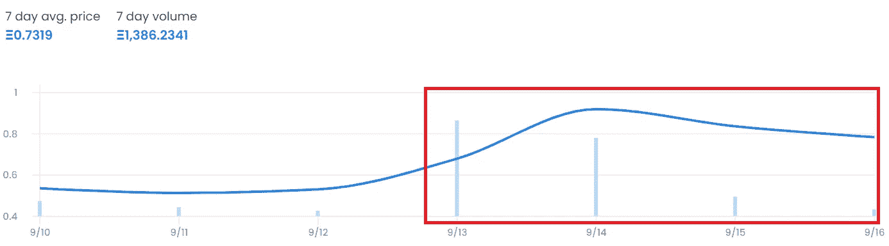

# 以下是 NFT 交易员如何每月赚 21000 美元的方法

> 原文：<https://levelup.gitconnected.com/heres-how-nft-traders-make-21-000-a-month-9474a1f48706>

这比你想象的要简单得多

[信用—金融时报](https://www.ft.com/content/9dda4d32-9723-11e7-8c5c-c8d8fa6961bb)

现在，NFT 交易处于历史最低点。

人们的杠杆率过高，在 2021 年，Opensea 上的 NFT 销量比历史最高水平下降了 [97.3%。](https://dune.com/rchen8/opensea)

人们的收入完全取决于个人努力和市场条件。

然而，市场仍然存在低效率。如果你付出努力，你仍然可以赚一大笔钱。

以下是你需要知道的。我们将深入探讨每个主题。

*   **如何找到后起之秀**
*   **了解买卖压力**
*   **“鲸鱼”正在购买该项目吗**
*   **如何理解二次销量**
*   **买入和卖出定价失误的非金融资产的策略**

免责声明—这些建议都不涉及使用机器人。机器人在速度方面工作得很好，购买地板令牌和批量报价，但它们仍然非常低效。

# 如何找到有前途的项目

一个很好的搜索网站；

*   **稀有.工具**

在他们登陆页面的顶部是一个“即将到来”的标签。

在“即将到来”下，你会看到每个项目铸造的时间和日期——项目社交媒体页面的令牌和链接的总供应量。

加入他们的纷争

*   **推特**

NFT 社区的核心在 Twitter 上。通过关注合适的人，你可以在 NFT 空间找到快速发布和新闻。

为了更好地了解 NFT 市场，你必须关注下面的人——为了方便起见，我链接了他们的 Twitter 个人资料。

*   [Punk6529](https://twitter.com/punk6529)
*   [NFT _ 神](https://twitter.com/NFT_GOD)
*   加里维
*   [Pio.eth](https://twitter.com/piovincenzo_)
*   [NFTNick.eth](https://twitter.com/allnick)
*   [Kix.eth](https://twitter.com/SpeculatorArt)
*   [EasyEatsBodega](https://twitter.com/EasyEatsBodega)
*   约什博布罗斯基
*   [DepecheNode_](https://twitter.com/DepecheNode_)
*   杰登莱维特(是我)

# 理解买卖压力

了解市场对一个项目的感受。

你必须使用；

*   **不和**
*   **推特**

你需要感受潜在的买卖压力。

如果你听到的是围绕项目长期价值而非底价的有识之士的对话，这可能意味着一个钻石手的坚实社区。

从而减少销售压力，推动价格上涨。

衡量一个项目的情绪的最好方法是阅读至少 50 条关于该项目的不和谐的评论和 Twitter 上的评论。

这些都应该是危险信号；

*   社区的大部分人对项目缺乏了解
*   谈论通过提高 NFTs 的价格来操纵底价
*   创始人在谈底价。

# 鲸鱼会买这个项目吗

我希望这部分不存在。

现实情况是，交易市场使用更多知名的 NFT 名字和买家作为安全信号。

因此，更多重要的钱包地址会收到垃圾邮件空投。

人们还意识到，规模较大的 NFT 买家会在一个项目中创造更高的交易量。所以至少值得追踪这个。

最好的网站是

*   [nftscoring.com](https://nftscoring.com/)

他们对正在进行的洞察收取订阅费。

如果你不想付这个钱，那就卷起袖子，看看那些大牌在 Twitter 上关注什么项目。你甚至可以使用我之前在帖子里发的 Twitter 链接。

# 如何理解二次销量

这是事实。

在搜索买卖 NFT 时，您需要一个二级销售量高、市场价值公平的项目。

这是你衡量公平市场价值的方法。

1.  在 [Opensea.io](https://opensea.io/) 上搜索项目
2.  检查“总体积”——这是总的 ETH 体积。
3.  检查“项目”——这是集合中有多少个 NFT。
4.  将“总体积”除以“项目”
5.  这将会给你一个强烈的暗示，如果底价被低估或高估。

**示例:**

[Veefriends 第一季](https://opensea.io/collection/veefriends):总体积= 57，000 ETH 除以 10，300 件藏品= 5.5ETH

目前的底价是 5.4 ETH——所以我可以看到这个价格可能是一个公平的市场价值。

几周前，底价是 15 eth——如果我进行精确的计算，我会发现市场对这些 NFT 定价过高。

**接下来是销量；**

1.  点击“活动”选项卡——在下面用红色圈出。

1.  按过去七天过滤—在下面以红色显示。

在这里你会明白每天到底有多少销售。

如果每天只有少量的销售，你就不太可能在这个项目中交易。

上例中的 [Veefriends](https://opensea.io/collection/veefriends/activity) 显示了低于底价的个位数日销售额。快速空翻是不够的。

或者，你可以给出“低价”报价，抓住机会，在市场回暖时卖出。

你必须寻找一个更大的项目。

*   查看 [Opensea 排名](https://opensea.io/rankings?sortBy=one_day_volume)，按量排序。
*   例如— [Renga](https://opensea.io/collection/renga) 位列前十，销量健康。
*   847—3 天前的销售
*   513 —两天前的销售
*   142—1 天前的销售

趋势向下，但仍有足够的量来成功地买卖。

# 买入和卖出定价失误的非金融资产的策略

现在你找到了一个值得交易的收藏；你需要[包装你的 ETH](https://decentralizedcreator.com/wrap-ethereum-eth-to-weth/) 并对集合中的每个 NFT 进行低价报价。

当购买低于底价的代币时，记得在出售时计入 [Opensea 的 2.5%费用](http://opensea.io)和创作者版税。

*   10%的版税给 Veefriends
*   Renga 的 5%版税

版税在你获得多少利润方面也起着重要的作用。

一些市场，如 Sudoswap，收取 0.5%的费用，并且不支付创作者的版税。

[Credit — Sudoswap Twitter](https://twitter.com/sudoswap)

我个人不是粉丝。对我来说，Web3 的全部本质是回馈创造者经济。

但是，你做你的。

我在这里写了一篇关于我的观点的博客——NFT 版税可能已经永远改变了——完全分割了 Web3。

## 最后

把尽可能多的报价放在底价以下；保证骨头上有足够的肉，以获得费用后的利润。

对于 Veefriends 来说，你需要从销售中获得 12.5%的利润才能达到收支平衡，所以要考虑周全。

有人谁是过度杠杆化或寻找快速出售购买其他东西会上钩。

这对你来说将是一个神奇的时刻，所以不要忘记拍拍自己的背。

立即列出你在略高于地板的地方买的 NFT，包括让你获利的费用。

在这一点上，购买高交易量项目的人并不担心，多付了 100 美元。尤其是当这些鲸鱼中的一部分人盲目扫地或者购买 NFT 的时候，他们主观上是喜欢的。

最后但同样重要的是。

冲洗并重复。

在 [Medium](https://t.co/0WsCUfngD2) 、 [LinkedIn](https://www.linkedin.com/in/jayden-levitt-aa93511b9/) 或 [Twitter](https://twitter.com/JaydenLevitt) 上关注我。

*本文仅供参考；不应将其视为财务、税务或法律建议。在做出任何重大财务决定之前，请咨询财务专家。*