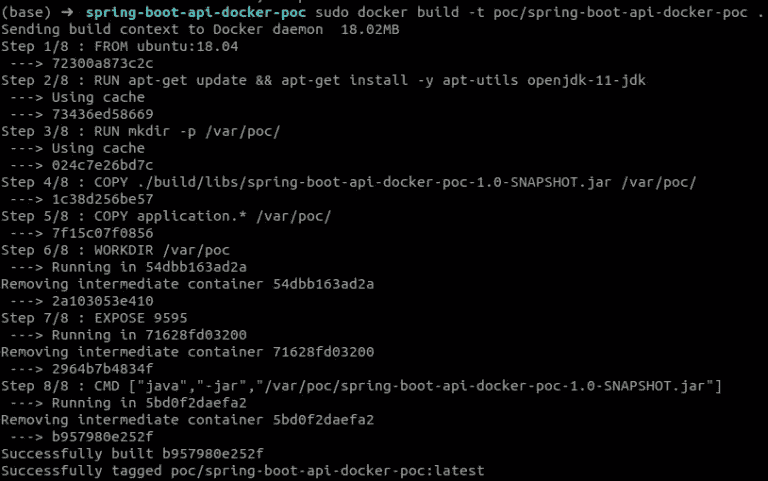

# 以下是如何对 Spring Boot 网络应用程序进行 Dockerize

> 原文：<https://levelup.gitconnected.com/heres-how-you-can-dockerize-a-spring-boot-web-application-c17e5db06632>

> 最初发表于 2020 年 3 月 24 日 https://blog.contactsunny.com。


今天码头工人无处不在。大多数大公司的许多项目都是作为 Docker 容器部署在生产中的。一旦你意识到这种方法是多么简单和有用，你就会想把所有的东西都归档。如今，许多工具和服务都提供了官方的 Docker 映像，因此您不必担心下载所有必需的依赖项、修复这些依赖项的版本冲突以及其他兼容性问题。Docker 简单来说就是安心。

但是我们如何开始呢？我经常被问到这个问题。这就是我写这篇文章的原因。开始很容易。您只需创建一个 Docker 文件，编写一个命令来下载所有的依赖项，将您的项目复制到 Docker 映像中，构建并运行它。在这篇文章中，我们将以一个简单的 [Spring Boot](https://blog.contactsunny.com/?s=spring+boot) web 应用程序为例，看看我们如何做到这一点。

# Spring Boot 网络应用程序

我写了一个简单的你好，世界！这方面的例子。你可以在我的 [GitHub repo](https://github.com/contactsunny/SpringBoot_Web_App_Docker_POC) 中看到这个项目和 Dockerfile 文件。项目中的自述文件为您提供了构建项目和运行项目以测试其工作方式所需的所有说明和命令。所以我不会在这里讨论构建 Spring Boot 项目的细节，但是我们会更多地讨论 Docker 部分。如果自述文件不清楚如何构建 Spring Boot 应用程序，请在评论中告诉我，我会帮你解决。

# 让我们把它归档


让我们一行一行地查看 docker 文件，因为如果您想将它应用于任何其他项目，了解每一行的作用是很重要的。

**第一行:来自 ubuntu:18.04**

任何 Docker 文件中的第一行告诉 Docker 使用哪个“基础”映像。这一行的意思是:从扩展我的 Docker 图片*另一个图片叫做 *ubuntu:18.04* 。该基础图像主要是一个[公共图像](https://hub.docker.com/_/ubuntu)。在某些情况下，每个公司或项目可能会创建一个自定义基础映像，所有其他映像都需要从该映像创建。在这种情况下，你会使用特定的图像。如果你想从 Java 中得到一个类似的东西来更好地理解这一点，这一行意味着“导入 ubuntu:18.04”因此 Docker 映像中的所有特性都可以在您的映像中使用。*

**第 2 行:运行 apt-get 更新&&apt-get install-y apt-utils open JDK-11-JDK**

当您从基础映像扩展时，在这种情况下是一个基本的 Ubuntu 18.04 映像，您不能保证它会有您需要的所有包。所以在这一行，我在更新 *apt* 库，然后安装 openjdk-11-jdk 包。我们需要 JDK 11 号来运行我们的 Spring Boot 网络应用。

**第 3 行:运行 mkdir -p /var/poc/**

我们需要 Docker 映像中的一个目录来保存我们所有的项目文件。所以在这一行中，我们运行 *mkdir* 命令来创建目录 */var/poc/* 。你可以用你想要的任何名字创建一个目录。

**第四行:复制。/build/libs/spring-boot-API-docker-POC-1.0-snapshot . jar/var/POC/**

一旦我们创建了目录，我们需要将我们的项目文件复制到该目录中，这样当我们运行 Docker 映像时，它将在 Docker 容器中可用。为此，在这一行中，我们将复制*。jar* 文件放到我们在上一步中刚刚创建的 */var/poc/* 目录中。这里，我们假设您已经构建了 Spring Boot 项目和*。jar* 文件已经创建。

**第 5 行:曝光 9595**

因为我们有一个运行在 Docker 容器中的 web 应用程序，为了与应用程序交互，我们需要打开端口。当我们在 Docker 容器内部的应用程序中打开一个端口时，该端口将在容器内部打开，在容器外部不可用。因此，如果你从浏览器向应用程序发送请求，它根本不会到达应用程序。为此，我们需要“公开”我们的应用程序正在监听的端口。在我们的示例中，这是端口 9595。所以在这行中，我们告诉 Docker*将*这个端口暴露给外界。稍后，当我们运行映像来创建容器时，我们将把这个公开的端口映射到主机上的另一个端口，这样请求就可以转发到 Docker 容器内的应用程序。

**第 6 行:CMD ["java "，"-jar "，"/var/POC/spring-boot-API-docker-POC-1.0-snapshot . jar "]**

这是我们文档的最后一行。这很容易理解。我们只是运行 *java -jar* 命令来运行我们的 Spring Boot web 应用。命令中给出的语法。这仅仅是运行 web 应用程序。

# 运行 Docker 映像来创建容器

现在我们已经准备好了 does 文件，并且理解了每一行的作用，我们将运行这个映像，看看我们的设置是否工作正常。但在此之前，我们需要首先创建一个图像。现在我们只有一个文档，还没有图像。要从 docker 文件创建图像，首先将 *cd* 放入 docker 文件所在的目录。然后，运行下面的 *docker build* 命令:

```
docker build -t poc/spring-boot-api-docker-poc .
```

如果您第一次运行这个命令，并且没有下载所有的依赖项，那么将会有大量的下载。这也包括基本的 ubuntu:18.04 映像。这可能需要一些时间。从第二次开始，它会快得多，因为没有什么可下载的。您的输出应该类似于以下内容:



此时，输出中的最后两行是我们感兴趣的。倒数第二行表示图像已经成功构建，并给出了图像的 ID。我们现在不需要它。最后一行说这张图片也被标记为最新的版本。这意味着您可以将同一个应用程序的多个版本作为不同的图像。您不必为不同版本的应用程序创建不同的 docker 文件。当您必须同时维护一个服务的不同版本时，这非常方便。

无论如何，一旦构建了映像，运行以下命令将该映像作为容器运行:

```
docker run -it -p 127.0.0.1:9595:9595 poc/spring-boot-api-docker-poc
```

正如您在命令中看到的，我们在这里使用了 *-p* 选项来将主机端口映射到容器中公开的端口。在本例中，我们将主机的端口 9595 映射到公开的端口 9595。但是您不必将主机中的同一个端口映射为公开的端口。也许有一些其他服务正在使用主机上的端口 9595。因此，您可以决定在主机上使用端口 9596。为此，只需在命令中更改端口号，如下所示:

```
docker run -it -p 127.0.0.1:9596:9595 poc/spring-boot-api-docker-poc
```

可以看到，主机的 9596 现在映射到了从容器中暴露出来的 9595:*127 . 0 . 0 . 1:****9596***。那很容易。现在让我们看看这个应用程序是否有效。在另一个终端窗口中，运行以下命令:

```
curl [http://localhost:9595/hello](http://localhost:9595/hello)
```

然后试着输入你的名字:

```
curl "http://localhost:9595/hello?name=Sunny"
```

您应该会看到类似于以下屏幕截图的输出:


看来我们的小实验成功了。我们已经成功地创建了一个简单的 Spring Boot web 应用程序，对其进行了 Dockerized，公开了所需的端口，并与应用程序进行了通信。开始并不困难，不是吗？但是，我们甚至还没有触及 Docker 的表面。这只是我们使用 Docker 需要知道的最基本的东西。使用 Docker，您可以而且应该做更多的事情。如果你有兴趣和我一起探索 Docker，请在评论中告诉我，我很乐意写更多。你可以在[我的 GitHub repo](https://github.com/contactsunny/SpringBoot_Web_App_Docker_POC) 上找到我们在这篇文章中使用的所有命令和代码。去探索吧。