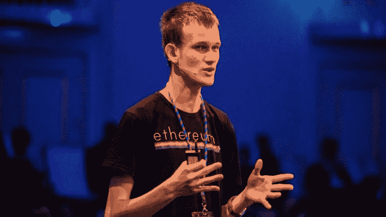
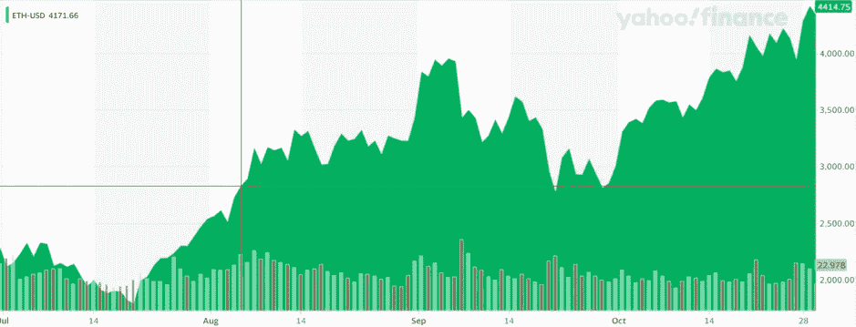

# 以下是如何利用 ETH 合并的优势——为什么它还没有定价。

> 原文：<https://levelup.gitconnected.com/heres-how-you-take-advantage-of-the-eth-merge-why-it-s-not-priced-in-yet-5288621b079e>

[信用—加密经济](https://crypto-economy.com/)

> “买谣言，卖新闻。”

这句话被普遍认为是准确的，而且重复得如此频繁，以至于令人生厌。

历史不会总是重演。

有时候押韵，大多数时候，如果大家想法都一样，那就是狗屁想法。

以太坊区块链正在走向利益共识的证明。
ETH 的股权证明举措旨在提高其可扩展性，并使区块链降低 99.95%的能耗。

短线专业交易者和狂热交易者将寻求利用自比特币和以太坊诞生以来加密领域最重要的新闻事件的势头。

在最“明显”的举动中，狂热的交易者会在 ETH 合并之前、期间或之后抛售他们的代币来出售新闻事件。

对于 Crypto 中的重要事件，可以在事件发生之前很好地“定价”。

因此有了这个说法。

> “买谣言，卖新闻。”

这一次，比赛场地不同了。交易者可能已经在价格中对冲了对事件的恐惧和不确定性。

如果这七年的承诺变成一个巨大的失败会怎样？或者稍微不那么令人担忧的是，合并被推迟了？

没人知道。

我们不能做的一件事是预测未来。

不过我们可以看看 ETH 过去的一个重大历史事件，就是 2021 年 8 月 5 日的 EIP1559(又名伦敦硬叉)更新。

这一事件改变了以太坊的收费机制，取消了第一名拍卖作为汽油费的计算方式。

那是一口饱；还记得你去铸币 NFT 项目，但一条鲸鱼俯冲下来，出价高于你，创造了一个天然气战争？

嗯，他们固定了一个固定的基本费用。事实证明这是一件大事。

虽然合并和 EIP1559 是规模完全不同的事件，但市场对这两个事件的反应可能是相似的。

以下是一些令人兴奋的数据，说明 EIP1559 的价格走势可能与 ETH 合并后的情况相关。

# 以太坊价格时间表，2021 年 EIP1559 更新前:

> 7 月 20 日—1787.51 美元
> 7 月 22 日—2025.20 美元
> 7 月 24 日—2189.22 美元
> 7 月 26 日—2233.37 美元
> 7 月 28 日—2296.55 美元
> 7 月 30 日—2466.96 美元
> 
> 8 月 1 日—2561.85 美元
> 8 月 2 日—2610.15 美元
> 8 月 3 日—2502.35 美元
> 8 月 4 日—2724.62 美元
> 
> **8 月 5 日(EIP1559 日)——$ 2827.33**
> [(数据来自雅虎财经)](http://eyJpbnRlcnZhbCI6ImRheSIsInBlcmlvZGljaXR5IjoxLCJjYW5kbGVXaWR0aCI6MTAuMjI5NTA4MTk2NzIxMzEyLCJmbGlwcGVkIjpmYWxzZSwidm9sdW1lVW5kZXJsYXkiOnRydWUsImFkaiI6dHJ1ZSwiY3Jvc3NoYWlyIjp0cnVlLCJjaGFydFR5cGUiOiJtb3VudGFpbiIsImV4dGVuZGVkIjpmYWxzZSwibWFya2V0U2Vzc2lvbnMiOnt9LCJhZ2dyZWdhdGlvblR5cGUiOiJvaGxjIiwiY2hhcnRTY2FsZSI6ImxpbmVhciIsInBhbmVscyI6eyJjaGFydCI6eyJwZXJjZW50IjoxLCJkaXNwbGF5IjoiRVRILVVTRCIsImNoYXJ0TmFtZSI6ImNoYXJ0IiwiaW5kZXgiOjAsInlBeGlzIjp7Im5hbWUiOiJjaGFydCIsInBvc2l0aW9uIjpudWxsfSwieWF4aXNMSFMiOltdLCJ5YXhpc1JIUyI6WyJjaGFydCIsIuKAjHZvbCB1bmRy4oCMIl19fSwibGluZVdpZHRoIjoyLCJzdHJpcGVkQmFja2dyb3VuZCI6dHJ1ZSwiZXZlbnRzIjp0cnVlLCJjb2xvciI6IiMwMDgxZjIiLCJzdHJpcGVkQmFja2dyb3VkIjp0cnVlLCJyYW5nZSI6eyJkdExlZnQiOiIyMDIxLTA2LTMwVDIzOjAwOjAwLjUwMFoiLCJkdFJpZ2h0IjoiMjAyMS0xMC0zMVQyMzo1OTowMC41MDBaIiwicGVyaW9kaWNpdHkiOnsiaW50ZXJ2YWwiOiJkYXkiLCJwZXJpb2QiOjF9LCJwYWRkaW5nIjowfSwiZXZlbnRNYXAiOnsiY29ycG9yYXRlIjp7ImRpdnMiOnRydWUsInNwbGl0cyI6dHJ1ZX0sInNpZ0RldiI6e319LCJzeW1ib2xzIjpbeyJzeW1ib2wiOiJFVEgtVVNEIiwic3ltYm9sT2JqZWN0Ijp7InN5bWJvbCI6IkVUSC1VU0QiLCJxdW90ZVR5cGUiOiJDUllQVE9DVVJSRU5DWSIsImV4Y2hhbmdlVGltZVpvbmUiOiJVVEMifSwicGVyaW9kaWNpdHkiOjEsImludGVydmFsIjoiZGF5In1dLCJzdHVkaWVzIjp7IuKAjHZvbCB1bmRy4oCMIjp7InR5cGUiOiJ2b2wgdW5kciIsImlucHV0cyI6eyJpZCI6IuKAjHZvbCB1bmRy4oCMIiwiZGlzcGxheSI6IuKAjHZvbCB1bmRy4oCMIn0sIm91dHB1dHMiOnsiVXAgVm9sdW1lIjoicmdiYSgyMDAsIDI0MCwgMjIwLCAwLjgpIiwiRG93biBWb2x1bWUiOiJyZ2JhKDI1NSwgNDgsIDYwLCAwLjgpIn0sInBhbmVsIjoiY2hhcnQiLCJwYXJhbWV0ZXJzIjp7IndpZHRoRmFjdG9yIjowLjQ1LCJjaGFydE5hbWUiOiJjaGFydCIsInBhbmVsTmFtZSI6ImNoYXJ0In19fSwiY3VzdG9tUmFuZ2UiOnsic3RhcnQiOjE2MjUxODA0MDAwMDAsImVuZCI6MTYzNTYzNDgwMDAwMH19)

你可以看到价格趋势在活动开始前向上。在投机性的加密市场，你可以说这没什么不寻常的。

你还应该考虑到当时略有不同的市场条件和宏观经济环境。

这也是 NFT 夏天的高潮，我们都认为我们将从我们的 Jpegs 图片中获得世代财富。

以下是对 EIP1559 更新前后几个月发生的事情的更广泛的看法。

红色 X 标记 8 月 5 日，EIP1559 更新的日子。下面的日期范围是从；

> **2021 年 7 月 1 日-2021 年 10 月 31 日**

虽然看短期图表有时可能是无意义的，但以太坊历史上的这一重大事件确实描绘了一幅在即将到来的合并期间可能发生的引人注目的画面。

以下是以太坊联合创始人 Vitalik Buterin 在无银行播客上被问及合并时所说的话。

> “合并正越来越多地出现在人们的眼前。从市场和心理叙事的角度来看，它仍未被“定价”
> 
> “有些人仍然认为股权证明是噪音，大多数人认为它不会去任何地方；在合并发生之前，它(合并)可能不会被定价。”

图表和历史参考资料显示，维塔利克的预测可能是正确的。

我们有什么资格与自印刷术以来最有影响力的技术的创始人争论呢？

太棒了，这一切对你来说意味着什么？

这里有四种方法可以让你利用合并的优势

1.  坐在以太坊上，如果价格上涨，活动成功，就分阶段卖出。然后在价格暴跌时回购。
2.  根本不要卖，因为你是钻石手。
3.  现在坐在菲亚特上，等待可能的购买行动，因为目前的宏观经济环境是一场狗屎秀。
4.  或者我个人最喜欢的，对冲和做这三件事，因为其他任何事情都只是猜测。

在 [Medium](https://t.co/0WsCUfngD2) 、 [LinkedIn](https://www.linkedin.com/in/jayden-levitt-aa93511b9/) 或 [Twitter](https://twitter.com/JaydenLevitt) 上关注我

***以上都不是理财建议。我不是一个合格的财务顾问，尽管我尽了最大努力，我也无法预测未来。***

***NFT，Web3 &加密空间是有风险的。***

***专家说，目前 99%的项目都在走向 0。***