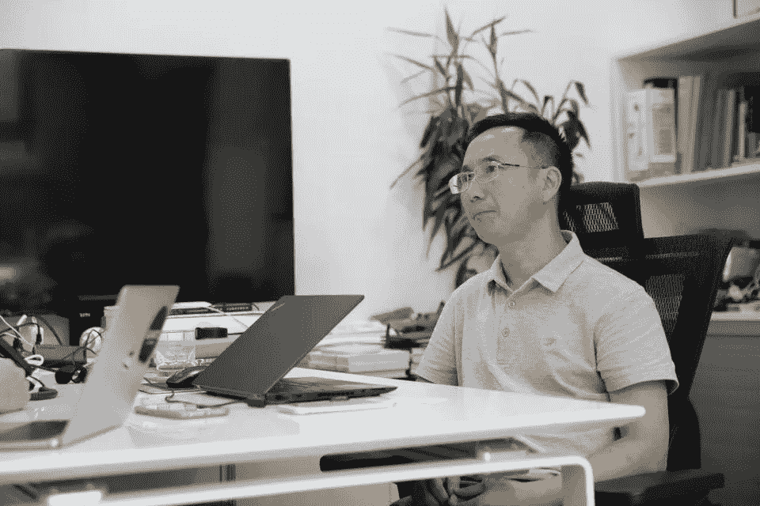
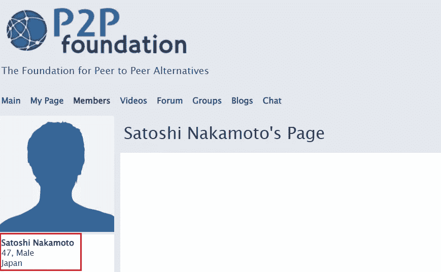
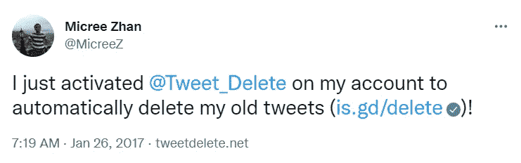
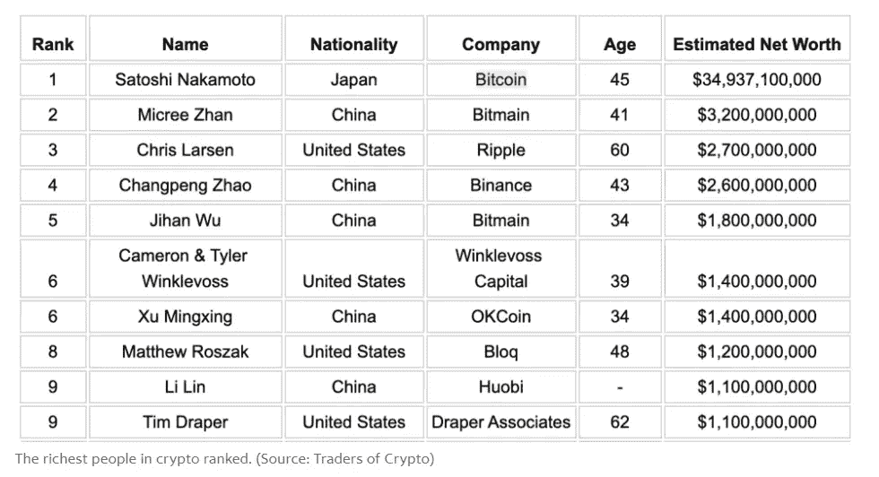

# 这是世界上已知最大的比特币持有者——你从未听说过。

> 原文：<https://levelup.gitconnected.com/heres-the-world-s-largest-known-bitcoin-holder-you-ve-never-heard-of-8d11a9a9a55e>

线索；这不是中本聪。

[资料来源——福布斯——米奇·詹](https://www.forbes.com/sites/jasmineteng/2018/08/28/meet-the-little-known-billionaire-co-founder-of-chinese-crypto-firm-bitmain-micree-zhan/?sh=4ee90107234d)

[中本聪](https://en.wikipedia.org/wiki/Satoshi_Nakamoto)是一个虚构的开发比特币的人或一群人。

他们是著名的比特币[白皮书](https://en.wikipedia.org/wiki/White_paper)的作者，创造并实现了比特币，并设计了第一个[区块链](https://en.wikipedia.org/wiki/Blockchain)数据库。

这种去中心化的公共分类账系统完全改变了我们生活的方向。这是自互联网甚至印刷术以来最重大的技术进步。

直到 2010 年 12 月，中本聪一直积极参与比特币的开发

他的真实身份总是引起广泛的猜测，主要是各种各样的社会攀登者为了他们在聚光灯下的 15 分钟而攀登。

声称中有疯狂的澳大利亚计算机科学家克雷格·史蒂夫·赖特。Wright 赢得了一场针对他死去的商业伙伴的家庭的诉讼，该家庭起诉他要求得到他 500 亿美元加密货币财产的一半。

陪审团判给这个家庭 1 亿美元，作为他们共同拥有的知识产权。

根据他的资产净值来看，这是一笔小数目。

自从赖特在 2016 年[声称自己是比特币](https://www.theguardian.com/technology/2016/may/02/craig-wright-bitcoin-founder-satoshi-nakamoto-claim)的发明者以来，除了说，他从未提供任何证据。

> “我来早了”。

我们不都是克雷格吗？

莱特的律师后来站出来说，他的历史和成功足以证明这一点。他们拒绝提供他是发明者的加密证据。

来自美国或欧洲的软件和密码专家对中本聪的身份进行了推测。

去想想。

尽管中本聪的名字是日本人，并且在他 2012 年的基金会简介中声称他是一名居住在日本的 37 岁男子，但考虑到他的英语理解水平，这可能不太可能。

[来源——基金会 P2P——中本聪今天 47 岁](https://p2pfoundation.ning.com/profile/SatoshiNakamoto)

## 本博客顶部的图片是世界上已知最大的比特币持有者。

我向你介绍。

鼓声。

## **米奇·詹**

这个人虽然不起眼，却是个天才。詹是一个充满幻想的人，一直远离公众的视线。

网上几乎没有詹的信息，甚至连采访都没有。[他的推特](https://twitter.com/MicreeZ)页面已经删除了从 2017 年开始的历史推文，并且自 2022 年 7 月起不再活跃。

[来源——米奇·詹推特](https://twitter.com/MicreeZ/status/824517209733136384)

令人惊讶的是，他只有 3000 名推特粉丝。

你不会想到唐纳德·特朗普式的推特风暴，但作为世界上最富有的人之一，你会认为他会有一些游戏。

那么除了毫无生气的推特信息，我们还知道詹什么呢？

他是个天才，他的财富不是侥幸得来的。

2001 年从山东大学电气工程专业毕业后，詹于 2004 年从中国科学院微电子研究所获得工程硕士学位。

他到清华大学工作，在信息技术研究所担任研发工程师。

2010 年，他创办了一家名为 Diva IP technologies 的初创公司，为机顶盒制造芯片。

老式的有线电视盒有一个电视解码器，前面有一个按钮可以调谐你的电视。

令人惊讶的是，当比特币出现时，它们仍然存在。

詹认识了他的商业伙伴[吴](https://en.wikipedia.org/wiki/Jihan_Wu)；两人共同创建了一家名为比特大陆的采矿芯片制造公司。

詹的商业伙伴吴是第一个将比特币白皮书翻译成中文的人。

在该公司进行首次公开募股(IPO)时，有人在一份简报中透露，詹持有该公司 36%的股份，吴持有 26%的股份。

詹是这家公司的幕后策划者。

很容易理解为什么这两个人拥有世界上大部分的比特币。如果你拥有一家比特币芯片制造公司和数百个比特币农场，你应该很富有。

就像你小时候父母告诉你的摇钱树。它存在。只不过它不是长在树上，而是长在农场里。比特币采矿场。

如果你想知道的话，这里有一份根据雅虎财经统计的前十名比特币持有者的名单。

[来源——雅虎 2021 年比特币排行榜|估计净值可能有所不同](https://au.finance.yahoo.com/news/bitcoin-rich-listers-200427764.html)

在[媒体](https://t.co/0WsCUfngD2)、 [LinkedIn](https://www.linkedin.com/in/jayden-levitt-aa93511b9/) 或 [Twitter](https://twitter.com/JaydenLevitt) 上关注我。

*本文仅供参考；不应将其视为财务、税务或法律建议。在做出任何重大财务决定之前，请咨询财务专家。*