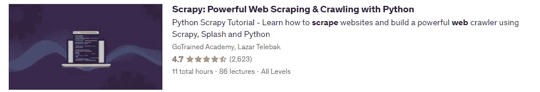
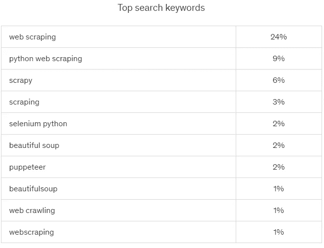
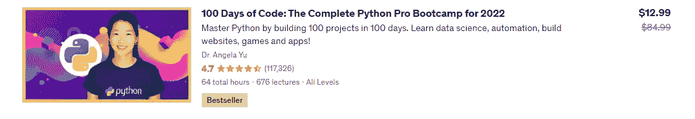
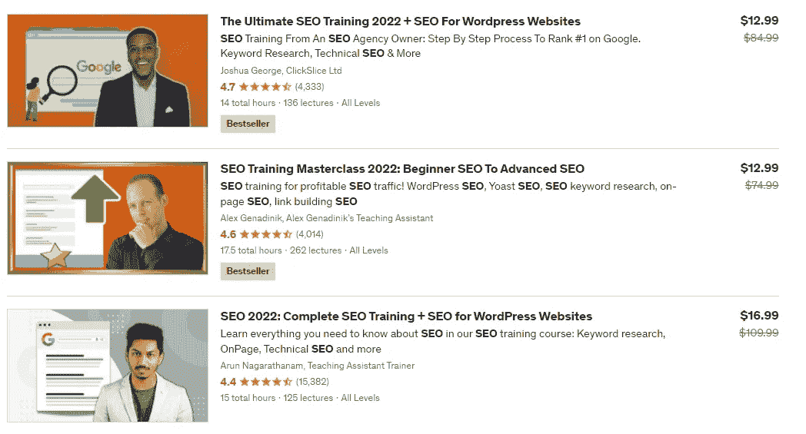

# 以下是我从逆转 Udemy 排名算法中学到的东西

> 原文：<https://levelup.gitconnected.com/heres-what-i-ve-learned-from-reversing-the-udemy-rankings-algorithm-d776ef6ed23c>

**逆向——逆向工程，或者至少是假装。*

由[丹尼尔·肖斯塔克](https://unsplash.com/@max010?utm_source=medium&utm_medium=referral)在 [Unsplash](https://unsplash.com?utm_source=medium&utm_medium=referral) 上拍摄的照片

**问题描述:**将你的内容放在排名表的顶部会带来更多的浏览。句号。在谷歌是这样，在 Udemy 也毫无疑问是真实的。但是怎么登顶呢？

# 特征

每门 Udemy 课程都有以下特点:

*   课程名称
*   课程字幕
*   课程描述
*   学生人数
*   评论数量
*   评级
*   赛程距离
*   课程价格
*   讲座名称

以及潜在地对用户不可用但对站点开发者可见的一些其他特征。为了简单起见，让我们假设像 referrer URL 或用户的国家这样的特征不是那么相关，并检查只有上述这些特征如何影响最终的位置。

# Udemy 知道术语化

词汇化是将一个词的不同屈折形式组合在一起的过程，这样它们就可以作为一个项目进行分析。例如，术语“walk”可以用其变形形式来分组，“walks”、“walked”和“walking”。这个过程是文本分析的标准，因为它减少了文档中唯一单词的数量，从而更容易识别模式和趋势。词汇化对于诸如信息检索这样的任务也是有帮助的，Udemy devs 似乎也同意这一点。

进入 Udemy 搜索，输入“网络抓取”。而在顶部 3，你只会看到严格输入的课程(“网络抓取”)，在页面的中间，你会看到算法在描述中突出显示了像“抓取”这样的词。

注意描述中粗体的“刮擦”。

这有助于优化你的标题和描述，因为你可以从低频请求中获取更多的流量。您可以使用 Google Keywords Planner 或 Udemy 的 Marketing Insights 工具找到与您的主题相关的关键词:

来自营销洞察工具的“网络抓取”流量份额

# 鲸鱼得到更多

Udemy 上的一些课程非常好，涵盖的内容超出了它们的设计范围。例如，这里有几个例子，学习材料不符合搜索请求，但 Udemy 仍然提供它，因为许多学生正在学习它，他们与通常提出初始请求的人有相似的兴趣。

Angela Yu 博士关于 Python 的一个很棒的课程是“网络抓取”中的第五课

# 古老的 SEO 作品

2010 年，谷歌的 SEO 就是通过创建关键词丰富的标题和元标签，为搜索引擎优化你的网站。虽然这些方法仍然有效，但它们没有考虑用户体验。因此，许多人开始专注于创造更多信息和吸引人的内容，而不是关键词。现在，SEO 更多的是为用户创造一个良好的整体体验，而不是为搜索引擎优化。在乌德米，老把戏仍然是黄金。

数数你在排名前三的搜索引擎优化课程中看到“搜索引擎优化”的次数

看起来该算法对关键字垃圾邮件几乎没有理解。关键术语提得越多越好。仅仅是从“网络抓取”切换到“使用 python 进行网络抓取”就把我的课程从“Python 网络抓取”的第二页移到了第一页。

**免责声明:** *谷歌，老实说，我并不是在这里试图为特定的关键词进行优化。*

如果你也考虑其他要求，你会发现有时 Udemy 会提供一些与主题无关的课程，但会有一些关于主题的讲座。大概，Udemy 认为有总比没有好。

# 没有深度学习的迹象

这个先前的提示意味着算法中没有再训练，并且纯粹是统计的。虽然谷歌从你的网站上抓取新内容后需要时间来更新排名，但 Udemy 似乎马上就能做到。这可以帮助你更快地优化你的课程元数据，但我没有意识到内容频繁变化的负面影响。*所以，也许，有一个惩罚。*

# 尺寸很重要

向上滚动到功能列表，进行长时间的评估，然后回到这里。在哪些属性上最容易产生差异？我们已经知道，滥发标题、副标题、描述和讲座名称会起作用，但在 Udemy 还有其他聪明的女士和先生们。人们已经意识到了这一点，大多数主题的前 10 名将会被大量优化。你不能对评分和学生人数或评论做太多，因为你首先需要流量来获得所有这些。除了价格，可以说价格对排名没有影响，只剩下一个特征——球场的长度。

快速浏览一下 Udemy 的网站，就会发现一个惊人的事实:他们的绝大多数顶级课程都是 10 小时或更长。在一个时间越来越宝贵的世界里，Udemy 选择推出需要如此大量时间投入的课程似乎有些奇怪。此外，这些课程中的许多主题都在快速变化，这意味着这些材料在课程结束时可能会过时。更糟糕的是，有些课程似乎只是试图利用当前的趋势赚钱。在一个人们追求质量胜于数量的时代，看到 Udemy 仍然重长度轻实质，令人失望。

# 结论

这篇文章没有被认为是科学的，所以这里的大多数结论都是模糊的，没有数据证明。我很乐意在下一部分中修复它，但我希望首先得到反馈。让我知道，如果你需要更详细的 Udemy 排名算法✌️逆转

# 分级编码

感谢您成为我们社区的一员！更多内容见[级编码出版物](https://levelup.gitconnected.com/)。
跟随:[推特](https://twitter.com/gitconnected)，[领英](https://www.linkedin.com/company/gitconnected)，[通迅](https://newsletter.levelup.dev/)
**升一级正在改造理工大招聘➡️** [**加入我们的人才集体**](https://jobs.levelup.dev/talent/welcome?referral=true)