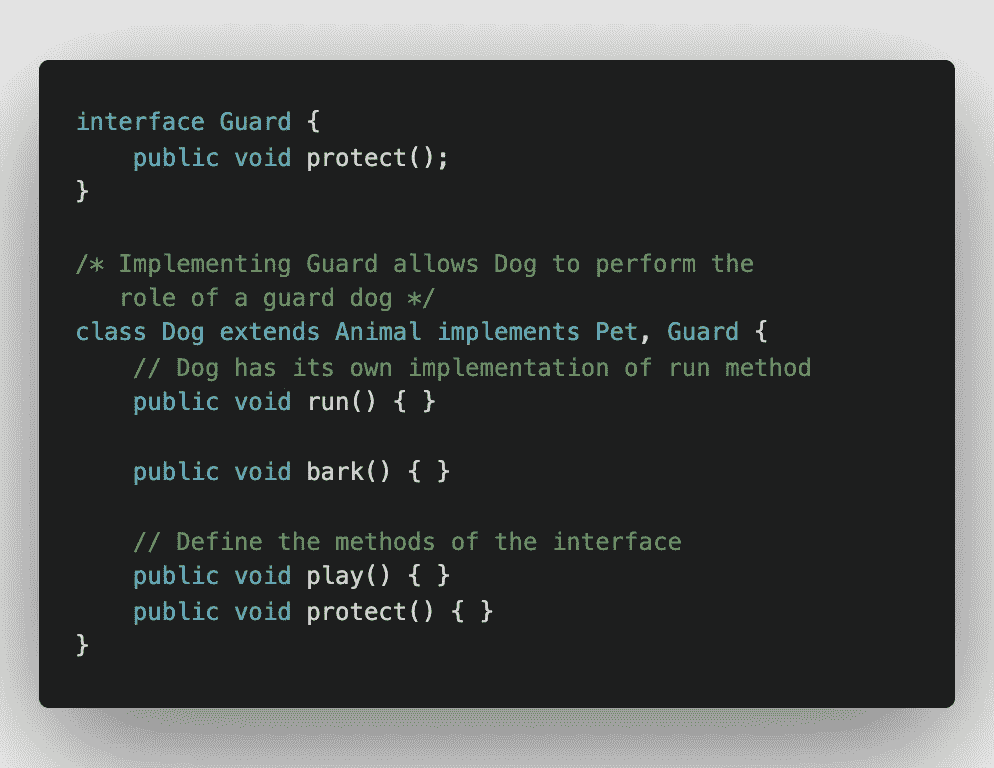

# 以下是你应该知道的关于接口的知识

> 原文：<https://levelup.gitconnected.com/heres-what-you-should-know-about-interfaces-808be7852ef7>


詹姆斯·哈里逊在 [Unsplash](https://unsplash.com?utm_source=medium&utm_medium=referral) 上拍摄的照片

在[之前的一篇](https://medium.com/@kunal.nalawade25/oop-just-a-glimpse-354815efd81e)文章中，我给了你 OOP 世界的一瞥及其概念的概述。但是有一个概念我想单独介绍一下，那就是接口。要理解接口，你首先需要知道什么是[抽象类](https://www.javatpoint.com/abstract-class-in-java)。

# 接口和抽象类有什么不同？

抽象类不能被实例化(你不能创建它的对象)，它们必须有一个子类。抽象函数没有主体，必须在子类中重写。

接口就像一个抽象类，只是它的所有方法都是抽象的，变量是公共的、静态的和最终的(常量)。接口不能有实例变量和方法实现(默认方法除外),抽象类不是这样。一个类可以实现多个接口，但是不管抽象如何，只能扩展一个类。

# 什么是接口？

接口用于实现抽象。在 Java 中，接口的声明方式如下:

```
interface ABC {
   void fun1();
   int add(int a, int b);
}
```

接口中的方法没有主体，因为它们都是抽象的。下面是一个类如何实现一个接口。

```
class A implements ABC {
    void fun1() { ... }
    int add(int a, int b) { ... }
}
```

当你实现一个接口时，你必须定义它的所有函数，否则，编译器会抛出一个错误。

实现接口是一种继承形式，其中类继承接口内的方法和变量。接口用于实现多态性，这提供了最大的灵活性。您可以以任何方式实现这些方法。

这样考虑吧，扩展一个类就像出生在一个具有某些固定特征的家庭中，而实现一个接口就像学习其他不依赖于你的层次结构的东西。

# 什么时候使用接口？

如前所述，当您想要实现抽象和多态时，请使用接口。当一个类实现一个接口时，这个类来自哪个层次(继承)并不重要。任何类都可以实现一个接口并覆盖它的函数。当你希望你的类执行一个特定的**角色**时，使用接口。

考虑下面的例子。


我们有一个 *Dog* 类，它扩展了 *Animal* 类并覆盖了它的一个方法。现在，让我们创建一个接口 *Pet* 并让 *Dog* 实现它。


一旦*狗*实现了接口，它就必须定义*宠物*的方法。在这个例子中，*狗*是*动物*层次的一部分，并且能够继承*动物*的大部分属性。但是它可以通过实现接口来扮演宠物的角色。

在这里，*狗*是-A *动物*，是-A *宠物* (IS-A 是继承关系)。*宠物*接口也可以被其他扩展*动物*的类使用，例如*猫。*

狗还可以通过实现另一个接口来执行额外的角色。



在这里，*狗*可以扮演*宠物*以及*守卫*的角色。*守卫*接口可由想要扮演*守卫*角色的类使用，例如属于不同层级的*人、*。

上面的例子给出了接口的另一种用法，即多重继承。

## 多重遗传

在这里，一个类可以有多个父类，因此可以从每个父类继承属性。不幸的是，Java 不允许多重继承(至少不直接)。

在 Java 中，一个类不能扩展多个类，但是可以实现多个接口。如上例所示，扩展了 *Animal* 类的 *Dog* 能够实现多个接口，这些接口指示了它扮演的各种角色。

所以，如果你想让一个类继承特定角色的属性，接口就是为你准备的。一个类可以通过接口扮演多个这样的角色。最棒的是，这个类来自哪个层次并不重要。它所要做的就是实现接口，然后就万事大吉了。

# 其他功能

到目前为止，我们已经学习了接口的主要概念及其用例。现在，让我们看看其他一些特性。

## 扩展接口

接口可以像类一样扩展，其中子接口继承父接口的所有成员。参见[本](https://www.tutorialspoint.com/how-to-extend-interfaces-in-java)中的示例。

与类不同，一个接口可以扩展[多个接口](https://www.tutorialspoint.com/can-an-interface-in-java-extend-multiple-interfaces)。

## 默认方法

接口中的默认方法有一个函数体。等等，什么？我们认为所有的接口方法都是抽象的。这是真的，但是 Java 允许您向接口方法添加实现。

没有必要重写默认方法，尽管您可以这样做。

使用*默认*关键字定义默认方法:

```
interface Guard {
    public void protect();

    public default void fight() {
        // body of the function
    }
}
```

默认方法的目的是什么？考虑上面只有 *protect()* 方法的接口。假设您有许多实现接口的类。现在，如果您想要添加一个新的功能，在这个例子中，就是 *fight()* 方法，您将不得不跟踪所有实现接口的类来定义这个方法。这可能会变得非常乏味，并引入冗余。

相反，您可以使用默认方法添加一个默认的 *fight()* 实现，它将被所有的类继承。如果您有不同地使用 *fight()* 的类，您可以只修改那些类。

## 创建接口对象

您不能创建接口的对象并实例化它。但是您可以创建该接口的引用变量。

考虑前面例子中的保护接口。我们来看一个实现 Guard 的 Man 类。

```
class Man implements Guard {
    public void protect() { ... }
}// In the main method
Guard guard = new Man();   // This is allowed
guard.protect();
```

## 接口中的静态和私有方法

一个接口可以有静态和私有方法。访问[此处](https://www.geeksforgeeks.org/static-method-in-interface-in-java/)查看接口中静态方法的演示。

私有方法通常用作接口中任何其他公共方法的辅助方法。参见[本](https://www.tutorialspoint.com/can-we-use-private-methods-in-an-interface-in-java-9)实施。

# 结论

接口用于实现两件事，抽象和多态。当一个类实现一个接口时，它必须覆盖所有的方法。任何层次结构中的类都可以实现一个接口，因此提供了很大的灵活性。接口允许你在 Java 中实现多重继承。像类一样，它们可以有静态和私有方法，也可以被扩展。但是，它们不能直接实例化。

如果您无法理解内容或对解释不满意，请在下面评论您的想法。新想法总是受欢迎的！如果你喜欢这篇文章，请订阅并关注我的每周更新。到那时，再见！！