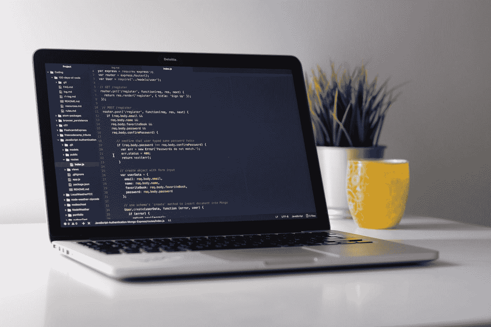

# 下面是您应该了解的 Java 异常处理

> 原文：<https://levelup.gitconnected.com/heres-what-you-should-know-about-java-exception-handling-5ed08669ad21>



照片由 [Unsplash](https://unsplash.com?utm_source=medium&utm_medium=referral) 上的 [Clément Hélardot](https://unsplash.com/@clemhlrdt?utm_source=medium&utm_medium=referral) 拍摄

想象一下，你正在 YouTube 上看视频，突然，你的互联网连接断开了。app 表现如何？会崩溃吗？不，它只是给你显示信息，“没有互联网连接”。

不管你的代码有多棒，有些事情就是超出了你的控制范围！如果你的代码的一部分依赖于外部行为，比如互联网连接，那就不能保证你的代码会一直工作。

幸运的是，Java 提供了一种机制来处理这些情况，称为**异常处理。**在这篇文章中，我将通过例子解释异常处理中的重要关键字，以便您可以在下一个 Java 应用程序中实现它们。

## 异常处理的重要性

我们先来了解一下异常处理的重要性。当你的代码没有按预期运行时，程序**抛出**异常。

例如，您的代码可能包含一个从服务器获取一些数据的函数。如果服务器关闭，您的代码将无法继续正常执行，因此，您的应用程序将崩溃。

因此，您需要编写处理这些情况的代码。如果您的代码与文件、服务器或线程一起工作，则不能保证它正常工作。因此，异常处理成为强制性的。

```
// Fetch data from the server
String data = fetchData()/* There is no guarantee the above code would work as expected
If the server is down, the flow of the program is interrupted and its execution stops. *//* The subsequent code depends on the data */...rest of the code ...
```

异常处理确保即使出现问题(抛出异常)，程序也能继续执行。它还帮助您理解代码在各种情况下引发的异常。

# 尝试捕捉块

当你写一个可能不起作用的函数(有风险的函数)时，你需要处理它抛出的异常。以下面的方式用 try-catch 块包围有风险的函数。

```
try{
    riskyFunction();  // Function that might throw an exception
} catch(Exception e){
  // Handle exception here
}...rest of the code...
```

这里，如果 try 块内部出错(本例中为*risky function)*，catch 块内部的代码将被执行。这类似于生活；“尝试一些有风险的事情，但如果不起作用，一定要抓住任何问题”。(注意:*如果定义了 try 块，就得定义 catch 或者 finally 块，否则编译器抛出错误)。*

catch 中的参数是包含代码抛出的异常的异常对象。在 Java 中，Exception 是一个具有各种子类的类，这些子类指示特定类型的异常，例如 ArithmeticException。参考[本](https://rollbar.com/blog/java-exceptions-hierarchy-explained)了解异常类层级，即其子类。

让我们以从远程服务器获取数据的代码为例。*数据*被声明为列表类型变量，因为服务器被期望发送列表。

```
List data=null;
try{
      data=fetchData();
} catch(IOException e){
   // Handle exception here
}
```

try 块中的代码从远程服务器获取数据。如果无法连接到服务器，该函数将抛出一个异常( [IOException](https://docs.oracle.com/javase/7/docs/api/java/io/IOException.html) )。

现在，让我们假设服务器响应，但不发送任何数据。*数据*变量仍然为空，如果您试图使用*数据*执行任何操作，代码将抛出另一个异常(**NullPointerException(hyperlink this)**)。

一个 try 块可以有多个 catch 块。

```
Object data=null;
try{
      data=fetchData(); // Get the first element of the list 
      System.out.println(data.get(0));} catch(IOException e){
   // Handle IOException here
} catch(NullPointerException e){
   // Handle NullPointerException here
} catch(Exception e){
   // Handle any other exceptions here
}
```

这里，我处理了代码可能抛出的两个异常。虽然这里不是这样，但是如果您的代码可能抛出更多您不知道的异常，它们将在第三个 catch 块中处理。因为 Exception 是一个超类，所以它可以保存任何异常对象。

如果您想以同样的方式处理异常，您可以编写一个 catch 块。

```
Object data=null;
try{
      data=fetchData();// Get the first element of the list 
      System.out.println(data.get(0));} catch(Exception e){
   // Handle your exceptions here
}
```

# 最终块

无论是否发生异常，该块都用于编写“清理”代码。什么是清理代码？如果你的危险函数打开了任何文件或服务器/数据库连接，你需要在最后关闭它们以避免任何[资源泄漏](https://quora.com/What-is-resource-leak-in-Java)。

不管有什么异常， *finally* 块总是会执行，所以在块内编写任何清理代码是有意义的。

假设我们已经打开了一个到服务器的连接。

```
try{
    openConnection();
 // Other risky operations} catch(Exception e){
   // Handle exception here
} finally {
  //  Cleanup code
    closeConnection();
}
```

我们有一个 *catch* 块来处理任何异常，还有一个 *finally* 块来关闭连接。这里，关闭连接是您的清理代码。

如果你有一个*最终*块，你可以跳过*捕捉*块。

```
try{
    openConnection(); 
 ...Other risky operations...} finally {
  //  Cleanup code
    closeConnection();
}
```

# 投掷 vs 投掷

当你捕捉到一个异常时，必须有一个抛出它的函数。我们把它贴上了风险函数的标签。在它的实现中，您会发现显式代码，用于在出现问题时抛出异常。

以如下方式使用 *throw* 关键字抛出异常:

```
void riskyFunction() {
    ...rest of the code...

    // Throw an exception if something went wrong
    if (something wrong):
       throw new Exception('This is an exception');

    ...rest of the code
}try{
    riskyFunction();
} catch(Exception e){
    // Handle Excepion
}
```

*throw* 关键字后面是一个异常对象。构造函数的参数是引发异常时显示的消息。但是*扔*和*扔*有什么区别呢？

*抛出*显式抛出异常。如果执行了 *throw* 关键字，您必须处理异常(使用 *catch* 或 *finally)* ，否则您的代码将停止执行。

```
try{
    throw new ArithmeticException();
} catch(ArithmeticException e){
  // Handle exception here
}
```

上面的代码抛出一个算术异常，然后在 *catch* 块中进行处理。

同时，*抛出*关键字来声明一个异常。它与函数声明一起使用。*抛出*告诉你函数可能抛出一个异常，你最好在调用函数的任何地方处理这个异常。

让我们看看它是如何做到的:

```
// Declare the exception along with the function definition
void function() throws Exception {
    ...function implementation...
    if (something wrong)
        throw new Exception('Message');
    else
        ...normal flow...
}
```

这里，我们声明了一个例外。如果出错，该函数会抛出一个异常(任何类型的)。调用此函数时，处理异常。

```
try{
    function();
} catch(Exception e){
    // Handle exception here
}
```

*throws* 关键字不抛出异常或中断程序流程。它只通知你和编译器一个可能的异常。

# 结论

在现实世界的应用中，事情很少按照计划进行。您的代码在执行过程中可能会遇到意外问题。因此，异常处理成为 Java 应用程序的必要组成部分。

在这篇文章中，我用例子解释了异常处理中的重要关键词。这些关键词是相互依存的。如果没有抛出异常，就无法捕捉到它。此外，*投掷*和*投掷*的区别已经用实例说明。

好吧！今天到此为止。如果您无法理解内容或对解释不满意，请在下面评论您的想法。新想法总是受欢迎的！如果你喜欢这篇文章，请鼓掌。订阅并关注我的每周内容。此外，请务必查看我的其他[帖子](https://medium.com/@kunal.nalawade25)。到那时，再见！！