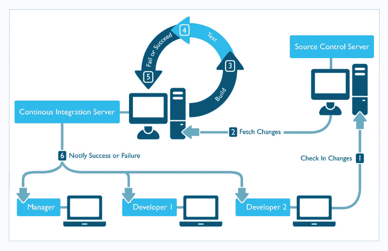
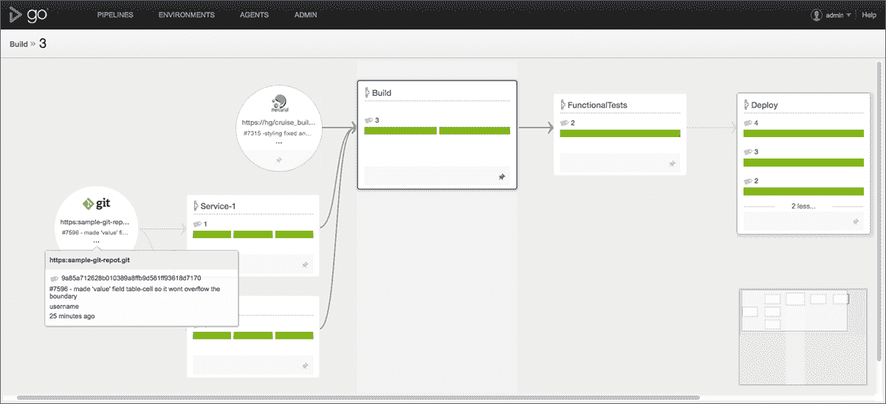

# 这就是为什么持续集成和部署对软件开发过程如此重要

> 原文：<https://levelup.gitconnected.com/heres-why-continuous-integration-and-deployment-is-so-important-to-the-software-development-c0caeead5881>

Mathilda Khoo 在 [Unsplash](https://unsplash.com/s/photos/endless?utm_source=unsplash&utm_medium=referral&utm_content=creditCopyText) 上的照片

*这是我的现代软件开发实践系列* [*的第一部分*](https://medium.com/@tylor.borgeson/my-series-on-modern-software-development-practices-372c65a2837e?source=friends_link&sk=3b037795f393df5554502e2c65365d0d) *。在这个系列中，我介绍了软件工程师可以通过改进他们的过程和实践来改进他们的软件的多种方法，所有这些都是我在 ThoughtWorks 担任软件顾问期间学到的，也是我目前在德国一家大型零售公司工作时的经历。*

我曾经和一个客户合作过一个云迁移项目。我到达办公室的第一天，一天快结束时，一位高级工程师邀请我和他们一起“观察”部署。我很兴奋…我以前从未听说过“观看”一次部署，并期待着发现这意味着什么。

这是惊人的…以最糟糕的方式。

这家公司，姑且称之为 ABC Corp，有 16 个相同软件的实例，每个实例都有一个不同的白色标签，托管在数据中心的独立 Linux 机器上。我最终观察到的(3 个小时)是客户端如何分别远程连接到每台机器并进行“capistrano 部署”。对于那些不熟悉的人来说，Capistrano 本质上是一个脚本工具，它允许远程执行各种任务。部署过程包括在每台机器上运行多个命令，然后进行手动测试以确保其工作正常。

最棒的是，这位开发人员和另一位开发人员是整个公司中唯一知道如何运行部署的人，这意味着他们被禁止在同一时间休假。如果他们中的一个生病了，另一个就得为自己负责。这一部署过程每两周进行一次。

那天晚上回家，睡不着。

我在工作中最喜欢做的事情之一就是让自己自动失业，这听起来很老套。我尽最大努力遵循“不要手动做任何事情超过一次”的口头禅。部署是我认为每个团队应该自动化的第一件事，也是我们在 ABC 公司工作的第一件事，使用构建管道来实现持续集成和持续交付。原因如下:

C *持续整合图解—鸣谢*www.pepgotesting.com

# 连续累计

业内称之为 CI，持续集成是开发人员尽可能频繁地向主存储库推送或集成变更的实践。这通常每天发生多次。在高层次上，这允许开发人员尽可能快地注意并查明代码或功能中的错误。

这个想法很简单:

*   开发人员将代码提交到存储库的主分支
*   CI 服务器检测更改并提取它们。
*   CI 服务器构建变更并标记它。
*   所有的单元、集成和端到端测试都是针对构建运行的。
*   如果在任何阶段出现任何问题，包括失败的测试，管道将会停止，开发人员会得到失败的通知。

这使得团队可以看到项目对每一个提交的反应，而不管提交的大小。当出现问题时，您可以准确地看到是哪个提交导致了失败，并且可能准确地看到是哪一行代码导致了失败。持续集成是保持代码变化尽可能小的绝对最佳方式之一，这是 [DevOps 运动](https://aws.amazon.com/devops/what-is-devops/)所提倡的，而不是大变动。这也意味着在多个环境(开发、[测试、](/test-driven-development-is-overrated-ad9f0491c11d)、集成、生产等)的情况下，环境应该尽可能的相似。

GoCD CI/CD 管道

# 连续交货

连续交付被称为 CD，指的是自动部署已经成功通过测试套件的代码。

> “本质上，它是向用户发布每一个好的构建的实践”——Jez Humble

实现如下:

*   作为构建管道中的另一个步骤，一旦测试通过，就获取创建的构建，并通过自动化脚本将其部署到您的各种环境中(测试环境、集成环境、生产环境等)
*   作为流程中的最后一步，运行冒烟测试以确保部署顺利进行
*   设置监控和警报，通知开发人员出现故障
*   用户不应看到的任何代码都可以隐藏在[特征标志](https://martinfowler.com/articles/feature-toggles.html)之后

假设所有部署的变更都是单独提交的，那么部署的风险很低，导致的错误也很少，但是这也意味着您作为一个企业可以非常快速地开发和部署代码，次数不限。将此与容器化(即 Docker、K8s)相结合，尤其是在云平台上，可以实现非常快速的部署，几乎没有停机时间，这意味着团队可以在一天中的任何时间进行部署。

# 为什么这很重要？

当查看四个关键的软件开发度量时，正如在*加速中定义的，我在这里谈到的*是在测量软件团队的性能和效率时唯一重要的度量。良好的 CI / CD 实践可以极大地提高团队的水平。

1.  **交付周期** : CI / CD 允许开发人员完成代码编写，并将变更直接部署到用户可以访问的生产环境中。当一个团队有好的 CI/CD 实践时，这可能在几个小时甚至几分钟内发生。
2.  部署频率:更快、更小的部署意味着团队可以并且将会更频繁地部署，尤其是在部署没有什么特别之处的情况下。回想一下 ABC 公司，想象一下当所有需要的只是任何人在任何时候都可以按下按钮时，该团队有多愿意部署。在亚马逊全球的所有团队中，[他们平均每 11 秒部署一次。](https://techbeacon.com/devops/10-companies-killing-it-devops)
3.  **平均恢复时间**:场景——团队部署了导致中断的变更。由于团队出色的 CI/CD 实践，团队确切地知道哪个变更甚至哪个行导致了问题。15 分钟后，修复程序已经开发出来并部署到生产环境中。
4.  **变更失败率** : 小的变更与您的服务的早期且经常的集成以及您的测试套件的全面运行相结合，意味着在重大变更接近生产之前就被检测到。所有到达用户手中的代码都已经过测试。只剩下每个蓝月都会冒出来的隐藏 bug。

# 要记住的事情

当一个团队试图实现并实践 CI/CD 实践时，他们必须在开发时记住一些事情。

*   团队的首要任务是修复任何损坏的管道构建
*   开发人员应该经常推动，以防止大爆炸式的变化
*   [开发人员应该在发布之前测试代码，以免破坏构建](/how-to-keep-your-build-pipeline-from-breaking-using-git-hooks-f30c1d7086cc)
*   带着残破的建筑回家是不允许的

如果使用得当，CI/CD 可以成为所有软件团队的一个很好的工具。没有人希望在执行“capistrano deploy”后花几个小时观看脚本运行，希望不会出现任何问题，因为他们可以每天简单地推送代码，并确保在万一出现问题时会收到警报。

开发人员应该解决问题，而不是做电脑能为我们做的琐碎工作。

您可以使用任何一种流行的 CI 服务器( [Concourse](https://concourse-ci.org/) 、 [Jenkins](http://jenkins.io) 、 [GoCD](https://www.gocd.org/) 、 [Circle-CI](https://circleci.com/) 等等)来帮助生成令人难以置信的结果，并让开发人员在提高软件弹性的同时致力于解决难题。

CI/CD 是实现现代软件实践的最直接的步骤之一，正如 Nike 所说:

感谢阅读！

[*我的现代软件开发实践系列中的其他文章可以在这里找到*](https://medium.com/@tylor.borgeson/my-series-on-modern-software-development-practices-372c65a2837e?source=friends_link&sk=3b037795f393df5554502e2c65365d0d)

## 资源:

*   https://concourse-ci.org/
*   詹金斯(工具) [http://jenkins.io](http://jenkins.io)
*   GoCD(工具)[https://www.gocd.org/](https://www.gocd.org/)
*   圆-CI(工具)[https://circleci.com/](https://circleci.com/)
*   https://aws.amazon.com/devops/what-is-devops/
*   DevOps 做得好的公司(资讯)[https://techbeacon . com/devo PS/10-companies-killing-it-devo PS](https://techbeacon.com/devops/10-companies-killing-it-devops)
*   Gene Kim 图书摘要(Info)[https://medium . com/swlh/software-development-practices-as-recommended-by-gene-Kim-c6f6e 952309 f](https://medium.com/swlh/software-development-practices-as-recommended-by-gene-kim-c6f6e952309f)