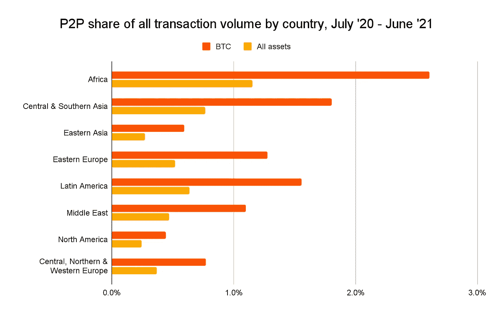
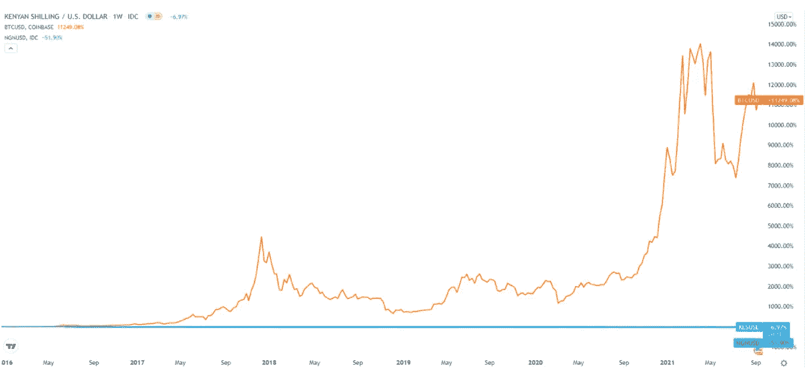

# 这就是为什么肯尼亚最卑微的人宁愿坐牢也不愿买比特币

> 原文：<https://levelup.gitconnected.com/heres-why-kenya-s-most-humble-man-would-rather-do-time-in-jail-than-buy-bitcoin-1a24bb4a173a>

以及为什么好人也会犯错

来源— 肯尼亚央行行长— [Youtube 截图](https://www.youtube.com/watch?v=D_vAaKR4WKc)

如果你是数字货币的狂热爱好者，你会很高兴这个话题甚至会出现在餐桌上。

肯尼亚是一个负债累累的国家。

Patrick Njoroge 是一个极其谦虚的人，他拒绝了一部高端智能手机、一座豪宅、一群保安和三辆汽车，目前掌管着肯尼亚的资金。

让许多人松了一口气。

非洲是少数几个进入公职就能致富的大洲之一。

肮脏的有钱人。

以南非前总统[雅各布·祖马](https://www.celebritynetworth.com/richest-politicians/presidents/jacob-zuma-net-worth/)为例，他仍然与四位妻子结婚，在一个每小时最低工资为 1.13 美元的国家，他的净资产为 2000 万美元。

在祖马执政期间，数百亿国家资金被发现被抽走。他于 2021 年 6 月被捕，开始服刑 15 个月。

相比之下，美国总统乔·拜登(Joe Biden)的 40 万美元年薪就有些令人满意了。

拜登也没有陷入丑闻。

现年 61 岁的 Njoroge 曾是耶鲁大学的学生，也是在国际货币基金组织工作了 20 年的经济学家，他在肯尼亚没有任何资产记录。

不过，他不缺一块钱。

在他为国际货币基金组织工作的 20 年里，他在过去的 20 年里每月赚 300 万先令，相当于每月 25，000 美元。

他甚至不是总统。

但他对国家货币政策的立场反映了他的生活方式。

高度谨慎的极简主义者。

当这位前国际货币基金组织(IMF)经济学家在巨大压力下动用国家财政储备购买比特币时，他毫不意外地没有屈服于需求。

他认为任何人甚至建议这是完全超出了他们的支架。

> “我可以向你保证，有很多人敦促我把我们的储备放在比特币上。我会因为那种疯狂行为而失去理智。”
> 
> “带我去卡米提(监狱)，如果我们把储备放在比特币里，就把钥匙扔掉。
> 
> “也许你可以用自己的钱去做，去玩一玩。”
> 
> “除了炒作，加密货币解决不了任何问题……”
> 
> “加密货币是不是比你的传统银行账户更好的支付、交易和安全工具？答案是否定的，不会比你的银行账户更好。”

你不想说出来。但他错了。

他完全没有抓住重点。

事实是，群众不相信他们的政府有钱，他们摆脱贫困的唯一基本工具是权力下放。

数据证明了。

根据[chain analysis](https://www.chainalysis.com/)的数据，2020 年 7 月至 2021 年 6 月期间，非洲大陆的点对点(P2P)支付的加密价值增长了 1，200%，是全球增长最快的地区。

无论是比特币还是其他加密货币。

来源— [连锁分析](https://www.chainalysis.com/)

2015 年，肯尼亚中央银行发布了一份[公告](https://www.centralbank.go.ke/images/docs/media/Public_Notice_on_virtual_currencies_such_as_Bitcoin.pdf)，完全针对比特币。

> 这是为了告知公众，比特币等虚拟货币在肯尼亚不是法定货币。因此，如果交易或持有虚拟货币的平台失败或倒闭，就没有保护可言。与购买、持有或交易虚拟货币相关的一些风险包括
> 
> 没有资产的基础或支持，虚拟货币的价值是投机性的。这可能导致虚拟货币价值的高度波动，从而使用户面临潜在的损失。

自公告发布以来，以对大众健康有害的形式，比特币相对于肯尼亚先令升值了 **11，249%** ，肯尼亚先令贬值了 **6.97%**

尴尬。

*   比特币=橙色线
*   肯尼亚先令(KES) =平坦的蓝线。

五年来肯尼亚先令(KES)对比特币。图片:[TradingView.com](https://www.tradingview.com/)

加密货币在非洲以全球最快的速度被采用有很多原因。

*   金融包容性
*   零银行手续费
*   快速传输
*   点对点和跨境支付
*   财富积累和价值储存工具——政府无法获得

你看到机构赶上民众的采用率可能只是时间问题。

无论结果如何。

只是在一个充满祖玛的世界里做一个 Njoroge。

在 [Medium](https://t.co/0WsCUfngD2) 上关注我了解更多信息。

*本文仅供参考；不应将其视为财务、税务或法律建议。在做出任何重大财务决定之前，请咨询财务专家。*